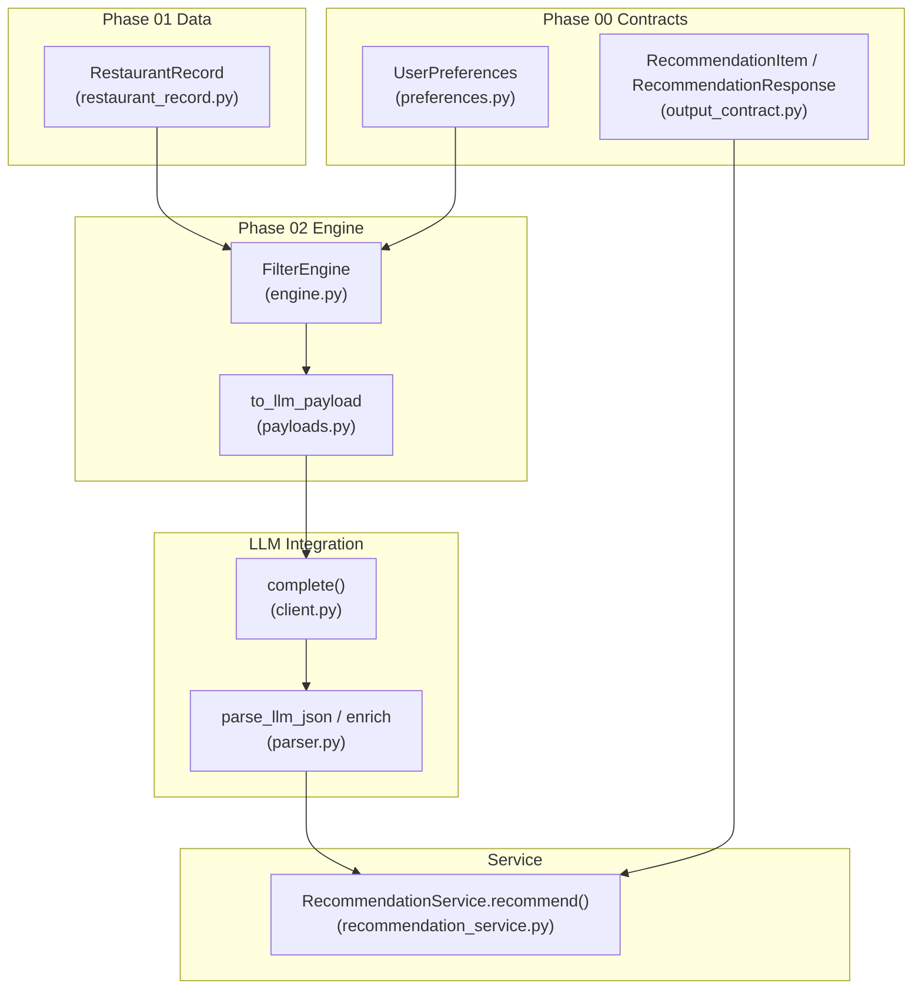
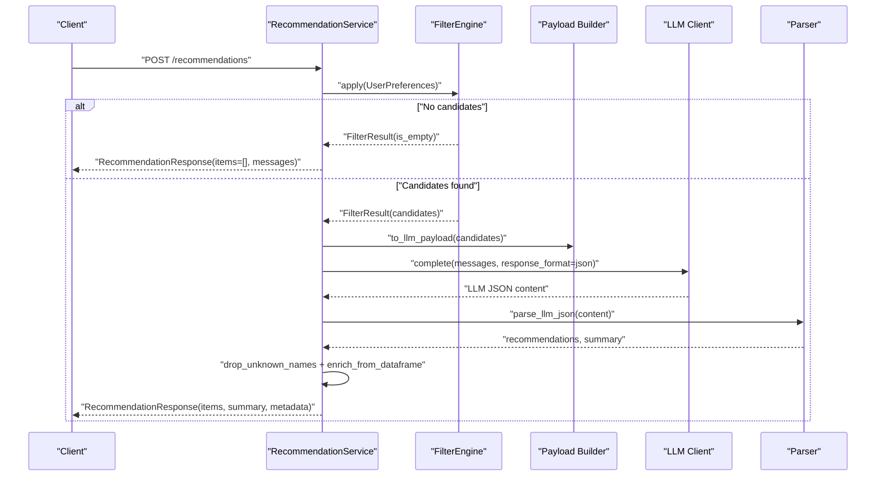
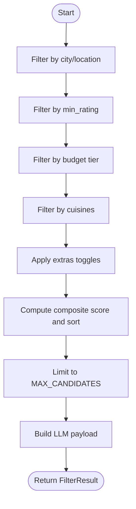
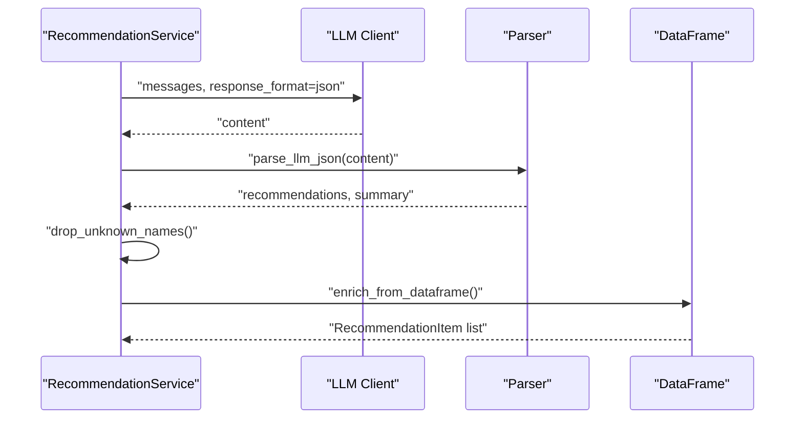
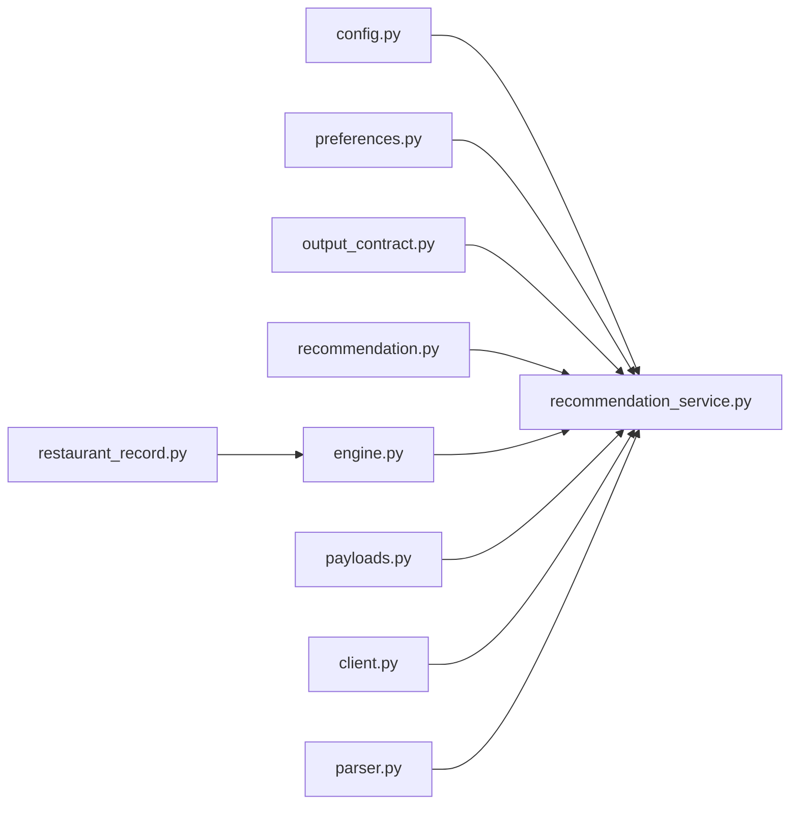

# API Reference

<cite>
**Referenced Files in This Document**
- [README.md](file://README.md)
- [recommendation_service.py](file://src/services/recommendation_service.py)
- [preferences.py](file://src/phases/phase00/preferences.py)
- [output_contract.py](file://src/phases/phase00/output_contract.py)
- [recommendation.py](file://src/models/recommendation.py)
- [restaurant.py](file://src/models/restaurant.py)
- [restaurant_record.py](file://src/phases/phase01/restaurant_record.py)
- [engine.py](file://src/phases/phase2/engine.py)
- [payloads.py](file://src/phases/phase2/payloads.py)
- [config.py](file://src/config.py)
- [.env.example](file://.env.example)
- [client.py](file://src/llm/client.py)
- [parser.py](file://src/llm/parser.py)
- [pyproject.toml](file://pyproject.toml)
</cite>

## Table of Contents
1. [Introduction](#introduction)
2. [Project Structure](#project-structure)
3. [Core Components](#core-components)
4. [Architecture Overview](#architecture-overview)
5. [Detailed Component Analysis](#detailed-component-analysis)
6. [Dependency Analysis](#dependency-analysis)
7. [Performance Considerations](#performance-considerations)
8. [Troubleshooting Guide](#troubleshooting-guide)
9. [Conclusion](#conclusion)
10. [Appendices](#appendices)

## Introduction
This document describes the API for the Zomato AI Recommendation System. It focuses on the recommendation service endpoint, including HTTP method, URL pattern, request and response schemas, authentication, and error handling. It also documents user preferences input format, recommendation response structure, and underlying data models for preferences, recommendations, and restaurant records. Additional topics include rate limiting, versioning considerations, and integration guidelines for client applications.

## Project Structure
The recommendation pipeline is implemented as a Python package with clearly separated phases:
- Input contracts and outputs are defined in phase 00.
- Data ingestion and caching are handled in phase 01.
- Filtering and ranking logic resides in phase 02.
- LLM integration and parsing are handled in dedicated modules.
- The recommendation service orchestrates filtering and LLM ranking.

**Diagram sources**
- [recommendation_service.py:37-131](file://src/services/recommendation_service.py#L37-L131)
- [engine.py:140-189](file://src/phases/phase2/engine.py#L140-L189)
- [payloads.py:27-43](file://src/phases/phase2/payloads.py#L27-L43)
- [client.py:14-94](file://src/llm/client.py#L14-L94)
- [parser.py:24-141](file://src/llm/parser.py#L24-L141)
- [preferences.py:20-71](file://src/phases/phase00/preferences.py#L20-L71)
- [output_contract.py:8-41](file://src/phases/phase00/output_contract.py#L8-L41)
- [restaurant_record.py:8-30](file://src/phases/phase01/restaurant_record.py#L8-L30)

**Section sources**
- [README.md:14-39](file://README.md#L14-L39)
- [pyproject.toml:1-16](file://pyproject.toml#L1-L16)

## Core Components
- Recommendation service endpoint: Orchestrates filtering and LLM ranking, returning a standardized response.
- User preferences input: Strongly typed input schema consumed by the service.
- Recommendation response: Standardized output schema for UI rendering.
- Restaurant record: Ground-truth schema for candidate data.

Key configuration and environment variables:
- LLM provider selection, base URL, and model.
- API keys for Groq or OpenAI-compatible APIs.
- Tunable limits for candidate count and top-K recommendations.

**Section sources**
- [recommendation_service.py:30-131](file://src/services/recommendation_service.py#L30-L131)
- [preferences.py:20-71](file://src/phases/phase00/preferences.py#L20-L71)
- [output_contract.py:8-41](file://src/phases/phase00/output_contract.py#L8-L41)
- [restaurant_record.py:8-30](file://src/phases/phase01/restaurant_record.py#L8-L30)
- [config.py:26-41](file://src/config.py#L26-L41)
- [.env.example:1-17](file://.env.example#L1-L17)

## Architecture Overview
The recommendation pipeline follows a deterministic flow:
1. Receive user preferences.
2. Apply structured filtering to produce a shortlist.
3. If enabled, send a compact payload to the LLM for ranking and explanation.
4. Parse and validate LLM output, enrich with ground-truth data, and return a standardized response.
5. Fallback to structured ranking if LLM is unavailable or fails.

**Diagram sources**
- [recommendation_service.py:37-131](file://src/services/recommendation_service.py#L37-L131)
- [engine.py:146-189](file://src/phases/phase2/engine.py#L146-L189)
- [payloads.py:27-43](file://src/phases/phase2/payloads.py#L27-L43)
- [client.py:14-94](file://src/llm/client.py#L14-L94)
- [parser.py:24-141](file://src/llm/parser.py#L24-L141)

## Detailed Component Analysis

### Endpoint Definition
- Method: POST
- URL: /recommendations
- Content-Type: application/json
- Authentication: Bearer token via Authorization header using the configured LLM API key
- Rate limiting: Managed by the LLM provider; client should handle retries with exponential backoff on 429/5xx

Behavior:
- Validates preferences and applies filtering.
- Calls the LLM for ranking and explanation when the API key is present.
- Returns a standardized response with recommendations, summary, and metadata.
- Falls back to structured ranking if the LLM is disabled or fails.

**Section sources**
- [recommendation_service.py:37-131](file://src/services/recommendation_service.py#L37-L131)
- [client.py:36-94](file://src/llm/client.py#L36-L94)
- [.env.example:1-17](file://.env.example#L1-L17)

### Request Schema: UserPreferences
- city: string (required), trimmed, non-empty
- budget: enum "low" | "medium" | "high"
- cuisines: array of strings (optional), deduplicated and normalized
- min_rating: number 0..5 (optional)
- extras: object with optional toggles
  - family_friendly: boolean
  - quick_service: boolean
  - book_table: boolean
- additional_notes: string (optional, max length)

Validation and coercion:
- Empty or whitespace-only city is rejected.
- Cuisines can be provided as a list, tuple, or comma-separated string; duplicates are removed while preserving order.

**Section sources**
- [preferences.py:20-71](file://src/phases/phase00/preferences.py#L20-L71)

### Response Schema: RecommendationResponse
- items: array of RecommendationItem
- summary: string (optional)
- filter_count: integer (count of candidates before LLM)
- llm_used: boolean (indicates whether LLM was used)
- messages: array of strings (user-facing hints or errors)

RecommendationItem fields:
- rank: integer ≥ 1
- name: string
- cuisine: string
- rating: number or null
- estimated_cost: integer (INR for two) or null
- explanation: string
- location: string
- dish_liked: string
- book_table: boolean
- online_order: boolean
- votes: integer

**Section sources**
- [output_contract.py:8-41](file://src/phases/phase00/output_contract.py#L8-L41)

### Data Models

#### RestaurantRecommendation (LLM output shape)
- name: string (exact restaurant name)
- cuisine: string
- rating: number or null
- estimated_cost: integer or null
- explanation: string

**Section sources**
- [recommendation.py:9-23](file://src/models/recommendation.py#L9-L23)

#### RestaurantRecord (ground-truth data)
- restaurant_id: integer ≥ 0
- name: string
- city: string
- location: string
- cuisines: string (pipe-separated tokens)
- rating: number 0..5 or null
- votes: integer ≥ 0
- cost_for_two: integer ≥ 0 or null
- budget_tier: enum "low" | "medium" | "high" | "unknown" or null
- rest_type: string
- online_order: string
- book_table: string
- dish_liked: string
- listed_in_type: string

**Section sources**
- [restaurant_record.py:8-30](file://src/phases/phase01/restaurant_record.py#L8-L30)

#### Export alias
- RestaurantRecord is exported via src/models/restaurant.py for external use.

**Section sources**
- [restaurant.py:3-5](file://src/models/restaurant.py#L3-L5)

### Filtering and Payload Construction
- FilterEngine applies vectorized filters (city, rating, budget, cuisines, extras) and sorts by a composite score.
- to_llm_payload builds a compact list of candidate records suitable for prompting.

**Diagram sources**
- [engine.py:146-189](file://src/phases/phase2/engine.py#L146-L189)
- [payloads.py:27-43](file://src/phases/phase2/payloads.py#L27-L43)

**Section sources**
- [engine.py:140-189](file://src/phases/phase2/engine.py#L140-L189)
- [payloads.py:27-43](file://src/phases/phase2/payloads.py#L27-L43)

### LLM Integration and Parsing
- LLM client sends chat completions with JSON response format when available.
- Parser extracts and validates JSON, handles markdown/code-block wrappers, and enforces strict typing.
- Enrichment replaces LLM-provided fields with verified ground-truth values from the candidate DataFrame.

**Diagram sources**
- [client.py:14-94](file://src/llm/client.py#L14-L94)
- [parser.py:24-141](file://src/llm/parser.py#L24-L141)
- [recommendation_service.py:84-122](file://src/services/recommendation_service.py#L84-L122)

**Section sources**
- [client.py:14-94](file://src/llm/client.py#L14-L94)
- [parser.py:24-141](file://src/llm/parser.py#L24-L141)
- [recommendation_service.py:84-122](file://src/services/recommendation_service.py#L84-L122)

### Error Handling Patterns
- Empty filter results: Returns an empty items list with human-readable messages indicating why no candidates matched.
- Missing LLM API key: Logs a warning and falls back to structured ranking with a note.
- LLM failures: Catches exceptions, logs an error, and falls back to structured ranking with a user-facing message.
- LLM JSON parsing errors: Logs original response and raises a validation error.
- LLM rate limiting: Client retries with exponential backoff; unrecoverable client-side errors are raised immediately.

**Section sources**
- [recommendation_service.py:47-66](file://src/services/recommendation_service.py#L47-L66)
- [recommendation_service.py:124-130](file://src/services/recommendation_service.py#L124-L130)
- [parser.py:42-43](file://src/llm/parser.py#L42-L43)
- [client.py:71-94](file://src/llm/client.py#L71-L94)

### Examples of API Usage
- Request body (JSON):
  - city: "Bangalore"
  - budget: "medium"
  - cuisines: ["North Indian", "Chinese"]
  - min_rating: 4.0
  - extras: { "book_table": true }
  - additional_notes: "Looking for a place with outdoor seating"
- Successful response:
  - items: array of RecommendationItem with rank, name, cuisine, rating, estimated_cost, explanation, location, dish_liked, book_table, online_order, votes
  - summary: string summarizing the recommendations
  - filter_count: integer
  - llm_used: boolean
  - messages: empty or informational messages
- Error response:
  - items: empty
  - messages: array containing human-readable reasons (e.g., no candidates, invalid input)

Note: The endpoint is defined in the service orchestration; the above examples reflect the request/response schemas documented above.

**Section sources**
- [preferences.py:20-71](file://src/phases/phase00/preferences.py#L20-L71)
- [output_contract.py:8-41](file://src/phases/phase00/output_contract.py#L8-L41)
- [recommendation_service.py:47-66](file://src/services/recommendation_service.py#L47-L66)

## Dependency Analysis
- The service depends on:
  - FilterEngine for candidate generation and sorting
  - to_llm_payload for compact candidate serialization
  - LLM client for chat completions
  - Parser for JSON extraction and enrichment
- Configuration drives provider selection, model, base URL, and tunable limits.

**Diagram sources**
- [config.py:26-41](file://src/config.py#L26-L41)
- [recommendation_service.py:37-131](file://src/services/recommendation_service.py#L37-L131)
- [engine.py:140-189](file://src/phases/phase2/engine.py#L140-L189)
- [payloads.py:27-43](file://src/phases/phase2/payloads.py#L27-L43)
- [client.py:14-94](file://src/llm/client.py#L14-L94)
- [parser.py:24-141](file://src/llm/parser.py#L24-L141)
- [preferences.py:20-71](file://src/phases/phase00/preferences.py#L20-L71)
- [output_contract.py:8-41](file://src/phases/phase00/output_contract.py#L8-L41)
- [recommendation.py:9-23](file://src/models/recommendation.py#L9-L23)
- [restaurant_record.py:8-30](file://src/phases/phase01/restaurant_record.py#L8-L30)

**Section sources**
- [recommendation_service.py:37-131](file://src/services/recommendation_service.py#L37-L131)
- [engine.py:140-189](file://src/phases/phase2/engine.py#L140-L189)
- [payloads.py:27-43](file://src/phases/phase2/payloads.py#L27-L43)
- [client.py:14-94](file://src/llm/client.py#L14-L94)
- [parser.py:24-141](file://src/llm/parser.py#L24-L141)
- [config.py:26-41](file://src/config.py#L26-L41)

## Performance Considerations
- Candidate cap: MAX_CANDIDATES controls the maximum number of candidates sent to the LLM, reducing latency and cost.
- Top-K limit: TOP_K_RECOMMENDATIONS controls the final number of recommendations returned.
- Structured fallback: When the LLM is unavailable, the service uses a composite score and tiebreakers to rank candidates efficiently.
- Payload size: to_llm_payload selects only essential columns to minimize prompt size and cost.

[No sources needed since this section provides general guidance]

## Troubleshooting Guide
Common issues and resolutions:
- No recommendations returned:
  - Verify city spelling and consider location text for neighborhood matching.
  - Relax min_rating, budget tier, or cuisines.
  - Check that the data cache exists and is built.
- LLM offline or API key missing:
  - Set GROQ_API_KEY or OPENAI_API_KEY in .env.
  - Confirm LLM_PROVIDER and LLM_BASE_URL are correct.
- LLM JSON parsing errors:
  - Ensure the LLM returns a valid JSON object; the parser handles markdown wrappers but requires a parsable dictionary.
- Rate limiting:
  - Expect 429 responses; implement exponential backoff and retry logic.
- Unexpected fields or missing fields:
  - The service enriches results from the DataFrame; fields may differ from raw LLM output.

**Section sources**
- [engine.py:104-137](file://src/phases/phase2/engine.py#L104-L137)
- [recommendation_service.py:60-66](file://src/services/recommendation_service.py#L60-L66)
- [parser.py:42-43](file://src/llm/parser.py#L42-L43)
- [client.py:71-94](file://src/llm/client.py#L71-L94)

## Conclusion
The Zomato AI Recommendation System exposes a simple, robust API for personalized restaurant recommendations. Clients submit user preferences, receive a standardized response with explanations, and gracefully handle scenarios where the LLM is unavailable. Proper configuration of environment variables and understanding of the request/response schemas enable reliable integrations.

[No sources needed since this section summarizes without analyzing specific files]

## Appendices

### Authentication
- Header: Authorization: Bearer <API_KEY>
- API key sources: GROQ_API_KEY or OPENAI_API_KEY depending on LLM_PROVIDER
- Provider base URL: LLM_BASE_URL

**Section sources**
- [.env.example:1-17](file://.env.example#L1-L17)
- [config.py:26-38](file://src/config.py#L26-L38)
- [client.py:36-43](file://src/llm/client.py#L36-L43)

### Versioning and Compatibility
- Package version: 0.1.0
- Python requirement: >=3.10

**Section sources**
- [pyproject.toml:3](file://pyproject.toml#L3)
- [pyproject.toml:6](file://pyproject.toml#L6)

### Integration Guidelines
- Use POST /recommendations with application/json.
- Provide a minimal preferences payload (city, budget) and optionally refine with cuisines, min_rating, and extras.
- Handle llm_used flag to inform clients about explanation availability.
- Implement retry with exponential backoff for 429/5xx responses from the LLM provider.

**Section sources**
- [recommendation_service.py:37-131](file://src/services/recommendation_service.py#L37-L131)
- [client.py:55-94](file://src/llm/client.py#L55-L94)