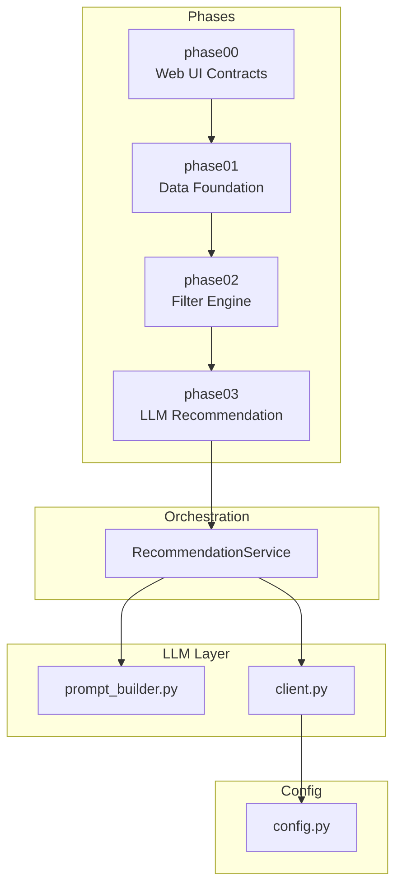
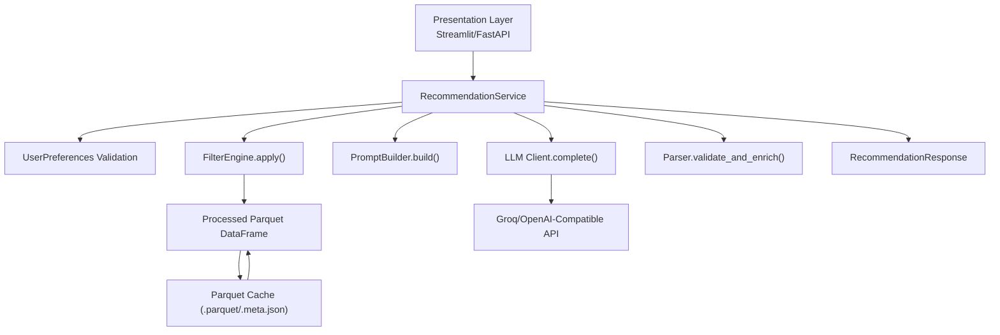
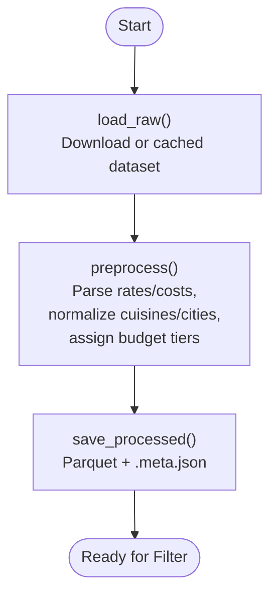
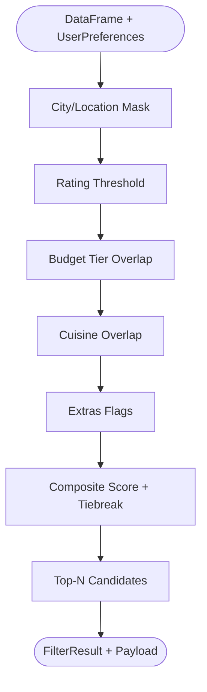
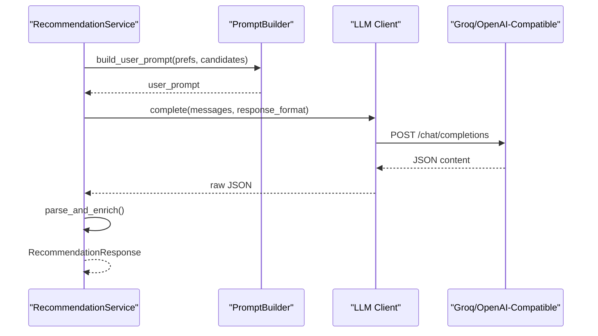
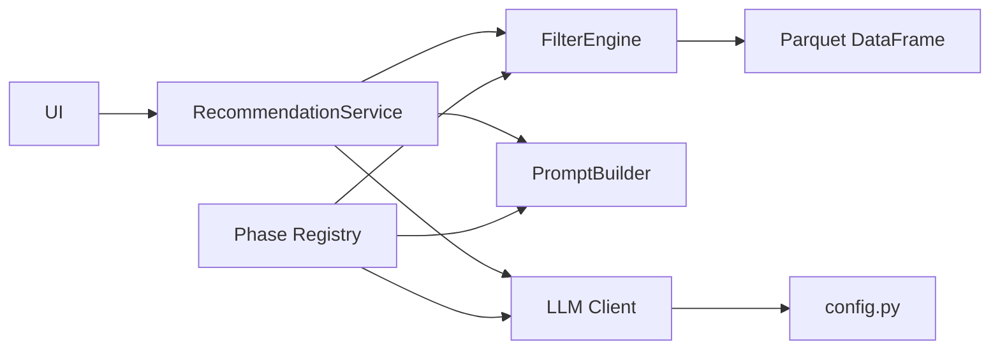

# Architecture and Design

<cite>
**Referenced Files in This Document**
- [README.md](file://README.md)
- [ARCHITECTURE.md](file://docs/ARCHITECTURE.md)
- [phases.md](file://docs/phases.md)
- [registry.py](file://src/phases/registry.py)
- [preferences.py](file://src/phases/phase00/preferences.py)
- [loader.py](file://src/phases/phase01/loader.py)
- [preprocessor.py](file://src/phases/phase01/preprocessor.py)
- [cache.py](file://src/phases/phase01/cache.py)
- [engine.py](file://src/phases/phase02/engine.py)
- [scorer.py](file://src/phases/phase02/scorer.py)
- [payloads.py](file://src/phases/phase02/payloads.py)
- [prompt_builder.py](file://src/llm/prompt_builder.py)
- [client.py](file://src/llm/client.py)
- [config.py](file://src/config.py)
- [pyproject.toml](file://pyproject.toml)
</cite>

## Table of Contents
1. [Introduction](#introduction)
2. [Project Structure](#project-structure)
3. [Core Components](#core-components)
4. [Architecture Overview](#architecture-overview)
5. [Detailed Component Analysis](#detailed-component-analysis)
6. [Dependency Analysis](#dependency-analysis)
7. [Performance Considerations](#performance-considerations)
8. [Troubleshooting Guide](#troubleshooting-guide)
9. [Conclusion](#conclusion)
10. [Appendices](#appendices)

## Introduction
This document describes the Zomato AI Recommendation System’s phased architecture, layered design, and integration patterns. The system separates concerns across Data, Filter, LLM, and Presentation layers, with explicit phase boundaries to enable incremental delivery, testability, and safe rollbacks. It emphasizes minimizing LLM cost and latency by pre-filtering structured data, caching reproducible artifacts, and grounding LLM outputs against verified candidates.

## Project Structure
The repository is organized around development phases and layers:
- src/phases: Implementation of each phase with explicit dependency order.
- src/llm: LLM orchestration, prompt building, and client.
- src/config.py: Centralized environment-driven configuration.
- docs: Architectural and phase planning documentation.
- scripts: Phase-specific CLI helpers for cache building and smoke testing.
- tests: Unit and integration tests validating each layer.

**Diagram sources**
- [registry.py:28-68](file://src/phases/registry.py#L28-L68)
- [engine.py:140-197](file://src/phases/phase02/engine.py#L140-L197)
- [prompt_builder.py:1-69](file://src/llm/prompt_builder.py#L1-L69)
- [client.py:1-94](file://src/llm/client.py#L1-L94)
- [config.py:19-47](file://src/config.py#L19-L47)

**Section sources**
- [README.md:14-39](file://README.md#L14-L39)
- [ARCHITECTURE.md:146-181](file://docs/ARCHITECTURE.md#L146-L181)
- [phases.md:18-26](file://docs/phases.md#L18-L26)

## Core Components
- Phase Registry: Defines ordered phases and dependency constraints to support rollback and bisection.
- Data Layer (phase01): Loads, cleans, normalizes, and caches the dataset as Parquet for fast reuse.
- Filter Layer (phase02): Applies vectorized filters and composite scoring to produce a small, ranked candidate set for the LLM.
- LLM Layer (src/llm): Builds grounded prompts, invokes the provider, parses structured outputs, and merges with original data to prevent hallucinations.
- Configuration (src/config.py): Centralizes environment variables for providers, models, and runtime knobs.

**Section sources**
- [registry.py:16-84](file://src/phases/registry.py#L16-L84)
- [loader.py:33-64](file://src/phases/phase01/loader.py#L33-L64)
- [preprocessor.py:136-232](file://src/phases/phase01/preprocessor.py#L136-L232)
- [cache.py:27-64](file://src/phases/phase01/cache.py#L27-L64)
- [engine.py:140-197](file://src/phases/phase02/engine.py#L140-L197)
- [scorer.py:29-70](file://src/phases/phase02/scorer.py#L29-L70)
- [payloads.py:27-44](file://src/phases/phase02/payloads.py#L27-L44)
- [prompt_builder.py:1-69](file://src/llm/prompt_builder.py#L1-L69)
- [client.py:14-94](file://src/llm/client.py#L14-L94)
- [config.py:19-47](file://src/config.py#L19-L47)

## Architecture Overview
The system follows a layered architecture with a strict phase dependency graph:
- Presentation Layer: Streamlit MVP or future FastAPI + frontend.
- Orchestration: RecommendationService coordinates validation, filtering, prompting, LLM invocation, parsing, and formatting.
- Filter Layer: Structured filtering and pre-ranking.
- LLM Layer: Structured, grounded ranking with anti-hallucination checks.
- Data Layer: Reproducible cache and schema.

**Diagram sources**
- [ARCHITECTURE.md:12-39](file://docs/ARCHITECTURE.md#L12-L39)
- [engine.py:140-197](file://src/phases/phase02/engine.py#L140-L197)
- [prompt_builder.py:30-69](file://src/llm/prompt_builder.py#L30-L69)
- [client.py:39-94](file://src/llm/client.py#L39-L94)
- [cache.py:27-64](file://src/phases/phase01/cache.py#L27-L64)

**Section sources**
- [ARCHITECTURE.md:12-39](file://docs/ARCHITECTURE.md#L12-L39)
- [ARCHITECTURE.md:122-143](file://docs/ARCHITECTURE.md#L122-L143)

## Detailed Component Analysis

### Phase Registry and Dependency Ordering
The phase registry enforces a strict order and rollback hints, ensuring each phase depends only on earlier ones. This enables safe bisection of issues and controlled rollbacks.

**Diagram sources**
- [registry.py:28-68](file://src/phases/registry.py#L28-L68)
- [phases.md:18-26](file://docs/phases.md#L18-L26)

**Section sources**
- [registry.py:16-84](file://src/phases/registry.py#L16-L84)
- [phases.md:9-16](file://docs/phases.md#L9-L16)

### Data Layer (phase01)
Responsibilities:
- Load dataset from Hugging Face with retries and robustness.
- Normalize and clean fields, compute budget tiers, and deduplicate entries.
- Persist a versioned Parquet cache with metadata.

Key implementation patterns:
- Robust dataset resolution across formats.
- Numeric parsing with diagnostics.
- Per-city budget tier computation with fallback.
- Versioned cache invalidation via metadata.

**Diagram sources**
- [loader.py:33-64](file://src/phases/phase01/loader.py#L33-L64)
- [preprocessor.py:136-232](file://src/phases/phase01/preprocessor.py#L136-L232)
- [cache.py:27-64](file://src/phases/phase01/cache.py#L27-L64)

**Section sources**
- [loader.py:21-64](file://src/phases/phase01/loader.py#L21-L64)
- [preprocessor.py:27-232](file://src/phases/phase01/preprocessor.py#L27-L232)
- [cache.py:19-64](file://src/phases/phase01/cache.py#L19-L64)

### Filter Layer (phase02)
Responsibilities:
- Apply vectorized filters in a defined order to reduce candidate set.
- Compute a composite score and deterministic tiebreak ordering.
- Produce a compact payload suitable for LLM prompts.

Processing logic:
- City/location match (with aliasing).
- Rating threshold.
- Budget tier overlap (including unknown-cost rows).
- Cuisine overlap using flexible substring/token matching.
- Extras toggles mapped to restaurant attributes.
- Final sorting and head(N) selection.

**Diagram sources**
- [engine.py:140-197](file://src/phases/phase02/engine.py#L140-L197)
- [scorer.py:29-70](file://src/phases/phase02/scorer.py#L29-L70)
- [payloads.py:27-44](file://src/phases/phase02/payloads.py#L27-L44)

**Section sources**
- [engine.py:41-197](file://src/phases/phase02/engine.py#L41-L197)
- [scorer.py:15-70](file://src/phases/phase02/scorer.py#L15-L70)
- [payloads.py:9-44](file://src/phases/phase02/payloads.py#L9-L44)

### LLM Layer (src/llm)
Responsibilities:
- Build grounded prompts with explicit schema and constraints.
- Invoke provider with retries and timeouts.
- Parse structured JSON and enrich with original data to avoid hallucinations.

**Diagram sources**
- [prompt_builder.py:30-69](file://src/llm/prompt_builder.py#L30-L69)
- [client.py:14-94](file://src/llm/client.py#L14-L94)

**Section sources**
- [prompt_builder.py:1-69](file://src/llm/prompt_builder.py#L1-L69)
- [client.py:14-94](file://src/llm/client.py#L14-L94)

### Configuration and Environment
Centralized configuration reads environment variables for provider credentials, model selection, and runtime parameters. It ensures secrets are not embedded in code and supports multiple providers via a single key.

**Section sources**
- [config.py:19-47](file://src/config.py#L19-L47)
- [README.md:41-54](file://README.md#L41-L54)

## Dependency Analysis
The system exhibits layered and phased dependencies:
- Presentation depends on Orchestration.
- Orchestration depends on Filter and LLM.
- Filter depends on Data (Parquet).
- LLM depends on Configuration and Provider APIs.
- Phase Registry enforces compile-time dependency order.

**Diagram sources**
- [registry.py:28-68](file://src/phases/registry.py#L28-L68)
- [engine.py:140-197](file://src/phases/phase02/engine.py#L140-L197)
- [prompt_builder.py:30-69](file://src/llm/prompt_builder.py#L30-L69)
- [client.py:39-94](file://src/llm/client.py#L39-L94)
- [config.py:19-47](file://src/config.py#L19-L47)

**Section sources**
- [registry.py:75-84](file://src/phases/registry.py#L75-L84)
- [ARCHITECTURE.md:215-222](file://docs/ARCHITECTURE.md#L215-L222)

## Performance Considerations
- Pre-filtering reduces LLM input size to a small, ranked set, dramatically lowering cost and latency.
- Parquet caching eliminates repeated heavy loads and preprocessing.
- Vectorized operations in the Filter Layer minimize overhead.
- Configurable limits (MAX_CANDIDATES, TOP_K_RECOMMENDATIONS) tune quality/performance trade-offs.
- Retry/backoff and timeouts protect against provider variability.

[No sources needed since this section provides general guidance]

## Troubleshooting Guide
Common areas to inspect:
- Data ingestion: Verify cache presence and metadata version; rebuild cache if mismatched.
- Filter pipeline: Review funnel logs and empty-state messages to identify failing filters.
- LLM calls: Inspect API key configuration, provider base URL, and retry behavior.
- Configuration: Confirm environment variables and defaults.

Operational checks:
- Ensure .env is present and contains required keys.
- Validate cache path and permissions.
- Monitor filter timing and LLM latency.

**Section sources**
- [cache.py:46-64](file://src/phases/phase01/cache.py#L46-L64)
- [engine.py:104-137](file://src/phases/phase02/engine.py#L104-L137)
- [client.py:36-94](file://src/llm/client.py#L36-L94)
- [config.py:26-47](file://src/config.py#L26-L47)

## Conclusion
The Zomato AI Recommendation System applies a phased, layered architecture to balance correctness, performance, and maintainability. By enforcing dependency order, separating concerns, and grounding LLM outputs, the system achieves low-latency, explainable recommendations while remaining extensible and testable.

[No sources needed since this section summarizes without analyzing specific files]

## Appendices

### System Context Diagrams
- Phase relationships and component breakdowns are illustrated in the architecture overview and dependency diagrams above.

**Section sources**
- [ARCHITECTURE.md:12-39](file://docs/ARCHITECTURE.md#L12-L39)
- [phases.md:18-26](file://docs/phases.md#L18-L26)

### Infrastructure and Deployment Notes
- Environment setup: Copy .env.example to .env and configure provider credentials.
- Python version: 3.10+ recommended (3.11 pinned in project).
- Testing: pytest configuration included in project metadata.
- Provider compatibility: Groq and OpenAI-compatible endpoints supported via a single API key.

**Section sources**
- [README.md:41-73](file://README.md#L41-L73)
- [pyproject.toml:1-16](file://pyproject.toml#L1-L16)