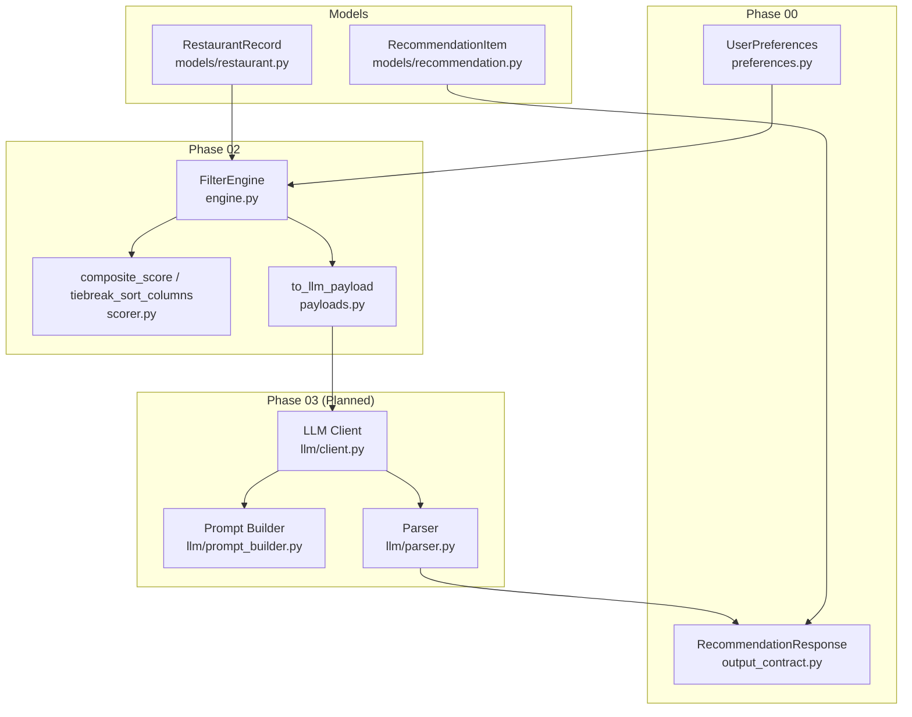
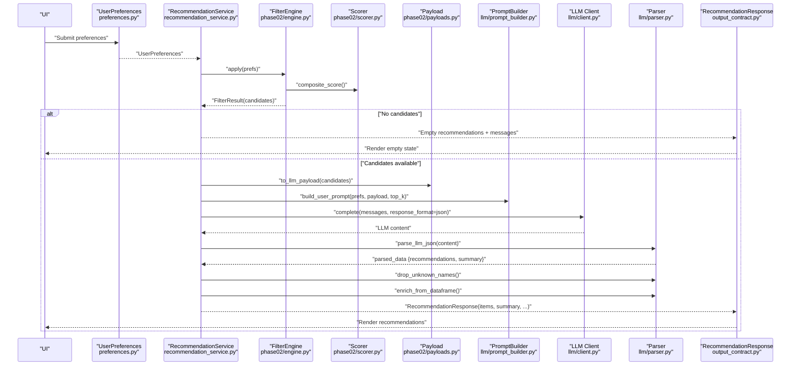
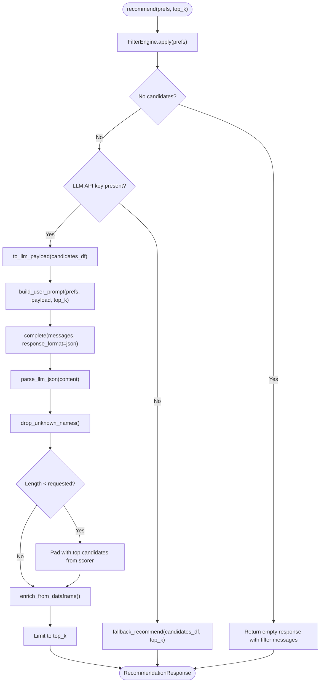
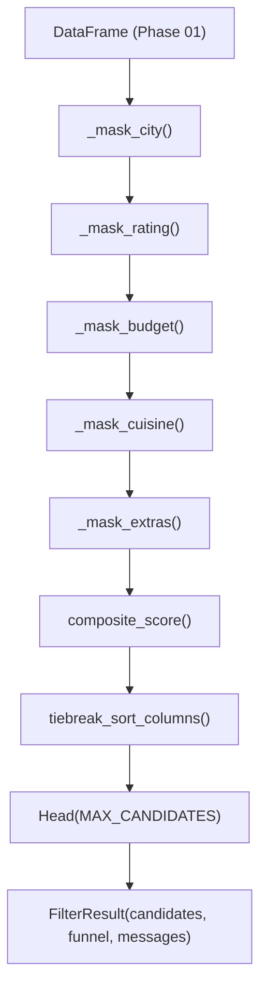
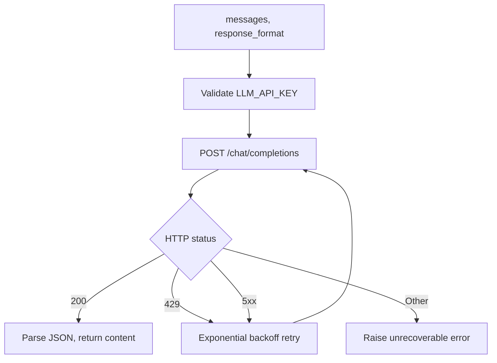
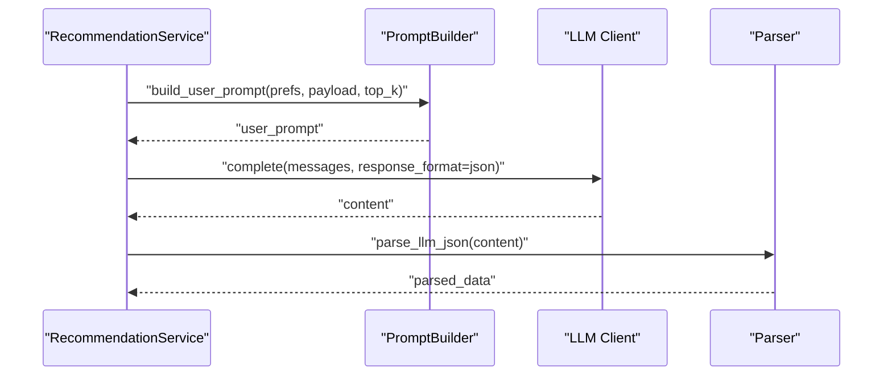
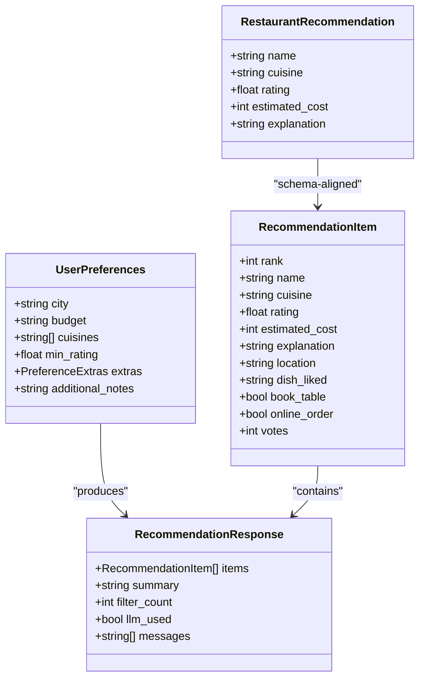
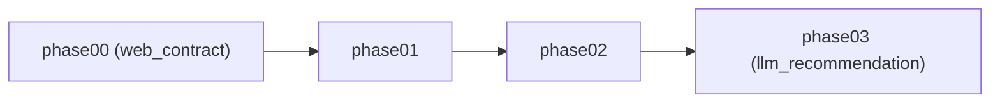

# Component Interactions

<cite>
**Referenced Files in This Document**
- [README.md](file://README.md)
- [src/config.py](file://src/config.py)
- [src/services/recommendation_service.py](file://src/services/recommendation_service.py)
- [src/phases/registry.py](file://src/phases/registry.py)
- [src/phases/phase00/preferences.py](file://src/phases/phase00/preferences.py)
- [src/phases/phase00/output_contract.py](file://src/phases/phase00/output_contract.py)
- [src/phases/phase02/engine.py](file://src/phases/phase02/engine.py)
- [src/phases/phase02/scorer.py](file://src/phases/phase02/scorer.py)
- [src/phases/phase02/payloads.py](file://src/phases/phase02/payloads.py)
- [src/llm/client.py](file://src/llm/client.py)
- [src/llm/parser.py](file://src/llm/parser.py)
- [src/llm/prompt_builder.py](file://src/llm/prompt_builder.py)
- [src/models/recommendation.py](file://src/models/recommendation.py)
- [src/models/restaurant.py](file://src/models/restaurant.py)
</cite>

## Table of Contents
1. [Introduction](#introduction)
2. [Project Structure](#project-structure)
3. [Core Components](#core-components)
4. [Architecture Overview](#architecture-overview)
5. [Detailed Component Analysis](#detailed-component-analysis)
6. [Dependency Analysis](#dependency-analysis)
7. [Performance Considerations](#performance-considerations)
8. [Troubleshooting Guide](#troubleshooting-guide)
9. [Conclusion](#conclusion)

## Introduction
This document explains how components interact and how data flows through the system to produce personalized restaurant recommendations. It covers the end-to-end request lifecycle from user preferences, filtering, LLM processing, and final response formatting. It also documents inter-component communication protocols, data transformations, error propagation, fallback mechanisms, and performance optimizations.

## Project Structure
The system is organized into development phases that define clear boundaries and dependencies. The recommendation pipeline spans three major phases:
- Phase 00: Web UI contracts (input/output models)
- Phase 01: Data ingestion and caching (not detailed in this document)
- Phase 02: Filtering engine and pre-processing
- Phase 03: LLM recommendation (planned)

**Diagram sources**
- [src/phases/phase00/preferences.py:1-71](file://src/phases/phase00/preferences.py#L1-L71)
- [src/phases/phase00/output_contract.py:1-52](file://src/phases/phase00/output_contract.py#L1-L52)
- [src/phases/phase02/engine.py:140-197](file://src/phases/phase02/engine.py#L140-L197)
- [src/phases/phase02/scorer.py:29-70](file://src/phases/phase02/scorer.py#L29-L70)
- [src/phases/phase02/payloads.py:27-44](file://src/phases/phase02/payloads.py#L27-L44)
- [src/llm/client.py:14-94](file://src/llm/client.py#L14-L94)
- [src/llm/prompt_builder.py:30-69](file://src/llm/prompt_builder.py#L30-L69)
- [src/llm/parser.py:24-141](file://src/llm/parser.py#L24-L141)
- [src/models/recommendation.py:9-24](file://src/models/recommendation.py#L9-L24)
- [src/models/restaurant.py:1-6](file://src/models/restaurant.py#L1-L6)

**Section sources**
- [README.md:14-39](file://README.md#L14-L39)
- [src/phases/registry.py:27-68](file://src/phases/registry.py#L27-L68)

## Core Components
- UserPreferences: Canonical input contract from the UI, validated and normalized.
- FilterEngine: Applies vectorized filters and computes a pre-LLM composite score to shortlist candidates.
- RecommendationService: Orchestrates filtering, LLM invocation, parsing, validation, enrichment, and fallback.
- LLM stack: Prompt builder, HTTP client with retries, and parser for structured JSON outputs.
- Output models: RecommendationItem and RecommendationResponse define the UI-facing response shape.

Key responsibilities and interactions:
- Input normalization and validation occur in Phase 00 models.
- Filtering and pre-ranking are handled by FilterEngine and scorer utilities.
- LLM processing is encapsulated in dedicated modules with robust error handling and retry logic.
- Output shaping ensures consistent rendering in the UI.

**Section sources**
- [src/phases/phase00/preferences.py:20-71](file://src/phases/phase00/preferences.py#L20-L71)
- [src/phases/phase02/engine.py:140-197](file://src/phases/phase02/engine.py#L140-L197)
- [src/phases/phase02/scorer.py:29-70](file://src/phases/phase02/scorer.py#L29-L70)
- [src/services/recommendation_service.py:30-200](file://src/services/recommendation_service.py#L30-L200)
- [src/llm/prompt_builder.py:9-69](file://src/llm/prompt_builder.py#L9-L69)
- [src/llm/client.py:14-94](file://src/llm/client.py#L14-L94)
- [src/llm/parser.py:24-141](file://src/llm/parser.py#L24-L141)
- [src/phases/phase00/output_contract.py:8-52](file://src/phases/phase00/output_contract.py#L8-L52)

## Architecture Overview
The recommendation workflow is orchestrated by RecommendationService. It:
1. Validates and normalizes preferences.
2. Filters candidates and pre-ranks them.
3. Builds a compact payload for the LLM.
4. Constructs a system and user prompt.
5. Calls the LLM with retries and structured JSON response format.
6. Parses and validates the LLM output against known candidates.
7. Pads results from the pre-LLM scorer if needed.
8. Enriches results with ground-truth data and returns a stable response.

**Diagram sources**
- [src/services/recommendation_service.py:37-131](file://src/services/recommendation_service.py#L37-L131)
- [src/phases/phase02/engine.py:146-189](file://src/phases/phase02/engine.py#L146-L189)
- [src/phases/phase02/scorer.py:29-70](file://src/phases/phase02/scorer.py#L29-L70)
- [src/phases/phase02/payloads.py:27-44](file://src/phases/phase02/payloads.py#L27-L44)
- [src/llm/prompt_builder.py:30-69](file://src/llm/prompt_builder.py#L30-L69)
- [src/llm/client.py:14-94](file://src/llm/client.py#L14-L94)
- [src/llm/parser.py:24-141](file://src/llm/parser.py#L24-L141)
- [src/phases/phase00/output_contract.py:24-52](file://src/phases/phase00/output_contract.py#L24-L52)

## Detailed Component Analysis

### RecommendationService Orchestration
RecommendationService is the central coordinator. It:
- Applies filters and handles empty-candidate scenarios.
- Checks for LLM API availability and falls back to a structured scorer when absent.
- Builds LLM messages, invokes the client, parses JSON, validates names, pads results, and enriches fields from the DataFrame.

**Diagram sources**
- [src/services/recommendation_service.py:37-131](file://src/services/recommendation_service.py#L37-L131)
- [src/phases/phase02/payloads.py:27-44](file://src/phases/phase02/payloads.py#L27-L44)
- [src/llm/prompt_builder.py:30-69](file://src/llm/prompt_builder.py#L30-L69)
- [src/llm/client.py:14-94](file://src/llm/client.py#L14-L94)
- [src/llm/parser.py:24-141](file://src/llm/parser.py#L24-L141)

**Section sources**
- [src/services/recommendation_service.py:30-200](file://src/services/recommendation_service.py#L30-L200)

### FilterEngine and Pre-Scoring
FilterEngine applies a series of vectorized masks to narrow candidates and compute a composite score. It tracks funnel counts per filter stage and provides human-readable reasons when the result is empty. The scorer emphasizes rating, votes (log-transformed), cuisine overlap, and budget alignment.

**Diagram sources**
- [src/phases/phase02/engine.py:146-189](file://src/phases/phase02/engine.py#L146-L189)
- [src/phases/phase02/scorer.py:29-70](file://src/phases/phase02/scorer.py#L29-L70)

**Section sources**
- [src/phases/phase02/engine.py:140-197](file://src/phases/phase02/engine.py#L140-L197)
- [src/phases/phase02/scorer.py:1-70](file://src/phases/phase02/scorer.py#L1-L70)

### LLM Client and Retry Logic
The LLM client performs chat completions with exponential backoff for 429/5xx and timeouts. It enforces a strict JSON response format and raises recoverable/unrecoverable errors based on status codes.

**Diagram sources**
- [src/llm/client.py:14-94](file://src/llm/client.py#L14-L94)

**Section sources**
- [src/llm/client.py:14-94](file://src/llm/client.py#L14-L94)

### Prompt Construction and Parsing
The prompt builder constructs a system instruction and a user prompt containing user preferences and a compact candidate list. The parser extracts and validates JSON, tolerates markdown wrappers, and enforces the expected schema.

**Diagram sources**
- [src/llm/prompt_builder.py:30-69](file://src/llm/prompt_builder.py#L30-L69)
- [src/llm/client.py:14-94](file://src/llm/client.py#L14-L94)
- [src/llm/parser.py:24-44](file://src/llm/parser.py#L24-L44)

**Section sources**
- [src/llm/prompt_builder.py:9-69](file://src/llm/prompt_builder.py#L9-L69)
- [src/llm/parser.py:24-141](file://src/llm/parser.py#L24-L141)

### Data Models and Contracts
- UserPreferences defines canonical input fields and validations.
- RecommendationItem and RecommendationResponse define the UI-facing output shape.
- Internal models (RestaurantRecommendation) align with the expected LLM output schema.

**Diagram sources**
- [src/phases/phase00/preferences.py:20-71](file://src/phases/phase00/preferences.py#L20-L71)
- [src/phases/phase00/output_contract.py:8-52](file://src/phases/phase00/output_contract.py#L8-L52)
- [src/models/recommendation.py:9-24](file://src/models/recommendation.py#L9-L24)

**Section sources**
- [src/phases/phase00/preferences.py:1-71](file://src/phases/phase00/preferences.py#L1-L71)
- [src/phases/phase00/output_contract.py:1-52](file://src/phases/phase00/output_contract.py#L1-L52)
- [src/models/recommendation.py:1-24](file://src/models/recommendation.py#L1-L24)

## Dependency Analysis
Phased architecture enforces explicit dependencies and rollback hints. Each phase depends only on earlier phases, enabling isolated rollbacks.

**Diagram sources**
- [src/phases/registry.py:28-68](file://src/phases/registry.py#L28-L68)

**Section sources**
- [src/phases/registry.py:1-84](file://src/phases/registry.py#L1-L84)

## Performance Considerations
- Shortlist sizing: MAX_CANDIDATES caps the number of candidates sent to the LLM, reducing token usage and latency.
- Payload minimization: to_llm_payload selects only essential columns and converts NaN to null to keep payloads lean.
- Pre-scoring: composite_score and deterministic tiebreaks reduce LLM workload and improve consistency.
- Retry strategy: exponential backoff reduces API pressure during transient failures.
- Fallback path: when the LLM is unavailable, the service returns top-ranked candidates with templated explanations, ensuring responsiveness.

[No sources needed since this section provides general guidance]

## Troubleshooting Guide
Common issues and their handling:
- No candidates after filtering: The service returns an empty list with filter_count=0 and explanatory messages derived from the funnel.
- Missing API key: The service logs a warning and returns a fallback response with a user-facing message.
- LLM errors: On exceptions, the service logs and falls back to structured scoring with a message.
- JSON parsing failures: The parser logs the raw response and raises a validation error; callers should catch and handle gracefully.
- Name hallucinations: drop_unknown_names filters out recommendations whose names are not present in the candidate list.

Operational checks:
- Verify environment variables for LLM provider, model, base URL, and keys.
- Confirm cache availability and accessibility for Phase 01 data.
- Validate that preferences conform to the Pydantic models (non-empty city, valid rating range, etc.).

**Section sources**
- [src/services/recommendation_service.py:45-131](file://src/services/recommendation_service.py#L45-L131)
- [src/llm/parser.py:24-66](file://src/llm/parser.py#L24-L66)
- [src/llm/client.py:36-94](file://src/llm/client.py#L36-L94)
- [src/phases/phase02/engine.py:104-137](file://src/phases/phase02/engine.py#L104-L137)

## Conclusion
The system’s phased architecture cleanly separates concerns: input contracts, filtering and pre-ranking, and LLM-powered ranking with robust error handling and fallbacks. RecommendationService orchestrates the pipeline, ensuring reliable, explainable recommendations while maintaining performance and resilience.