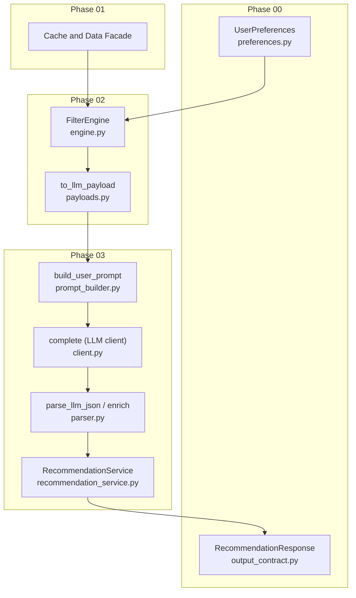
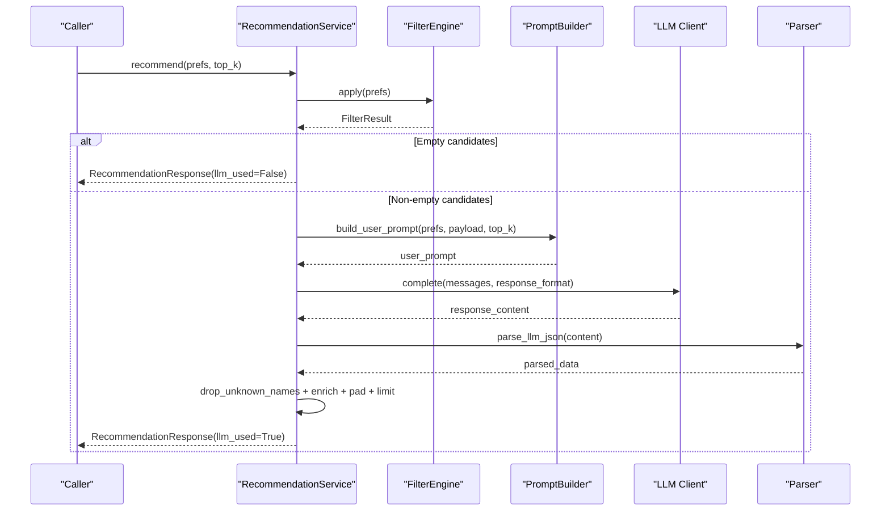
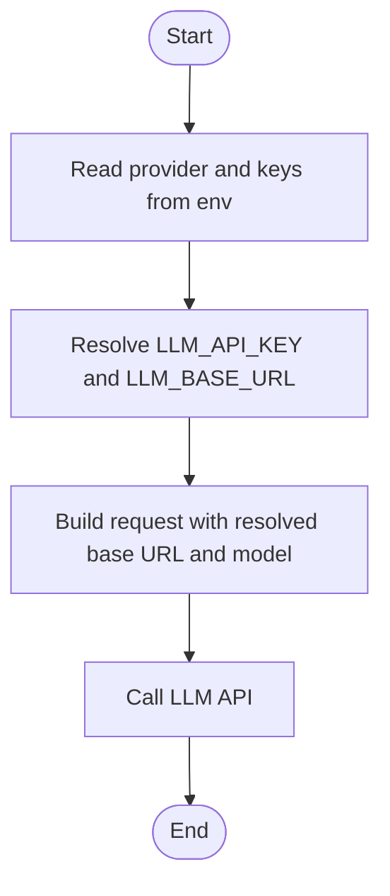
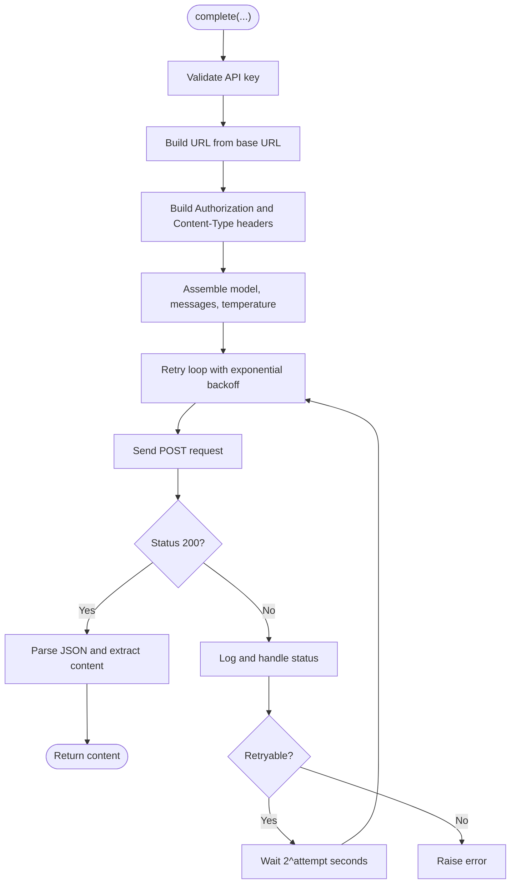
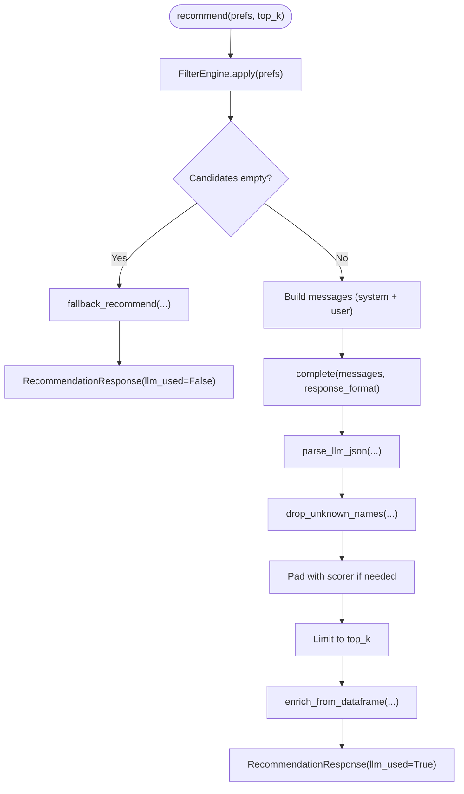
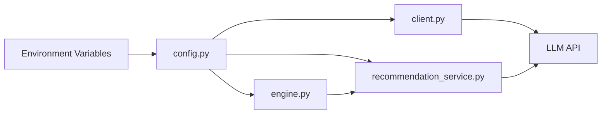
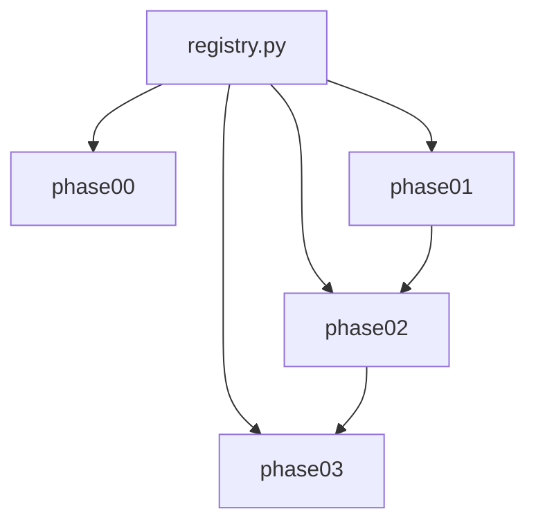

# Design Patterns

<cite>
**Referenced Files in This Document**
- [config.py](file://zomato-ai-recommendation/src/config.py)
- [client.py](file://zomato-ai-recommendation/src/llm/client.py)
- [prompt_builder.py](file://zomato-ai-recommendation/src/llm/prompt_builder.py)
- [parser.py](file://zomato-ai-recommendation/src/llm/parser.py)
- [recommendation_service.py](file://zomato-ai-recommendation/src/services/recommendation_service.py)
- [engine.py](file://zomato-ai-recommendation/src/phases/phase02/engine.py)
- [payloads.py](file://zomato-ai-recommendation/src/phases/phase02/payloads.py)
- [preferences.py](file://zomato-ai-recommendation/src/phases/phase00/preferences.py)
- [output_contract.py](file://zomato-ai-recommendation/src/phases/phase00/output_contract.py)
- [registry.py](file://zomato-ai-recommendation/src/phases/registry.py)
- [test_recommendation.py](file://zomato-ai-recommendation/tests/test_recommendation.py)
</cite>

## Table of Contents
1. [Introduction](#introduction)
2. [Project Structure](#project-structure)
3. [Core Components](#core-components)
4. [Architecture Overview](#architecture-overview)
5. [Detailed Component Analysis](#detailed-component-analysis)
6. [Dependency Analysis](#dependency-analysis)
7. [Performance Considerations](#performance-considerations)
8. [Troubleshooting Guide](#troubleshooting-guide)
9. [Conclusion](#conclusion)

## Introduction
This document explains the design patterns implemented across the system’s architecture and how they contribute to extensibility, maintainability, and testability. The focus areas are:
- Strategy pattern for LLM provider abstraction
- Factory pattern for client creation
- Template Method for the recommendation workflow
- Observer pattern for configuration change propagation

We also show how these patterns interact to support phased delivery, robustness, and clear separation of concerns.

## Project Structure
The system is organized into phases, each introducing a bounded responsibility and explicit dependencies. Phase 03 encapsulates the LLM recommendation pipeline, integrating filtering, prompting, client invocation, and response parsing.

**Diagram sources**
- [preferences.py:20-71](file://zomato-ai-recommendation/src/phases/phase00/preferences.py#L20-L71)
- [output_contract.py:33-51](file://zomato-ai-recommendation/src/phases/phase00/output_contract.py#L33-L51)
- [engine.py:140-197](file://zomato-ai-recommendation/src/phases/phase02/engine.py#L140-L197)
- [payloads.py:27-44](file://zomato-ai-recommendation/src/phases/phase02/payloads.py#L27-L44)
- [recommendation_service.py:30-200](file://zomato-ai-recommendation/src/services/recommendation_service.py#L30-L200)
- [client.py:14-94](file://zomato-ai-recommendation/src/llm/client.py#L14-L94)
- [prompt_builder.py:30-69](file://zomato-ai-recommendation/src/llm/prompt_builder.py#L30-L69)
- [parser.py:24-141](file://zomato-ai-recommendation/src/llm/parser.py#L24-L141)

**Section sources**
- [registry.py:28-84](file://zomato-ai-recommendation/src/phases/registry.py#L28-L84)

## Core Components
- LLM client with retry/backoff: Encapsulates HTTP calls and error handling for LLM APIs.
- Prompt builder: Produces system and user prompts tailored to the LLM.
- Response parser: Validates and normalizes LLM JSON output.
- Recommendation service: Orchestrates filtering, prompting, LLM invocation, and post-processing.
- Filter engine: Applies structured filters and pre-scores candidates.
- Payload shaping: Prepares compact candidate lists for prompts.

These components are wired together in a Template Method-style workflow within the recommendation service, while configuration-driven selection enables Strategy-like provider switching.

**Section sources**
- [client.py:14-94](file://zomato-ai-recommendation/src/llm/client.py#L14-L94)
- [prompt_builder.py:30-69](file://zomato-ai-recommendation/src/llm/prompt_builder.py#L30-L69)
- [parser.py:24-141](file://zomato-ai-recommendation/src/llm/parser.py#L24-L141)
- [recommendation_service.py:30-200](file://zomato-ai-recommendation/src/services/recommendation_service.py#L30-L200)
- [engine.py:140-197](file://zomato-ai-recommendation/src/phases/phase02/engine.py#L140-L197)
- [payloads.py:27-44](file://zomato-ai-recommendation/src/phases/phase02/payloads.py#L27-L44)

## Architecture Overview
The recommendation pipeline follows a Template Method: the high-level steps are fixed, but the individual steps can be varied or swapped. Provider selection is handled via configuration, enabling Strategy-like substitution of providers.

**Diagram sources**
- [recommendation_service.py:37-131](file://zomato-ai-recommendation/src/services/recommendation_service.py#L37-L131)
- [engine.py:146-189](file://zomato-ai-recommendation/src/phases/phase02/engine.py#L146-L189)
- [prompt_builder.py:30-69](file://zomato-ai-recommendation/src/llm/prompt_builder.py#L30-L69)
- [client.py:14-94](file://zomato-ai-recommendation/src/llm/client.py#L14-L94)
- [parser.py:24-141](file://zomato-ai-recommendation/src/llm/parser.py#L24-L141)

## Detailed Component Analysis

### Strategy Pattern: LLM Provider Abstraction
The Strategy pattern is realized through configuration-driven provider selection. The system reads the provider setting and selects the appropriate API key and base URL, allowing swapping between providers (e.g., Groq and OpenAI-compatible endpoints) without changing the client call site.

Key implementation points:
- Provider selection and API key resolution are centralized in configuration.
- The LLM client consumes the resolved key and base URL.
- The client remains agnostic of provider specifics beyond endpoint and key.

Benefits:
- Extensibility: Adding a new provider requires updating configuration mapping and endpoint defaults.
- Testability: Provider behavior can be mocked via environment variables and HTTP mocking.
- Maintainability: Provider-specific logic is isolated in configuration.

Concrete evidence:
- Provider and keys are resolved from environment variables and mapped to runtime values.
- The client constructs the request using the resolved base URL and model.

**Diagram sources**
- [config.py:26-38](file://zomato-ai-recommendation/src/config.py#L26-L38)
- [client.py:39-49](file://zomato-ai-recommendation/src/llm/client.py#L39-L49)

**Section sources**
- [config.py:26-38](file://zomato-ai-recommendation/src/config.py#L26-L38)
- [client.py:36-51](file://zomato-ai-recommendation/src/llm/client.py#L36-L51)

### Factory Pattern: Client Creation
The Factory pattern is evident in the LLM client’s construction of the HTTP client and request payload. The client encapsulates the creation of the HTTPX client, request headers, and payload, returning a unified interface for invoking the LLM. This centralization acts as a factory for LLM interactions.

Benefits:
- Encapsulation: HTTPX client lifecycle and payload assembly are internalized.
- Consistency: Uniform retry/backoff and error handling across invocations.
- Testability: The factory can be patched or stubbed in tests.

Concrete evidence:
- The client creates an HTTPX client per call and builds the payload with model and messages.
- It applies exponential backoff and handles specific status codes.

**Diagram sources**
- [client.py:14-94](file://zomato-ai-recommendation/src/llm/client.py#L14-L94)

**Section sources**
- [client.py:14-94](file://zomato-ai-recommendation/src/llm/client.py#L14-L94)

### Template Method: Recommendation Workflow
The recommendation workflow is a Template Method: the high-level steps are fixed, but the low-level steps (filtering, prompting, parsing, enrichment) can vary. The service orchestrates the process, ensuring consistent behavior while allowing pluggable components.

Template steps:
- Apply filters and produce a shortlist.
- Build the user prompt from preferences and candidates.
- Invoke the LLM client.
- Parse and validate the response.
- Drop hallucinations, enrich fields, pad if needed, and limit results.
- Return a typed response.

Benefits:
- Extensibility: New parsing rules, enrichment logic, or fallback strategies can be introduced without altering the orchestration.
- Maintainability: Clear separation between orchestration and implementation.
- Testability: Each step can be unit-tested independently.

**Diagram sources**
- [recommendation_service.py:37-131](file://zomato-ai-recommendation/src/services/recommendation_service.py#L37-L131)
- [engine.py:146-189](file://zomato-ai-recommendation/src/phases/phase02/engine.py#L146-L189)
- [parser.py:24-141](file://zomato-ai-recommendation/src/llm/parser.py#L24-L141)

**Section sources**
- [recommendation_service.py:37-131](file://zomato-ai-recommendation/src/services/recommendation_service.py#L37-L131)

### Observer Pattern: Configuration Change Propagation
The Observer pattern manifests through configuration loading and environment-driven behavior. Changes to environment variables (e.g., provider, model, base URL) propagate automatically to dependent modules at runtime. This enables dynamic behavior without manual reconfiguration.

Implementation:
- Configuration loads environment variables and exposes normalized values.
- Modules import configuration and use resolved values.
- Tests can override environment variables to simulate changes.

Benefits:
- Observability: Consumers react to configuration changes transparently.
- Flexibility: Runtime tuning without redeployments.
- Testability: Easy to simulate different configurations.

Concrete evidence:
- Environment variables are loaded and normalized into module globals.
- The LLM client consumes the resolved configuration values.

**Diagram sources**
- [config.py:15-50](file://zomato-ai-recommendation/src/config.py#L15-L50)
- [client.py:10](file://zomato-ai-recommendation/src/llm/client.py#L10)
- [recommendation_service.py:9-17](file://zomato-ai-recommendation/src/services/recommendation_service.py#L9-L17)
- [engine.py:14](file://zomato-ai-recommendation/src/phases/phase02/engine.py#L14)

**Section sources**
- [config.py:15-50](file://zomato-ai-recommendation/src/config.py#L15-L50)

## Dependency Analysis
The system enforces phased dependencies to ensure modularity and rollback safety. Each phase imports only from earlier phases, and the registry validates dependency order.

**Diagram sources**
- [registry.py:28-84](file://zomato-ai-recommendation/src/phases/registry.py#L28-L84)

**Section sources**
- [registry.py:28-84](file://zomato-ai-recommendation/src/phases/registry.py#L28-L84)

## Performance Considerations
- Retry/backoff reduces wasted requests under transient failures.
- Structured filtering limits the candidate set to reduce prompt size and cost.
- Payload shaping minimizes unnecessary fields for prompts.
- Fallback ensures availability when the LLM is unavailable or misconfigured.

## Troubleshooting Guide
Common issues and mitigations:
- Missing API key: The client raises a clear error; ensure the appropriate environment variable is set.
- Rate limiting: The client retries with exponential backoff; monitor logs for warnings.
- Invalid JSON: The parser validates and raises descriptive errors; ensure the LLM adheres to the expected schema.
- Hallucinated names: The service drops unknown names and can pad results from the scorer.
- Empty candidates: The service returns a user-facing message indicating why no matches were found.

Concrete tests demonstrate:
- Retry behavior on rate-limited responses.
- Parsing robustness for wrapped or clean JSON.
- Grounding and enrichment correctness.
- Fallback behavior on LLM failure.
- Padding logic to meet requested counts.

**Section sources**
- [client.py:36-94](file://zomato-ai-recommendation/src/llm/client.py#L36-L94)
- [parser.py:24-141](file://zomato-ai-recommendation/src/llm/parser.py#L24-L141)
- [recommendation_service.py:132-199](file://zomato-ai-recommendation/src/services/recommendation_service.py#L132-L199)
- [test_recommendation.py:133-155](file://zomato-ai-recommendation/tests/test_recommendation.py#L133-L155)
- [test_recommendation.py:188-251](file://zomato-ai-recommendation/tests/test_recommendation.py#L188-L251)
- [test_recommendation.py:254-280](file://zomato-ai-recommendation/tests/test_recommendation.py#L254-L280)

## Conclusion
The system leverages Strategy, Factory, Template Method, and Observer patterns to achieve:
- Extensibility: New providers, parsers, and fallbacks can be integrated cleanly.
- Maintainability: Clear boundaries between phases and components.
- Testability: Well-defined interfaces and deterministic behaviors enable robust unit and integration tests.

Together, these patterns support the phased architecture and deliver a resilient, configurable recommendation pipeline.