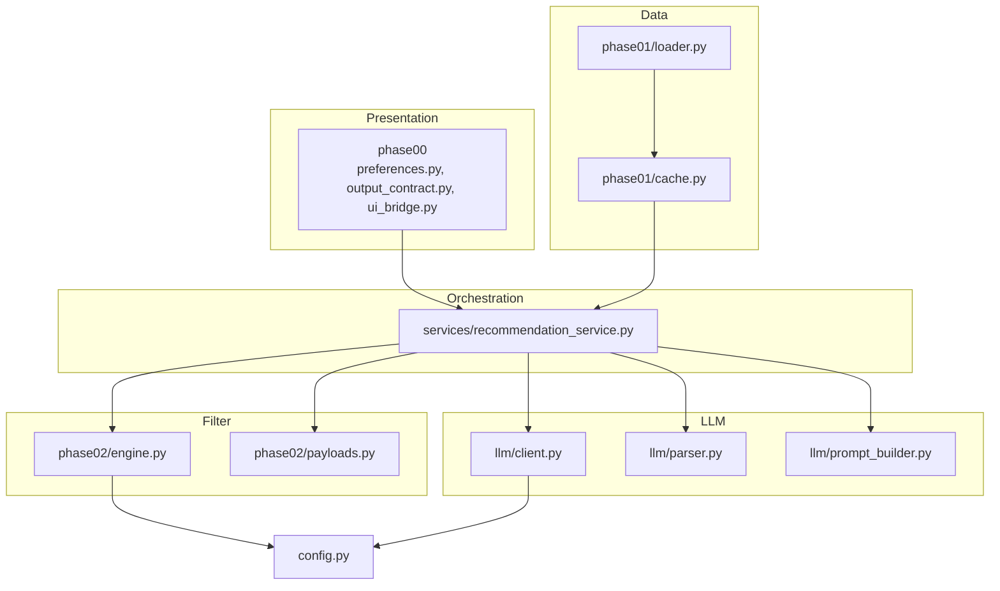
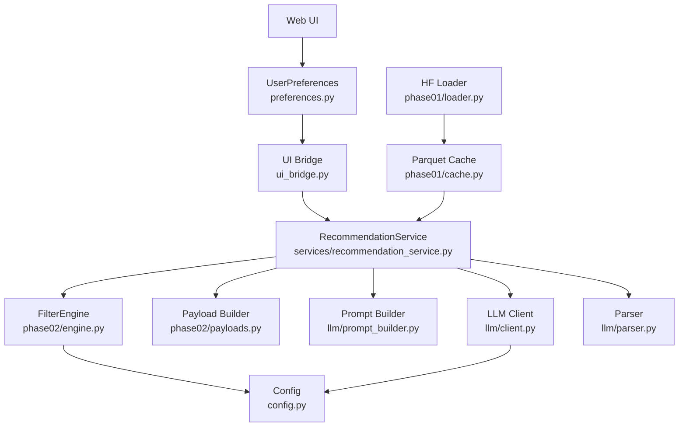
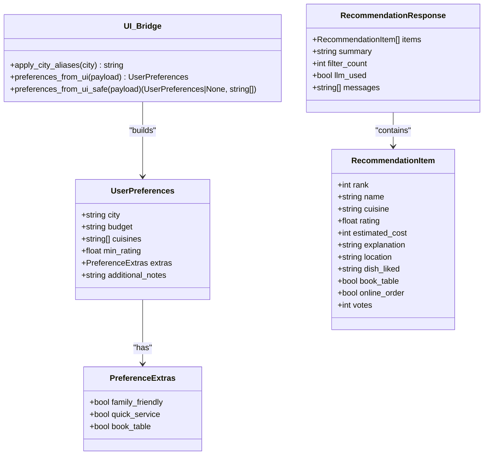
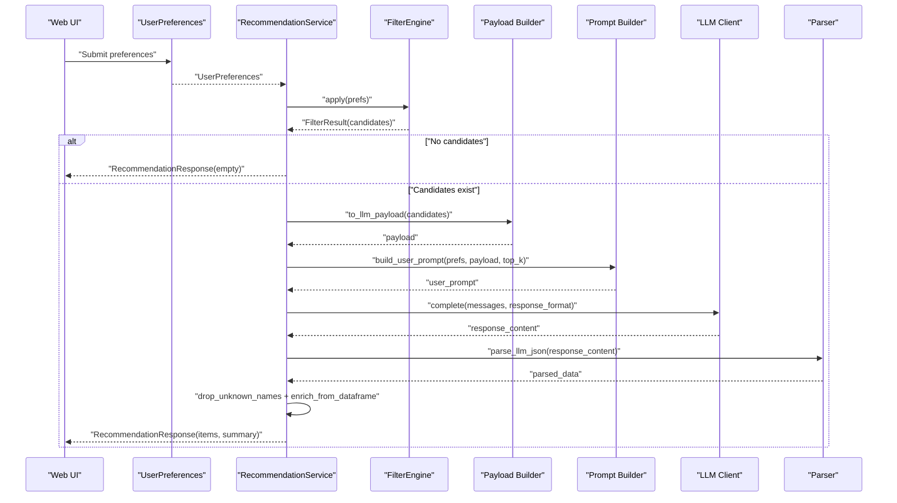
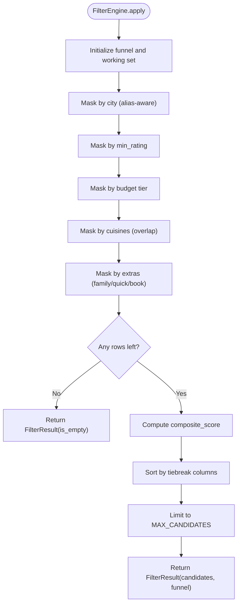
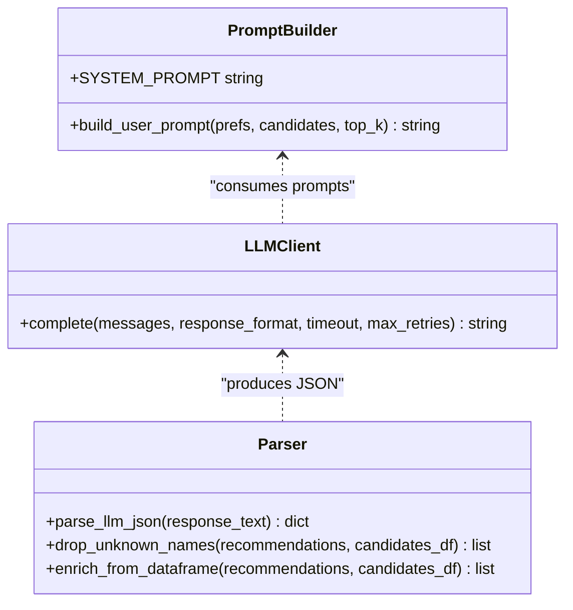
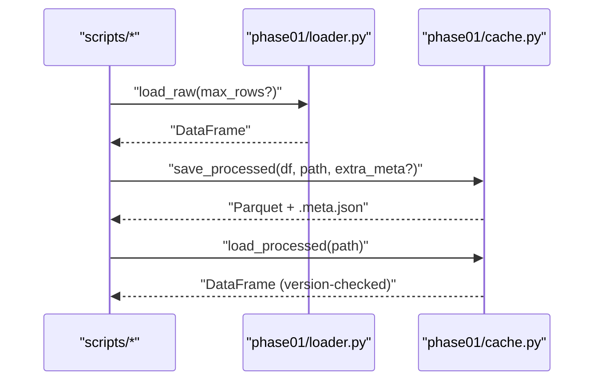
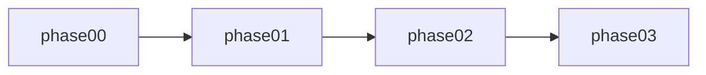

# Layered Architecture

<cite>
**Referenced Files in This Document**
- [README.md](file://README.md)
- [src/config.py](file://src/config.py)
- [src/services/recommendation_service.py](file://src/services/recommendation_service.py)
- [src/phases/registry.py](file://src/phases/registry.py)
- [src/phases/phase00/preferences.py](file://src/phases/phase00/preferences.py)
- [src/phases/phase00/output_contract.py](file://src/phases/phase00/output_contract.py)
- [src/phases/phase00/ui_bridge.py](file://src/phases/phase00/ui_bridge.py)
- [src/phases/phase01/loader.py](file://src/phases/phase01/loader.py)
- [src/phases/phase01/cache.py](file://src/phases/phase01/cache.py)
- [src/phases/phase02/engine.py](file://src/phases/phase02/engine.py)
- [src/phases/phase02/payloads.py](file://src/phases/phase02/payloads.py)
- [src/llm/client.py](file://src/llm/client.py)
- [src/llm/parser.py](file://src/llm/parser.py)
- [src/llm/prompt_builder.py](file://src/llm/prompt_builder.py)
- [src/models/restaurant.py](file://src/models/restaurant.py)
</cite>

## Table of Contents
1. [Introduction](#introduction)
2. [Project Structure](#project-structure)
3. [Core Components](#core-components)
4. [Architecture Overview](#architecture-overview)
5. [Detailed Component Analysis](#detailed-component-analysis)
6. [Dependency Analysis](#dependency-analysis)
7. [Performance Considerations](#performance-considerations)
8. [Troubleshooting Guide](#troubleshooting-guide)
9. [Conclusion](#conclusion)

## Introduction
This document explains the layered architecture pattern implemented in the recommendation system. The system follows a five-layer design:
- Presentation: Web UI contracts and normalization bridging
- Orchestration: Recommendation service coordinating filters and LLM
- Filter: Structured filtering and scoring engine
- LLM: Prompt building, client invocation, and response parsing
- Data: Hugging Face ingestion, caching, and DataFrame loading

It documents responsibilities, layer boundaries, data flow, interface contracts, dependency injection patterns, and how the layered approach supports testing and maintenance.

## Project Structure
The repository is organized by development phases and functional layers. The Presentation and Orchestration layers are primarily under src/phases/phase00 and src/services, Filter and Data under src/phases/phase01 and src/phases/phase02, and LLM under src/llm. Configuration is centralized in src/config.py.

**Diagram sources**
- [src/phases/phase00/preferences.py:1-71](file://src/phases/phase00/preferences.py#L1-L71)
- [src/phases/phase00/output_contract.py:1-52](file://src/phases/phase00/output_contract.py#L1-L52)
- [src/phases/phase00/ui_bridge.py:1-112](file://src/phases/phase00/ui_bridge.py#L1-L112)
- [src/services/recommendation_service.py:1-200](file://src/services/recommendation_service.py#L1-L200)
- [src/phases/phase02/engine.py:1-197](file://src/phases/phase02/engine.py#L1-L197)
- [src/phases/phase02/payloads.py](file://src/phases/phase02/payloads.py)
- [src/llm/client.py:1-94](file://src/llm/client.py#L1-L94)
- [src/llm/parser.py:1-141](file://src/llm/parser.py#L1-L141)
- [src/llm/prompt_builder.py:1-69](file://src/llm/prompt_builder.py#L1-L69)
- [src/phases/phase01/loader.py:1-64](file://src/phases/phase01/loader.py#L1-L64)
- [src/phases/phase01/cache.py:1-64](file://src/phases/phase01/cache.py#L1-L64)
- [src/config.py:1-50](file://src/config.py#L1-L50)

**Section sources**
- [README.md:14-39](file://README.md#L14-L39)
- [src/config.py:1-50](file://src/config.py#L1-L50)

## Core Components
- Presentation layer
  - UserPreferences and PreferenceExtras define canonical input contracts.
  - RecommendationItem and RecommendationResponse define stable output contracts.
  - UI bridge normalizes UI inputs to canonical models and validates constraints.
- Orchestration layer
  - RecommendationService coordinates filtering and LLM ranking, with a robust fallback path.
- Filter layer
  - FilterEngine applies vectorized filters and composite scoring to produce a shortlist.
  - Payload helpers prepare slim candidate lists for LLM consumption.
- LLM layer
  - Prompt builder constructs system and user prompts with strict JSON schema guidance.
  - Client handles HTTP requests, retries, and error handling.
  - Parser extracts and validates JSON, drops hallucinations, and enriches fields from ground truth.
- Data layer
  - Loader fetches and caches the dataset as Parquet with metadata.
  - Cache utilities manage versioned artifacts and sidecar metadata.

**Section sources**
- [src/phases/phase00/preferences.py:1-71](file://src/phases/phase00/preferences.py#L1-L71)
- [src/phases/phase00/output_contract.py:1-52](file://src/phases/phase00/output_contract.py#L1-L52)
- [src/phases/phase00/ui_bridge.py:1-112](file://src/phases/phase00/ui_bridge.py#L1-L112)
- [src/services/recommendation_service.py:1-200](file://src/services/recommendation_service.py#L1-L200)
- [src/phases/phase02/engine.py:1-197](file://src/phases/phase02/engine.py#L1-L197)
- [src/phases/phase02/payloads.py](file://src/phases/phase02/payloads.py)
- [src/llm/prompt_builder.py:1-69](file://src/llm/prompt_builder.py#L1-L69)
- [src/llm/client.py:1-94](file://src/llm/client.py#L1-L94)
- [src/llm/parser.py:1-141](file://src/llm/parser.py#L1-L141)
- [src/phases/phase01/loader.py:1-64](file://src/phases/phase01/loader.py#L1-L64)
- [src/phases/phase01/cache.py:1-64](file://src/phases/phase01/cache.py#L1-L64)

## Architecture Overview
The five-layer architecture enforces clear separation of concerns:
- Presentation: Defines contracts and normalizes user inputs.
- Orchestration: Coordinates steps, manages fallbacks, and composes outputs.
- Filter: Applies deterministic, vectorized filtering and scoring.
- LLM: Provides explainable ranking with strict schema enforcement and safety checks.
- Data: Supplies reliable, versioned datasets.

**Diagram sources**
- [src/phases/phase00/preferences.py:1-71](file://src/phases/phase00/preferences.py#L1-L71)
- [src/phases/phase00/ui_bridge.py:1-112](file://src/phases/phase00/ui_bridge.py#L1-L112)
- [src/services/recommendation_service.py:1-200](file://src/services/recommendation_service.py#L1-L200)
- [src/phases/phase02/engine.py:1-197](file://src/phases/phase02/engine.py#L1-L197)
- [src/phases/phase02/payloads.py](file://src/phases/phase02/payloads.py)
- [src/llm/prompt_builder.py:1-69](file://src/llm/prompt_builder.py#L1-L69)
- [src/llm/client.py:1-94](file://src/llm/client.py#L1-L94)
- [src/llm/parser.py:1-141](file://src/llm/parser.py#L1-L141)
- [src/phases/phase01/cache.py:1-64](file://src/phases/phase01/cache.py#L1-L64)
- [src/phases/phase01/loader.py:1-64](file://src/phases/phase01/loader.py#L1-L64)
- [src/config.py:1-50](file://src/config.py#L1-L50)

## Detailed Component Analysis

### Presentation Layer
Responsibilities:
- Define canonical input/output contracts for the UI.
- Normalize and validate user inputs from UI widgets or JSON bodies.

Key contracts:
- UserPreferences: city, budget tier, cuisines, min_rating, extras, optional notes.
- RecommendationItem and RecommendationResponse: stable UI-facing shapes.

UI bridge:
- Normalizes city aliases and coerces extras and budget.
- Validates and truncates inputs per UI constraints.

**Diagram sources**
- [src/phases/phase00/preferences.py:1-71](file://src/phases/phase00/preferences.py#L1-L71)
- [src/phases/phase00/output_contract.py:1-52](file://src/phases/phase00/output_contract.py#L1-L52)
- [src/phases/phase00/ui_bridge.py:1-112](file://src/phases/phase00/ui_bridge.py#L1-L112)

**Section sources**
- [src/phases/phase00/preferences.py:1-71](file://src/phases/phase00/preferences.py#L1-L71)
- [src/phases/phase00/output_contract.py:1-52](file://src/phases/phase00/output_contract.py#L1-L52)
- [src/phases/phase00/ui_bridge.py:1-112](file://src/phases/phase00/ui_bridge.py#L1-L112)

### Orchestration Layer
Responsibilities:
- Coordinate filtering and LLM ranking.
- Manage fallback to structured scoring when LLM is unavailable.
- Compose final RecommendationResponse with explanations and summaries.

Processing logic:
- Apply FilterEngine to produce candidates.
- Build LLM payload and prompt.
- Invoke LLM client and parse JSON.
- Drop hallucinated names and pad with top candidates if needed.
- Enrich items with ground truth fields.

**Diagram sources**
- [src/services/recommendation_service.py:1-200](file://src/services/recommendation_service.py#L1-L200)
- [src/phases/phase02/engine.py:1-197](file://src/phases/phase02/engine.py#L1-L197)
- [src/phases/phase02/payloads.py](file://src/phases/phase02/payloads.py)
- [src/llm/prompt_builder.py:1-69](file://src/llm/prompt_builder.py#L1-L69)
- [src/llm/client.py:1-94](file://src/llm/client.py#L1-L94)
- [src/llm/parser.py:1-141](file://src/llm/parser.py#L1-L141)

**Section sources**
- [src/services/recommendation_service.py:1-200](file://src/services/recommendation_service.py#L1-L200)

### Filter Layer
Responsibilities:
- Apply vectorized filters (city, rating, budget, cuisines, extras).
- Compute composite scores and sort candidates.
- Return FilterResult with funnel statistics and messages.

**Diagram sources**
- [src/phases/phase02/engine.py:1-197](file://src/phases/phase02/engine.py#L1-L197)

**Section sources**
- [src/phases/phase02/engine.py:1-197](file://src/phases/phase02/engine.py#L1-L197)

### LLM Layer
Responsibilities:
- Build system and user prompts with strict JSON schema guidance.
- Invoke LLM API with retries and timeouts.
- Parse, validate, and sanitize LLM outputs.

**Diagram sources**
- [src/llm/prompt_builder.py:1-69](file://src/llm/prompt_builder.py#L1-L69)
- [src/llm/client.py:1-94](file://src/llm/client.py#L1-L94)
- [src/llm/parser.py:1-141](file://src/llm/parser.py#L1-L141)

**Section sources**
- [src/llm/prompt_builder.py:1-69](file://src/llm/prompt_builder.py#L1-L69)
- [src/llm/client.py:1-94](file://src/llm/client.py#L1-L94)
- [src/llm/parser.py:1-141](file://src/llm/parser.py#L1-L141)

### Data Layer
Responsibilities:
- Load raw dataset from Hugging Face with retries.
- Persist processed DataFrame as Parquet with metadata.
- Load cached artifacts safely with version checks.

**Diagram sources**
- [src/phases/phase01/loader.py:1-64](file://src/phases/phase01/loader.py#L1-L64)
- [src/phases/phase01/cache.py:1-64](file://src/phases/phase01/cache.py#L1-L64)

**Section sources**
- [src/phases/phase01/loader.py:1-64](file://src/phases/phase01/loader.py#L1-L64)
- [src/phases/phase01/cache.py:1-64](file://src/phases/phase01/cache.py#L1-L64)

## Dependency Analysis
Layer boundaries and directionality:
- Presentation depends on Orchestration via contracts.
- Orchestration depends on Filter, LLM, and Data.
- Filter depends on Presentation contracts and Config.
- LLM depends on Orchestration and Config.
- Data is foundational and consumed by Orchestration.

Phased dependency manifest:
- Phase 00 (web contract) is independent.
- Phase 01 (data foundation) depends on 00.
- Phase 02 (filtering engine) depends on 01.
- Phase 03 (LLM recommendation) depends on 02.

**Diagram sources**
- [src/phases/registry.py:28-68](file://src/phases/registry.py#L28-L68)

**Section sources**
- [src/phases/registry.py:1-84](file://src/phases/registry.py#L1-L84)

## Performance Considerations
- Vectorized filtering minimizes Python loops and leverages pandas masks for speed.
- Early exit when no candidates remain reduces unnecessary LLM calls.
- Payload trimming limits token usage and cost.
- Retry/backoff in the LLM client prevents transient failures from failing recommendations.
- Caching processed datasets avoids repeated downloads and transformations.

## Troubleshooting Guide
Common issues and remedies:
- No candidates returned
  - Cause: Overly restrictive filters or city mismatch.
  - Action: Inspect funnel stats and messages from FilterEngine; relax constraints incrementally.
- LLM API key missing
  - Cause: Missing environment variable.
  - Action: Set LLM provider key; the service falls back to structured scoring.
- LLM response malformed
  - Cause: Non-JSON output or markdown wrappers.
  - Action: Parser extracts JSON blocks; ensure system prompt compliance.
- Unknown restaurant names
  - Cause: LLM hallucination.
  - Action: drop_unknown_names filters out non-candidates; enrichment uses ground truth.
- Cache version mismatch
  - Cause: Outdated metadata.
  - Action: Rebuild cache using provided script.

**Section sources**
- [src/services/recommendation_service.py:45-130](file://src/services/recommendation_service.py#L45-L130)
- [src/llm/parser.py:45-66](file://src/llm/parser.py#L45-L66)
- [src/phases/phase01/cache.py:52-60](file://src/phases/phase01/cache.py#L52-L60)

## Conclusion
The layered architecture cleanly separates concerns across Presentation, Orchestration, Filter, LLM, and Data. Contracts defined in the Presentation layer decouple UI from backend logic. Orchestration coordinates steps and ensures resilience with fallbacks. Filter and LLM layers encapsulate domain logic and safety checks. Data layer provides reliable, versioned assets. This design enables modular testing, incremental development, and straightforward maintenance.