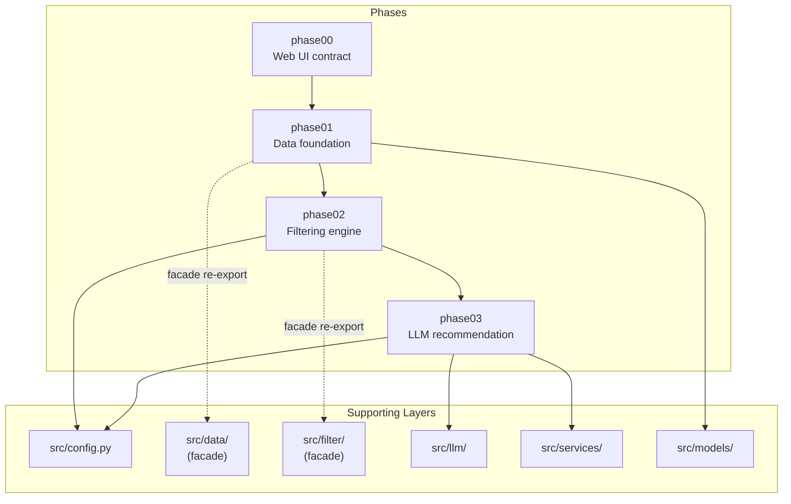
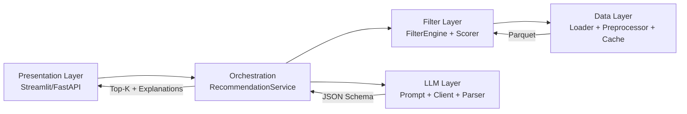
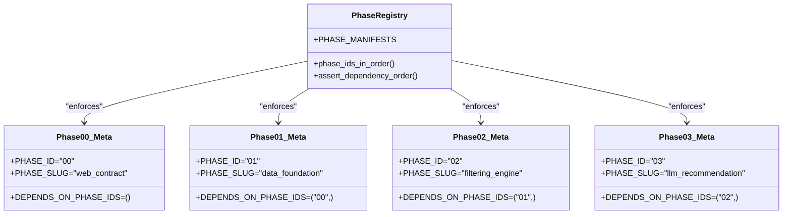
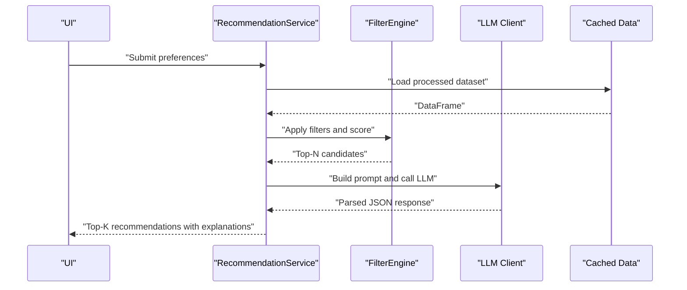

# Phased Architecture

<cite>
**Referenced Files in This Document**
- [README.md](file://README.md)
- [docs/phases.md](file://docs/phases.md)
- [docs/ARCHITECTURE.md](file://docs/ARCHITECTURE.md)
- [src/phases/registry.py](file://src/phases/registry.py)
- [src/phases/__init__.py](file://src/phases/__init__.py)
- [src/phases/phase00/meta.py](file://src/phases/phase00/meta.py)
- [src/phases/phase01/meta.py](file://src/phases/phase01/meta.py)
- [src/phases/phase02/meta.py](file://src/phases/phase02/meta.py)
- [src/phases/phase03/meta.py](file://src/phases/phase03/meta.py)
- [src/phases/phase00/preferences.py](file://src/phases/phase00/preferences.py)
- [src/phases/phase01/loader.py](file://src/phases/phase01/loader.py)
- [src/phases/phase01/preprocessor.py](file://src/phases/phase01/preprocessor.py)
- [src/phases/phase01/cache.py](file://src/phases/phase01/cache.py)
- [src/phases/phase02/engine.py](file://src/phases/phase02/engine.py)
- [src/phases/phase02/scorer.py](file://src/phases/phase02/scorer.py)
</cite>

## Table of Contents
1. [Introduction](#introduction)
2. [Project Structure](#project-structure)
3. [Core Components](#core-components)
4. [Architecture Overview](#architecture-overview)
5. [Detailed Component Analysis](#detailed-component-analysis)
6. [Dependency Analysis](#dependency-analysis)
7. [Performance Considerations](#performance-considerations)
8. [Troubleshooting Guide](#troubleshooting-guide)
9. [Conclusion](#conclusion)
10. [Appendices](#appendices)

## Introduction
This document explains the five-phase architecture of the Zomato AI Recommendation System. It describes the sequential dependencies, the phase registry system, rollback mechanisms, and how each phase builds upon previous ones while maintaining isolation boundaries. It also documents deliverables, transition criteria, error handling strategies, and practical examples of phase interactions. The phased approach improves maintainability, testability, and operational safety by enforcing strict forward-only dependencies and providing clear rollback hints.

## Project Structure
The repository organizes functionality by phases under src/phases/, with supporting layers for data, filtering, LLM, and services. The phases are ordered and enforced by a registry that prevents reverse dependencies and provides rollback guidance.

**Diagram sources**
- [docs/ARCHITECTURE.md:146-181](file://docs/ARCHITECTURE.md#L146-L181)
- [src/phases/registry.py:28-68](file://src/phases/registry.py#L28-L68)

**Section sources**
- [README.md:14-39](file://README.md#L14-L39)
- [docs/ARCHITECTURE.md:146-181](file://docs/ARCHITECTURE.md#L146-L181)

## Core Components
- Phase registry: Defines phase identities, dependency order, and rollback hints. It enforces forward-only dependencies and exposes helpers to validate ordering.
- Phase manifests: Immutable records mapping each phase to its package, dependencies, and rollback guidance.
- Phase meta modules: Keep phase identifiers and dependency lists synchronized with the registry.
- Contracts and models: Shared data contracts (e.g., user preferences) are defined in phase00 and imported by later phases only.
- Data foundation: Loads, cleans, and caches the dataset for downstream phases.
- Filtering engine: Applies structured filters and pre-ranks candidates for the LLM.
- LLM layer: Builds prompts, calls the provider, parses results, and enforces anti-hallucination checks.

**Section sources**
- [src/phases/registry.py:16-84](file://src/phases/registry.py#L16-L84)
- [src/phases/phase00/meta.py:1-6](file://src/phases/phase00/meta.py#L1-L6)
- [src/phases/phase01/meta.py:1-6](file://src/phases/phase01/meta.py#L1-L6)
- [src/phases/phase02/meta.py:1-6](file://src/phases/phase02/meta.py#L1-L6)
- [src/phases/phase03/meta.py:1-6](file://src/phases/phase03/meta.py#L1-L6)
- [src/phases/phase00/preferences.py:1-71](file://src/phases/phase00/preferences.py#L1-L71)
- [src/phases/phase01/loader.py:1-64](file://src/phases/phase01/loader.py#L1-L64)
- [src/phases/phase01/preprocessor.py:1-232](file://src/phases/phase01/preprocessor.py#L1-L232)
- [src/phases/phase01/cache.py:1-64](file://src/phases/phase01/cache.py#L1-L64)
- [src/phases/phase02/engine.py:1-197](file://src/phases/phase02/engine.py#L1-L197)
- [src/phases/phase02/scorer.py:1-70](file://src/phases/phase02/scorer.py#L1-L70)

## Architecture Overview
The system follows a layered, vertically integrated approach:
- Data layer: Loads and caches the dataset.
- Filter layer: Applies structured filters and pre-scores candidates.
- LLM layer: Ranks and explains recommendations using a small, curated candidate set.
- Presentation layer: Streamlit UI (MVP) or future FastAPI + frontend.
- Services: Orchestration and fallback logic.

**Diagram sources**
- [docs/ARCHITECTURE.md:12-39](file://docs/ARCHITECTURE.md#L12-L39)
- [docs/ARCHITECTURE.md:122-134](file://docs/ARCHITECTURE.md#L122-L134)

**Section sources**
- [docs/ARCHITECTURE.md:3-11](file://docs/ARCHITECTURE.md#L3-L11)
- [docs/ARCHITECTURE.md:43-114](file://docs/ARCHITECTURE.md#L43-L114)

## Detailed Component Analysis

### Phase 00: Web UI contract
Objective: Define stable typed inputs and outputs for the UI before building data, filters, or LLM logic. This ensures downstream phases can rely on consistent contracts and simplifies rollback if later phases are removed.

Key responsibilities:
- Define canonical user preferences and extras.
- Provide UI bridge helpers for city aliases and input normalization.
- Establish output contracts for recommendations.

Deliverables:
- UserPreferences model and extras.
- UI bridge functions.
- Output contract models.

Transition criteria:
- Validation errors surfaced to the UI.
- Notes and cuisines bounded.
- Output types exist for rendering.

Rollback guidance:
- Removing phase00 requires replacing or deleting downstream imports of contracts.

**Section sources**
- [docs/phases.md:37-63](file://docs/phases.md#L37-L63)
- [src/phases/phase00/preferences.py:1-71](file://src/phases/phase00/preferences.py#L1-L71)
- [src/phases/phase00/meta.py:1-6](file://src/phases/phase00/meta.py#L1-L6)

### Phase 01: Data foundation
Objective: Establish a reliable, fast, and versioned local cache of the Zomato dataset with a clean, typed schema.

Key responsibilities:
- Load dataset from Hugging Face.
- Clean and normalize fields (ratings, costs, cuisines, cities).
- Persist a versioned Parquet cache with metadata.
- Provide a CLI to refresh the cache.

Deliverables:
- Loader, preprocessor, cache I/O, record schema, registry, refresh script, and cached dataset.

Transition criteria:
- CLI builds cache successfully.
- Data types are correct and invalid values are logged.
- Schema is stable and excludes unnecessary fields.

Rollback guidance:
- Removing phase01 and its callers breaks downstream phases until restored.

**Section sources**
- [docs/phases.md:65-152](file://docs/phases.md#L65-L152)
- [src/phases/phase01/loader.py:1-64](file://src/phases/phase01/loader.py#L1-L64)
- [src/phases/phase01/preprocessor.py:1-232](file://src/phases/phase01/preprocessor.py#L1-L232)
- [src/phases/phase01/cache.py:1-64](file://src/phases/phase01/cache.py#L1-L64)
- [src/phases/phase01/meta.py:1-6](file://src/phases/phase01/meta.py#L1-L6)

### Phase 02: Filtering engine
Objective: Produce a shortlist of 20–40 candidates using fast, structured filters and pre-scoring before invoking the LLM.

Key responsibilities:
- Apply city, rating, budget, cuisine, and extras filters.
- Compute a composite score and deterministic tiebreak ordering.
- Provide a stable payload for the LLM.

Deliverables:
- Filter engine, scorer, payload helpers, and CLI script.

Transition criteria:
- Filters sub-200 ms on warm cache.
- Correct city/budget/cuisine/rating/extras logic.
- Empty results include actionable reasons.

Rollback guidance:
- Removing phase02 requires updating downstream assumptions about output shape.

**Section sources**
- [docs/phases.md:154-212](file://docs/phases.md#L154-L212)
- [src/phases/phase02/engine.py:1-197](file://src/phases/phase02/engine.py#L1-L197)
- [src/phases/phase02/scorer.py:1-70](file://src/phases/phase02/scorer.py#L1-L70)
- [src/phases/phase02/meta.py:1-6](file://src/phases/phase02/meta.py#L1-L6)

### Phase 03: LLM recommendation
Objective: Rank and explain recommendations using an LLM on the filtered candidate set, ensuring no hallucinations.

Key responsibilities:
- Build structured prompts with JSON schema.
- Call provider client with timeouts and retries.
- Parse and enrich results against the original dataframe.
- Provide fallback ranking when the LLM is unavailable.

Deliverables:
- Prompt builder, client, parser, recommendation service, and models.

Transition criteria:
- Returns top K with required fields and explanations.
- Enforces that all names are from the filtered set.
- Graceful fallback on API failure.

Rollback guidance:
- Removing phase03 requires removing LLM-related modules and service.

**Section sources**
- [docs/phases.md:214-272](file://docs/phases.md#L214-L272)
- [docs/ARCHITECTURE.md:81-96](file://docs/ARCHITECTURE.md#L81-L96)

### Phase 04: User interface
Objective: End-to-end Streamlit UX that collects preferences, displays results, and handles loading states.

Deliverables:
- Streamlit app and formatters.

Transition criteria:
- Supports all preference fields, spinner during LLM calls, and empty-state guidance.

Rollback guidance:
- Removing the UI does not affect core logic but requires restoring the app to continue end-to-end testing.

**Section sources**
- [docs/phases.md:274-303](file://docs/phases.md#L274-L303)
- [docs/ARCHITECTURE.md:104-114](file://docs/ARCHITECTURE.md#L104-L114)

### Phase 05: Hardening & deploy
Objective: Comprehensive tests, CI, documentation, resilience, and optional API/deployment.

Deliverables:
- Test suite, CI workflow, runbook, and optional FastAPI/Docker.

Transition criteria:
- All tests pass, README updated, and resilient UX on LLM failure.

Rollback guidance:
- Removing hardening steps reduces reliability but does not break core functionality.

**Section sources**
- [docs/phases.md:305-326](file://docs/phases.md#L305-L326)
- [docs/ARCHITECTURE.md:198-203](file://docs/ARCHITECTURE.md#L198-L203)

## Dependency Analysis
The phase registry defines a strict forward-only dependency graph and provides rollback hints. Each phase’s meta module mirrors the registry’s dependency list to keep them synchronized.

**Diagram sources**
- [src/phases/registry.py:28-68](file://src/phases/registry.py#L28-L68)
- [src/phases/phase00/meta.py:1-6](file://src/phases/phase00/meta.py#L1-L6)
- [src/phases/phase01/meta.py:1-6](file://src/phases/phase01/meta.py#L1-L6)
- [src/phases/phase02/meta.py:1-6](file://src/phases/phase02/meta.py#L1-L6)
- [src/phases/phase03/meta.py:1-6](file://src/phases/phase03/meta.py#L1-L6)

**Section sources**
- [src/phases/registry.py:75-84](file://src/phases/registry.py#L75-L84)
- [src/phases/__init__.py:8-16](file://src/phases/__init__.py#L8-L16)

## Performance Considerations
- Minimize LLM cost and latency by filtering first: target sub-100 ms filtering and small candidate sets (< 40 rows) sent to the LLM.
- Reproducible data via caching: versioned Parquet with metadata enables controlled migrations.
- Testable layers: clear contracts and isolated phases simplify unit and integration testing.
- Graceful degradation: fallback ranking when the LLM is down preserves value.

**Section sources**
- [docs/ARCHITECTURE.md:3-9](file://docs/ARCHITECTURE.md#L3-L9)
- [docs/ARCHITECTURE.md:136-143](file://docs/ARCHITECTURE.md#L136-L143)

## Troubleshooting Guide
Common issues and strategies:
- Dataset load failures: The loader retries with exponential backoff and raises a clear runtime error after repeated failures.
- Cache version mismatch: Loading cache warns when metadata version differs; rebuild using the provided script.
- Empty filter results: The filter engine provides human-readable reasons to guide users to relax constraints.
- LLM errors: The LLM layer supports retries, timeouts, and fallback ranking to preserve UX.

Concrete examples:
- Data ingestion failure: The loader attempts multiple times and surfaces the last error after retries.
- Cache invalidation: On version mismatch, the cache loader logs a warning and instructs to rebuild.
- Filter funnel diagnostics: The filter engine logs stepwise counts and returns actionable messages when the list is empty.
- LLM resilience: The LLM layer handles provider errors and falls back to a deterministic ranking.

**Section sources**
- [src/phases/phase01/loader.py:45-64](file://src/phases/phase01/loader.py#L45-L64)
- [src/phases/phase01/cache.py:46-63](file://src/phases/phase01/cache.py#L46-L63)
- [src/phases/phase02/engine.py:104-137](file://src/phases/phase02/engine.py#L104-L137)
- [docs/ARCHITECTURE.md:81-96](file://docs/ARCHITECTURE.md#L81-L96)

## Conclusion
The phased architecture delivers incremental, testable, and maintainable progress. By enforcing forward-only dependencies, preserving isolation boundaries, and providing rollback hints, the system remains robust and easy to evolve. Each phase builds on the previous one, culminating in a production-ready recommendation pipeline with graceful degradation and strong error handling.

## Appendices

### Phase Registry and Rollback Mechanisms
- The registry defines phase order and rollback hints. It includes a helper to assert dependency order and a function to enumerate phases in order.
- Each phase’s meta module mirrors the registry’s dependency list to keep contracts synchronized.

**Section sources**
- [src/phases/registry.py:28-84](file://src/phases/registry.py#L28-L84)
- [src/phases/phase00/meta.py:1-6](file://src/phases/phase00/meta.py#L1-L6)
- [src/phases/phase01/meta.py:1-6](file://src/phases/phase01/meta.py#L1-L6)
- [src/phases/phase02/meta.py:1-6](file://src/phases/phase02/meta.py#L1-L6)
- [src/phases/phase03/meta.py:1-6](file://src/phases/phase03/meta.py#L1-L6)

### Phase Interactions Example: Request Lifecycle

**Diagram sources**
- [docs/ARCHITECTURE.md:122-134](file://docs/ARCHITECTURE.md#L122-L134)
- [src/phases/phase02/engine.py:146-197](file://src/phases/phase02/engine.py#L146-L197)
- [src/phases/phase01/cache.py:46-63](file://src/phases/phase01/cache.py#L46-L63)