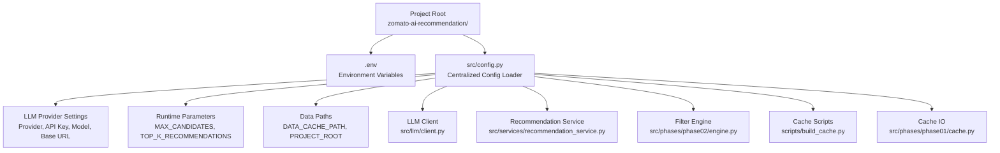
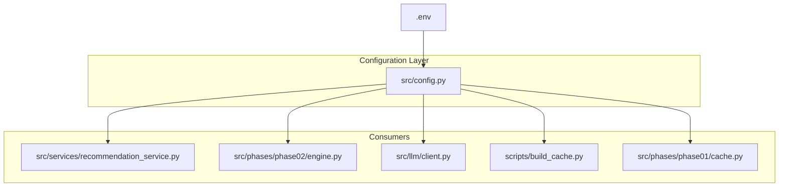
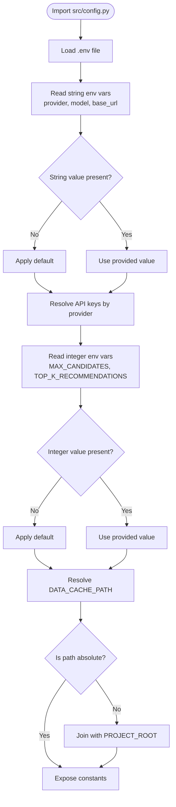
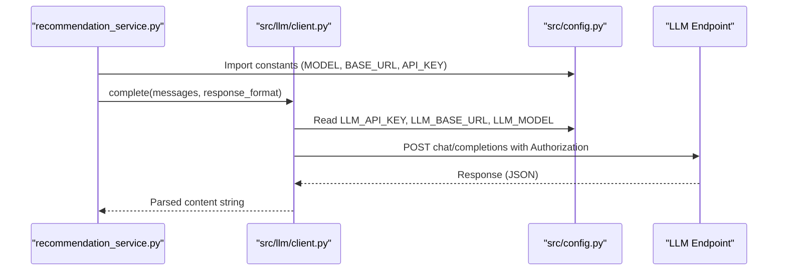
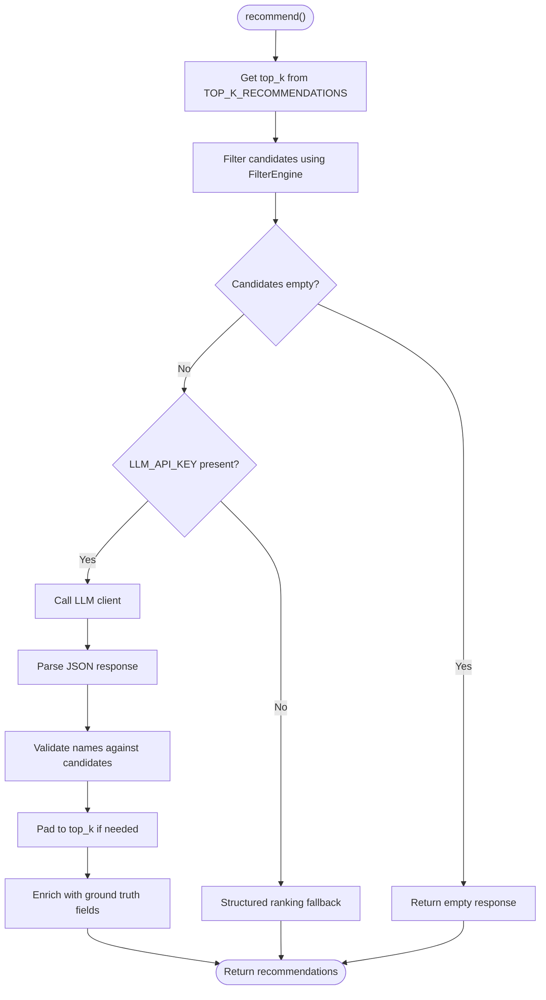
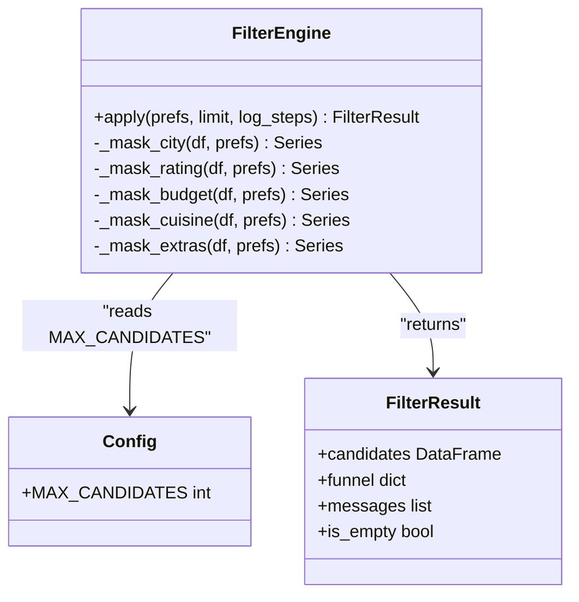
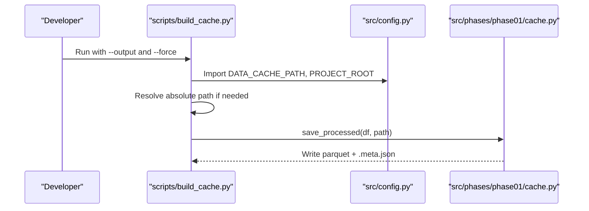
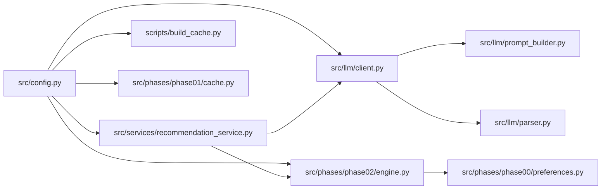

# Configuration Management

<cite>
**Referenced Files in This Document**
- [config.py](file://zomato-ai-recommendation/src/config.py)
- [README.md](file://zomato-ai-recommendation/README.md)
- [requirements.txt](file://zomato-ai-recommendation/requirements.txt)
- [client.py](file://zomato-ai-recommendation/src/llm/client.py)
- [recommendation_service.py](file://zomato-ai-recommendation/src/services/recommendation_service.py)
- [engine.py](file://zomato-ai-recommendation/src/phases/phase02/engine.py)
- [build_cache.py](file://zomato-ai-recommendation/scripts/build_cache.py)
- [cache.py](file://zomato-ai-recommendation/src/phases/phase01/cache.py)
- [preferences.py](file://zomato-ai-recommendation/src/phases/phase00/preferences.py)
- [prompt_builder.py](file://zomato-ai-recommendation/src/llm/prompt_builder.py)
- [parser.py](file://zomato-ai-recommendation/src/llm/parser.py)
</cite>

## Table of Contents
1. [Introduction](#introduction)
2. [Project Structure](#project-structure)
3. [Core Components](#core-components)
4. [Architecture Overview](#architecture-overview)
5. [Detailed Component Analysis](#detailed-component-analysis)
6. [Dependency Analysis](#dependency-analysis)
7. [Performance Considerations](#performance-considerations)
8. [Troubleshooting Guide](#troubleshooting-guide)
9. [Conclusion](#conclusion)

## Introduction
This document describes the configuration management system for the Zomato AI Recommendation System. It explains how environment variables are loaded and normalized, how provider configuration is handled, and how runtime parameters are validated and defaulted. It also details the relationships between configuration and major system components such as the LLM provider, data cache paths, and performance parameters. Practical examples and troubleshooting guidance are included to help customize configurations across environments.

## Project Structure
The configuration system is centralized in a single module that loads environment variables from a .env file located at the project root. Other modules import configuration constants rather than reading environment variables directly, ensuring a consistent and testable configuration surface.

**Diagram sources**
- [config.py:1-50](file://zomato-ai-recommendation/src/config.py#L1-L50)
- [client.py:10](file://zomato-ai-recommendation/src/llm/client.py#L10)
- [recommendation_service.py:9](file://zomato-ai-recommendation/src/services/recommendation_service.py#L9)
- [engine.py:14](file://zomato-ai-recommendation/src/phases/phase02/engine.py#L14)
- [build_cache.py:15](file://zomato-ai-recommendation/scripts/build_cache.py#L15)
- [cache.py:19](file://zomato-ai-recommendation/src/phases/phase01/cache.py#L19)

**Section sources**
- [config.py:1-50](file://zomato-ai-recommendation/src/config.py#L1-L50)
- [README.md:14-39](file://zomato-ai-recommendation/README.md#L14-L39)

## Core Components
This section documents the configuration constants and their roles in the system.

- LLM provider configuration
  - Provider selection and API key resolution
  - Model and base URL defaults
- Runtime parameters
  - Candidate pool sizing and final recommendation count
- Data paths
  - Cache file path resolution and normalization

Key configuration constants and their defaults:
- LLM_PROVIDER: default "groq"
- GROQ_API_KEY: optional; falls back to OPENAI_API_KEY if present
- OPENAI_API_KEY: optional; used when provider is openai-compatible
- LLM_API_KEY: resolved from the above based on provider
- LLM_MODEL: default model identifier
- LLM_BASE_URL: default base URL for Groq-compatible endpoint
- MAX_CANDIDATES: default number of candidates shortlisted before LLM ranking
- TOP_K_RECOMMENDATIONS: default number of final recommendations
- DATA_CACHE_PATH: path to the processed parquet cache; defaults under project data directory
- PROJECT_ROOT: absolute project root path

Validation and defaults:
- String environment variables are normalized to lowercase where applicable
- Integer environment variables are parsed with sensible defaults
- Non-absolute cache paths are resolved against the project root
- Missing API keys trigger explicit errors or fallback behavior downstream

**Section sources**
- [config.py:15-49](file://zomato-ai-recommendation/src/config.py#L15-L49)
- [README.md:47-54](file://zomato-ai-recommendation/README.md#L47-L54)

## Architecture Overview
The configuration system is a thin, centralized loader that exposes typed constants. Consumers import these constants rather than accessing environment variables directly, enabling:
- Consistent defaults across the application
- Easy testing by patching the config module
- Clear separation between environment loading and application logic

**Diagram sources**
- [config.py:1-50](file://zomato-ai-recommendation/src/config.py#L1-L50)
- [recommendation_service.py:9](file://zomato-ai-recommendation/src/services/recommendation_service.py#L9)
- [engine.py:14](file://zomato-ai-recommendation/src/phases/phase02/engine.py#L14)
- [client.py:10](file://zomato-ai-recommendation/src/llm/client.py#L10)
- [build_cache.py:15](file://zomato-ai-recommendation/scripts/build_cache.py#L15)
- [cache.py:27](file://zomato-ai-recommendation/src/phases/phase01/cache.py#L27)

## Detailed Component Analysis

### Centralized Configuration Loader
Responsibilities:
- Load environment variables from .env
- Normalize and validate string and integer values
- Resolve provider-specific API keys
- Construct absolute paths for cache locations

Processing logic:
- Environment loading occurs at import time
- String defaults are applied when keys are absent
- Integer parsing uses safe defaults
- Provider selection determines which API key is active
- Cache path normalization ensures consistent behavior across OSes

**Diagram sources**
- [config.py:12-49](file://zomato-ai-recommendation/src/config.py#L12-L49)

**Section sources**
- [config.py:12-49](file://zomato-ai-recommendation/src/config.py#L12-L49)

### LLM Client Integration
How configuration is used:
- The LLM client reads the configured model, base URL, and API key
- It constructs the endpoint URL and Authorization header
- It performs retries with exponential backoff for transient errors

Error handling:
- Missing API key raises a clear error indicating the required environment variable
- Transient HTTP errors are retried; unrecoverable errors propagate immediately

**Diagram sources**
- [client.py:14-94](file://zomato-ai-recommendation/src/llm/client.py#L14-L94)
- [config.py:26-38](file://zomato-ai-recommendation/src/config.py#L26-L38)
- [recommendation_service.py:78](file://zomato-ai-recommendation/src/services/recommendation_service.py#L78)

**Section sources**
- [client.py:14-94](file://zomato-ai-recommendation/src/llm/client.py#L14-L94)
- [recommendation_service.py:78](file://zomato-ai-recommendation/src/services/recommendation_service.py#L78)

### Recommendation Service and Parameter Tuning
How configuration affects behavior:
- The service uses TOP_K_RECOMMENDATIONS to limit final results
- If LLM_API_KEY is missing, the service falls back to a structured ranking method
- The LLM client is invoked only when an API key is present

**Diagram sources**
- [recommendation_service.py:37-131](file://zomato-ai-recommendation/src/services/recommendation_service.py#L37-L131)
- [config.py:40-41](file://zomato-ai-recommendation/src/config.py#L40-L41)

**Section sources**
- [recommendation_service.py:37-131](file://zomato-ai-recommendation/src/services/recommendation_service.py#L37-L131)
- [config.py:40-41](file://zomato-ai-recommendation/src/config.py#L40-L41)

### Filter Engine and Candidate Pool Size
How configuration is used:
- MAX_CANDIDATES controls the initial shortlist size before LLM ranking
- The engine applies filters and then sorts by a composite score

**Diagram sources**
- [engine.py:140-196](file://zomato-ai-recommendation/src/phases/phase02/engine.py#L140-L196)
- [config.py:40](file://zomato-ai-recommendation/src/config.py#L40)

**Section sources**
- [engine.py:140-196](file://zomato-ai-recommendation/src/phases/phase02/engine.py#L140-L196)
- [config.py:40](file://zomato-ai-recommendation/src/config.py#L40)

### Cache Path Resolution and Build Script
How configuration is used:
- The build script reads DATA_CACHE_PATH and PROJECT_ROOT to determine output locations
- Cache IO modules validate metadata compatibility and handle sidecar metadata

**Diagram sources**
- [build_cache.py:21-70](file://zomato-ai-recommendation/scripts/build_cache.py#L21-L70)
- [config.py:43-47](file://zomato-ai-recommendation/src/config.py#L43-L47)
- [cache.py:27-43](file://zomato-ai-recommendation/src/phases/phase01/cache.py#L27-L43)

**Section sources**
- [build_cache.py:21-70](file://zomato-ai-recommendation/scripts/build_cache.py#L21-L70)
- [config.py:43-47](file://zomato-ai-recommendation/src/config.py#L43-L47)
- [cache.py:27-43](file://zomato-ai-recommendation/src/phases/phase01/cache.py#L27-L43)

## Dependency Analysis
Configuration dependencies across modules:

**Diagram sources**
- [config.py:1-50](file://zomato-ai-recommendation/src/config.py#L1-L50)
- [client.py:10](file://zomato-ai-recommendation/src/llm/client.py#L10)
- [recommendation_service.py:9-16](file://zomato-ai-recommendation/src/services/recommendation_service.py#L9-L16)
- [engine.py:14](file://zomato-ai-recommendation/src/phases/phase02/engine.py#L14)
- [build_cache.py:15](file://zomato-ai-recommendation/scripts/build_cache.py#L15)
- [cache.py:19](file://zomato-ai-recommendation/src/phases/phase01/cache.py#L19)
- [preferences.py:20](file://zomato-ai-recommendation/src/phases/phase00/preferences.py#L20)
- [prompt_builder.py:9](file://zomato-ai-recommendation/src/llm/prompt_builder.py#L9)
- [parser.py:11](file://zomato-ai-recommendation/src/llm/parser.py#L11)

**Section sources**
- [config.py:1-50](file://zomato-ai-recommendation/src/config.py#L1-L50)
- [recommendation_service.py:9-16](file://zomato-ai-recommendation/src/services/recommendation_service.py#L9-L16)
- [engine.py:14](file://zomato-ai-recommendation/src/phases/phase02/engine.py#L14)
- [client.py:10](file://zomato-ai-recommendation/src/llm/client.py#L10)
- [build_cache.py:15](file://zomato-ai-recommendation/scripts/build_cache.py#L15)
- [cache.py:19](file://zomato-ai-recommendation/src/phases/phase01/cache.py#L19)
- [preferences.py:20](file://zomato-ai-recommendation/src/phases/phase00/preferences.py#L20)
- [prompt_builder.py:9](file://zomato-ai-recommendation/src/llm/prompt_builder.py#L9)
- [parser.py:11](file://zomato-ai-recommendation/src/llm/parser.py#L11)

## Performance Considerations
- Candidate pool sizing: Increasing MAX_CANDIDATES increases LLM prompt size and latency but may improve recall. Decrease for faster iterations.
- Final recommendation count: TOP_K_RECOMMENDATIONS controls downstream processing; larger values increase post-processing work.
- LLM model and base URL: Changing the model impacts cost and latency; ensure the base URL matches the provider’s endpoint.
- Cache path normalization: Using relative paths is supported but resolved against the project root; prefer absolute paths for clarity in CI/CD.

[No sources needed since this section provides general guidance]

## Troubleshooting Guide
Common configuration issues and resolutions:

- Missing API key
  - Symptom: LLM client raises an error indicating the API key is not configured.
  - Resolution: Set the appropriate provider key in .env (e.g., GROQ_API_KEY or OPENAI_API_KEY). The system resolves the active key based on LLM_PROVIDER.
  - Section sources
    - [client.py:36-37](file://zomato-ai-recommendation/src/llm/client.py#L36-L37)
    - [config.py:26-33](file://zomato-ai-recommendation/src/config.py#L26-L33)

- Unexpected provider behavior
  - Symptom: Requests go to the wrong endpoint or fail with authentication errors.
  - Resolution: Verify LLM_PROVIDER and the corresponding API key. Ensure LLM_BASE_URL matches the provider’s documented endpoint.
  - Section sources
    - [config.py:26-38](file://zomato-ai-recommendation/src/config.py#L26-L38)
    - [README.md:47-54](file://zomato-ai-recommendation/README.md#L47-L54)

- Cache path issues
  - Symptom: Cache not found or metadata mismatch warnings.
  - Resolution: Confirm DATA_CACHE_PATH is correct. Rebuild cache if metadata version mismatches occur.
  - Section sources
    - [config.py:43-47](file://zomato-ai-recommendation/src/config.py#L43-L47)
    - [cache.py:46-63](file://zomato-ai-recommendation/src/phases/phase01/cache.py#L46-L63)
    - [build_cache.py:44-70](file://zomato-ai-recommendation/scripts/build_cache.py#L44-L70)

- Recommendations not using LLM
  - Symptom: Results lack AI explanations and show fallback messaging.
  - Resolution: Ensure LLM_API_KEY is set. The service falls back to structured ranking when the key is missing.
  - Section sources
    - [recommendation_service.py:60-66](file://zomato-ai-recommendation/src/services/recommendation_service.py#L60-L66)

- Parameter tuning effects
  - Symptom: Too many or too few recommendations.
  - Resolution: Adjust TOP_K_RECOMMENDATIONS. Adjust MAX_CANDIDATES to influence the pre-LLM shortlist size.
  - Section sources
    - [config.py:40-41](file://zomato-ai-recommendation/src/config.py#L40-L41)
    - [engine.py:153](file://zomato-ai-recommendation/src/phases/phase02/engine.py#L153)

## Conclusion
The configuration system centralizes environment-driven settings and normalizes them into a consistent set of typed constants. It cleanly separates provider configuration, runtime parameters, and data paths, enabling predictable behavior across development, testing, and production. By following the validation and default rules described here, teams can confidently customize configurations for different environments while maintaining system reliability.