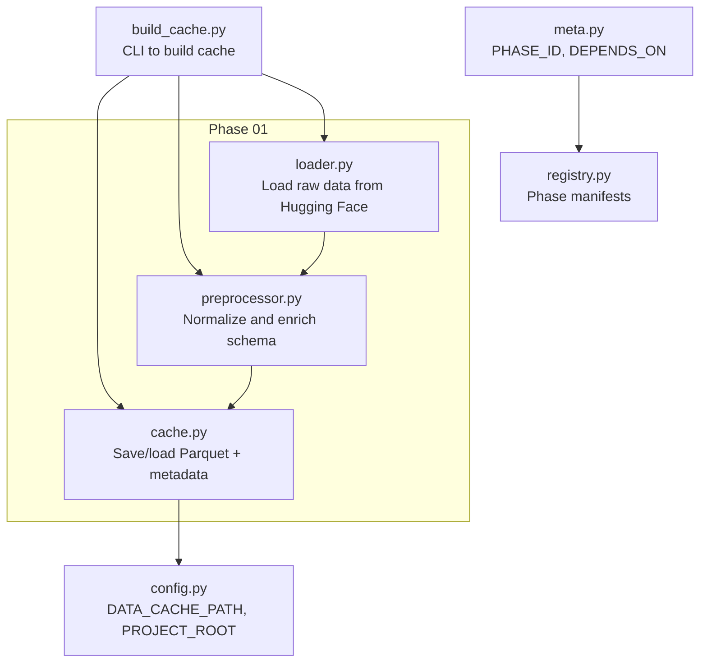
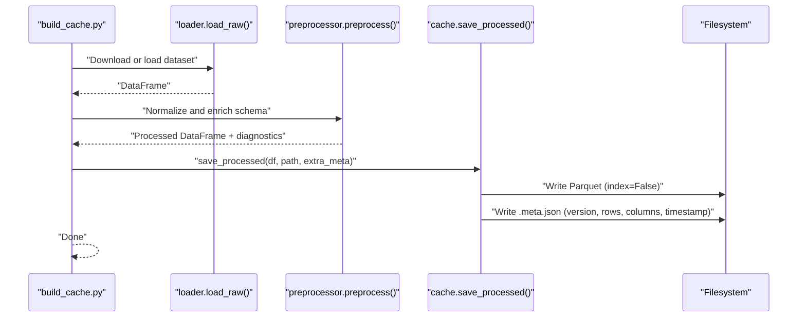
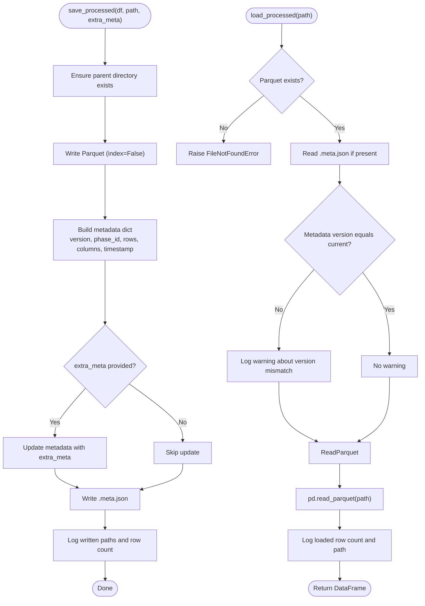
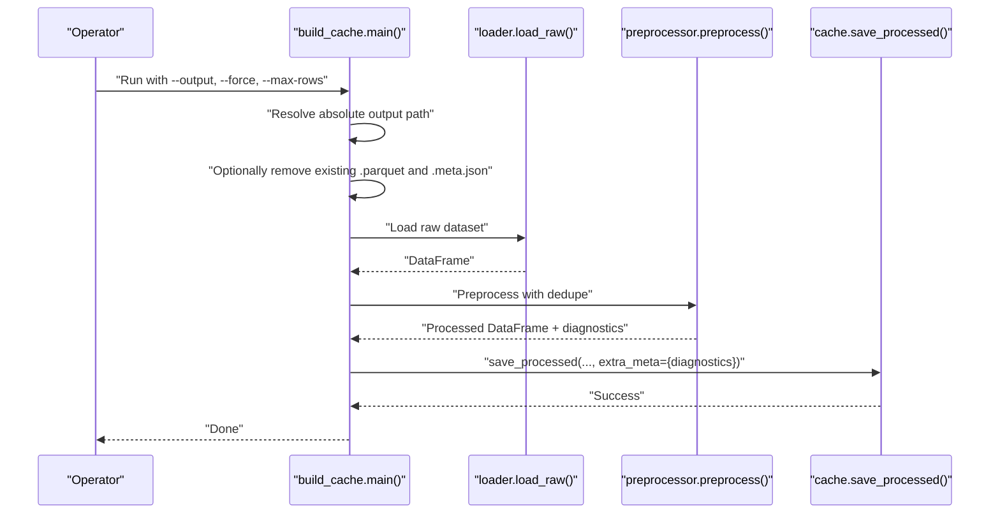
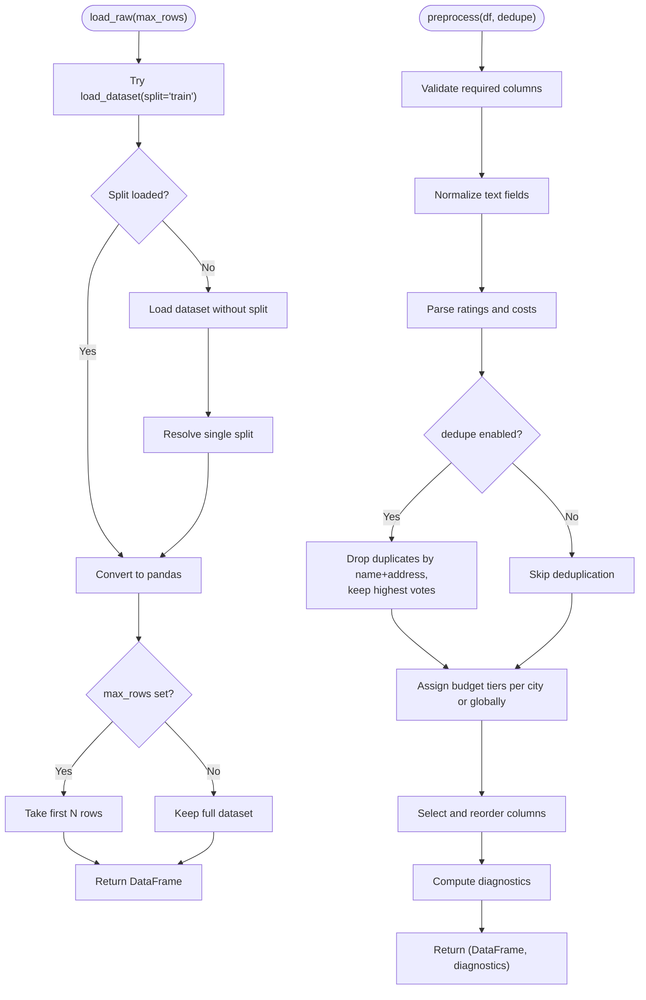
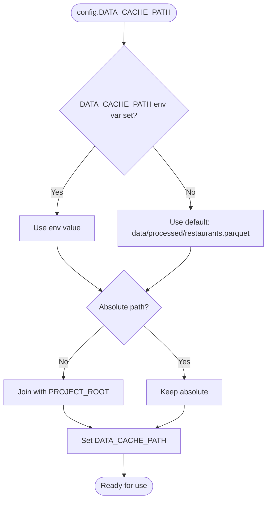
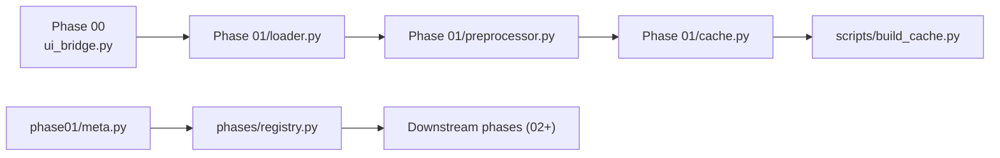

# Caching Strategy and Parquet Management

<cite>
**Referenced Files in This Document**
- [cache.py](file://zomato-ai-recommendation/src/phases/phase01/cache.py)
- [build_cache.py](file://zomato-ai-recommendation/scripts/build_cache.py)
- [loader.py](file://zomato-ai-recommendation/src/phases/phase01/loader.py)
- [preprocessor.py](file://zomato-ai-recommendation/src/phases/phase01/preprocessor.py)
- [config.py](file://zomato-ai-recommendation/src/config.py)
- [meta.py](file://zomato-ai-recommendation/src/phases/phase01/meta.py)
- [registry.py](file://zomato-ai-recommendation/src/phases/registry.py)
- [test_cache_roundtrip.py](file://zomato-ai-recommendation/tests/test_cache_roundtrip.py)
</cite>

## Table of Contents
1. [Introduction](#introduction)
2. [Project Structure](#project-structure)
3. [Core Components](#core-components)
4. [Architecture Overview](#architecture-overview)
5. [Detailed Component Analysis](#detailed-component-analysis)
6. [Dependency Analysis](#dependency-analysis)
7. [Performance Considerations](#performance-considerations)
8. [Troubleshooting Guide](#troubleshooting-guide)
9. [Conclusion](#conclusion)
10. [Appendices](#appendices)

## Introduction
This document explains the caching strategy and Parquet file management system used in Phase 01 of the recommendation pipeline. It covers the data persistence layer built on pandas and PyArrow’s Parquet format, cache versioning and metadata sidecars, file naming conventions, and directory organization. It also documents the round-trip process from DataFrame to Parquet and back, including compression settings and performance optimizations. Practical guidance is included for cache invalidation, version control, troubleshooting, and disk space management.

## Project Structure
The caching and Parquet management logic is centered around Phase 01:
- Data ingestion and preprocessing live in phase01/loader.py and phase01/preprocessor.py.
- The cache writer and reader live in phase01/cache.py.
- The cache build script orchestrates downloading, preprocessing, and writing the cache in scripts/build_cache.py.
- Application configuration (including the default cache path) is defined in src/config.py.
- Phase metadata and dependency information are defined in phase01/meta.py and src/phases/registry.py.
- Tests validate the cache roundtrip in tests/test_cache_roundtrip.py.

**Diagram sources**
- [build_cache.py:21-70](file://zomato-ai-recommendation/scripts/build_cache.py#L21-L70)
- [loader.py:33-63](file://zomato-ai-recommendation/src/phases/phase01/loader.py#L33-L63)
- [preprocessor.py:136-231](file://zomato-ai-recommendation/src/phases/phase01/preprocessor.py#L136-L231)
- [cache.py:27-63](file://zomato-ai-recommendation/src/phases/phase01/cache.py#L27-L63)
- [config.py:43-47](file://zomato-ai-recommendation/src/config.py#L43-L47)
- [meta.py:3-5](file://zomato-ai-recommendation/src/phases/phase01/meta.py#L3-L5)
- [registry.py:28-68](file://zomato-ai-recommendation/src/phases/registry.py#L28-L68)

**Section sources**
- [build_cache.py:21-70](file://zomato-ai-recommendation/scripts/build_cache.py#L21-L70)
- [config.py:43-47](file://zomato-ai-recommendation/src/config.py#L43-L47)
- [meta.py:3-5](file://zomato-ai-recommendation/src/phases/phase01/meta.py#L3-L5)
- [registry.py:28-68](file://zomato-ai-recommendation/src/phases/registry.py#L28-L68)

## Core Components
- Cache writer and reader: Implements saving a DataFrame to Parquet and writing a sidecar metadata JSON file; loading validates cache version and logs warnings on mismatch.
- Build script: Orchestrates downloading raw data, preprocessing, and writing the cache with optional force rebuild and row limits.
- Loader: Downloads or loads the Hugging Face dataset and returns a pandas DataFrame.
- Preprocessor: Normalizes and enriches the schema, computes diagnostics, and prepares a filter-ready DataFrame.
- Configuration: Provides the default cache path and project root resolution.
- Metadata and registry: Defines phase identity and dependency order.

Key responsibilities:
- Persist processed data efficiently using Parquet.
- Maintain cache versioning via a sidecar metadata file.
- Provide deterministic file naming and directory structure.
- Support controlled rebuilds and diagnostics.

**Section sources**
- [cache.py:19-63](file://zomato-ai-recommendation/src/phases/phase01/cache.py#L19-L63)
- [build_cache.py:21-70](file://zomato-ai-recommendation/scripts/build_cache.py#L21-L70)
- [loader.py:33-63](file://zomato-ai-recommendation/src/phases/phase01/loader.py#L33-L63)
- [preprocessor.py:136-231](file://zomato-ai-recommendation/src/phases/phase01/preprocessor.py#L136-L231)
- [config.py:43-47](file://zomato-ai-recommendation/src/config.py#L43-L47)
- [meta.py:3-5](file://zomato-ai-recommendation/src/phases/phase01/meta.py#L3-L5)

## Architecture Overview
The caching architecture follows a strict separation of concerns:
- Data ingestion and normalization occur in Phase 01.
- The cache writer persists normalized data to Parquet and writes a sidecar metadata file.
- The cache reader loads Parquet data and validates metadata version.
- The build script coordinates the entire pipeline and supports forced rebuilds.

**Diagram sources**
- [build_cache.py:57-68](file://zomato-ai-recommendation/scripts/build_cache.py#L57-L68)
- [loader.py:33-63](file://zomato-ai-recommendation/src/phases/phase01/loader.py#L33-L63)
- [preprocessor.py:136-231](file://zomato-ai-recommendation/src/phases/phase01/preprocessor.py#L136-L231)
- [cache.py:27-43](file://zomato-ai-recommendation/src/phases/phase01/cache.py#L27-L43)

## Detailed Component Analysis

### Cache Writer and Reader
Responsibilities:
- Save processed DataFrame to Parquet without an index.
- Write a sidecar metadata file adjacent to the Parquet with cache version, phase ID, row count, column names, and timestamp.
- Load Parquet with version validation; warn when metadata version differs from current cache version.
- Raise a clear error when the cache file is missing.

File naming and directory structure:
- Parquet file: e.g., restaurants.parquet.
- Sidecar metadata: restaurants.parquet.meta.json.
- Parent directory is created automatically if missing.

Versioning and migration:
- Cache version is defined centrally and embedded in metadata.
- Changing the cache version triggers invalidation of old artifacts and requires rebuilding via the build script.

Compression and performance:
- Uses pandas DataFrame.to_parquet and pandas read_parquet.
- Compression defaults are determined by pandas/pyarrow defaults; explicit compression settings are not configured in the current implementation.

**Diagram sources**
- [cache.py:27-63](file://zomato-ai-recommendation/src/phases/phase01/cache.py#L27-L63)

**Section sources**
- [cache.py:19-63](file://zomato-ai-recommendation/src/phases/phase01/cache.py#L19-L63)

### Build Script Orchestration
Responsibilities:
- Accepts output path, force rebuild flag, and optional row limit.
- Resolves absolute output path using project root.
- Optionally removes existing cache and metadata files when force rebuild is enabled.
- Loads raw data, preprocesses, and writes cache with diagnostics embedded in metadata.

Operational controls:
- Force rebuild removes existing artifacts before writing new ones.
- Row limit supports quick testing and CI smoke runs.

**Diagram sources**
- [build_cache.py:21-70](file://zomato-ai-recommendation/scripts/build_cache.py#L21-L70)
- [loader.py:33-63](file://zomato-ai-recommendation/src/phases/phase01/loader.py#L33-L63)
- [preprocessor.py:136-231](file://zomato-ai-recommendation/src/phases/phase01/preprocessor.py#L136-L231)
- [cache.py:27-43](file://zomato-ai-recommendation/src/phases/phase01/cache.py#L27-L43)

**Section sources**
- [build_cache.py:21-70](file://zomato-ai-recommendation/scripts/build_cache.py#L21-L70)

### Loader and Preprocessor
Loader:
- Attempts to load a dataset split; falls back to resolving a single split from a bundle.
- Implements exponential backoff retries on failure.
- Supports limiting rows for development and CI.

Preprocessor:
- Validates presence of required columns.
- Normalizes text fields, parses numeric fields, and assigns budget tiers.
- Deduplicates entries by name and address, preferring higher vote counts.
- Produces a filter-ready schema and returns diagnostics.

**Diagram sources**
- [loader.py:33-63](file://zomato-ai-recommendation/src/phases/phase01/loader.py#L33-L63)
- [preprocessor.py:136-231](file://zomato-ai-recommendation/src/phases/phase01/preprocessor.py#L136-L231)

**Section sources**
- [loader.py:33-63](file://zomato-ai-recommendation/src/phases/phase01/loader.py#L33-L63)
- [preprocessor.py:136-231](file://zomato-ai-recommendation/src/phases/phase01/preprocessor.py#L136-L231)

### Configuration and Directory Organization
- Default cache path is resolved under a data/processed directory beneath the project root.
- The cache path can be overridden via an environment variable.
- Paths are normalized to absolute paths for reliability.

**Diagram sources**
- [config.py:43-47](file://zomato-ai-recommendation/src/config.py#L43-L47)

**Section sources**
- [config.py:43-47](file://zomato-ai-recommendation/src/config.py#L43-L47)

### Round-Trip Validation
The test suite validates:
- Writing a DataFrame to Parquet and reading it back yields the same shape and columns.
- The sidecar metadata file is created and contains the current cache version.

**Section sources**
- [test_cache_roundtrip.py:12-38](file://zomato-ai-recommendation/tests/test_cache_roundtrip.py#L12-L38)
- [cache.py:27-43](file://zomato-ai-recommendation/src/phases/phase01/cache.py#L27-L43)

## Dependency Analysis
- Phase 01 depends on Phase 00 for city alias normalization.
- The registry defines the ordered dependency and rollback hints.
- The cache build script depends on loader and preprocessor; cache reader is used by downstream consumers.

**Diagram sources**
- [preprocessor.py:15](file://zomato-ai-recommendation/src/phases/phase01/preprocessor.py#L15)
- [meta.py:3-5](file://zomato-ai-recommendation/src/phases/phase01/meta.py#L3-L5)
- [registry.py:28-68](file://zomato-ai-recommendation/src/phases/registry.py#L28-L68)

**Section sources**
- [registry.py:28-68](file://zomato-ai-recommendation/src/phases/registry.py#L28-L68)
- [meta.py:3-5](file://zomato-ai-recommendation/src/phases/phase01/meta.py#L3-L5)

## Performance Considerations
- Parquet compression: The current implementation relies on pandas/pyarrow defaults. Explicit compression settings are not configured. If storage or I/O throughput is a concern, consider configuring compression codec and page/index buffering via pandas options or environment-specific configurations.
- Index avoidance: The cache writer saves Parquet without an index, reducing overhead and improving read locality for analytics-style queries.
- Deduplication: Preprocessing includes deduplication by name and address, which reduces downstream processing volume.
- Row limiting: The build script supports limiting rows for development and CI, minimizing I/O and memory usage during testing.
- Metadata sidecar: Keeping metadata close to the Parquet file avoids cross-cluster metadata lookups and simplifies cache invalidation.

[No sources needed since this section provides general guidance]

## Troubleshooting Guide
Common issues and resolutions:
- Cache not found: The loader raises a clear error when the cache file does not exist. Verify the path and rebuild if necessary.
- Version mismatch warning: When metadata version differs from the current cache version, a warning is logged advising to rebuild using the build script. Increment the cache version in code to invalidate old caches intentionally.
- Missing required columns: Preprocessing validates required columns and raises an error if any are absent. Ensure the raw dataset matches the expected schema.
- Network or remote dataset issues: The loader retries with exponential backoff and raises a runtime error after repeated failures. Check network connectivity and remote service availability.
- Disk space management: Use the force rebuild option to remove stale cache and metadata files before writing new ones. Periodically clean up unused cache files outside the normal pipeline.

**Section sources**
- [cache.py:49-60](file://zomato-ai-recommendation/src/phases/phase01/cache.py#L49-L60)
- [preprocessor.py:160-162](file://zomato-ai-recommendation/src/phases/phase01/preprocessor.py#L160-L162)
- [loader.py:46-63](file://zomato-ai-recommendation/src/phases/phase01/loader.py#L46-L63)
- [build_cache.py:49-55](file://zomato-ai-recommendation/scripts/build_cache.py#L49-L55)

## Conclusion
The caching strategy leverages Parquet for efficient persistence and a sidecar metadata file for versioning and diagnostics. The build script coordinates ingestion, preprocessing, and caching, while the cache reader enforces version checks. The system is designed for reproducibility, maintainability, and straightforward invalidation via cache version changes and force rebuilds. For performance tuning, consider explicit compression settings and environment-specific optimizations.

[No sources needed since this section summarizes without analyzing specific files]

## Appendices

### File Naming Conventions and Directory Structure
- Parquet file: restaurants.parquet
- Sidecar metadata: restaurants.parquet.meta.json
- Default cache location: data/processed/restaurants.parquet under the project root
- Overridable via environment variable for DATA_CACHE_PATH

**Section sources**
- [cache.py:22-24](file://zomato-ai-recommendation/src/phases/phase01/cache.py#L22-L24)
- [config.py:43-47](file://zomato-ai-recommendation/src/config.py#L43-L47)

### Cache Versioning and Migration
- Central cache version constant drives invalidation.
- Changing the version triggers warnings on load and requires rebuilding.
- Intended as a real-world migration hook for breaking schema or processing changes.

**Section sources**
- [cache.py:19](file://zomato-ai-recommendation/src/phases/phase01/cache.py#L19)
- [cache.py:55-60](file://zomato-ai-recommendation/src/phases/phase01/cache.py#L55-L60)

### Round-Trip Process: DataFrame to Parquet and Back
- Save: Write Parquet without index; write sidecar metadata with version, phase, row/column info, and timestamp.
- Load: Validate metadata version; read Parquet; log row count and path.

**Section sources**
- [cache.py:27-43](file://zomato-ai-recommendation/src/phases/phase01/cache.py#L27-L43)
- [cache.py:46-63](file://zomato-ai-recommendation/src/phases/phase01/cache.py#L46-L63)