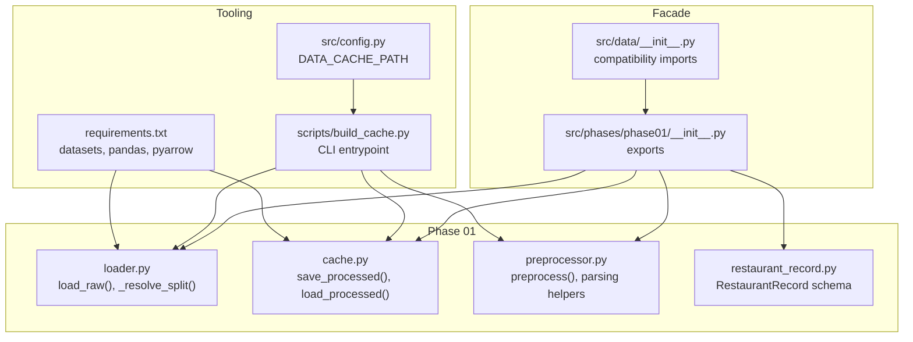
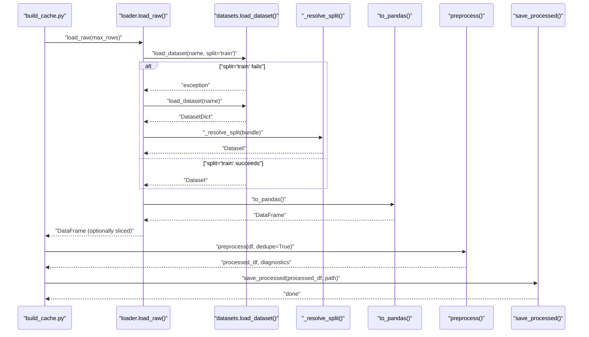
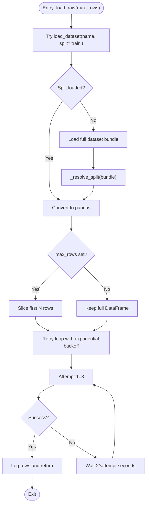
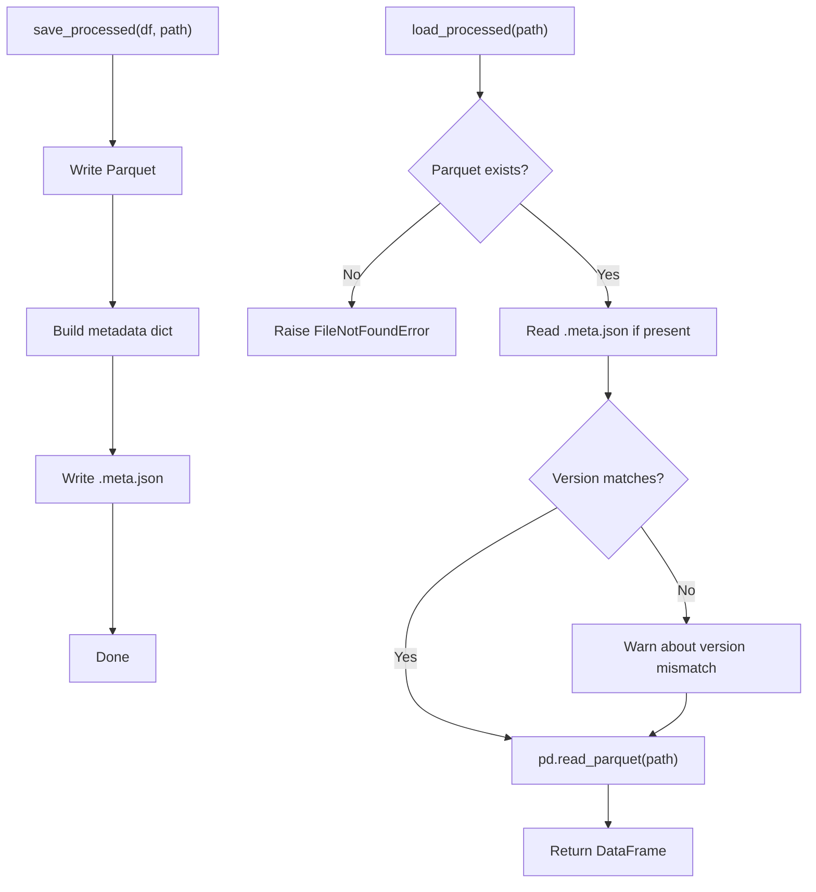
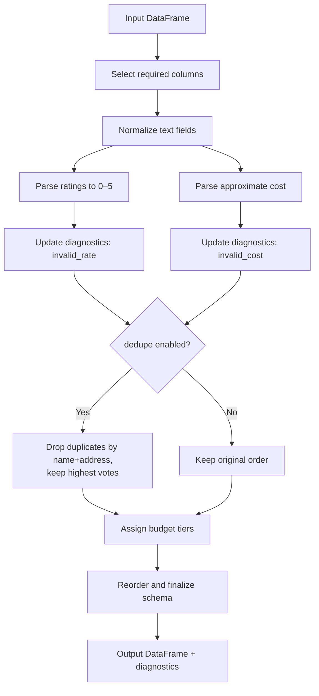
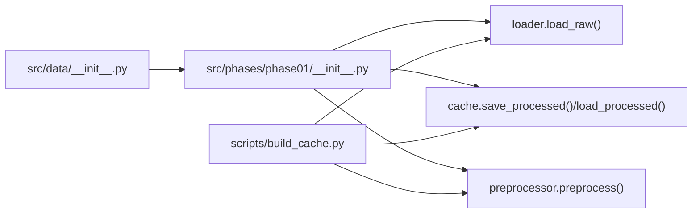
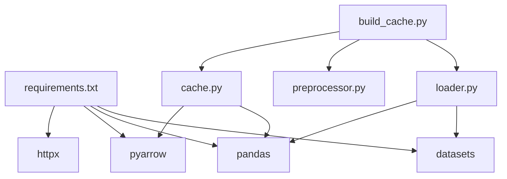

# Data Loading and Hugging Face Integration

<cite>
**Referenced Files in This Document**
- [loader.py](file://zomato-ai-recommendation/src/phases/phase01/loader.py)
- [cache.py](file://zomato-ai-recommendation/src/phases/phase01/cache.py)
- [build_cache.py](file://zomato-ai-recommendation/scripts/build_cache.py)
- [preprocessor.py](file://zomato-ai-recommendation/src/phases/phase01/preprocessor.py)
- [restaurant_record.py](file://zomato-ai-recommendation/src/phases/phase01/restaurant_record.py)
- [__init__.py (phase01)](file://zomato-ai-recommendation/src/phases/phase01/__init__.py)
- [__init__.py (data facade)](file://zomato-ai-recommendation/src/data/__init__.py)
- [config.py](file://zomato-ai-recommendation/src/config.py)
- [requirements.txt](file://zomato-ai-recommendation/requirements.txt)
- [test_hf_integration.py](file://zomato-ai-recommendation/tests/test_hf_integration.py)
</cite>

## Table of Contents
1. [Introduction](#introduction)
2. [Project Structure](#project-structure)
3. [Core Components](#core-components)
4. [Architecture Overview](#architecture-overview)
5. [Detailed Component Analysis](#detailed-component-analysis)
6. [Dependency Analysis](#dependency-analysis)
7. [Performance Considerations](#performance-considerations)
8. [Troubleshooting Guide](#troubleshooting-guide)
9. [Conclusion](#conclusion)
10. [Appendices](#appendices)

## Introduction
This document explains the data loading and Hugging Face integration component used in Phase 01 of the recommendation pipeline. It covers how the dataset is downloaded or loaded from cache, how flexible dataset structures are resolved, the parameters and behavior of the load_raw function, error handling with exponential backoff, and the local caching strategy. Practical examples demonstrate development-time row limiting, and troubleshooting guidance addresses common dataset loading issues.

## Project Structure
The data loading and caching logic resides in the Phase 01 package. A compatibility facade exposes these APIs from a higher-level namespace for downstream consumers. The build script orchestrates downloading, preprocessing, and writing a Parquet cache with metadata.

**Diagram sources**
- [loader.py:1-64](file://zomato-ai-recommendation/src/phases/phase01/loader.py#L1-L64)
- [cache.py:1-64](file://zomato-ai-recommendation/src/phases/phase01/cache.py#L1-L64)
- [preprocessor.py:1-232](file://zomato-ai-recommendation/src/phases/phase01/preprocessor.py#L1-L232)
- [restaurant_record.py:1-30](file://zomato-ai-recommendation/src/phases/phase01/restaurant_record.py#L1-L30)
- [__init__.py (phase01):1-45](file://zomato-ai-recommendation/src/phases/phase01/__init__.py#L1-L45)
- [__init__.py (data facade):1-38](file://zomato-ai-recommendation/src/data/__init__.py#L1-L38)
- [build_cache.py:1-75](file://zomato-ai-recommendation/scripts/build_cache.py#L1-L75)
- [config.py:1-50](file://zomato-ai-recommendation/src/config.py#L1-L50)
- [requirements.txt:1-9](file://zomato-ai-recommendation/requirements.txt#L1-L9)

**Section sources**
- [__init__.py (phase01):1-45](file://zomato-ai-recommendation/src/phases/phase01/__init__.py#L1-L45)
- [__init__.py (data facade):1-38](file://zomato-ai-recommendation/src/data/__init__.py#L1-L38)
- [build_cache.py:1-75](file://zomato-ai-recommendation/scripts/build_cache.py#L1-L75)
- [config.py:1-50](file://zomato-ai-recommendation/src/config.py#L1-L50)
- [requirements.txt:1-9](file://zomato-ai-recommendation/requirements.txt#L1-L9)

## Core Components
- Hugging Face dataset loader and resolver
  - load_raw: Downloads or loads from cache, resolves dataset structure, converts to pandas, optionally limits rows, and logs metrics.
  - _resolve_split: Accepts either a Dataset or DatasetDict and returns a single Dataset.
- Local caching
  - save_processed: Writes a Parquet file and a sidecar metadata JSON with cache version, row count, column list, and timestamp.
  - load_processed: Reads Parquet and validates cache metadata version; warns on mismatch.
- Preprocessing pipeline
  - preprocess: Normalizes and transforms raw columns into a canonical schema, computes diagnostics, and assigns budget tiers.
- Facade and CLI
  - Compatibility imports expose load_raw and cache functions from the phase01 package.
  - build_cache.py is the CLI entrypoint to download, preprocess, and write cache.

Key behaviors:
- Network reliability: Exponential backoff retry with bounded attempts.
- Flexible dataset structure: Supports both single split and split-dict layouts.
- Local caching: Parquet with sidecar metadata; version-aware invalidation.
- Development aid: Optional row limiting via max_rows.

**Section sources**
- [loader.py:21-63](file://zomato-ai-recommendation/src/phases/phase01/loader.py#L21-L63)
- [cache.py:27-63](file://zomato-ai-recommendation/src/phases/phase01/cache.py#L27-L63)
- [preprocessor.py:136-231](file://zomato-ai-recommendation/src/phases/phase01/preprocessor.py#L136-L231)
- [__init__.py (phase01):10-24](file://zomato-ai-recommendation/src/phases/phase01/__init__.py#L10-L24)
- [build_cache.py:21-70](file://zomato-ai-recommendation/scripts/build_cache.py#L21-L70)

## Architecture Overview
The Phase 01 ingestion pipeline integrates Hugging Face datasets with local caching and preprocessing. The build script coordinates the end-to-end flow: download raw data, preprocess, and persist cache.

**Diagram sources**
- [build_cache.py:57-69](file://zomato-ai-recommendation/scripts/build_cache.py#L57-L69)
- [loader.py:33-63](file://zomato-ai-recommendation/src/phases/phase01/loader.py#L33-L63)
- [preprocessor.py:136-231](file://zomato-ai-recommendation/src/phases/phase01/preprocessor.py#L136-L231)
- [cache.py:27-43](file://zomato-ai-recommendation/src/phases/phase01/cache.py#L27-L43)

## Detailed Component Analysis

### Hugging Face Dataset Loader and Resolver
- Purpose: Provide robust access to the Zomato dataset, handling both single-split and split-dict layouts, and converting to a pandas DataFrame.
- Key functions:
  - load_raw(max_rows: int | None = None) -> pd.DataFrame
    - Attempts to load a training split directly.
    - Falls back to loading the full bundle and resolving to a single split.
    - Converts to pandas and optionally slices rows.
    - Retries on failure with exponential backoff.
  - _resolve_split(ds: Any) -> Any
    - Accepts a Dataset or DatasetDict and returns a single Dataset.
    - Prefers "train" split if present; otherwise selects the first available split.
    - Raises an error if no recognizable split is found.

**Diagram sources**
- [loader.py:33-63](file://zomato-ai-recommendation/src/phases/phase01/loader.py#L33-L63)
- [loader.py:21-30](file://zomato-ai-recommendation/src/phases/phase01/loader.py#L21-L30)

**Section sources**
- [loader.py:21-63](file://zomato-ai-recommendation/src/phases/phase01/loader.py#L21-L63)

### Local Caching and Metadata
- Purpose: Persist processed data as Parquet with sidecar metadata for versioning and diagnostics.
- Key functions:
  - save_processed(df: pd.DataFrame, path: Path, extra_meta: dict | None = None) -> None
    - Writes Parquet and metadata JSON containing cache version, phase ID, row count, column list, and timestamp.
  - load_processed(path: Path) -> pd.DataFrame
    - Validates cache version against current CACHE_VERSION and warns if mismatched.
    - Loads Parquet and logs row count.

**Diagram sources**
- [cache.py:27-63](file://zomato-ai-recommendation/src/phases/phase01/cache.py#L27-L63)

**Section sources**
- [cache.py:27-63](file://zomato-ai-recommendation/src/phases/phase01/cache.py#L27-L63)

### Preprocessing Pipeline
- Purpose: Transform raw dataset columns into a canonical schema suitable for filtering and recommendation.
- Key behaviors:
  - Column selection and normalization (trimming, lowercasing).
  - Parsing ratings and costs with diagnostics.
  - Deduplication by name and address, preferring higher-vote entries.
  - Budget tier assignment using city-specific or global quantiles.

**Diagram sources**
- [preprocessor.py:136-231](file://zomato-ai-recommendation/src/phases/phase01/preprocessor.py#L136-L231)

**Section sources**
- [preprocessor.py:136-231](file://zomato-ai-recommendation/src/phases/phase01/preprocessor.py#L136-L231)

### Facade and CLI Entrypoint
- Facade exports:
  - Compatibility imports from phase01 expose load_raw, cache functions, and preprocessing helpers.
- CLI:
  - build_cache.py downloads raw data, runs preprocessing, and writes cache with optional row limit and force rebuild.

**Diagram sources**
- [__init__.py (data facade):3-19](file://zomato-ai-recommendation/src/data/__init__.py#L3-L19)
- [__init__.py (phase01):10-24](file://zomato-ai-recommendation/src/phases/phase01/__init__.py#L10-L24)
- [build_cache.py:57-69](file://zomato-ai-recommendation/scripts/build_cache.py#L57-L69)

**Section sources**
- [__init__.py (data facade):1-38](file://zomato-ai-recommendation/src/data/__init__.py#L1-L38)
- [__init__.py (phase01):1-45](file://zomato-ai-recommendation/src/phases/phase01/__init__.py#L1-L45)
- [build_cache.py:21-70](file://zomato-ai-recommendation/scripts/build_cache.py#L21-L70)

## Dependency Analysis
External libraries and their roles:
- datasets: Provides load_dataset and Dataset/DatasetDict abstractions.
- pandas: Converts Dataset to DataFrame and performs transformations.
- pyarrow: Required by pandas for Parquet IO.
- httpx: Used by datasets for HTTP requests; contributes to network reliability.

**Diagram sources**
- [requirements.txt:1-9](file://zomato-ai-recommendation/requirements.txt#L1-L9)
- [loader.py:43-53](file://zomato-ai-recommendation/src/phases/phase01/loader.py#L43-L53)
- [cache.py:31-43](file://zomato-ai-recommendation/src/phases/phase01/cache.py#L31-L43)
- [build_cache.py:15-16](file://zomato-ai-recommendation/scripts/build_cache.py#L15-L16)

**Section sources**
- [requirements.txt:1-9](file://zomato-ai-recommendation/requirements.txt#L1-L9)

## Performance Considerations
- Network reliability
  - Exponential backoff reduces thundering herd and allows transient failures to recover.
  - Limited retry attempts bound worst-case latency during failures.
- Local caching
  - Parquet storage improves IO performance compared to CSV/JSON.
  - Sidecar metadata enables fast validation and selective rebuilds.
- Row limiting for development
  - max_rows slicing reduces memory footprint and speeds up iteration cycles.
- Preprocessing efficiency
  - Vectorized pandas operations and grouped quantile computation minimize overhead.
- Memory usage
  - Converting to pandas and slicing early reduces peak memory during preprocessing.

[No sources needed since this section provides general guidance]

## Troubleshooting Guide
Common issues and remedies:
- Network timeouts or intermittent failures
  - The loader retries up to three times with exponential backoff. If persistent, check connectivity and consider retrying later.
- Unrecognized dataset structure
  - The resolver expects either a Dataset with column_names or a DatasetDict with named splits. If neither is detected, verify the dataset layout or pass a compatible split name.
- Cache version mismatch
  - If the cached metadata version does not match the current CACHE_VERSION, a warning is logged. Rebuild the cache using the provided script to align versions.
- Missing expected columns after preprocessing
  - The pipeline validates required columns and raises an error if any are absent. Inspect the raw dataset schema and adjust preprocessing accordingly.
- Large dataset download
  - The integration test is gated behind an environment flag to avoid unnecessary large downloads. Set the flag to enable testing against the full dataset.

Practical checks:
- Verify DATA_CACHE_PATH configuration and permissions for writing cache artifacts.
- Confirm datasets and pyarrow versions satisfy minimum requirements.
- Use max_rows during development to validate end-to-end flow without heavy IO.

**Section sources**
- [loader.py:45-63](file://zomato-ai-recommendation/src/phases/phase01/loader.py#L45-L63)
- [cache.py:52-60](file://zomato-ai-recommendation/src/phases/phase01/cache.py#L52-L60)
- [preprocessor.py:160-162](file://zomato-ai-recommendation/src/phases/phase01/preprocessor.py#L160-L162)
- [test_hf_integration.py:9-12](file://zomato-ai-recommendation/tests/test_hf_integration.py#L9-L12)

## Conclusion
The Phase 01 data loading and caching subsystem provides a robust, versioned, and efficient pathway for ingesting and preparing the Zomato-style dataset. It gracefully handles diverse Hugging Face dataset layouts, incorporates resilient retry logic, and offers practical development aids like row limiting. The combination of Parquet caching and sidecar metadata ensures reproducible and maintainable data artifacts across environments.

[No sources needed since this section summarizes without analyzing specific files]

## Appendices

### Practical Examples
- Development row limiting
  - Use max_rows to load a small subset for quick iteration and smoke tests.
  - Example invocation path: [build_cache.py:58](file://zomato-ai-recommendation/scripts/build_cache.py#L58)
- Building cache with diagnostics
  - Run the CLI to download, preprocess, and write cache; inspect diagnostics in logs.
  - Example invocation path: [build_cache.py:61-68](file://zomato-ai-recommendation/scripts/build_cache.py#L61-L68)
- Loading processed cache
  - Use load_processed to read cached data and validate cache metadata.
  - Example usage path: [cache.py:46-63](file://zomato-ai-recommendation/src/phases/phase01/cache.py#L46-L63)

**Section sources**
- [build_cache.py:57-69](file://zomato-ai-recommendation/scripts/build_cache.py#L57-L69)
- [cache.py:46-63](file://zomato-ai-recommendation/src/phases/phase01/cache.py#L46-L63)