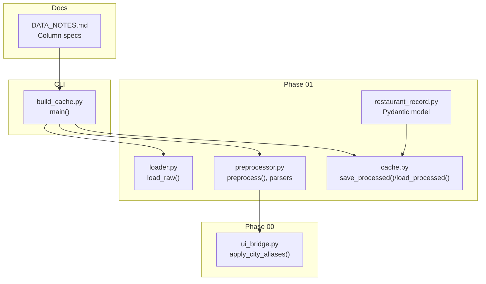
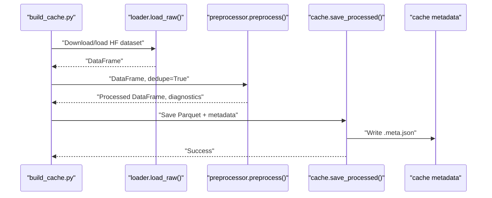
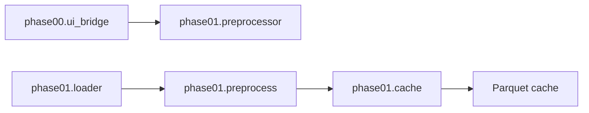

# Data Preprocessing and Normalization

<cite>
**Referenced Files in This Document**
- [preprocessor.py](file://zomato-ai-recommendation/src/phases/phase01/preprocessor.py)
- [loader.py](file://zomato-ai-recommendation/src/phases/phase01/loader.py)
- [cache.py](file://zomato-ai-recommendation/src/phases/phase01/cache.py)
- [restaurant_record.py](file://zomato-ai-recommendation/src/phases/phase01/restaurant_record.py)
- [ui_bridge.py](file://zomato-ai-recommendation/src/phases/phase00/ui_bridge.py)
- [build_cache.py](file://zomato-ai-recommendation/scripts/build_cache.py)
- [DATA_NOTES.md](file://zomato-ai-recommendation/docs/DATA_NOTES.md)
- [README.md](file://zomato-ai-recommendation/README.md)
- [registry.py](file://zomato-ai-recommendation/src/phases/registry.py)
- [config.py](file://zomato-ai-recommendation/src/config.py)
- [test_preprocessor.py](file://zomato-ai-recommendation/tests/test_preprocessor.py)
- [test_restaurant_record.py](file://zomato-ai-recommendation/tests/test_restaurant_record.py)
</cite>

## Table of Contents
1. [Introduction](#introduction)
2. [Project Structure](#project-structure)
3. [Core Components](#core-components)
4. [Architecture Overview](#architecture-overview)
5. [Detailed Component Analysis](#detailed-component-analysis)
6. [Dependency Analysis](#dependency-analysis)
7. [Performance Considerations](#performance-considerations)
8. [Troubleshooting Guide](#troubleshooting-guide)
9. [Conclusion](#conclusion)
10. [Appendices](#appendices)

## Introduction
This document explains the data preprocessing and normalization workflows used to transform the raw Zomato dataset into a filter-ready schema. It covers parsing and cleaning of ratings and approximate costs, text normalization for cuisines and locations, city canonicalization via UI aliases, budget tier assignment using per-city quantiles, deduplication strategies, and caching of processed data. It also documents validation checks, diagnostics, and performance/memory considerations for scalable preprocessing.

## Project Structure
Phase 01 orchestrates ingestion from Hugging Face, preprocessing, and caching. The build script coordinates the end-to-end workflow, while the cache module persists processed data with metadata. Tests validate parsing rules and pipeline behavior.

**Diagram sources**
- [loader.py:33-63](file://zomato-ai-recommendation/src/phases/phase01/loader.py#L33-L63)
- [preprocessor.py:136-231](file://zomato-ai-recommendation/src/phases/phase01/preprocessor.py#L136-L231)
- [cache.py:27-63](file://zomato-ai-recommendation/src/phases/phase01/cache.py#L27-L63)
- [restaurant_record.py:8-29](file://zomato-ai-recommendation/src/phases/phase01/restaurant_record.py#L8-L29)
- [ui_bridge.py:30-33](file://zomato-ai-recommendation/src/phases/phase00/ui_bridge.py#L30-L33)
- [build_cache.py:21-70](file://zomato-ai-recommendation/scripts/build_cache.py#L21-L70)
- [DATA_NOTES.md:23-36](file://zomato-ai-recommendation/docs/DATA_NOTES.md#L23-L36)

**Section sources**
- [README.md:75-85](file://zomato-ai-recommendation/README.md#L75-L85)
- [DATA_NOTES.md:23-36](file://zomato-ai-recommendation/docs/DATA_NOTES.md#L23-L36)

## Core Components
- Loader: Downloads or loads the Hugging Face dataset and returns a pandas DataFrame.
- Preprocessor: Parses and normalizes raw fields, assigns budget tiers, and optionally deduplicates.
- Cache: Writes Parquet with metadata and reads validated caches.
- City aliasing: Canonicalizes city names using a shared alias map.
- Record model: Pydantic model enforcing column types and constraints for downstream consumers.

Key responsibilities:
- Parsing numeric fields (rating, cost) with robust error handling.
- Normalizing text fields (cuisines, city, location, types) for matching and filtering.
- Budget tier assignment using per-city quantiles with fallback to global quantiles.
- Deduplication by restaurant name and address, prioritizing higher vote counts.
- Diagnostics and logging for data quality assurance.

**Section sources**
- [loader.py:33-63](file://zomato-ai-recommendation/src/phases/phase01/loader.py#L33-L63)
- [preprocessor.py:136-231](file://zomato-ai-recommendation/src/phases/phase01/preprocessor.py#L136-L231)
- [cache.py:27-63](file://zomato-ai-recommendation/src/phases/phase01/cache.py#L27-L63)
- [ui_bridge.py:30-33](file://zomato-ai-recommendation/src/phases/phase00/ui_bridge.py#L30-L33)
- [restaurant_record.py:8-29](file://zomato-ai-recommendation/src/phases/phase01/restaurant_record.py#L8-L29)

## Architecture Overview
End-to-end preprocessing pipeline from raw dataset to cache:

**Diagram sources**
- [build_cache.py:57-68](file://zomato-ai-recommendation/scripts/build_cache.py#L57-L68)
- [loader.py:33-63](file://zomato-ai-recommendation/src/phases/phase01/loader.py#L33-L63)
- [preprocessor.py:136-231](file://zomato-ai-recommendation/src/phases/phase01/preprocessor.py#L136-L231)
- [cache.py:27-43](file://zomato-ai-recommendation/src/phases/phase01/cache.py#L27-L43)

## Detailed Component Analysis

### Rating Parsing and Validation
- Input: Free-form rating strings (e.g., fractions, tokens).
- Rules:
  - Strip whitespace and uppercase.
  - Treat special tokens as missing.
  - If fraction format, extract numerator.
  - Clamp to 0–5 range; otherwise mark invalid.
- Output: Float in [0, 5] or missing.

Validation checks:
- Count of invalid rate cells tracked via diagnostics.

**Section sources**
- [preprocessor.py:27-44](file://zomato-ai-recommendation/src/phases/phase01/preprocessor.py#L27-L44)
- [test_preprocessor.py:19-38](file://zomato-ai-recommendation/tests/test_preprocessor.py#L19-L38)

### Cost Approximation Parsing
- Input: Strings representing INR amounts, possibly with currency symbols, commas, or ranges.
- Rules:
  - Strip whitespace.
  - Extract digits; handle ranges by taking midpoint.
  - Treat empty/invalid as missing.
- Output: Integer INR amount or missing.

Validation checks:
- Count of invalid cost cells tracked via diagnostics.

**Section sources**
- [preprocessor.py:47-70](file://zomato-ai-recommendation/src/phases/phase01/preprocessor.py#L47-L70)
- [test_preprocessor.py:40-53](file://zomato-ai-recommendation/tests/test_preprocessor.py#L40-L53)

### Cuisines Normalization
- Input: Comma-separated cuisine names.
- Rules:
  - Split by comma, strip, lowercase, remove empties.
  - De-duplicate while preserving order.
  - Join with pipe separator.
- Output: Pipe-separated lowercase tokens.

Validation checks:
- Unit test ensures normalization produces expected canonical form.

**Section sources**
- [preprocessor.py:73-85](file://zomato-ai-recommendation/src/phases/phase01/preprocessor.py#L73-L85)
- [test_preprocessor.py:56-58](file://zomato-ai-recommendation/tests/test_preprocessor.py#L56-L58)

### City Canonicalization
- Input: Raw city strings.
- Rules:
  - Apply shared alias map (case-insensitive).
  - Preserve original if no alias match.
- Output: Canonical city string.

Integration:
- Used during preprocessing to normalize listing city.

**Section sources**
- [ui_bridge.py:30-33](file://zomato-ai-recommendation/src/phases/phase00/ui_bridge.py#L30-L33)
- [preprocessor.py:88-92](file://zomato-ai-recommendation/src/phases/phase01/preprocessor.py#L88-L92)

### Budget Tier Assignment
- Input: Cost for two values and city grouping.
- Rules:
  - Compute global quantiles (1/3 and 2/3) for valid costs.
  - For each city with sufficient samples, compute city-specific quantiles.
  - Assign tiers: low/medium/high/unknown based on thresholds.
- Thresholds:
  - Minimum per-city sample size determines whether to use city-specific quantiles.

Validation checks:
- Robust fallback when quantiles degenerate (ensures q33 < q66).

**Section sources**
- [preprocessor.py:95-133](file://zomato-ai-recommendation/src/phases/phase01/preprocessor.py#L95-L133)

### Text Normalization and Feature Engineering
- Name, location, city, listed_in_type, rest_type, online_order, book_table, dish_liked:
  - Fill missing with empty string.
  - Cast to string and strip whitespace.
- Votes:
  - Convert to numeric, coerce errors to zero, cast to integer.
- Cuisines:
  - Normalize per above.
- Budget tier:
  - Assign per city/global quantiles.
- Restaurant ID:
  - Insert as incremental integer after deduplication.

**Section sources**
- [preprocessor.py:164-222](file://zomato-ai-recommendation/src/phases/phase01/preprocessor.py#L164-L222)

### Deduplication Strategy
- Optional step controlled by a flag.
- Strategy:
  - Sort by votes descending.
  - Drop duplicates by name and address, keeping first occurrence.
  - Track number of removed rows via diagnostics.

Validation checks:
- Test verifies deduplication reduces row count and removes duplicates by name/address.

**Section sources**
- [preprocessor.py:190-201](file://zomato-ai-recommendation/src/phases/phase01/preprocessor.py#L190-L201)
- [test_preprocessor.py:95-102](file://zomato-ai-recommendation/tests/test_preprocessor.py#L95-L102)

### Data Model and Validation
- Pydantic model enforces:
  - Types (int, str, float | None).
  - Ranges (rating in [0, 5], cost >= 0).
  - Optional fields and defaults.
- Utility method to split normalized cuisines into a list.

Validation checks:
- Unit test constructs a record from a processed row and verifies cuisine list extraction.

**Section sources**
- [restaurant_record.py:8-29](file://zomato-ai-recommendation/src/phases/phase01/restaurant_record.py#L8-L29)
- [test_restaurant_record.py:22-43](file://zomato-ai-recommendation/tests/test_restaurant_record.py#L22-L43)

### Cache and Metadata
- Save:
  - Write Parquet with index disabled.
  - Emit metadata JSON with cache version, phase id, row/column counts, and timestamp.
- Load:
  - Validate cache version; warn if mismatch.
  - Load Parquet and log row count.

**Section sources**
- [cache.py:27-63](file://zomato-ai-recommendation/src/phases/phase01/cache.py#L27-L63)

### End-to-End Workflow
- CLI entrypoint:
  - Configure logging.
  - Optionally force rebuild by removing existing cache and metadata.
  - Load raw data, preprocess, save cache with diagnostics.

**Section sources**
- [build_cache.py:21-70](file://zomato-ai-recommendation/scripts/build_cache.py#L21-L70)

## Dependency Analysis
Phased architecture ensures clear boundaries and rollback hints. Phase 01 depends on Phase 00 for city aliasing.

**Diagram sources**
- [preprocessor.py:15](file://zomato-ai-recommendation/src/phases/phase01/preprocessor.py#L15)
- [registry.py:28-68](file://zomato-ai-recommendation/src/phases/registry.py#L28-L68)

**Section sources**
- [registry.py:28-68](file://zomato-ai-recommendation/src/phases/registry.py#L28-L68)

## Performance Considerations
- Vectorized operations:
  - Pandas Series operations (map, fillna, astype, str.strip) minimize Python loops.
- Early pruning:
  - Deduplication by sorting and dropping duplicates reduces downstream computation.
- Quantile computation:
  - Per-city quantiles computed only when sample size threshold is met; otherwise global quantiles are used.
- Memory management:
  - Intermediate DataFrames are constructed incrementally; unnecessary columns are dropped before saving.
  - Parquet storage reduces memory footprint compared to CSV and enables fast reloads.
- I/O resilience:
  - Retry logic with exponential backoff during Hugging Face downloads.
- Logging and diagnostics:
  - Lightweight counters track invalid cells and deduped rows to guide tuning.

[No sources needed since this section provides general guidance]

## Troubleshooting Guide
Common issues and remedies:
- Missing expected columns:
  - The preprocessing step validates required columns and raises an error if any are absent.
- Invalid rating or cost entries:
  - Invalid cells are converted to missing; diagnostics capture counts for review.
- Cache version mismatch:
  - Loading a cache with a different metadata version logs a warning; rebuild using the provided script.
- Deduplication side effects:
  - Verify that expected duplicates were removed and that higher vote rows were preserved.
- City canonicalization:
  - Ensure alias map is up to date; new UI city names should be added to the alias dictionary.

**Section sources**
- [preprocessor.py:160-162](file://zomato-ai-recommendation/src/phases/phase01/preprocessor.py#L160-L162)
- [cache.py:54-60](file://zomato-ai-recommendation/src/phases/phase01/cache.py#L54-L60)
- [test_preprocessor.py:95-102](file://zomato-ai-recommendation/tests/test_preprocessor.py#L95-L102)

## Conclusion
The preprocessing pipeline transforms raw Zomato data into a clean, normalized schema optimized for filtering and recommendation. It rigorously parses numeric fields, normalizes text, canonicalizes cities, computes budget tiers, and deduplicates records. The cache layer ensures reproducibility and efficient reuse. Together, these steps establish a robust data foundation for downstream phases.

[No sources needed since this section summarizes without analyzing specific files]

## Appendices

### Column Specifications and Outputs
- Output columns include identifiers, normalized text fields, parsed numerics, and derived signals suitable for filtering and ranking.

**Section sources**
- [DATA_NOTES.md:23-36](file://zomato-ai-recommendation/docs/DATA_NOTES.md#L23-L36)

### Environment and Paths
- Data cache path resolution supports environment overrides and absolute/relative paths.

**Section sources**
- [config.py:43-47](file://zomato-ai-recommendation/src/config.py#L43-L47)