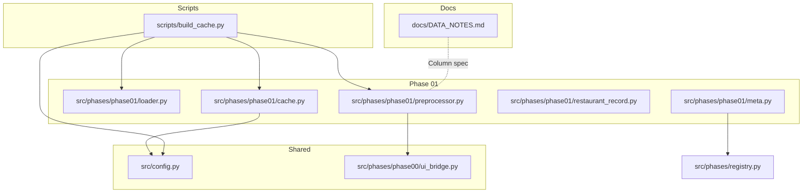
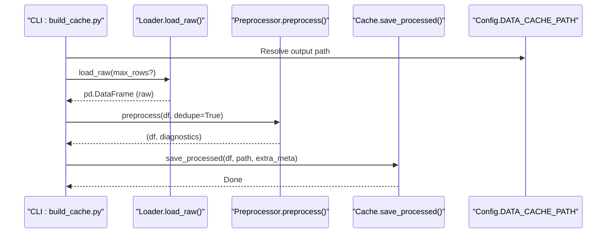
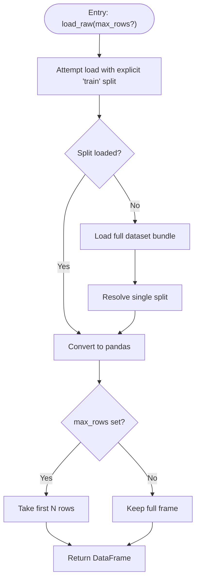
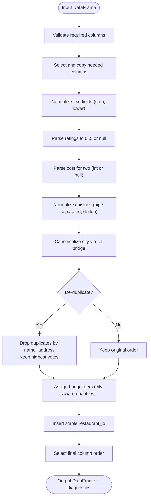
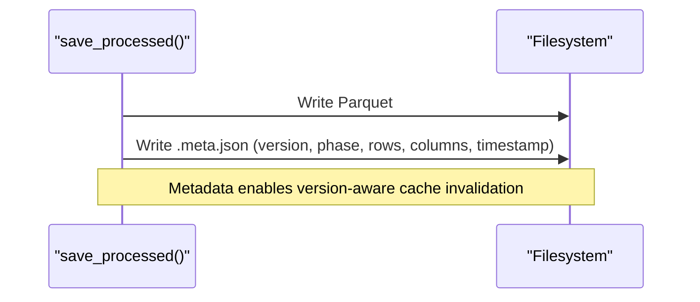
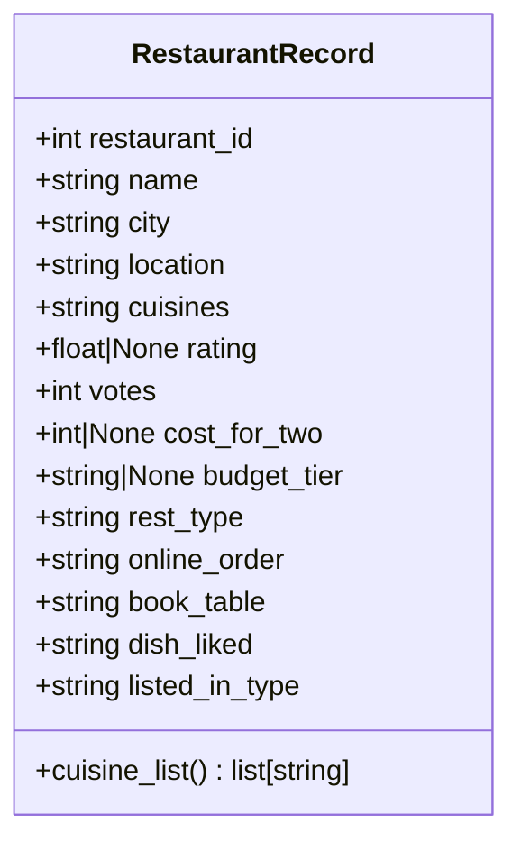
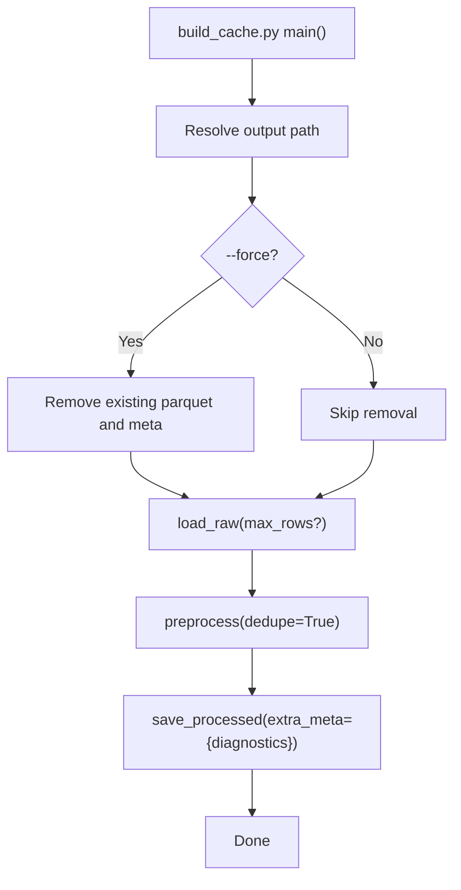
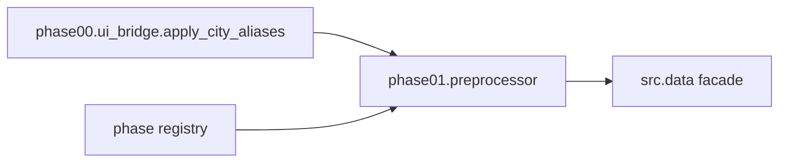

# Data Processing Pipeline

<cite>
**Referenced Files in This Document**
- [build_cache.py](file://scripts/build_cache.py)
- [loader.py](file://src/phases/phase01/loader.py)
- [preprocessor.py](file://src/phases/phase01/preprocessor.py)
- [cache.py](file://src/phases/phase01/cache.py)
- [restaurant_record.py](file://src/phases/phase01/restaurant_record.py)
- [config.py](file://src/config.py)
- [meta.py](file://src/phases/phase01/meta.py)
- [registry.py](file://src/phases/registry.py)
- [ui_bridge.py](file://src/phases/phase00/ui_bridge.py)
- [DATA_NOTES.md](file://docs/DATA_NOTES.md)
- [test_hf_integration.py](file://tests/test_hf_integration.py)
- [test_preprocessor.py](file://tests/test_preprocessor.py)
- [requirements.txt](file://requirements.txt)
</cite>

## Table of Contents
1. [Introduction](#introduction)
2. [Project Structure](#project-structure)
3. [Core Components](#core-components)
4. [Architecture Overview](#architecture-overview)
5. [Detailed Component Analysis](#detailed-component-analysis)
6. [Dependency Analysis](#dependency-analysis)
7. [Performance Considerations](#performance-considerations)
8. [Troubleshooting Guide](#troubleshooting-guide)
9. [Conclusion](#conclusion)
10. [Appendices](#appendices)

## Introduction
This document describes the data processing pipeline for the Zomato AI Recommendation System with a focus on Phase 01: Hugging Face dataset ingestion, normalization, and caching. It explains how raw Zomato data is downloaded, transformed into a standardized schema, cached as Parquet with metadata, validated, and prepared for downstream filtering and recommendation phases. It also documents the schema design, normalization rules, caching strategy, version control, and error handling.

## Project Structure
The Phase 01 pipeline spans a small set of focused modules:
- scripts/build_cache.py: orchestration script to download, transform, and persist cache
- src/phases/phase01/*: core data processing logic (loader, preprocessor, cache, schema)
- src/config.py: configuration for cache path and environment
- src/phases/phase00/ui_bridge.py: shared normalization used by preprocessing
- docs/DATA_NOTES.md: column definitions and inspection guidance
- tests/*: unit and integration tests validating parsing and cache behavior

**Diagram sources**
- [build_cache.py:1-75](file://scripts/build_cache.py#L1-L75)
- [loader.py:1-64](file://src/phases/phase01/loader.py#L1-L64)
- [preprocessor.py:1-232](file://src/phases/phase01/preprocessor.py#L1-L232)
- [cache.py:1-64](file://src/phases/phase01/cache.py#L1-L64)
- [restaurant_record.py:1-30](file://src/phases/phase01/restaurant_record.py#L1-L30)
- [meta.py:1-6](file://src/phases/phase01/meta.py#L1-L6)
- [registry.py:1-84](file://src/phases/registry.py#L1-L84)
- [config.py:1-50](file://src/config.py#L1-L50)
- [ui_bridge.py:1-112](file://src/phases/phase00/ui_bridge.py#L1-L112)
- [DATA_NOTES.md:1-37](file://docs/DATA_NOTES.md#L1-L37)

**Section sources**
- [build_cache.py:1-75](file://scripts/build_cache.py#L1-L75)
- [meta.py:1-6](file://src/phases/phase01/meta.py#L1-L6)
- [registry.py:1-84](file://src/phases/registry.py#L1-L84)
- [DATA_NOTES.md:1-37](file://docs/DATA_NOTES.md#L1-L37)

## Core Components
- Hugging Face Loader: Downloads or loads the dataset from the public hub, resolves dataset splits, and returns a pandas DataFrame. Includes retry logic and optional row sampling for development.
- Preprocessor: Normalizes raw columns into a canonical schema, parses ratings and costs, normalizes cuisines, assigns budget tiers, de-duplicates records, and validates required columns.
- Cache Manager: Writes processed data to Parquet with a sidecar metadata JSON containing cache version, row/column counts, and timestamps; reads with version checks and warnings.
- Schema Model: Pydantic model defining the processed restaurant record shape and helpers for cuisine parsing.
- Configuration: Provides the default cache path and project root, enabling deterministic cache locations.

Key responsibilities and behaviors are implemented in the files listed below.

**Section sources**
- [loader.py:33-64](file://src/phases/phase01/loader.py#L33-L64)
- [preprocessor.py:136-232](file://src/phases/phase01/preprocessor.py#L136-L232)
- [cache.py:27-63](file://src/phases/phase01/cache.py#L27-L63)
- [restaurant_record.py:8-30](file://src/phases/phase01/restaurant_record.py#L8-L30)
- [config.py:43-47](file://src/config.py#L43-L47)

## Architecture Overview
The Phase 01 pipeline follows a linear flow: download raw data, normalize and enrich, persist cache with metadata, and expose a stable interface for downstream consumers.

**Diagram sources**
- [build_cache.py:21-70](file://scripts/build_cache.py#L21-L70)
- [loader.py:33-64](file://src/phases/phase01/loader.py#L33-L64)
- [preprocessor.py:136-232](file://src/phases/phase01/preprocessor.py#L136-L232)
- [cache.py:27-43](file://src/phases/phase01/cache.py#L27-L43)
- [config.py:43-47](file://src/config.py#L43-L47)

## Detailed Component Analysis

### Hugging Face Dataset Loader
- Loads the dataset by attempting a split-first approach, falling back to resolving a single split from a multi-split bundle.
- Implements exponential backoff retries with warnings and raises a runtime error after repeated failures.
- Supports limiting rows for testing/dev via an argument.

**Diagram sources**
- [loader.py:21-64](file://src/phases/phase01/loader.py#L21-L64)

**Section sources**
- [loader.py:18-18](file://src/phases/phase01/loader.py#L18-L18)
- [loader.py:21-64](file://src/phases/phase01/loader.py#L21-L64)
- [test_hf_integration.py:15-21](file://tests/test_hf_integration.py#L15-L21)

### Data Preprocessing and Normalization
- Column selection and validation: ensures required columns exist; raises an error if any are missing.
- Text normalization: strips whitespace, lowercases, and cleans cuisines; canonicalizes city names using shared UI bridge.
- Numeric parsing:
  - Ratings: converts "X/Y" or numeric strings to 0–5 floats; invalid entries become null.
  - Approximate cost: extracts integers, handles commas and ranges (midpoint), and marks invalid as null.
- De-duplication: removes restaurants with identical name and address, preferring higher vote counts.
- Budget tier assignment: computes city-aware quantiles when sufficient samples; otherwise falls back to global quantiles; produces low/medium/high/unknown.
- Final schema: selects and orders a fixed set of columns; adds a stable integer identifier.

**Diagram sources**
- [preprocessor.py:136-232](file://src/phases/phase01/preprocessor.py#L136-L232)
- [ui_bridge.py:30-33](file://src/phases/phase00/ui_bridge.py#L30-L33)

**Section sources**
- [preprocessor.py:19-24](file://src/phases/phase01/preprocessor.py#L19-L24)
- [preprocessor.py:27-44](file://src/phases/phase01/preprocessor.py#L27-L44)
- [preprocessor.py:47-70](file://src/phases/phase01/preprocessor.py#L47-L70)
- [preprocessor.py:73-85](file://src/phases/phase01/preprocessor.py#L73-L85)
- [preprocessor.py:88-92](file://src/phases/phase01/preprocessor.py#L88-L92)
- [preprocessor.py:95-133](file://src/phases/phase01/preprocessor.py#L95-L133)
- [preprocessor.py:136-232](file://src/phases/phase01/preprocessor.py#L136-L232)
- [ui_bridge.py:20-27](file://src/phases/phase00/ui_bridge.py#L20-L27)

### Cache Persistence and Metadata
- Writes processed DataFrame to Parquet with index disabled.
- Creates a sidecar metadata JSON with cache version, phase ID, row count, column list, and timestamp.
- Reading validates cache version against current; logs a warning when mismatched and still loads the data.

**Diagram sources**
- [cache.py:27-43](file://src/phases/phase01/cache.py#L27-L43)

**Section sources**
- [cache.py:19-19](file://src/phases/phase01/cache.py#L19-L19)
- [cache.py:22-24](file://src/phases/phase01/cache.py#L22-L24)
- [cache.py:27-43](file://src/phases/phase01/cache.py#L27-L43)
- [cache.py:46-63](file://src/phases/phase01/cache.py#L46-L63)

### Restaurant Record Schema
- Defines the canonical processed schema for a restaurant row, including identifiers, attributes, and constraints.
- Provides a helper to parse normalized cuisines into a list.

**Diagram sources**
- [restaurant_record.py:8-30](file://src/phases/phase01/restaurant_record.py#L8-L30)

**Section sources**
- [restaurant_record.py:8-30](file://src/phases/phase01/restaurant_record.py#L8-L30)
- [DATA_NOTES.md:23-37](file://docs/DATA_NOTES.md#L23-L37)

### Orchestration Script
- Resolves absolute cache path from configuration.
- Optionally forces rebuild by removing existing cache and metadata.
- Orchestrates download, preprocessing, diagnostics logging, and persistence.

**Diagram sources**
- [build_cache.py:21-70](file://scripts/build_cache.py#L21-L70)

**Section sources**
- [build_cache.py:21-70](file://scripts/build_cache.py#L21-L70)

## Dependency Analysis
- Phase identity and ordering: Phase 01 (“data foundation”) depends on Phase 00 (“web contract”).
- Shared normalization: Preprocessor relies on Phase 00’s city aliasing to align UI inputs with dataset tokens.
- Facade compatibility: A compatibility facade exposes Phase 01 APIs under a single namespace for downstream modules.

**Diagram sources**
- [registry.py:28-68](file://src/phases/registry.py#L28-L68)
- [ui_bridge.py:30-33](file://src/phases/phase00/ui_bridge.py#L30-L33)
- [preprocessor.py:15-15](file://src/phases/phase01/preprocessor.py#L15-L15)
- [DATA_NOTES.md:21-21](file://docs/DATA_NOTES.md#L21-L21)

**Section sources**
- [registry.py:28-68](file://src/phases/registry.py#L28-L68)
- [ui_bridge.py:30-33](file://src/phases/phase00/ui_bridge.py#L30-L33)
- [preprocessor.py:15-15](file://src/phases/phase01/preprocessor.py#L15-L15)

## Performance Considerations
- Memory footprint
  - Prefer streaming or chunked processing if dataset scales beyond current size; current implementation loads the entire dataset into memory.
  - Deduplication sorts by votes and uses a temporary auxiliary column; consider indexing strategies if dataset grows large.
- I/O efficiency
  - Parquet compression and columnar layout reduce storage and speed up downstream scans.
  - Sidecar metadata avoids recomputation of schema and row counts.
- Parsing robustness
  - Numeric parsing tolerates varied formats and noise; invalid cells are marked null to avoid costly exceptions downstream.
- Network reliability
  - Loader retries with exponential backoff mitigate transient network failures.
- Environment configuration
  - Cache path resolution from environment allows flexible placement on fast disks or mounted volumes.

[No sources needed since this section provides general guidance]

## Troubleshooting Guide
- Cache version mismatch
  - Symptom: Warning logged indicating metadata version differs from expected.
  - Action: Rebuild cache using the provided script to align versions.
  - Reference: [cache.py:55-60](file://src/phases/phase01/cache.py#L55-L60)
- Missing cache file
  - Symptom: Error indicating cache not found.
  - Action: Run the build script to generate cache.
  - Reference: [cache.py:49-50](file://src/phases/phase01/cache.py#L49-L50)
- Hugging Face download failures
  - Symptom: Retries with increasing delays; final runtime error after attempts.
  - Action: Verify network connectivity and dataset availability; optionally limit rows for local testing.
  - Reference: [loader.py:46-63](file://src/phases/phase01/loader.py#L46-L63)
- Integration test for HF dataset
  - Use the integration test to validate small slices without downloading the full dataset.
  - Reference: [test_hf_integration.py:15-21](file://tests/test_hf_integration.py#L15-L21)
- Preprocessor diagnostics
  - Inspect diagnostic counters for invalid rate and cost cells and deduplication counts.
  - Reference: [preprocessor.py:176-186](file://src/phases/phase01/preprocessor.py#L176-L186), [preprocessor.py:224-230](file://src/phases/phase01/preprocessor.py#L224-L230)

**Section sources**
- [cache.py:49-60](file://src/phases/phase01/cache.py#L49-L60)
- [loader.py:46-63](file://src/phases/phase01/loader.py#L46-L63)
- [test_hf_integration.py:15-21](file://tests/test_hf_integration.py#L15-L21)
- [preprocessor.py:176-186](file://src/phases/phase01/preprocessor.py#L176-L186)
- [preprocessor.py:224-230](file://src/phases/phase01/preprocessor.py#L224-L230)

## Conclusion
The Phase 01 pipeline establishes a reliable, versioned, and validated foundation for Zomato restaurant data. It integrates with Hugging Face, normalizes heterogeneous inputs, and persists a compact, filter-friendly cache with metadata. The schema and parsing rules ensure downstream systems receive consistent, normalized records suitable for filtering and recommendation.

[No sources needed since this section summarizes without analyzing specific files]

## Appendices

### Practical Example: From Raw Dataset to Processed Cache
- Step 1: Configure cache path via environment or defaults.
  - Reference: [config.py:43-47](file://src/config.py#L43-L47)
- Step 2: Download raw dataset (with retries).
  - Reference: [loader.py:33-64](file://src/phases/phase01/loader.py#L33-L64)
- Step 3: Normalize and enrich (ratings, costs, cuisines, budget tiers, de-duplication).
  - Reference: [preprocessor.py:136-232](file://src/phases/phase01/preprocessor.py#L136-L232)
- Step 4: Persist Parquet with metadata sidecar.
  - Reference: [cache.py:27-43](file://src/phases/phase01/cache.py#L27-L43)
- Step 5: Verify cache and inspect distributions locally.
  - Reference: [DATA_NOTES.md:10-19](file://docs/DATA_NOTES.md#L10-L19)

**Section sources**
- [config.py:43-47](file://src/config.py#L43-L47)
- [loader.py:33-64](file://src/phases/phase01/loader.py#L33-L64)
- [preprocessor.py:136-232](file://src/phases/phase01/preprocessor.py#L136-L232)
- [cache.py:27-43](file://src/phases/phase01/cache.py#L27-L43)
- [DATA_NOTES.md:10-19](file://docs/DATA_NOTES.md#L10-L19)

### Data Validation Rules and Transformation Pipelines
- Required columns: Missing columns cause an immediate error during preprocessing.
  - Reference: [preprocessor.py:160-162](file://src/phases/phase01/preprocessor.py#L160-L162)
- Rating parsing: Accepts numeric or “X/Y” forms within 0–5; others become null.
  - Reference: [preprocessor.py:27-44](file://src/phases/phase01/preprocessor.py#L27-L44)
- Cost parsing: Integer extraction with comma handling and range midpoint; invalid entries become null.
  - Reference: [preprocessor.py:47-70](file://src/phases/phase01/preprocessor.py#L47-L70)
- Cuisines normalization: Lowercase, deduplicated, pipe-separated tokens.
  - Reference: [preprocessor.py:73-85](file://src/phases/phase01/preprocessor.py#L73-L85)
- City canonicalization: Uses shared alias map to align UI city names with dataset tokens.
  - Reference: [preprocessor.py:88-92](file://src/phases/phase01/preprocessor.py#L88-L92), [ui_bridge.py:20-27](file://src/phases/phase00/ui_bridge.py#L20-L27)
- Budget tiers: Per-city quantiles when sufficient samples; otherwise global quantiles.
  - Reference: [preprocessor.py:95-133](file://src/phases/phase01/preprocessor.py#L95-L133)

**Section sources**
- [preprocessor.py:160-162](file://src/phases/phase01/preprocessor.py#L160-L162)
- [preprocessor.py:27-44](file://src/phases/phase01/preprocessor.py#L27-L44)
- [preprocessor.py:47-70](file://src/phases/phase01/preprocessor.py#L47-L70)
- [preprocessor.py:73-85](file://src/phases/phase01/preprocessor.py#L73-L85)
- [preprocessor.py:88-92](file://src/phases/phase01/preprocessor.py#L88-L92)
- [preprocessor.py:95-133](file://src/phases/phase01/preprocessor.py#L95-L133)
- [ui_bridge.py:20-27](file://src/phases/phase00/ui_bridge.py#L20-L27)

### External Dependencies
- Core libraries include Hugging Face datasets, pandas, pyarrow, and pydantic.
  - Reference: [requirements.txt:1-8](file://requirements.txt#L1-L8)

**Section sources**
- [requirements.txt:1-8](file://requirements.txt#L1-L8)