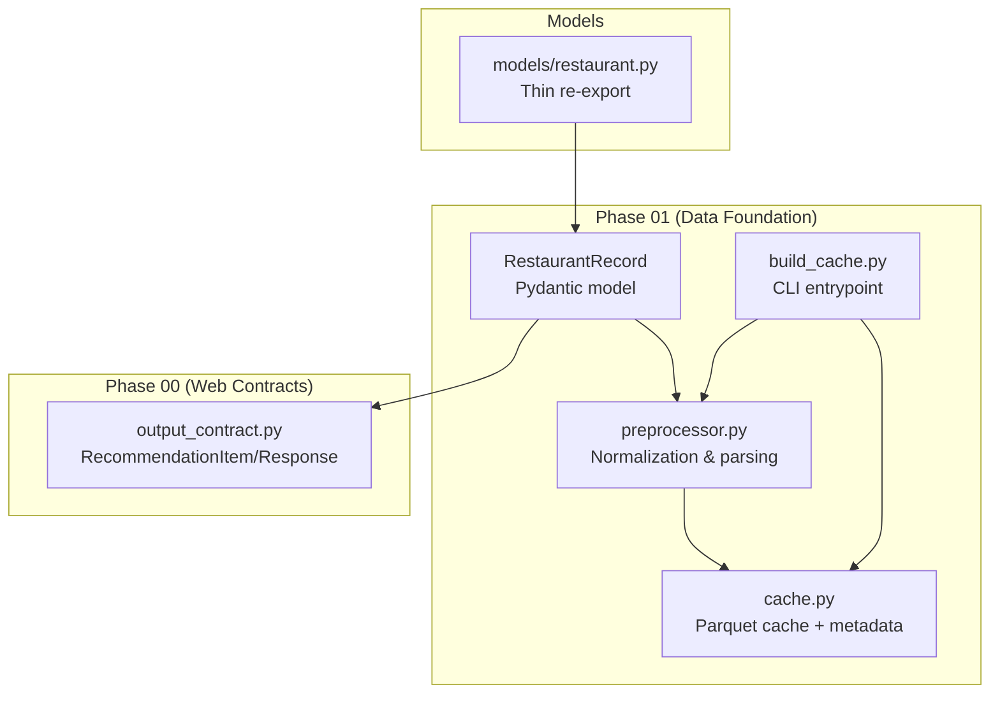
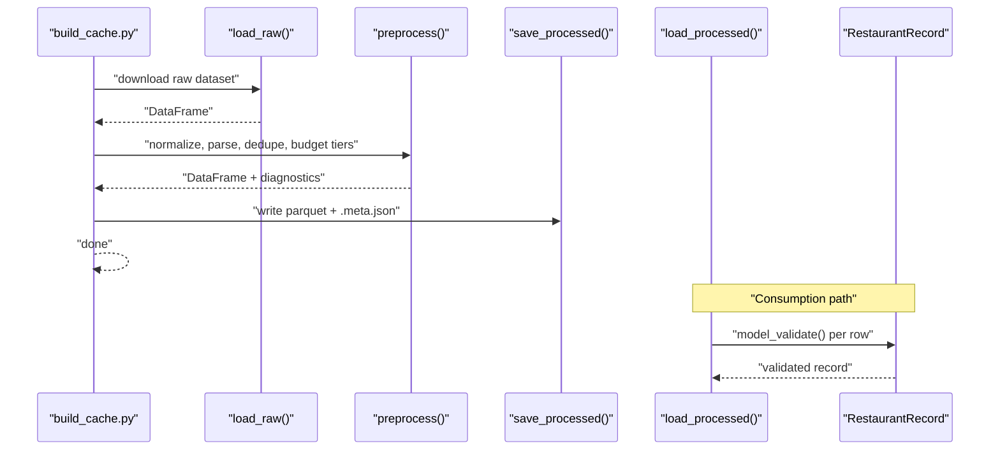
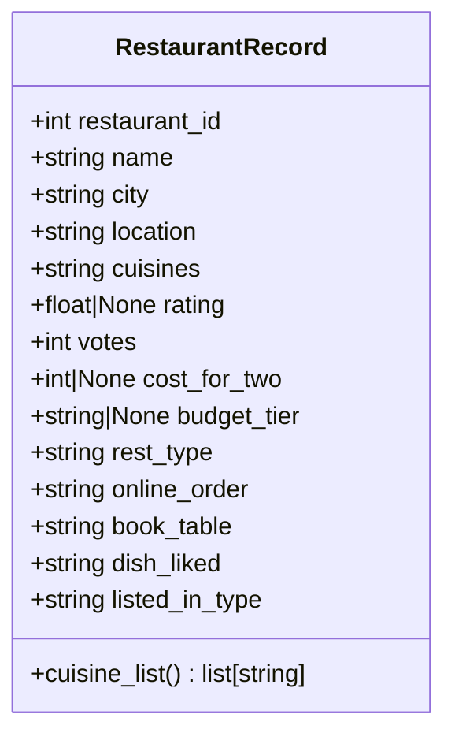
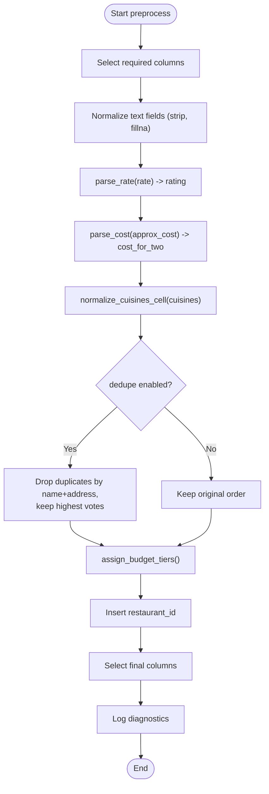
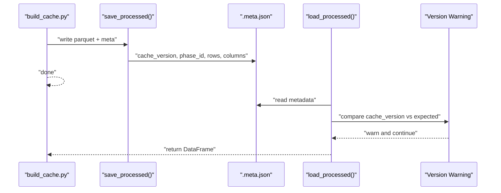
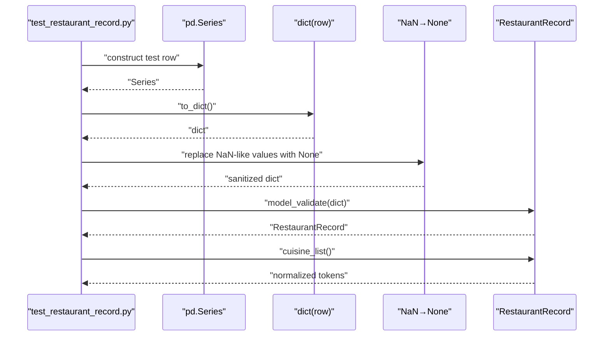
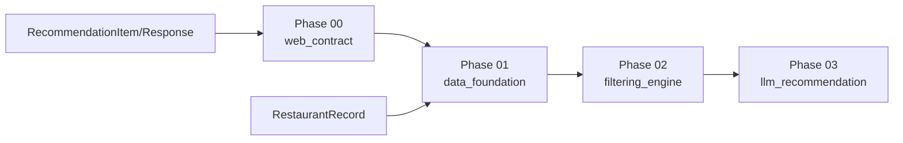

# Restaurant Record Schema and Data Models

<cite>
**Referenced Files in This Document**
- [restaurant.py](file://zomato-ai-recommendation/src/models/restaurant.py)
- [restaurant_record.py](file://zomato-ai-recommendation/src/phases/phase01/restaurant_record.py)
- [preprocessor.py](file://zomato-ai-recommendation/src/phases/phase01/preprocessor.py)
- [cache.py](file://zomato-ai-recommendation/src/phases/phase01/cache.py)
- [build_cache.py](file://zomato-ai-recommendation/scripts/build_cache.py)
- [DATA_NOTES.md](file://zomato-ai-recommendation/docs/DATA_NOTES.md)
- [ARCHITECTURE.md](file://zomato-ai-recommendation/docs/ARCHITECTURE.md)
- [output_contract.py](file://zomato-ai-recommendation/src/phases/phase00/output_contract.py)
- [test_restaurant_record.py](file://zomato-ai-recommendation/tests/test_restaurant_record.py)
- [registry.py](file://zomato-ai-recommendation/src/phases/registry.py)
- [meta.py](file://zomato-ai-recommendation/src/phases/phase00/meta.py)
- [phase01/meta.py](file://zomato-ai-recommendation/src/phases/phase01/meta.py)
</cite>

## Table of Contents
1. [Introduction](#introduction)
2. [Project Structure](#project-structure)
3. [Core Components](#core-components)
4. [Architecture Overview](#architecture-overview)
5. [Detailed Component Analysis](#detailed-component-analysis)
6. [Dependency Analysis](#dependency-analysis)
7. [Performance Considerations](#performance-considerations)
8. [Troubleshooting Guide](#troubleshooting-guide)
9. [Conclusion](#conclusion)
10. [Appendices](#appendices)

## Introduction
This document provides comprehensive data model documentation for the RestaurantRecord schema and related data structures used in the Zomato AI recommendation system. It covers field definitions, data types, validation rules, Pydantic model implementation, serialization/deserialization, data integrity checks, and practical workflows for instantiation, validation, and transformation. It also outlines schema evolution strategies, backward compatibility, and migration procedures for data model changes.

## Project Structure
The RestaurantRecord schema is part of Phase 01’s data foundation and is consumed by downstream phases for filtering and recommendation. Supporting components include normalization logic, caching, and tests that validate the model’s behavior.

**Diagram sources**
- [restaurant_record.py:1-30](file://zomato-ai-recommendation/src/phases/phase01/restaurant_record.py#L1-L30)
- [preprocessor.py:1-232](file://zomato-ai-recommendation/src/phases/phase01/preprocessor.py#L1-L232)
- [cache.py:1-64](file://zomato-ai-recommendation/src/phases/phase01/cache.py#L1-L64)
- [build_cache.py:1-75](file://zomato-ai-recommendation/scripts/build_cache.py#L1-L75)
- [restaurant.py:1-6](file://zomato-ai-recommendation/src/models/restaurant.py#L1-L6)
- [output_contract.py:1-52](file://zomato-ai-recommendation/src/phases/phase00/output_contract.py#L1-L52)

**Section sources**
- [ARCHITECTURE.md:146-181](file://zomato-ai-recommendation/docs/ARCHITECTURE.md#L146-L181)
- [DATA_NOTES.md:23-37](file://zomato-ai-recommendation/docs/DATA_NOTES.md#L23-L37)

## Core Components
This section documents the RestaurantRecord schema and related structures, focusing on field definitions, types, constraints, and derived behaviors.

- RestaurantRecord (Pydantic model)
  - Purpose: Encapsulates a single processed restaurant row suitable for caching and filtering.
  - Fields and constraints:
    - restaurant_id: int, required, ge=0
    - name: str, required
    - city: str, optional, default=""
    - location: str, optional, default=""
    - cuisines: str, optional, default="", description indicates pipe-separated normalized tokens
    - rating: float | None, optional, ge=0.0, le=5.0
    - votes: int, required, ge=0
    - cost_for_two: int | None, optional, ge=0, description indicates approximate INR for two
    - budget_tier: str | None, optional, description enumerates low | medium | high | unknown
    - rest_type: str, optional, default=""
    - online_order: str, optional, default=""
    - book_table: str, optional, default=""
    - dish_liked: str, optional, default=""
    - listed_in_type: str, optional, default=""
  - Methods:
    - cuisine_list(): returns a list of normalized cuisine tokens derived from the cuisines field; returns empty list if cuisines is empty

- RecommendationItem and RecommendationResponse (Phase 00 contracts)
  - RecommendationItem: Defines the UI-facing item shape with fields such as rank, name, cuisine, rating, estimated_cost, explanation, location, dish_liked, book_table, online_order, votes.
  - RecommendationResponse: Aggregates a list of RecommendationItem entries, optional summary and filter_count, llm_used flag, and messages for user-facing hints.

- Data Notes (Phase 01 output columns)
  - Provides a tabular summary of the cached schema columns and their descriptions, including excluded free-text fields.

**Section sources**
- [restaurant_record.py:8-30](file://zomato-ai-recommendation/src/phases/phase01/restaurant_record.py#L8-L30)
- [output_contract.py:8-52](file://zomato-ai-recommendation/src/phases/phase00/output_contract.py#L8-L52)
- [DATA_NOTES.md:23-37](file://zomato-ai-recommendation/docs/DATA_NOTES.md#L23-L37)

## Architecture Overview
The RestaurantRecord schema sits at the core of Phase 01’s data foundation. It is produced by the preprocessor, persisted to Parquet with metadata, and consumed by downstream phases for filtering and recommendation.

**Diagram sources**
- [build_cache.py:21-70](file://zomato-ai-recommendation/scripts/build_cache.py#L21-L70)
- [preprocessor.py:136-232](file://zomato-ai-recommendation/src/phases/phase01/preprocessor.py#L136-L232)
- [cache.py:27-63](file://zomato-ai-recommendation/src/phases/phase01/cache.py#L27-L63)
- [restaurant_record.py:8-30](file://zomato-ai-recommendation/src/phases/phase01/restaurant_record.py#L8-L30)

## Detailed Component Analysis

### RestaurantRecord Model
- Implementation pattern:
  - Pydantic BaseModel with strict field-level constraints (ge/le, optional unions).
  - A convenience method to derive a normalized list of cuisines from a pipe-delimited string.
- Data types and constraints:
  - Numeric fields enforce non-negativity; rating is bounded to 0–5.
  - Optional fields allow None when data is missing or unparsable.
- Validation rules:
  - Pydantic validation ensures type correctness and bounds.
  - Preprocessing converts raw strings to normalized forms and numeric types; invalid cells are mapped to None or defaults.
- Serialization/deserialization:
  - Pydantic model_validate() is used to construct records from dictionaries derived from processed rows.
  - Parquet persistence uses pandas; metadata includes cache version and row/column info for migration safety.

**Diagram sources**
- [restaurant_record.py:8-30](file://zomato-ai-recommendation/src/phases/phase01/restaurant_record.py#L8-L30)

**Section sources**
- [restaurant_record.py:8-30](file://zomato-ai-recommendation/src/phases/phase01/restaurant_record.py#L8-L30)
- [test_restaurant_record.py:13-20](file://zomato-ai-recommendation/tests/test_restaurant_record.py#L13-L20)

### Preprocessing Pipeline and Data Integrity
- Parsing and normalization:
  - Ratings: parse_rate() converts rate strings to floats in [0, 5], treating invalid tokens as None.
  - Costs: parse_cost() extracts numeric values from cost strings, handles ranges and commas, and returns midpoints for ranges.
  - Cuisines: normalize_cuisines_cell() lowercases and deduplicates tokens separated by commas, joined by pipes.
  - Cities: canonical_city() applies shared UI city aliasing.
- Deduplication and budget tiers:
  - Deduplication removes near-duplicate restaurants by name and address, preferring higher-vote entries.
  - assign_budget_tiers() computes per-city quantiles when sufficient samples are present; otherwise falls back to global quantiles.
- Diagnostics:
  - The preprocessor tracks invalid_rate and invalid_cost counts to inform quality checks.

**Diagram sources**
- [preprocessor.py:136-232](file://zomato-ai-recommendation/src/phases/phase01/preprocessor.py#L136-L232)

**Section sources**
- [preprocessor.py:27-232](file://zomato-ai-recommendation/src/phases/phase01/preprocessor.py#L27-L232)

### Cache and Migration Strategy
- Cache format:
  - Parquet file stores processed rows; metadata sidecar (.meta.json) stores cache_version, phase_id, rows, columns, and written_at_utc.
- Versioning and migration:
  - CACHE_VERSION is bumped to invalidate old artifacts; load_processed() warns if version mismatches and instructs rebuilding.
- CLI entrypoint:
  - build_cache.py orchestrates downloading, preprocessing, and saving cache with diagnostics.

**Diagram sources**
- [cache.py:27-63](file://zomato-ai-recommendation/src/phases/phase01/cache.py#L27-L63)
- [build_cache.py:48-69](file://zomato-ai-recommendation/scripts/build_cache.py#L48-L69)

**Section sources**
- [cache.py:19-63](file://zomato-ai-recommendation/src/phases/phase01/cache.py#L19-L63)
- [build_cache.py:21-70](file://zomato-ai-recommendation/scripts/build_cache.py#L21-L70)

### Model Instantiation, Validation, and Transformation Workflows
- From processed DataFrame to validated records:
  - Convert each row to a dictionary and normalize NaN-like values to None for optional numeric fields.
  - Use model_validate() to construct RestaurantRecord instances with automatic type coercion and validation.
- Example workflow:
  - Create a pandas Series representing a row.
  - Convert to dict and sanitize numeric NaNs.
  - Validate and instantiate RestaurantRecord.
  - Verify derived cuisine_list() behavior.

**Diagram sources**
- [test_restaurant_record.py:13-42](file://zomato-ai-recommendation/tests/test_restaurant_record.py#L13-L42)
- [restaurant_record.py:26-30](file://zomato-ai-recommendation/src/phases/phase01/restaurant_record.py#L26-L30)

**Section sources**
- [test_restaurant_record.py:13-42](file://zomato-ai-recommendation/tests/test_restaurant_record.py#L13-L42)

## Dependency Analysis
The system enforces a phased architecture with explicit dependencies and rollback hints. Phase 01 depends on Phase 00 contracts and is designed to be independently revertible.

**Diagram sources**
- [registry.py:28-68](file://zomato-ai-recommendation/src/phases/registry.py#L28-L68)
- [phase01/meta.py:3-6](file://zomato-ai-recommendation/src/phases/phase01/meta.py#L3-L6)
- [meta.py:3-6](file://zomato-ai-recommendation/src/phases/phase00/meta.py#L3-L6)

**Section sources**
- [registry.py:28-68](file://zomato-ai-recommendation/src/phases/registry.py#L28-L68)
- [phase01/meta.py:3-6](file://zomato-ai-recommendation/src/phases/phase01/meta.py#L3-L6)
- [meta.py:3-6](file://zomato-ai-recommendation/src/phases/phase00/meta.py#L3-L6)

## Performance Considerations
- Preprocessing efficiency:
  - Vectorized pandas operations and map() calls minimize Python loops.
  - Deduplication prioritizes votes to reduce candidate sets efficiently.
- Caching:
  - Parquet storage reduces IO overhead; metadata enables quick validation and migration.
- Validation:
  - Pydantic validation occurs once per row during model construction; keep batch sizes reasonable for memory usage.

[No sources needed since this section provides general guidance]

## Troubleshooting Guide
- Validation errors:
  - Ensure numeric fields meet bounds (rating in [0, 5], non-negative integers). Replace invalid strings with None or defaults before model validation.
- Missing or malformed data:
  - The preprocessor treats invalid rate and cost tokens as None; confirm that raw data is normalized consistently.
- Cache version mismatch:
  - If load_processed() warns about version mismatches, rebuild the cache using the provided script to align with the current CACHE_VERSION.
- Testing:
  - Use the included test to validate model instantiation and cuisine parsing behavior.

**Section sources**
- [preprocessor.py:27-71](file://zomato-ai-recommendation/src/phases/phase01/preprocessor.py#L27-L71)
- [cache.py:46-63](file://zomato-ai-recommendation/src/phases/phase01/cache.py#L46-L63)
- [test_restaurant_record.py:13-42](file://zomato-ai-recommendation/tests/test_restaurant_record.py#L13-L42)

## Conclusion
The RestaurantRecord schema and supporting components provide a robust, validated, and cacheable representation of restaurant data tailored for filtering and recommendation. Pydantic validation, preprocessing normalization, and Parquet caching ensure data integrity and performance. The phased architecture and explicit versioning enable controlled evolution and backward compatibility.

[No sources needed since this section summarizes without analyzing specific files]

## Appendices

### Field Reference and Validation Summary
- restaurant_id: int, required, ge=0
- name: str, required
- city: str, optional, default=""
- location: str, optional, default=""
- cuisines: str, optional, default="", normalized pipe-separated tokens
- rating: float | None, optional, ge=0.0, le=5.0
- votes: int, required, ge=0
- cost_for_two: int | None, optional, ge=0
- budget_tier: str | None, optional, values: low | medium | high | unknown
- rest_type: str, optional, default=""
- online_order: str, optional, default=""
- book_table: str, optional, default=""
- dish_liked: str, optional, default=""
- listed_in_type: str, optional, default=""

**Section sources**
- [restaurant_record.py:11-25](file://zomato-ai-recommendation/src/phases/phase01/restaurant_record.py#L11-L25)

### Schema Evolution and Migration Procedures
- Versioning:
  - Increment CACHE_VERSION to invalidate prior caches; downstream loaders warn and require rebuild.
- Backward compatibility:
  - Add new optional fields with sensible defaults; avoid changing required fields or types without a major version bump.
- Migration steps:
  - Update CACHE_VERSION.
  - Rebuild cache using the CLI entrypoint to regenerate Parquet and metadata.
  - Update consumers to handle new fields gracefully.
- Rollback:
  - Phase 01 is designed to be removable; downstream phases should tolerate missing cache artifacts and rebuild as needed.

**Section sources**
- [cache.py:19-63](file://zomato-ai-recommendation/src/phases/phase01/cache.py#L19-L63)
- [registry.py:39-47](file://zomato-ai-recommendation/src/phases/registry.py#L39-L47)
- [build_cache.py:48-69](file://zomato-ai-recommendation/scripts/build_cache.py#L48-L69)