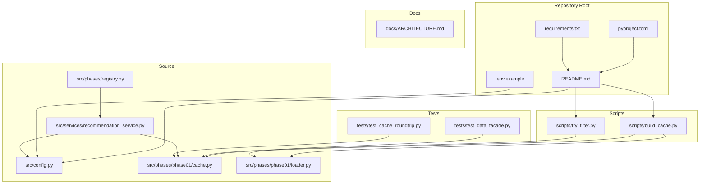
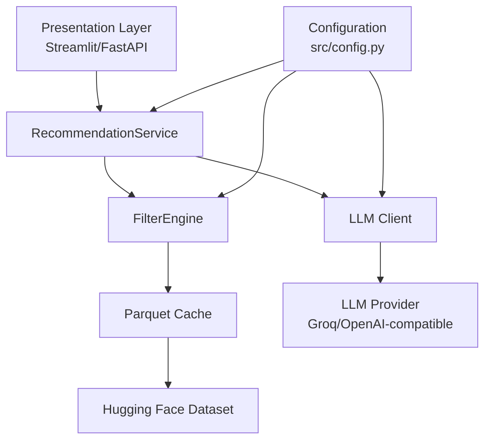
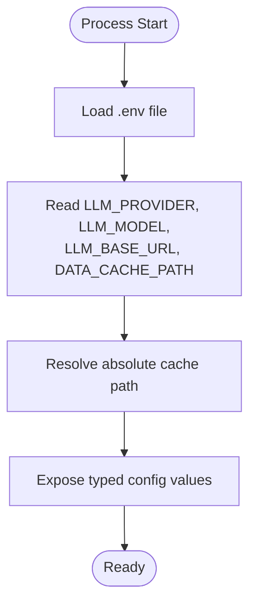
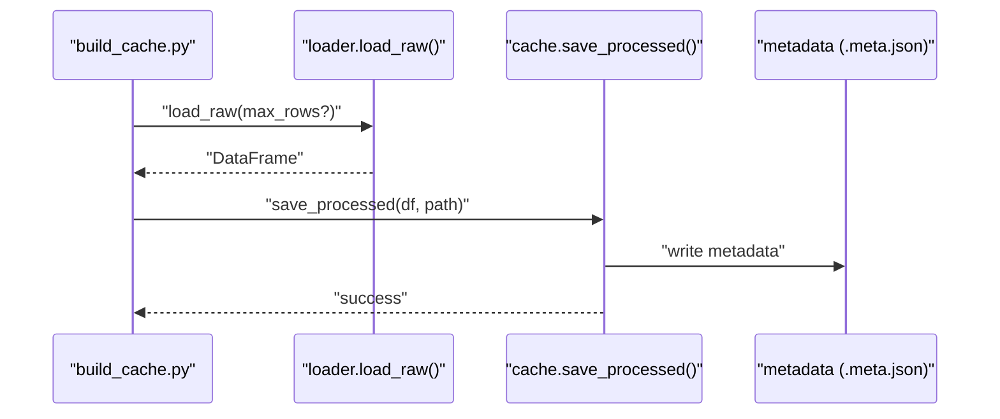
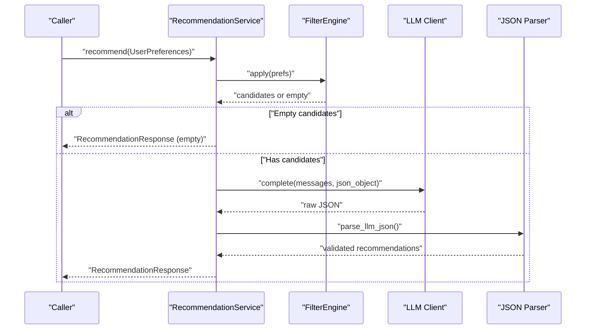
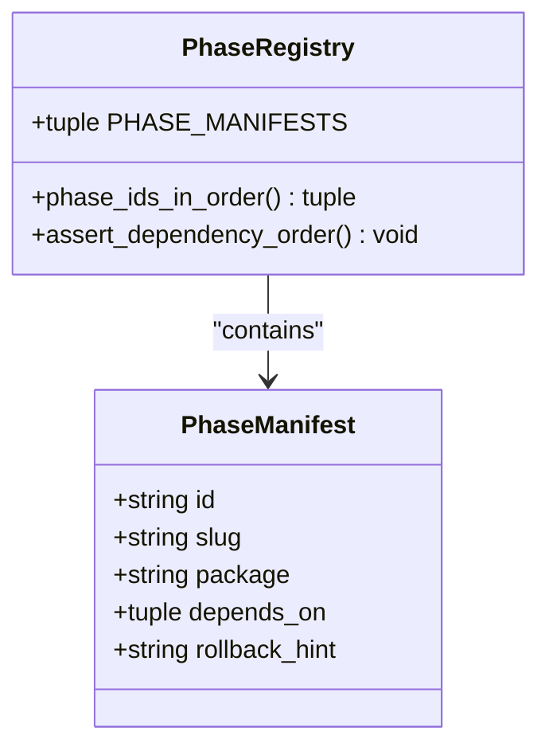
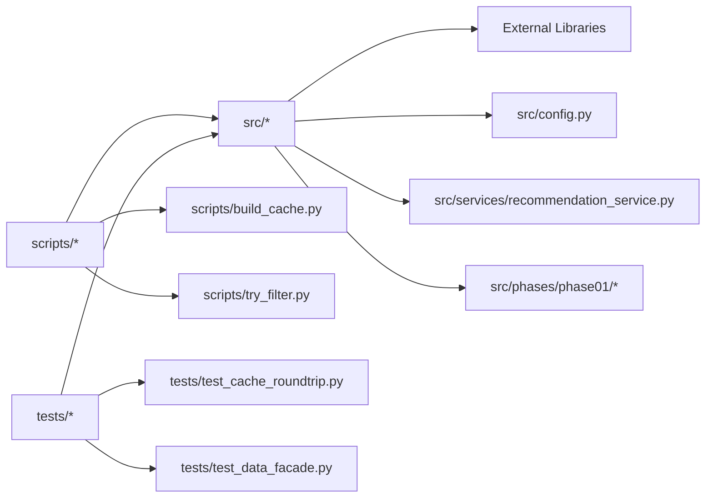

# Deployment and Operations

<cite>
**Referenced Files in This Document**
- [README.md](file://zomato-ai-recommendation/README.md)
- [ARCHITECTURE.md](file://zomato-ai-recommendation/docs/ARCHITECTURE.md)
- [pyproject.toml](file://zomato-ai-recommendation/pyproject.toml)
- [requirements.txt](file://zomato-ai-recommendation/requirements.txt)
- [config.py](file://zomato-ai-recommendation/src/config.py)
- [build_cache.py](file://zomato-ai-recommendation/scripts/build_cache.py)
- [try_filter.py](file://zomato-ai-recommendation/scripts/try_filter.py)
- [recommendation_service.py](file://zomato-ai-recommendation/src/services/recommendation_service.py)
- [cache.py](file://zomato-ai-recommendation/src/phases/phase01/cache.py)
- [loader.py](file://zomato-ai-recommendation/src/phases/phase01/loader.py)
- [registry.py](file://zomato-ai-recommendation/src/phases/registry.py)
- [test_cache_roundtrip.py](file://zomato-ai-recommendation/tests/test_cache_roundtrip.py)
- [test_data_facade.py](file://zomato-ai-recommendation/tests/test_data_facade.py)
</cite>

## Table of Contents
1. [Introduction](#introduction)
2. [Project Structure](#project-structure)
3. [Core Components](#core-components)
4. [Architecture Overview](#architecture-overview)
5. [Detailed Component Analysis](#detailed-component-analysis)
6. [Dependency Analysis](#dependency-analysis)
7. [Performance Considerations](#performance-considerations)
8. [Monitoring and Observability](#monitoring-and-observability)
9. [Deployment Automation and CI/CD](#deployment-automation-and-cicd)
10. [Environment Management](#environment-management)
11. [Scaling Strategies](#scaling-strategies)
12. [Operational Procedures](#operational-procedures)
13. [Troubleshooting Guide](#troubleshooting-guide)
14. [Conclusion](#conclusion)

## Introduction
This document provides deployment and operations guidance for the Zomato AI Recommendation System. It covers production deployment considerations, infrastructure requirements, scaling strategies, monitoring and logging, performance metrics, alerting, deployment automation, CI/CD setup, environment management, data freshness, cache management, backup strategies, troubleshooting, and maintenance procedures. The system is designed to minimize LLM cost and latency by applying structured filtering before LLM ranking, caching preprocessed data locally, and maintaining testable layers with clear contracts.

## Project Structure
The repository follows a phased architecture with explicit layering:
- Data ingestion and caching (Phase 01)
- Filtering engine (Phase 02)
- LLM orchestration (Phase 03)
- UI and presentation (Planned)
- Hardening and deployment (Planned)

Key operational files:
- Configuration and environment loading
- Cache build and validation scripts
- Recommendation service orchestrating filtering and LLM
- Phase registry for dependency ordering and rollback hints
- Tests validating cache roundtrip and facade delegation

**Diagram sources**
- [README.md:14-39](file://zomato-ai-recommendation/README.md#L14-L39)
- [pyproject.toml:1-16](file://zomato-ai-recommendation/pyproject.toml#L1-L16)
- [requirements.txt:1-9](file://zomato-ai-recommendation/requirements.txt#L1-L9)
- [config.py:1-50](file://zomato-ai-recommendation/src/config.py#L1-L50)
- [build_cache.py:1-75](file://zomato-ai-recommendation/scripts/build_cache.py#L1-L75)
- [try_filter.py:1-78](file://zomato-ai-recommendation/scripts/try_filter.py#L1-L78)
- [recommendation_service.py:1-200](file://zomato-ai-recommendation/src/services/recommendation_service.py#L1-L200)
- [cache.py:1-64](file://zomato-ai-recommendation/src/phases/phase01/cache.py#L1-L64)
- [loader.py:1-64](file://zomato-ai-recommendation/src/phases/phase01/loader.py#L1-L64)
- [registry.py:1-84](file://zomato-ai-recommendation/src/phases/registry.py#L1-L84)
- [test_cache_roundtrip.py:1-39](file://zomato-ai-recommendation/tests/test_cache_roundtrip.py#L1-L39)
- [test_data_facade.py:1-11](file://zomato-ai-recommendation/tests/test_data_facade.py#L1-L11)
- [ARCHITECTURE.md:146-181](file://zomato-ai-recommendation/docs/ARCHITECTURE.md#L146-L181)

**Section sources**
- [README.md:14-39](file://zomato-ai-recommendation/README.md#L14-L39)
- [ARCHITECTURE.md:146-181](file://zomato-ai-recommendation/docs/ARCHITECTURE.md#L146-L181)

## Core Components
- Configuration and environment
  - Loads environment variables from a .env file and exposes typed settings for LLM provider, model, base URL, API keys, and cache paths.
  - Provides defaults and absolute path resolution for cache locations.
- Data ingestion and caching
  - Downloads dataset from Hugging Face, normalizes fields, computes budget tiers, and writes a Parquet cache with metadata.
  - Validates cache version and logs warnings on mismatch to ensure reproducible data.
- Recommendation service
  - Orchestrates filtering, LLM ranking, parsing, hallucination checks, and fallback behavior when LLM is unavailable.
  - Returns structured recommendations with explanations and graceful degradation.
- Phase registry
  - Defines ordered phases and rollback hints to support safe deployments and incident response.

**Section sources**
- [config.py:15-50](file://zomato-ai-recommendation/src/config.py#L15-L50)
- [cache.py:27-64](file://zomato-ai-recommendation/src/phases/phase01/cache.py#L27-L64)
- [loader.py:33-64](file://zomato-ai-recommendation/src/phases/phase01/loader.py#L33-L64)
- [recommendation_service.py:30-200](file://zomato-ai-recommendation/src/services/recommendation_service.py#L30-L200)
- [registry.py:27-84](file://zomato-ai-recommendation/src/phases/registry.py#L27-L84)

## Architecture Overview
The system separates concerns across layers:
- Data layer: Hugging Face ingestion, preprocessing, and Parquet caching
- Filter layer: Structured filtering and scoring before LLM
- LLM layer: Prompt building, client invocation, and structured parsing
- Presentation layer: Streamlit MVP or future FastAPI + frontend
- Configuration: Environment-driven settings and cache paths

**Diagram sources**
- [ARCHITECTURE.md:12-39](file://zomato-ai-recommendation/docs/ARCHITECTURE.md#L12-L39)
- [recommendation_service.py:30-200](file://zomato-ai-recommendation/src/services/recommendation_service.py#L30-L200)
- [config.py:26-47](file://zomato-ai-recommendation/src/config.py#L26-L47)
- [cache.py:46-64](file://zomato-ai-recommendation/src/phases/phase01/cache.py#L46-L64)
- [loader.py:33-64](file://zomato-ai-recommendation/src/phases/phase01/loader.py#L33-L64)

## Detailed Component Analysis

### Configuration and Environment Management
- Loads .env at runtime and exposes typed getters for integers and strings.
- Supports multiple providers (Groq/OpenAI) and selects the appropriate API key.
- Resolves cache path to an absolute location relative to project root.

**Diagram sources**
- [config.py:12-50](file://zomato-ai-recommendation/src/config.py#L12-L50)

**Section sources**
- [config.py:12-50](file://zomato-ai-recommendation/src/config.py#L12-L50)

### Data Ingestion and Cache Management
- Downloads dataset from Hugging Face with retry logic and supports limiting rows for smoke tests.
- Writes Parquet cache with metadata including cache version, row count, column list, and timestamp.
- On load, validates cache version and warns if mismatched to prompt rebuilding.

**Diagram sources**
- [build_cache.py:21-70](file://zomato-ai-recommendation/scripts/build_cache.py#L21-L70)
- [loader.py:33-64](file://zomato-ai-recommendation/src/phases/phase01/loader.py#L33-L64)
- [cache.py:27-43](file://zomato-ai-recommendation/src/phases/phase01/cache.py#L27-L43)

**Section sources**
- [build_cache.py:21-70](file://zomato-ai-recommendation/scripts/build_cache.py#L21-L70)
- [cache.py:27-64](file://zomato-ai-recommendation/src/phases/phase01/cache.py#L27-L64)
- [loader.py:33-64](file://zomato-ai-recommendation/src/phases/phase01/loader.py#L33-L64)

### Recommendation Service Orchestration
- Applies structured filtering, validates API key, builds LLM prompts, parses JSON output, validates names against candidates, and falls back to structured scoring when needed.
- Returns a RecommendationResponse with explanations and filter counts.

**Diagram sources**
- [recommendation_service.py:37-131](file://zomato-ai-recommendation/src/services/recommendation_service.py#L37-L131)

**Section sources**
- [recommendation_service.py:30-200](file://zomato-ai-recommendation/src/services/recommendation_service.py#L30-L200)

### Phase Registry and Rollback Hints
- Defines ordered phases and dependency relationships.
- Provides rollback hints to isolate and revert changes during incidents.

**Diagram sources**
- [registry.py:16-84](file://zomato-ai-recommendation/src/phases/registry.py#L16-L84)

**Section sources**
- [registry.py:27-84](file://zomato-ai-recommendation/src/phases/registry.py#L27-L84)

## Dependency Analysis
- Internal dependencies
  - Scripts depend on src modules for cache building and filtering tests.
  - RecommendationService depends on FilterEngine, LLM client/parser, and configuration.
  - Tests validate cache roundtrip and facade delegation.
- External dependencies
  - Hugging Face datasets, pandas, pyarrow, pydantic, python-dotenv, pytest, streamlit, httpx.

**Diagram sources**
- [build_cache.py:15-16](file://zomato-ai-recommendation/scripts/build_cache.py#L15-L16)
- [try_filter.py:16-19](file://zomato-ai-recommendation/scripts/try_filter.py#L16-L19)
- [recommendation_service.py:9-17](file://zomato-ai-recommendation/src/services/recommendation_service.py#L9-L17)
- [requirements.txt:1-9](file://zomato-ai-recommendation/requirements.txt#L1-L9)

**Section sources**
- [requirements.txt:1-9](file://zomato-ai-recommendation/requirements.txt#L1-L9)
- [build_cache.py:15-16](file://zomato-ai-recommendation/scripts/build_cache.py#L15-L16)
- [try_filter.py:16-19](file://zomato-ai-recommendation/scripts/try_filter.py#L16-L19)
- [recommendation_service.py:9-17](file://zomato-ai-recommendation/src/services/recommendation_service.py#L9-L17)

## Performance Considerations
- Minimize LLM cost and latency by filtering candidates to a small set before LLM ranking.
- Cache preprocessed data locally in Parquet format for fast reads.
- Keep only necessary columns for filtering and LLM context to reduce memory and I/O overhead.
- Use structured scoring and fallback ranking to maintain responsiveness when LLM is unavailable.
- Monitor typical timings: filtering under 100 ms, LLM 2–8 s, total UX under 10 s with loading indicators.

[No sources needed since this section provides general guidance]

## Monitoring and Observability
- Logging
  - Log cache load/save operations, warnings on cache version mismatches, and errors on LLM failures.
  - Avoid logging sensitive prompts or PII; mask or redact personal information.
- Metrics
  - Track filter counts, LLM latency, API key presence, and fallback triggers.
  - Record cache hit rates and rebuild frequency.
- Alerting
  - Alert on cache version mismatches requiring rebuild, frequent LLM failures, missing API keys, and degraded performance (latency > thresholds).
- Tracing
  - Instrument recommendation requests to correlate filter counts, LLM calls, and fallback decisions.

[No sources needed since this section provides general guidance]

## Deployment Automation and CI/CD
- Local development
  - Use a virtual environment with pinned Python version and install dependencies from requirements.txt.
  - Run tests with pytest configured in pyproject.toml.
- CI pipeline
  - Install dependencies, run pytest, and optionally run cache build and filtering smoke tests.
  - Gate merges on passing tests and cache validation.
- CD pipeline
  - Build container images (if applicable) and deploy to target environments.
  - Promote artifacts with cache metadata to ensure reproducible deployments.
- Smoke tests
  - Use scripts to validate cache creation and filtering behavior before deploying.

**Section sources**
- [README.md:68-73](file://zomato-ai-recommendation/README.md#L68-L73)
- [pyproject.toml:8-11](file://zomato-ai-recommendation/pyproject.toml#L8-L11)
- [build_cache.py:21-70](file://zomato-ai-recommendation/scripts/build_cache.py#L21-L70)
- [try_filter.py:22-73](file://zomato-ai-recommendation/scripts/try_filter.py#L22-L73)

## Environment Management
- Secrets
  - Store API keys in .env; keep .env out of version control.
  - Rotate keys regularly and remove example keys before publishing.
- Variables
  - Configure LLM provider, model, base URL, and cache path via environment variables.
- Backups
  - Back up Parquet cache and metadata files; retain multiple recent versions for rollback.

**Section sources**
- [README.md:41-54](file://zomato-ai-recommendation/README.md#L41-L54)
- [config.py:26-47](file://zomato-ai-recommendation/src/config.py#L26-L47)

## Scaling Strategies
- Horizontal scaling
  - Stateless recommendation service can be scaled behind a load balancer; persist cache on shared storage.
- Vertical scaling
  - Increase CPU/RAM for filtering workloads; optimize Parquet compression and column projections.
- Caching
  - Use cache warming to preload frequently accessed cities or preference combinations.
- Asynchronous processing
  - Offload heavy LLM calls to async workers with result retrieval via IDs.
- CDN and static assets
  - Serve UI and static assets via CDN for reduced latency.

[No sources needed since this section provides general guidance]

## Operational Procedures
- Data freshness
  - Periodically rebuild cache using the cache build script; monitor dataset availability and network connectivity.
  - Validate cache metadata version after rebuilds.
- Cache management
  - Monitor cache size and update cadence; handle version mismatches by triggering rebuilds.
- Backup and restore
  - Back up Parquet cache and metadata; restore by copying artifacts and verifying metadata.
- Rollbacks
  - Use phase rollback hints to revert changes in case of regressions; ensure downstream consumers adapt to removed contracts.

**Section sources**
- [cache.py:46-64](file://zomato-ai-recommendation/src/phases/phase01/cache.py#L46-L64)
- [build_cache.py:21-70](file://zomato-ai-recommendation/scripts/build_cache.py#L21-L70)
- [registry.py:34-66](file://zomato-ai-recommendation/src/phases/registry.py#L34-L66)

## Troubleshooting Guide
- Cache not found or outdated
  - Symptom: Cache load raises file not found or version mismatch warning.
  - Action: Rebuild cache using the cache build script; verify metadata version.
- Hugging Face download failures
  - Symptom: Dataset load fails after retries.
  - Action: Check network connectivity, Hugging Face availability, and retry limits.
- LLM API key missing
  - Symptom: Recommendations fall back to structured scoring.
  - Action: Set the appropriate API key in environment variables.
- LLM call failures
  - Symptom: Exceptions during LLM completion; fallback triggered.
  - Action: Inspect logs, verify provider endpoint and credentials, and retry.
- Empty recommendation results
  - Symptom: No candidates returned after filtering.
  - Action: Relax filters (budget, rating, cuisines) and review funnel messages.

**Section sources**
- [cache.py:46-64](file://zomato-ai-recommendation/src/phases/phase01/cache.py#L46-L64)
- [loader.py:43-64](file://zomato-ai-recommendation/src/phases/phase01/loader.py#L43-L64)
- [recommendation_service.py:60-130](file://zomato-ai-recommendation/src/services/recommendation_service.py#L60-L130)

## Conclusion
The Zomato AI Recommendation System is designed for production-grade operations with structured filtering, local caching, and graceful degradation. By following the deployment and operations guidance—covering environment management, monitoring, CI/CD, scaling, cache management, and troubleshooting—you can reliably operate the system in production while maintaining performance and observability.