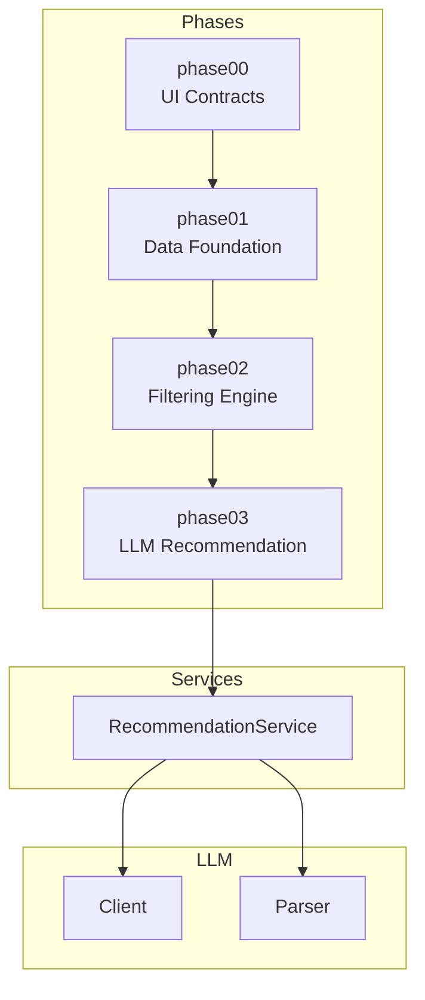
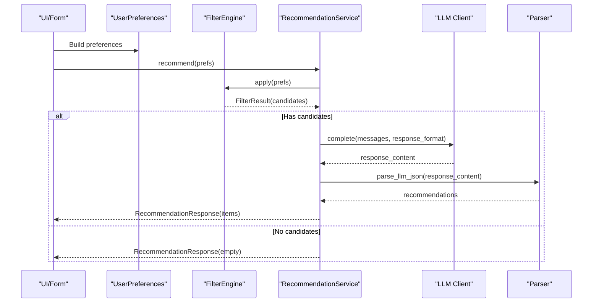
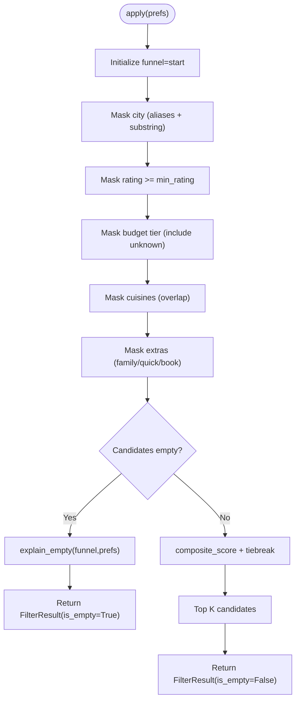
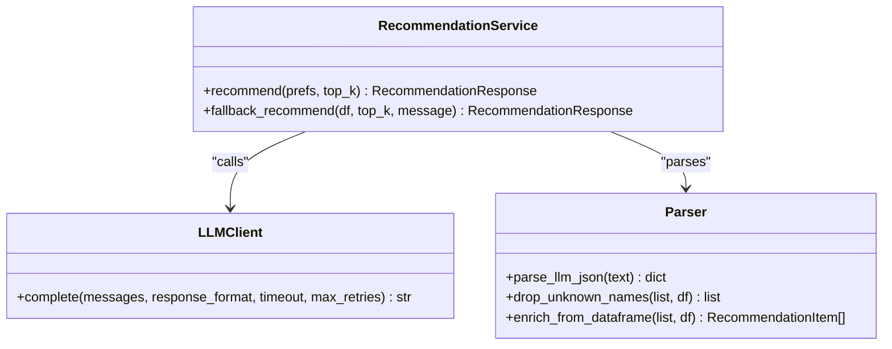
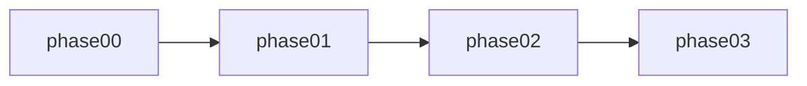

# Development Guidelines

<cite>
**Referenced Files in This Document**
- [README.md](file://README.md)
- [pyproject.toml](file://pyproject.toml)
- [src/config.py](file://src/config.py)
- [src/phases/registry.py](file://src/phases/registry.py)
- [src/phases/phase00/preferences.py](file://src/phases/phase00/preferences.py)
- [src/phases/phase01/loader.py](file://src/phases/phase01/loader.py)
- [src/phases/phase02/engine.py](file://src/phases/phase02/engine.py)
- [src/llm/client.py](file://src/llm/client.py)
- [src/llm/parser.py](file://src/llm/parser.py)
- [src/services/recommendation_service.py](file://src/services/recommendation_service.py)
- [scripts/try_filter.py](file://scripts/try_filter.py)
- [scripts/try_recommend.py](file://scripts/try_recommend.py)
- [tests/test_filter_engine.py](file://tests/test_filter_engine.py)
</cite>

## Table of Contents
1. [Introduction](#introduction)
2. [Project Structure](#project-structure)
3. [Core Components](#core-components)
4. [Architecture Overview](#architecture-overview)
5. [Detailed Component Analysis](#detailed-component-analysis)
6. [Dependency Analysis](#dependency-analysis)
7. [Performance Considerations](#performance-considerations)
8. [Troubleshooting Guide](#troubleshooting-guide)
9. [Contribution Standards](#contribution-standards)
10. [Extensibility Guidelines](#extensibility-guidelines)
11. [Debugging and Logging Strategies](#debugging-and-logging-strategies)
12. [Code Review Process](#code-review-process)
13. [Templates and Examples](#templates-and-examples)
14. [Conclusion](#conclusion)

## Introduction
This document defines development guidelines for the Zomato AI Recommendation System. It establishes code organization principles, contribution standards, and best practices for maintaining the phased architecture. It also covers coding conventions, error handling patterns, performance optimization techniques, extension strategies, debugging/logging approaches, and code review processes. The goal is to ensure consistent, maintainable, and testable development across all phases.

## Project Structure
The repository follows a phased architecture with explicit boundaries and rollback hints. Each phase introduces a working vertical slice and depends only on earlier phases. The structure emphasizes:
- Clear separation of concerns across phases
- Stable contracts (models, preferences, and output schemas)
- Testability and observability via scripts and unit tests
- Config-driven behavior for LLM providers and caching

**Diagram sources**
- [src/phases/registry.py:28-68](file://src/phases/registry.py#L28-L68)
- [src/services/recommendation_service.py:30-36](file://src/services/recommendation_service.py#L30-L36)
- [src/llm/client.py:14-94](file://src/llm/client.py#L14-L94)
- [src/llm/parser.py:24-141](file://src/llm/parser.py#L24-L141)

**Section sources**
- [README.md:14-39](file://README.md#L14-L39)
- [pyproject.toml:1-16](file://pyproject.toml#L1-L16)
- [src/phases/registry.py:1-84](file://src/phases/registry.py#L1-L84)

## Core Components
- Configuration: Centralized environment-based configuration for LLM provider, model, base URL, cache path, and tuning knobs.
- Phase Registry: Enforces dependency order and provides rollback hints for each phase.
- Phase 00: Defines canonical user preferences and output contracts for UI alignment.
- Phase 01: Loads, cleans, and caches the dataset; exposes a CLI to refresh cache.
- Phase 02: Structured filtering engine with vectorized masks, funnel logging, and explainability.
- Phase 03: LLM client with retries/backoff, prompt builder integration, and parser for structured outputs.
- Recommendation Service: Coordinates filtering and LLM ranking, with robust fallback behavior.
- Scripts: CLI helpers for smoke testing filtering and recommendation flows.
- Tests: Unit tests validating filtering correctness, performance, and payload stability.

**Section sources**
- [src/config.py:26-47](file://src/config.py#L26-L47)
- [src/phases/registry.py:28-84](file://src/phases/registry.py#L28-L84)
- [src/phases/phase00/preferences.py:20-71](file://src/phases/phase00/preferences.py#L20-L71)
- [src/phases/phase01/loader.py:33-64](file://src/phases/phase01/loader.py#L33-L64)
- [src/phases/phase02/engine.py:140-197](file://src/phases/phase02/engine.py#L140-L197)
- [src/llm/client.py:14-94](file://src/llm/client.py#L14-L94)
- [src/services/recommendation_service.py:30-200](file://src/services/recommendation_service.py#L30-L200)
- [scripts/try_filter.py:22-78](file://scripts/try_filter.py#L22-L78)
- [scripts/try_recommend.py:21-95](file://scripts/try_recommend.py#L21-L95)
- [tests/test_filter_engine.py:85-185](file://tests/test_filter_engine.py#L85-L185)

## Architecture Overview
The system is built as a pipeline:
- Input: UserPreferences from UI
- Data: Cached parquet from Phase 01
- Filter: Phase 02 FilterEngine produces a shortlist
- LLM: Phase 03 client completes prompts and parser validates outputs
- Output: RecommendationResponse with items and optional summary

**Diagram sources**
- [src/phases/phase00/preferences.py:20-71](file://src/phases/phase00/preferences.py#L20-L71)
- [src/phases/phase02/engine.py:146-197](file://src/phases/phase02/engine.py#L146-L197)
- [src/services/recommendation_service.py:37-131](file://src/services/recommendation_service.py#L37-L131)
- [src/llm/client.py:14-94](file://src/llm/client.py#L14-L94)
- [src/llm/parser.py:24-141](file://src/llm/parser.py#L24-L141)

## Detailed Component Analysis

### Phase 00: Web UI Contract
- Canonical models define strict input contracts and validation.
- PreferenceExtras and UserPreferences encapsulate UI inputs and normalize inputs (e.g., cuisines).
- UI bridge functions provide city aliasing and note/cuisine caps to keep payloads bounded.

Best practices:
- Keep UI contracts immutable and backward-compatible.
- Validate early and fail fast with clear error messages.
- Reuse these models across phases to avoid duplication.

**Section sources**
- [src/phases/phase00/preferences.py:20-71](file://src/phases/phase00/preferences.py#L20-L71)

### Phase 01: Data Foundation
- Robust dataset ingestion with retry logic and structured logging.
- Preprocessing ensures numeric ratings, integer costs, normalized cuisines, and canonical cities.
- Persistent cache via parquet with metadata.

Best practices:
- Treat cache as a single source of truth; refresh via CLI.
- Log meaningful metrics (row counts, parse outcomes).
- Keep preprocessing deterministic and idempotent.

**Section sources**
- [src/phases/phase01/loader.py:33-64](file://src/phases/phase01/loader.py#L33-L64)

### Phase 02: Filtering Engine
- Vectorized filtering masks for city, rating, budget tier, cuisines, and extras.
- Funnel logging and human-readable reasons for empty results.
- Composite scoring and tiebreaking sort to produce a shortlist.

**Diagram sources**
- [src/phases/phase02/engine.py:146-197](file://src/phases/phase02/engine.py#L146-L197)

**Section sources**
- [src/phases/phase02/engine.py:140-197](file://src/phases/phase02/engine.py#L140-L197)
- [tests/test_filter_engine.py:85-185](file://tests/test_filter_engine.py#L85-L185)

### Phase 03: LLM Recommendation
- HTTP client with exponential backoff, timeouts, and selective retries.
- Parser extracts and validates JSON from LLM responses, handles markdown/code blocks.
- Hallucination detection drops unknown restaurant names; enrichment overlays ground-truth fields.

**Diagram sources**
- [src/services/recommendation_service.py:30-200](file://src/services/recommendation_service.py#L30-L200)
- [src/llm/client.py:14-94](file://src/llm/client.py#L14-L94)
- [src/llm/parser.py:24-141](file://src/llm/parser.py#L24-L141)

**Section sources**
- [src/llm/client.py:14-94](file://src/llm/client.py#L14-L94)
- [src/llm/parser.py:24-141](file://src/llm/parser.py#L24-L141)
- [src/services/recommendation_service.py:37-131](file://src/services/recommendation_service.py#L37-L131)

### Configuration and Environment
- Centralized configuration reads environment variables and sets defaults.
- Supports multiple providers via provider-specific keys and a unified API key variable.
- Tuning knobs for candidate limits and cache path.

**Section sources**
- [src/config.py:26-47](file://src/config.py#L26-L47)

## Dependency Analysis
The phased architecture enforces unidirectional dependencies and rollback hints. The registry enumerates phases and their dependencies, ensuring that later phases only import from earlier ones.

**Diagram sources**
- [src/phases/registry.py:28-68](file://src/phases/registry.py#L28-L68)

**Section sources**
- [src/phases/registry.py:75-84](file://src/phases/registry.py#L75-L84)

## Performance Considerations
- Filtering performance: The filtering engine targets sub-200 ms on warm cache for large datasets. Maintain vectorized operations and avoid repeated scans.
- Candidate limiting: Tune MAX_CANDIDATES and TOP_K_RECOMMENDATIONS to balance quality and latency.
- I/O caching: Prefer reading from the cached parquet; refresh via CLI when schema changes.
- LLM calls: Use timeouts and retries; consider rate-limit handling and backoff strategies.

[No sources needed since this section provides general guidance]

## Troubleshooting Guide
Common issues and resolutions:
- Empty filter results: Inspect funnel logs and messages from explain_empty to identify the bottleneck (city, rating, budget, cuisine, extras).
- LLM API errors: Check for 429 rate limits, 5xx server errors, and unrecoverable client errors. Verify API key and base URL configuration.
- JSON parsing failures: Ensure the LLM response adheres to the expected JSON schema; the parser handles markdown/code blocks but expects a valid dictionary.
- Cache path issues: Confirm DATA_CACHE_PATH resolves to the correct parquet file; scripts resolve relative paths against project root.

**Section sources**
- [src/phases/phase02/engine.py:104-137](file://src/phases/phase02/engine.py#L104-L137)
- [src/llm/client.py:55-94](file://src/llm/client.py#L55-L94)
- [src/llm/parser.py:24-44](file://src/llm/parser.py#L24-L44)
- [src/config.py:43-47](file://src/config.py#L43-L47)

## Contribution Standards
- Coding conventions
  - Line length: 100 characters enforced by linter.
  - Type hints and docstrings for public APIs.
  - Frozen Pydantic models for immutability where appropriate.
- Testing
  - Unit tests under tests/; use fixtures and representative datasets.
  - Validate performance bounds and edge cases (empty results, malformed inputs).
- Commit hygiene
  - Atomic commits per feature or fix.
  - Clear commit messages referencing phase and issue.
- Branching
  - Feature branches merged via pull requests targeting main.
- Documentation
  - Update docs/phases.md and README.md when changing phase deliverables or environment requirements.

**Section sources**
- [pyproject.toml:13-16](file://pyproject.toml#L13-L16)
- [tests/test_filter_engine.py:85-185](file://tests/test_filter_engine.py#L85-L185)

## Extensibility Guidelines

### Adding New Filter Criteria
Steps:
- Extend UserPreferences with the new field and validators.
- Add a new mask function in the filtering engine and integrate it into apply().
- Update explain_empty to provide actionable reasons when the new mask eliminates candidates.
- Add tests covering the new criterion and edge cases.
- If applicable, update the UI bridge to normalize or bound the new input.

Guidelines:
- Keep masks vectorized and efficient.
- Preserve funnel logging granularity.
- Maintain backward compatibility for existing preferences.

**Section sources**
- [src/phases/phase00/preferences.py:20-71](file://src/phases/phase00/preferences.py#L20-L71)
- [src/phases/phase02/engine.py:146-197](file://src/phases/phase02/engine.py#L146-L197)

### Integrating Additional LLM Providers
Steps:
- Add provider-specific environment variables in configuration.
- Introduce a provider selector and route API calls accordingly.
- Ensure the client supports the same interface (complete with retries/backoff).
- Update the parser to handle provider-specific response formats if needed.
- Add tests verifying provider switching and fallback behavior.

Guidelines:
- Centralize provider selection and key routing.
- Keep the prompt builder and response format consistent across providers.
- Document environment variables and defaults clearly.

**Section sources**
- [src/config.py:26-38](file://src/config.py#L26-L38)
- [src/llm/client.py:14-94](file://src/llm/client.py#L14-L94)

## Debugging and Logging Strategies
- Enable INFO-level logging for filter funnel steps and LLM API calls.
- Use structured logs with contextual keys (model, URL, attempt).
- Capture and log exceptions with stack traces; include user preferences for reproducibility.
- For LLM failures, log the raw response text to aid debugging.
- Utilize CLI scripts to reproduce issues quickly with minimal setup.

**Section sources**
- [src/phases/phase02/engine.py:173-175](file://src/phases/phase02/engine.py#L173-L175)
- [src/llm/client.py:57-90](file://src/llm/client.py#L57-L90)
- [src/llm/parser.py:42-43](file://src/llm/parser.py#L42-L43)

## Code Review Process
Checklist:
- Correctness: Do tests pass? Are edge cases covered?
- Maintainability: Is the code modular and readable? Are dependencies respected?
- Performance: Are vectorized operations used? Are bottlenecks addressed?
- Security: Are secrets managed via environment variables? Are sensitive values redacted in logs?
- Documentation: Are changes reflected in docs/phases.md and README.md?

**Section sources**
- [tests/test_filter_engine.py:85-185](file://tests/test_filter_engine.py#L85-L185)
- [README.md:56-63](file://README.md#L56-L63)

## Templates and Examples

### Template: Adding a New Mask in the Filter Engine
- Define a new mask function returning a boolean Series.
- Call the mask inside apply() and record funnel counts.
- Update explain_empty to diagnose when the mask reduces candidates to zero.
- Add unit tests for the new mask and combinations.

**Section sources**
- [src/phases/phase02/engine.py:41-102](file://src/phases/phase02/engine.py#L41-L102)
- [src/phases/phase02/engine.py:104-137](file://src/phases/phase02/engine.py#L104-L137)

### Template: Extending UserPreferences
- Add a new field with appropriate validators and defaults.
- Update UI bridge functions if normalization or caps are needed.
- Ensure the change does not break backward compatibility.

**Section sources**
- [src/phases/phase00/preferences.py:20-71](file://src/phases/phase00/preferences.py#L20-L71)

### Example: Running the Filtering CLI
- Use the filtering CLI to validate a small dataset and inspect funnel logs and candidate preview.

**Section sources**
- [scripts/try_filter.py:22-78](file://scripts/try_filter.py#L22-L78)

### Example: Running the Recommendation CLI
- Use the recommendation CLI to test the end-to-end flow, including LLM fallback when the API key is missing.

**Section sources**
- [scripts/try_recommend.py:21-95](file://scripts/try_recommend.py#L21-L95)

## Conclusion
These guidelines establish a consistent, test-driven approach to developing the Zomato AI Recommendation System. By adhering to the phased architecture, strong contracts, robust error handling, and performance-conscious patterns, contributors can reliably extend the system while maintaining quality and maintainability.