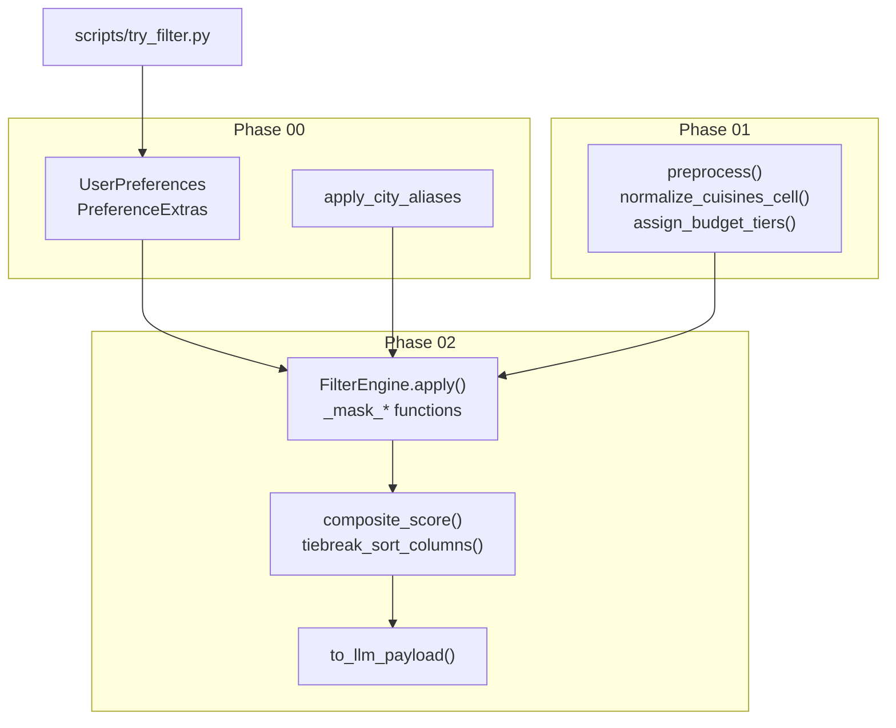
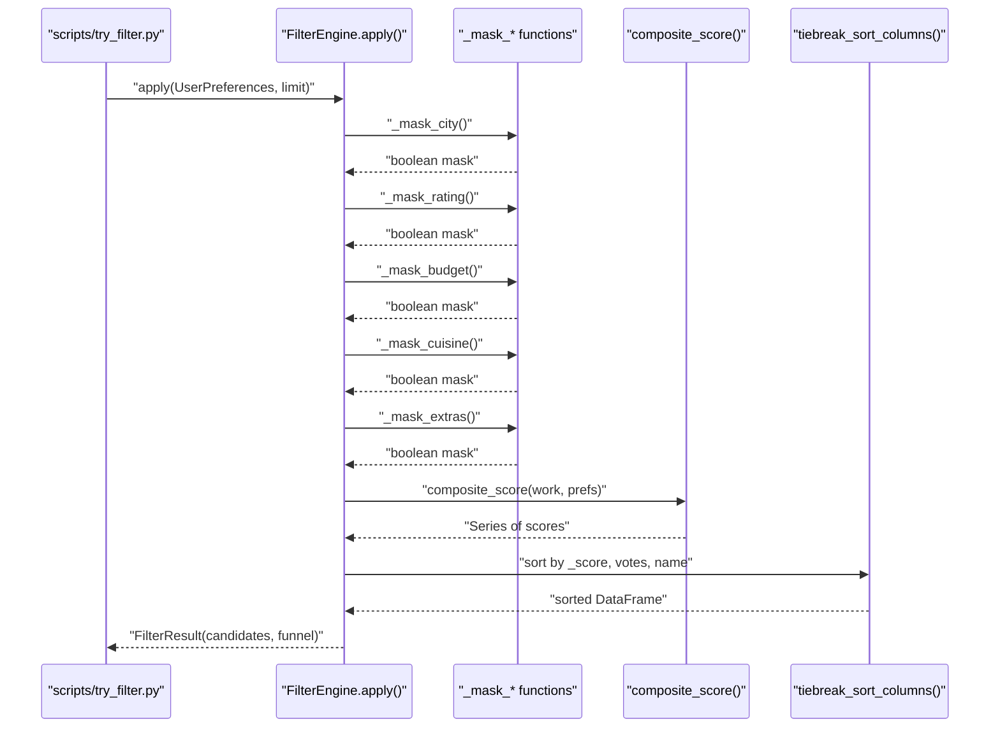
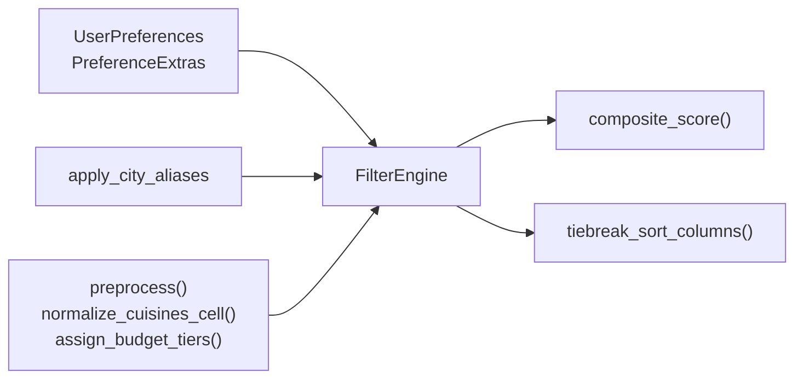

# Filter Algorithms

<cite>
**Referenced Files in This Document**
- [engine.py](file://src/phases/phase02/engine.py)
- [scorer.py](file://src/phases/phase02/scorer.py)
- [preferences.py](file://src/phases/phase00/preferences.py)
- [ui_bridge.py](file://src/phases/phase00/ui_bridge.py)
- [preprocessor.py](file://src/phases/phase01/preprocessor.py)
- [DATA_NOTES.md](file://docs/DATA_NOTES.md)
- [EDGE_CASES.md](file://docs/EDGE_CASES.md)
- [try_filter.py](file://scripts/try_filter.py)
- [test_filter_engine.py](file://tests/test_filter_engine.py)
</cite>

## Table of Contents
1. [Introduction](#introduction)
2. [Project Structure](#project-structure)
3. [Core Components](#core-components)
4. [Architecture Overview](#architecture-overview)
5. [Detailed Component Analysis](#detailed-component-analysis)
6. [Dependency Analysis](#dependency-analysis)
7. [Performance Considerations](#performance-considerations)
8. [Troubleshooting Guide](#troubleshooting-guide)
9. [Conclusion](#conclusion)
10. [Appendices](#appendices)

## Introduction
This document explains the vectorized filtering algorithms that form the structured filtering stage of the Zomato AI Recommendation System. It covers:
- City matching with alias resolution and location substring expansion
- Rating threshold filtering
- Budget tier matching (including unknown-cost rows)
- Cuisine token-based filtering with flexible substring matching
- Extra feature filtering (family-friendly, quick service, book table)
It also documents pandas-based boolean masking, string normalization, and substring matching strategies, along with parameter handling, edge cases, and performance considerations. Examples of filter combinations and their effects on candidate reduction are included.

## Project Structure
The filtering pipeline resides primarily in the phase02 package and interacts with phase00 models and phase01 preprocessing artifacts. The key files are:
- Filter engine and masks: src/phases/phase02/engine.py
- Scoring and tie-breaking: src/phases/phase02/scorer.py
- User preferences and extras: src/phases/phase00/preferences.py
- City alias normalization: src/phases/phase00/ui_bridge.py
- Preprocessing and column normalization: src/phases/phase01/preprocessor.py
- CLI smoke test and examples: scripts/try_filter.py
- Tests validating behavior: tests/test_filter_engine.py
- Dataset notes and edge cases: docs/DATA_NOTES.md, docs/EDGE_CASES.md

**Diagram sources**
- [engine.py:140-196](file://src/phases/phase02/engine.py#L140-L196)
- [scorer.py:29-69](file://src/phases/phase02/scorer.py#L29-L69)
- [preferences.py:20-71](file://src/phases/phase00/preferences.py#L20-L71)
- [ui_bridge.py:30-34](file://src/phases/phase00/ui_bridge.py#L30-L34)
- [preprocessor.py:136-232](file://src/phases/phase01/preprocessor.py#L136-L232)
- [try_filter.py:22-78](file://scripts/try_filter.py#L22-L78)

**Section sources**
- [engine.py:1-197](file://src/phases/phase02/engine.py#L1-L197)
- [scorer.py:1-70](file://src/phases/phase02/scorer.py#L1-70)
- [preferences.py:1-71](file://src/phases/phase00/preferences.py#L1-71)
- [ui_bridge.py:1-112](file://src/phases/phase00/ui_bridge.py#L1-112)
- [preprocessor.py:1-232](file://src/phases/phase01/preprocessor.py#L1-232)
- [try_filter.py:1-78](file://scripts/try_filter.py#L1-78)
- [DATA_NOTES.md:1-37](file://docs/DATA_NOTES.md#L1-L37)
- [EDGE_CASES.md:1-145](file://docs/EDGE_CASES.md#L1-L145)

## Core Components
- FilterEngine: Orchestrates vectorized boolean masking across city, rating, budget tier, cuisine tokens, and extras; records funnel counts; computes a composite score and sorts candidates deterministically.
- Mask functions: _mask_city, _mask_rating, _mask_budget, _mask_cuisine, _mask_extras.
- Scoring: composite_score and tiebreak_sort_columns prepare a deterministic sort key.
- Preferences: UserPreferences and PreferenceExtras define inputs and constraints.
- Normalization: apply_city_aliases and preprocessor utilities normalize text and budgets.

Key behaviors:
- City matching resolves aliases and broadens via location substring matching.
- Rating filtering respects None ratings and thresholds.
- Budget matching includes unknown-tier rows to avoid silent exclusions.
- Cuisine matching normalizes tokens and supports equality/substring overlaps.
- Extras combine multiple signals with configurable logic.

**Section sources**
- [engine.py:140-196](file://src/phases/phase02/engine.py#L140-L196)
- [scorer.py:29-69](file://src/phases/phase02/scorer.py#L29-L69)
- [preferences.py:20-71](file://src/phases/phase00/preferences.py#L20-L71)
- [ui_bridge.py:30-34](file://src/phases/phase00/ui_bridge.py#L30-L34)
- [preprocessor.py:73-93](file://src/phases/phase01/preprocessor.py#L73-L93)

## Architecture Overview
The filtering pipeline applies a sequence of boolean masks to a preprocessed DataFrame, recording the number of candidates after each step. It then computes a composite score and sorts deterministically before returning the top-K candidates.

**Diagram sources**
- [engine.py:146-189](file://src/phases/phase02/engine.py#L146-L189)
- [scorer.py:29-69](file://src/phases/phase02/scorer.py#L29-L69)
- [try_filter.py:48-73](file://scripts/try_filter.py#L48-L73)

## Detailed Component Analysis

### City Matching with Alias Resolution and Location Substring Expansion
- Input normalization: The user’s city string is normalized using apply_city_aliases (case-insensitive alias map) and folded to lowercase.
- Primary match: The canonical city is compared against the city column (normalized and stripped).
- Broad match: The location column is normalized and checked for substring containment of the canonical city (regex=False, na=False).
- Boolean combination: city exact match OR location substring match yields the city mask.

Implementation highlights:
- String normalization: strip + casefold ensures robust matching.
- Location substring: casefold + contains with regex=False avoids regex overhead and treats NaN as empty string.
- Aliasing: Maintains a small alias map to reconcile UI city names with dataset tokens.

Edge cases:
- Unknown city spelling: broad location substring helps when exact city does not match.
- Empty or missing city: validation occurs earlier in preferences; filtering expects a non-empty city.

Performance:
- Vectorized string operations and boolean indexing minimize Python loops.

Examples:
- Exact city match reduces candidates to the city subset.
- Adding location substring can capture neighborhoods not exactly equal to city.

**Section sources**
- [engine.py:41-47](file://src/phases/phase02/engine.py#L41-L47)
- [ui_bridge.py:30-34](file://src/phases/phase00/ui_bridge.py#L30-L34)
- [DATA_NOTES.md:28-34](file://docs/DATA_NOTES.md#L28-L34)

### Rating Threshold Filtering
- Behavior: If min_rating is greater than zero, excludes rows where rating is null or less than the threshold; if min_rating is zero or less, includes all rows.
- Logic: notna() combined with comparison ensures nulls are excluded when a positive threshold is set.

Edge cases:
- Null ratings: treated as not meeting threshold when min_rating > 0.
- Out-of-range ratings: preprocessor clamps to [0, 5]; filtering respects the clamped values.

Performance:
- Single vectorized comparison and null check.

Examples:
- Raising min_rating from 0 to 4.0 typically reduces candidates significantly.

**Section sources**
- [engine.py:75-79](file://src/phases/phase02/engine.py#L75-L79)
- [preprocessor.py:27-44](file://src/phases/phase01/preprocessor.py#L27-L44)
- [EDGE_CASES.md:58-58](file://docs/EDGE_CASES.md#L58-L58)

### Budget Tier Matching
- Behavior: Matches rows whose budget_tier equals the requested tier OR are marked as unknown.
- Rationale: Unknown-cost rows are included to avoid silent exclusions and preserve candidate diversity.

Edge cases:
- Missing cost_for_two: assigned as unknown tier during preprocessing.
- Budget boundary: quantiles are computed per city when sufficient samples exist; otherwise global quantiles are used.

Performance:
- Single vectorized equality comparisons and OR condition.

Examples:
- Requesting high budget includes unknown rows; lowering budget narrows candidates.

**Section sources**
- [engine.py:50-54](file://src/phases/phase02/engine.py#L50-L54)
- [preprocessor.py:107-133](file://src/phases/phase01/preprocessor.py#L107-L133)
- [DATA_NOTES.md:32-34](file://docs/DATA_NOTES.md#L32-L34)

### Cuisine Token-Based Filtering
- Input: cuisines list from UserPreferences (deduplicated and case-normalized).
- Preprocessing: cuisines are normalized to lowercase, split by comma, de-duplicated, and joined with pipes for tokenization.
- Matching strategy:
  - If no cuisines filter is requested, include all rows.
  - For each row, split normalized cuisines by pipe into tokens.
  - For each user-selected cuisine, normalize and strip; match if:
    - exact equality with a token, OR
    - user token is contained in a token, OR
    - a token is contained in the user token.
- Returns a boolean mask indicating matches.

Edge cases:
- Empty cuisines: skip filter to widen results.
- Multi-cuisine strings: normalized to token lists for flexible matching.
- Partial matches: supports substring containment in either direction.

Performance:
- Row-wise map operation with early exits; vectorized string ops in preprocessing.

Examples:
- Selecting “Chinese” may match “Sichuan”, “Dim Sum”, or “Hunan” depending on token containment.

**Section sources**
- [engine.py:57-72](file://src/phases/phase02/engine.py#L57-L72)
- [preferences.py:44-71](file://src/phases/phase00/preferences.py#L44-L71)
- [preprocessor.py:73-86](file://src/phases/phase01/preprocessor.py#L73-L86)
- [DATA_NOTES.md:29-29](file://docs/DATA_NOTES.md#L29-L29)

### Extra Feature Filtering (Family-Friendly, Quick Service, Book Table)
- Family-friendly:
  - Matches rows where rest_type contains “casual dining”, “cafe”, or “family”.
  - Alternatively, votes >= 80 can substitute for family-friendly vibe.
  - Combined with votes check using OR logic.
- Quick service:
  - Matches rows where rest_type contains “quick bites” OR online_order is truthy (normalized).
- Book table:
  - Matches rows where book_table is truthy (normalized).
- Normalization:
  - _normalize_yes converts “yes/y/true/1” (case-insensitive) to True; nulls become False.

Edge cases:
- Conflicting toggles: applying both quick service and a high-end rest_type may eliminate candidates.
- Missing signals: nulls are treated as False for yes/no toggles.

Performance:
- Vectorized contains and map operations.

Examples:
- Enabling book_table reduces candidates to restaurants supporting reservations.
- Family-friendly toggle increases candidates by including casual or cafe-like venues.

**Section sources**
- [engine.py:82-101](file://src/phases/phase02/engine.py#L82-L101)
- [engine.py:35-38](file://src/phases/phase02/engine.py#L35-L38)
- [preferences.py:12-18](file://src/phases/phase00/preferences.py#L12-L18)

### Composite Scoring and Deterministic Sorting
- Inputs: rating, votes (log-transformed), cuisine hit count, budget alignment (with unknown bonus), and a small unknown-cost bonus.
- Output: a Series used as a sort key; higher is better.
- Tie-breaking: deterministic sort by score, votes (desc), name (asc) using mergesort.

Edge cases:
- Zero cuisines: cuisine hits are zero.
- Unknown budget: small bonus applied.

Performance:
- Pure vectorized operations; mergesort ensures stable ordering.

**Section sources**
- [scorer.py:29-69](file://src/phases/phase02/scorer.py#L29-L69)

### Filter Funnel and Empty-Result Messaging
- Funnel tracks candidate counts after each filter step.
- explain_empty generates human-readable reasons for empty results based on funnel deltas and preference values.

Examples:
- If after city no matches, message suggests trying another spelling or broader area.
- If after rating no matches, message suggests lowering the rating threshold.

**Section sources**
- [engine.py:104-137](file://src/phases/phase02/engine.py#L104-L137)

## Dependency Analysis
The filtering engine depends on:
- UserPreferences for inputs
- apply_city_aliases for normalization
- Preprocessed columns (city, location, cuisines, rating, votes, cost_for_two, budget_tier, rest_type, online_order, book_table)

**Diagram sources**
- [engine.py:140-196](file://src/phases/phase02/engine.py#L140-L196)
- [scorer.py:29-69](file://src/phases/phase02/scorer.py#L29-L69)
- [preferences.py:20-71](file://src/phases/phase00/preferences.py#L20-L71)
- [ui_bridge.py:30-34](file://src/phases/phase00/ui_bridge.py#L30-L34)
- [preprocessor.py:136-232](file://src/phases/phase01/preprocessor.py#L136-L232)

**Section sources**
- [engine.py:140-196](file://src/phases/phase02/engine.py#L140-L196)
- [scorer.py:29-69](file://src/phases/phase02/scorer.py#L29-L69)
- [preferences.py:20-71](file://src/phases/phase00/preferences.py#L20-L71)
- [ui_bridge.py:30-34](file://src/phases/phase00/ui_bridge.py#L30-L34)
- [preprocessor.py:136-232](file://src/phases/phase01/preprocessor.py#L136-L232)

## Performance Considerations
- Vectorization: All filters rely on pandas vectorized operations and boolean indexing, avoiding Python loops over rows.
- String operations: casefold, strip, and contains are applied at the Series level; regex=False ensures fast substring matching.
- Early exits: Cuisine matching short-circuits when a user token matches a database token.
- Memory footprint: Preprocessing removes heavy text columns; payload shaping limits JSON size.
- Throughput: Tests demonstrate sub-250 ms filtering on ~8k synthetic rows under warm-cache conditions.

Recommendations:
- Keep cuisines list moderate to prevent excessive substring comparisons.
- Prefer exact city names when possible to reduce location substring checks.
- Use limit to cap post-filter candidates for downstream LLM processing.

**Section sources**
- [test_filter_engine.py:167-184](file://tests/test_filter_engine.py#L167-L184)
- [DATA_NOTES.md:36-36](file://docs/DATA_NOTES.md#L36-L36)

## Troubleshooting Guide
Common issues and resolutions:
- No candidates after city filter:
  - Verify city spelling and consider aliases; broad location substring may help.
- No candidates after rating filter:
  - Lower min_rating or choose a city with more rated restaurants.
- No candidates after budget filter:
  - Relax budget tier or accept unknown rows by requesting a different tier.
- No candidates after cuisine filter:
  - Remove or broaden cuisine selections; note that any match satisfies the filter.
- No candidates after extras:
  - Uncheck conflicting toggles; quick service plus high-end rest_type may be mutually exclusive.
- Empty cache:
  - Rebuild cache using the provided script before filtering.

Validation and messaging:
- explain_empty inspects funnel deltas and preference values to produce actionable suggestions.

**Section sources**
- [engine.py:104-137](file://src/phases/phase02/engine.py#L104-L137)
- [try_filter.py:22-78](file://scripts/try_filter.py#L22-L78)
- [EDGE_CASES.md:53-61](file://docs/EDGE_CASES.md#L53-L61)

## Conclusion
The filtering engine applies a series of efficient, vectorized boolean masks to reduce the candidate set to a manageable size for LLM ranking. Its design emphasizes robustness through normalization, inclusive budget handling, flexible cuisine matching, and explicit messaging for empty results. Together with deterministic scoring and sorting, it provides a reliable foundation for personalized recommendations.

## Appendices

### Filter Combination Examples and Candidate Reduction Effects
- City + rating + budget + cuisine + extras:
  - Typical effect: Strong reduction due to rating and budget thresholds, plus cuisine overlap and toggles.
- City only:
  - Wider set; location substring may include neighborhood matches.
- Strict rating + high budget + rare cuisine:
  - Likely to yield few or no candidates; explain_empty suggests relaxing constraints.
- Alias city:
  - Canonical mapping ensures consistent behavior across user inputs like “Bengaluru” vs “Bangalore”.

Validation references:
- Tests cover city and cuisine filter, rating exclusion of nulls, budget inclusion of unknown rows, book-table toggle, and performance on bulk rows.

**Section sources**
- [test_filter_engine.py:85-135](file://tests/test_filter_engine.py#L85-L135)
- [test_filter_engine.py:167-184](file://tests/test_filter_engine.py#L167-L184)
- [try_filter.py:22-78](file://scripts/try_filter.py#L22-L78)