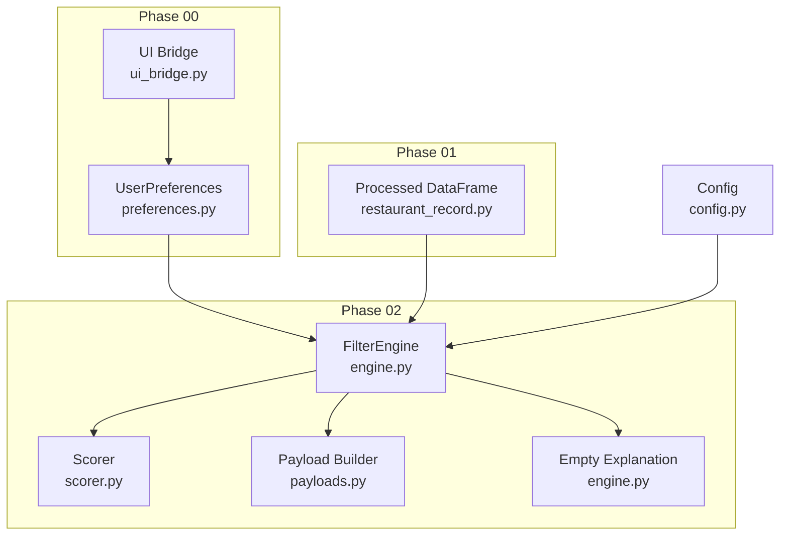
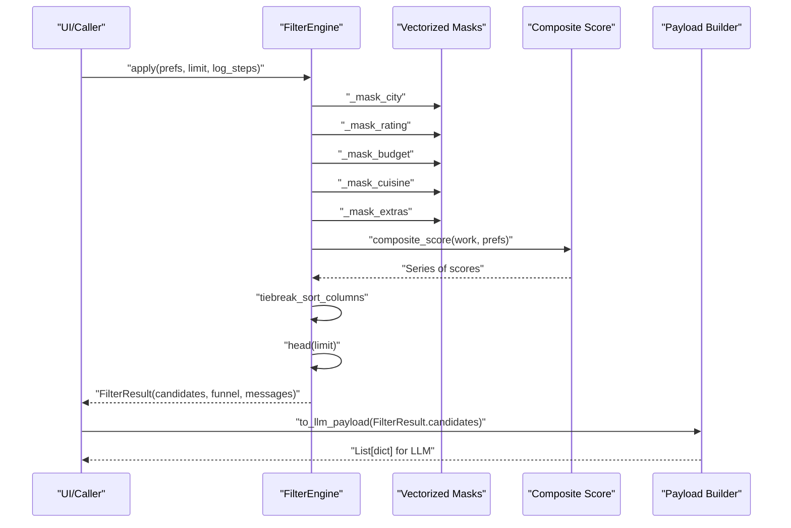
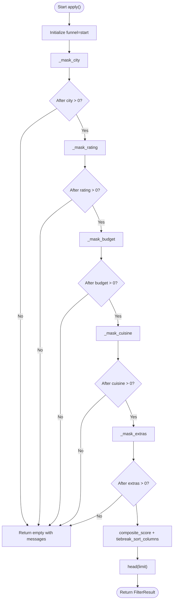
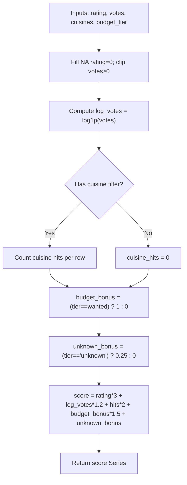
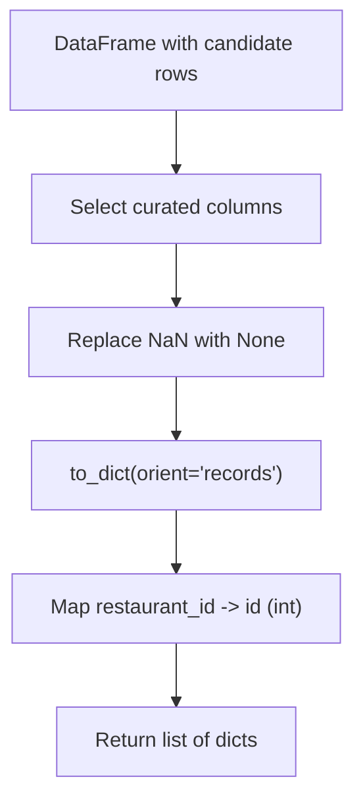
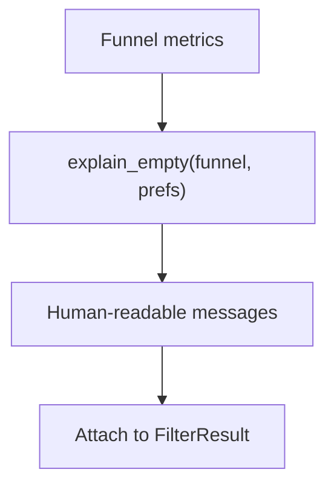
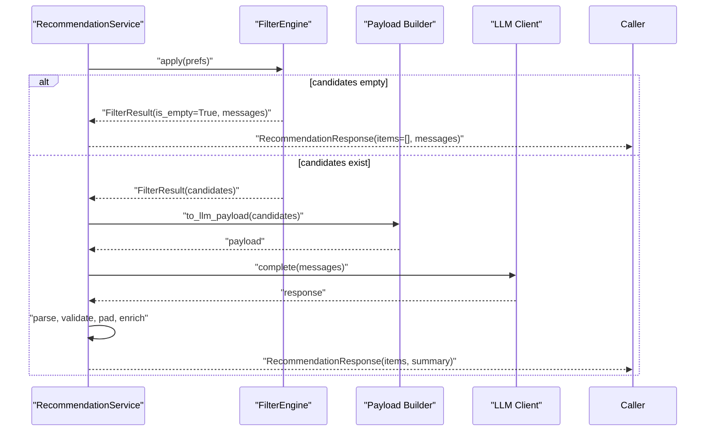
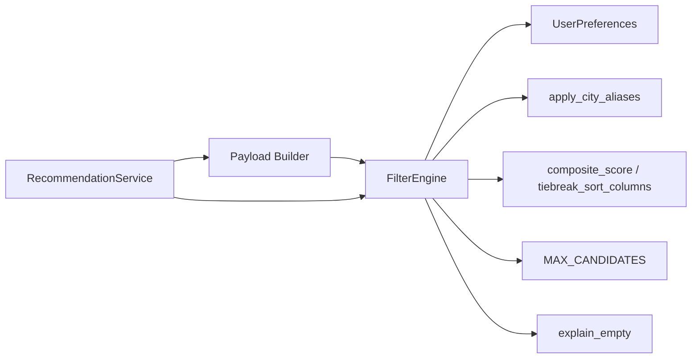
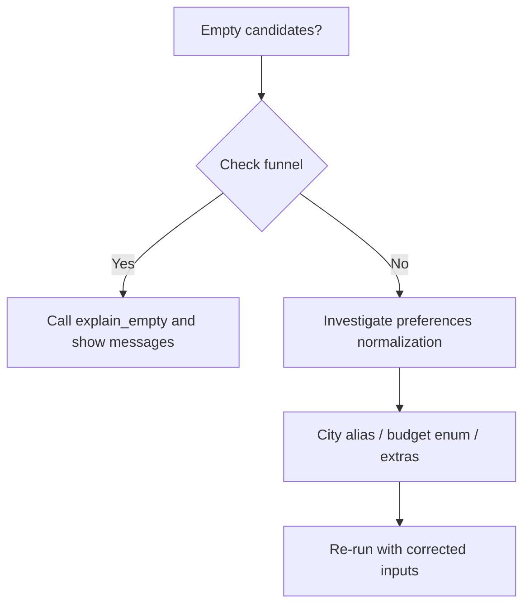

# Filtering Engine

<cite>
**Referenced Files in This Document**
- [engine.py](file://zomato-ai-recommendation/src/phases/phase02/engine.py)
- [scorer.py](file://zomato-ai-recommendation/src/phases/phase02/scorer.py)
- [payloads.py](file://zomato-ai-recommendation/src/phases/phase02/payloads.py)
- [__init__.py](file://zomato-ai-recommendation/src/filter/__init__.py)
- [preferences.py](file://zomato-ai-recommendation/src/phases/phase00/preferences.py)
- [ui_bridge.py](file://zomato-ai-recommendation/src/phases/phase00/ui_bridge.py)
- [config.py](file://zomato-ai-recommendation/src/config.py)
- [recommendation_service.py](file://zomato-ai-recommendation/src/services/recommendation_service.py)
- [try_filter.py](file://zomato-ai-recommendation/scripts/try_filter.py)
- [test_filter_engine.py](file://zomato-ai-recommendation/tests/test_filter_engine.py)
- [EDGE_CASES.md](file://zomato-ai-recommendation/docs/EDGE_CASES.md)
</cite>

## Table of Contents
1. [Introduction](#introduction)
2. [Project Structure](#project-structure)
3. [Core Components](#core-components)
4. [Architecture Overview](#architecture-overview)
5. [Detailed Component Analysis](#detailed-component-analysis)
6. [Dependency Analysis](#dependency-analysis)
7. [Performance Considerations](#performance-considerations)
8. [Troubleshooting Guide](#troubleshooting-guide)
9. [Conclusion](#conclusion)

## Introduction
This document describes the filtering engine for the Zomato AI Recommendation System. It explains the vectorized filtering pipeline built on pandas, the filter criteria (city matching, rating thresholds, budget constraints, and cuisine preferences), the composite scoring mechanism, the funnel metrics used to track candidate reduction, and the payload construction for LLM processing. It also covers empty-state handling, performance optimization techniques, memory management, and debugging approaches for filter operations.

## Project Structure
The filtering engine resides in Phase 02 and integrates with Phase 00 user preferences and Phase 01 processed data. The key modules are:
- FilterEngine: Applies vectorized filters and computes a pre-LLM score.
- Scoring: Computes a composite score and deterministic tiebreak ordering.
- Payloads: Constructs compact LLM-ready records.
- Preferences: Defines the canonical user preference model and normalization helpers.
- Service orchestration: Coordinates filtering and LLM ranking.

**Diagram sources**
- [engine.py:140-196](file://zomato-ai-recommendation/src/phases/phase02/engine.py#L140-L196)
- [scorer.py:29-69](file://zomato-ai-recommendation/src/phases/phase02/scorer.py#L29-L69)
- [payloads.py:27-44](file://zomato-ai-recommendation/src/phases/phase02/payloads.py#L27-L44)
- [preferences.py:20-71](file://zomato-ai-recommendation/src/phases/phase00/preferences.py#L20-L71)
- [ui_bridge.py:59-99](file://zomato-ai-recommendation/src/phases/phase00/ui_bridge.py#L59-L99)
- [config.py:40-47](file://zomato-ai-recommendation/src/config.py#L40-L47)

**Section sources**
- [engine.py:1-197](file://zomato-ai-recommendation/src/phases/phase02/engine.py#L1-L197)
- [scorer.py:1-70](file://zomato-ai-recommendation/src/phases/phase02/scorer.py#L1-L70)
- [payloads.py:1-44](file://zomato-ai-recommendation/src/phases/phase02/payloads.py#L1-L44)
- [preferences.py:1-71](file://zomato-ai-recommendation/src/phases/phase00/preferences.py#L1-L71)
- [ui_bridge.py:1-112](file://zomato-ai-recommendation/src/phases/phase00/ui_bridge.py#L1-L112)
- [config.py:1-50](file://zomato-ai-recommendation/src/config.py#L1-L50)

## Core Components
- FilterEngine: Applies vectorized masks for city, rating, budget, cuisine, and optional extras; tracks funnel sizes; computes composite score; sorts deterministically; limits to top candidates.
- Scorer: Computes a weighted composite score from rating, log(votes), cuisine hit count, and budget alignment; provides tiebreak sort columns.
- Payload builder: Produces a compact list of dictionaries for LLM consumption with stable IDs and None for missing values.
- Preferences: Strongly typed user preferences with normalization and coercion helpers.
- Empty-state explanation: Human-readable reasons derived from funnel metrics and preferences.

**Section sources**
- [engine.py:22-196](file://zomato-ai-recommendation/src/phases/phase02/engine.py#L22-L196)
- [scorer.py:15-69](file://zomato-ai-recommendation/src/phases/phase02/scorer.py#L15-L69)
- [payloads.py:9-44](file://zomato-ai-recommendation/src/phases/phase02/payloads.py#L9-L44)
- [preferences.py:20-71](file://zomato-ai-recommendation/src/phases/phase00/preferences.py#L20-L71)
- [ui_bridge.py:30-34](file://zomato-ai-recommendation/src/phases/phase00/ui_bridge.py#L30-L34)

## Architecture Overview
The filtering pipeline transforms a processed restaurant DataFrame into a shortlist for LLM ranking. It proceeds through a series of vectorized boolean masks, followed by a composite score and deterministic tiebreak sorting, then truncation to a maximum number of candidates.

**Diagram sources**
- [engine.py:146-189](file://zomato-ai-recommendation/src/phases/phase02/engine.py#L146-L189)
- [scorer.py:29-69](file://zomato-ai-recommendation/src/phases/phase02/scorer.py#L29-L69)
- [payloads.py:27-44](file://zomato-ai-recommendation/src/phases/phase02/payloads.py#L27-L44)

## Detailed Component Analysis

### FilterEngine
- Responsibilities:
  - Apply vectorized masks in sequence: city, rating, budget, cuisine, extras.
  - Track funnel metrics after each step.
  - Compute composite score and deterministic tiebreak ordering.
  - Limit to top candidates and return a FilterResult.
- Empty-state handling:
  - If the working set becomes empty, compute human-readable reasons via explain_empty using funnel metrics and preferences.
- Key methods and masks:
  - City mask: canonical city alias + case-insensitive equality and location substring match.
  - Rating mask: excludes rows with null rating when a positive minimum is set.
  - Budget mask: matches preferred tier or includes unknown-cost rows.
  - Cuisine mask: OR over user-selected cuisines; token overlap via substring containment.
  - Extras mask: family-friendly, quick-service, book-table toggles.
- Deterministic sorting:
  - Uses mergesort with a secondary sort on votes and name to stabilize ties.

**Diagram sources**
- [engine.py:146-189](file://zomato-ai-recommendation/src/phases/phase02/engine.py#L146-L189)

**Section sources**
- [engine.py:41-101](file://zomato-ai-recommendation/src/phases/phase02/engine.py#L41-L101)
- [engine.py:104-137](file://zomato-ai-recommendation/src/phases/phase02/engine.py#L104-L137)
- [engine.py:140-196](file://zomato-ai-recommendation/src/phases/phase02/engine.py#L140-L196)

### Scoring Mechanism
- Inputs:
  - rating: fills nulls with zero; used linearly.
  - votes: clipped to non-negative; log1p applied; used linearly.
  - cuisine_hits: count of user-selected cuisines matched in row tokens; used linearly.
  - budget_alignment: bonus for exact budget tier; small bonus for unknown tier.
- Weights:
  - Tuned constants for stable ordering prior to LLM; final ranking remains with LLM.
- Tiebreak:
  - Deterministic mergesort on score, then votes descending, then name ascending.

**Diagram sources**
- [scorer.py:29-59](file://zomato-ai-recommendation/src/phases/phase02/scorer.py#L29-L59)
- [scorer.py:62-69](file://zomato-ai-recommendation/src/phases/phase02/scorer.py#L62-L69)

**Section sources**
- [scorer.py:15-69](file://zomato-ai-recommendation/src/phases/phase02/scorer.py#L15-L69)

### Payload Construction for LLM
- Purpose: produce a compact, JSON-safe list of records for LLM prompts.
- Columns: curated subset of fields that aid ranking and explanation.
- Transformations:
  - Select only present columns.
  - Replace NaN with None to avoid JSON serialization issues.
  - Add a stable integer id derived from restaurant_id.

**Diagram sources**
- [payloads.py:27-44](file://zomato-ai-recommendation/src/phases/phase02/payloads.py#L27-L44)

**Section sources**
- [payloads.py:9-44](file://zomato-ai-recommendation/src/phases/phase02/payloads.py#L9-L44)

### Filter Criteria and Normalization
- City matching:
  - Canonical alias normalization via ui_bridge.
  - Exact city equality plus location substring match for neighborhood broadening.
- Rating threshold:
  - Positive minimum excludes rows with null rating.
- Budget constraints:
  - Matches preferred tier; unknown-cost rows included to avoid silent exclusions.
- Cuisine preferences:
  - Optional filter; OR over user-selected cuisines; token-level overlap via substring containment.
- Extras toggles:
  - Family-friendly: casual dining/family/cafe OR votes threshold.
  - Quick service: quick bites category OR online_order yes.
  - Book table: book_table yes.

**Section sources**
- [engine.py:41-101](file://zomato-ai-recommendation/src/phases/phase02/engine.py#L41-L101)
- [ui_bridge.py:30-34](file://zomato-ai-recommendation/src/phases/phase00/ui_bridge.py#L30-L34)
- [preferences.py:20-71](file://zomato-ai-recommendation/src/phases/phase00/preferences.py#L20-L71)

### Funnel Metrics and Empty-State Handling
- Funnel metrics:
  - Counts after each filter stage: start, after_city, after_rating, after_budget, after_cuisine, after_extras.
- Empty-state explanation:
  - Generates actionable messages based on funnel transitions and preferences.
  - Guides users to relax constraints or fix input issues.

**Diagram sources**
- [engine.py:104-137](file://zomato-ai-recommendation/src/phases/phase02/engine.py#L104-L137)

**Section sources**
- [engine.py:104-137](file://zomato-ai-recommendation/src/phases/phase02/engine.py#L104-L137)

### Orchestration with RecommendationService
- The service coordinates filtering and LLM ranking:
  - Calls FilterEngine.apply to obtain candidates.
  - Returns early with empty results and messages if candidates are empty.
  - Builds LLM payload and prompt, calls LLM, parses JSON, validates names, pads if needed, and enriches with ground-truth fields.
  - Falls back to structured scorer-based ranking if LLM is unavailable or fails.

**Diagram sources**
- [recommendation_service.py:37-131](file://zomato-ai-recommendation/src/services/recommendation_service.py#L37-L131)
- [engine.py:146-189](file://zomato-ai-recommendation/src/phases/phase02/engine.py#L146-L189)
- [payloads.py:27-44](file://zomato-ai-recommendation/src/phases/phase02/payloads.py#L27-L44)

**Section sources**
- [recommendation_service.py:30-200](file://zomato-ai-recommendation/src/services/recommendation_service.py#L30-L200)

## Dependency Analysis
- FilterEngine depends on:
  - UserPreferences for filter criteria.
  - City alias normalization from ui_bridge.
  - Composite scoring and tiebreak utilities from scorer.
  - Configuration for MAX_CANDIDATES.
- Payload builder depends on curated column set and pandas operations.
- RecommendationService composes FilterEngine and payload builder, and orchestrates LLM calls.

**Diagram sources**
- [engine.py:14-18](file://zomato-ai-recommendation/src/phases/phase02/engine.py#L14-L18)
- [scorer.py:12-12](file://zomato-ai-recommendation/src/phases/phase02/scorer.py#L12-L12)
- [config.py:40-41](file://zomato-ai-recommendation/src/config.py#L40-L41)
- [recommendation_service.py:9-17](file://zomato-ai-recommendation/src/services/recommendation_service.py#L9-L17)

**Section sources**
- [engine.py:14-18](file://zomato-ai-recommendation/src/phases/phase02/engine.py#L14-L18)
- [scorer.py:12-12](file://zomato-ai-recommendation/src/phases/phase02/scorer.py#L12-L12)
- [config.py:40-41](file://zomato-ai-recommendation/src/config.py#L40-L41)
- [recommendation_service.py:9-17](file://zomato-ai-recommendation/src/services/recommendation_service.py#L9-L17)

## Performance Considerations
- Vectorization:
  - All filters operate on pandas Series/DataFrame via vectorized string operations and boolean indexing.
- Memory management:
  - Keep only necessary columns in the processed cache; avoid heavy text columns to prevent memory blowups.
  - Drop transient score column after sorting to reduce peak memory.
- Throughput:
  - Tests demonstrate sub-200 ms latency for ~8k synthetic rows; ensure warm caches and efficient string operations.
- Candidate cap:
  - Always cap to MAX_CANDIDATES to control LLM prompt size and cost.

**Section sources**
- [test_filter_engine.py:167-184](file://zomato-ai-recommendation/tests/test_filter_engine.py#L167-L184)
- [engine.py:183-187](file://zomato-ai-recommendation/src/phases/phase02/engine.py#L183-L187)
- [config.py:40-41](file://zomato-ai-recommendation/src/config.py#L40-L41)
- [EDGE_CASES.md:24-24](file://zomato-ai-recommendation/docs/EDGE_CASES.md#L24-L24)

## Troubleshooting Guide
- Empty results:
  - Use explain_empty to diagnose whether the issue is city miss, rating floor, budget mismatch, cuisine overlap, or extras toggles.
- Validation and normalization:
  - Ensure city aliases are applied; validate budget enum; coerce cuisines from UI inputs.
- Edge cases:
  - Null ratings excluded when min_rating > 0; unknown budget rows included to avoid silent loss.
  - Case-insensitive comparisons and token-level cuisine matching.
- Debugging:
  - Enable funnel logging in FilterEngine.apply to inspect counts at each stage.
  - Use CLI script to run a smoke test with a cache file and inspect funnel and payload.

**Diagram sources**
- [engine.py:104-137](file://zomato-ai-recommendation/src/phases/phase02/engine.py#L104-L137)
- [ui_bridge.py:30-34](file://zomato-ai-recommendation/src/phases/phase00/ui_bridge.py#L30-L34)
- [preferences.py:36-56](file://zomato-ai-recommendation/src/phases/phase00/preferences.py#L36-L56)

**Section sources**
- [engine.py:104-137](file://zomato-ai-recommendation/src/phases/phase02/engine.py#L104-L137)
- [ui_bridge.py:30-34](file://zomato-ai-recommendation/src/phases/phase00/ui_bridge.py#L30-L34)
- [preferences.py:36-56](file://zomato-ai-recommendation/src/phases/phase00/preferences.py#L36-L56)
- [try_filter.py:22-78](file://zomato-ai-recommendation/scripts/try_filter.py#L22-L78)

## Conclusion
The filtering engine applies a fast, vectorized pipeline to reduce the candidate set to a manageable shortlist for LLM ranking. It uses explicit funnel metrics, deterministic scoring, and robust empty-state diagnostics. Together with careful payload construction and performance-conscious design, it ensures reliable, interpretable recommendations at scale.