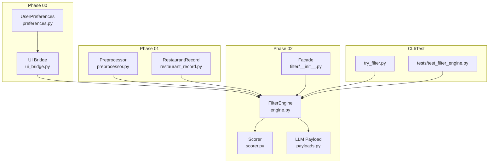
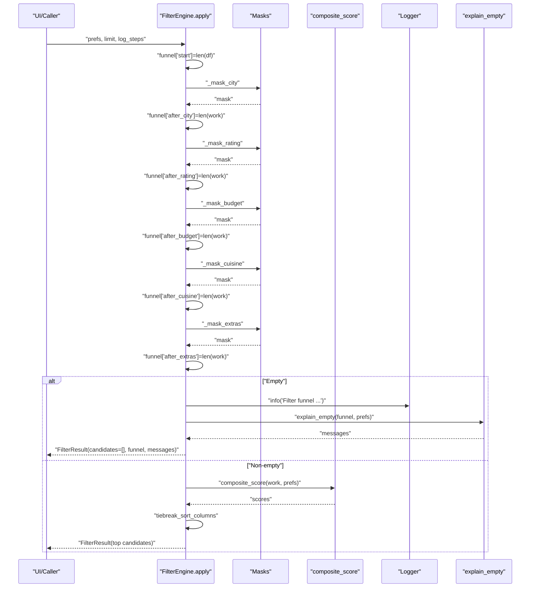
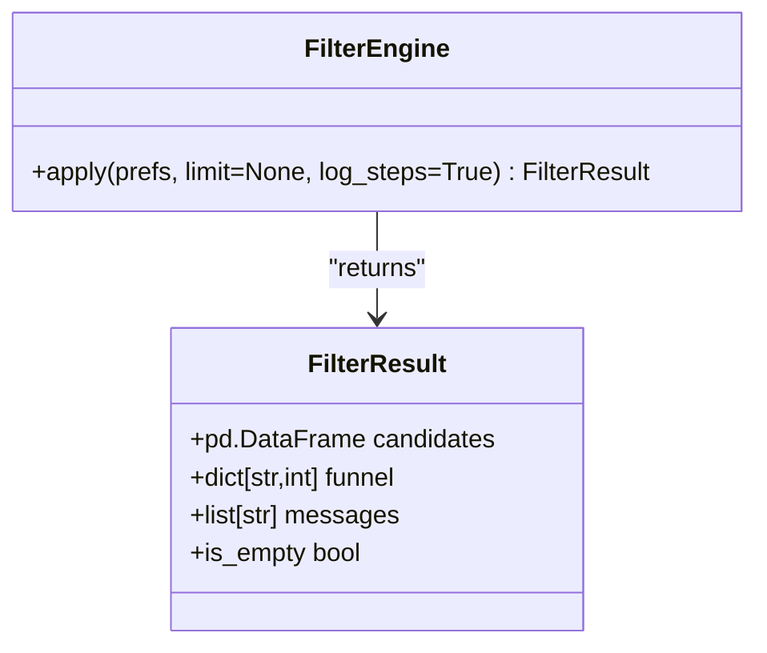
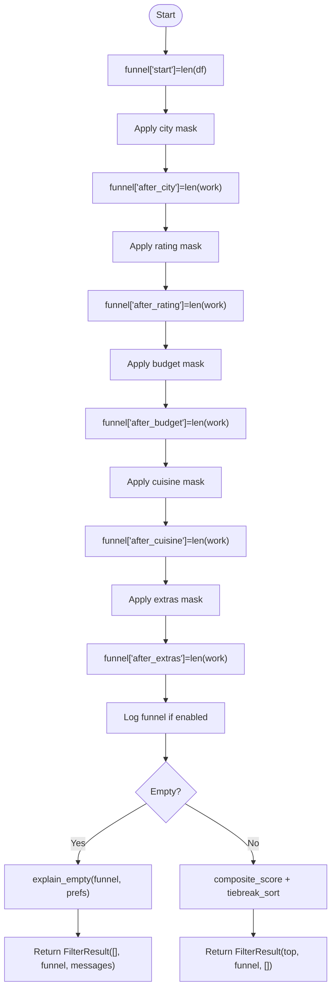
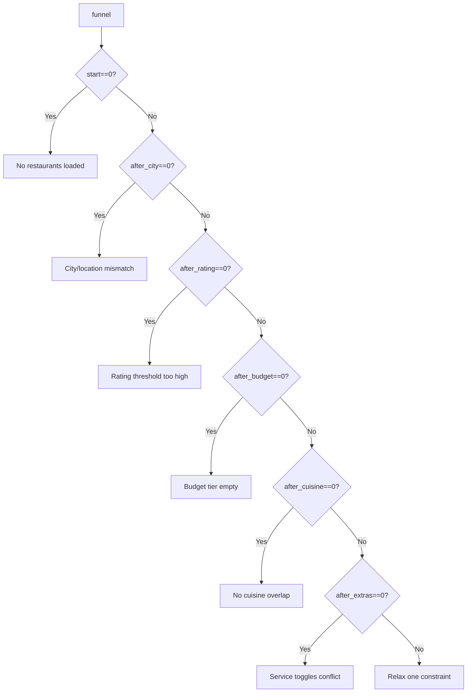
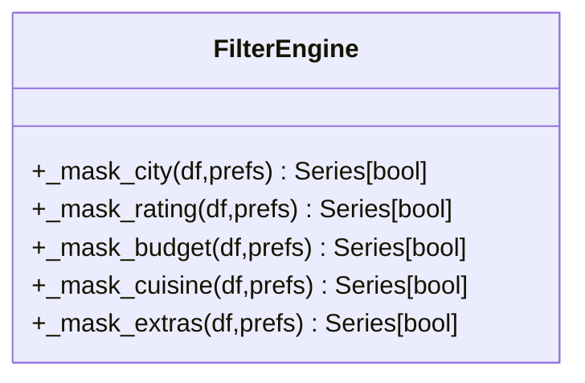
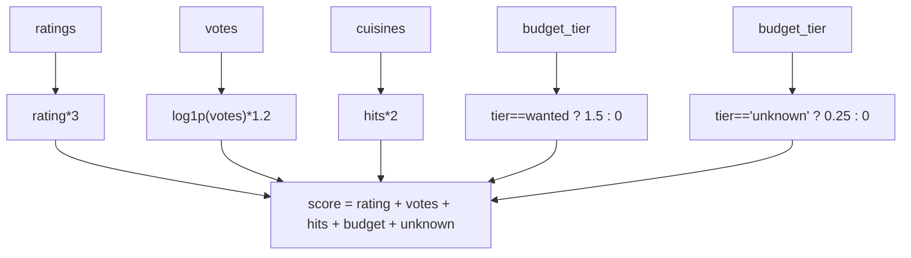
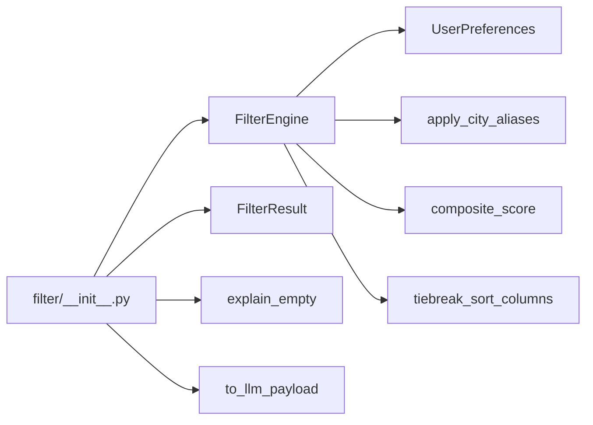

# Funnel Metrics and Empty State Handling

<cite>
**Referenced Files in This Document**
- [README.md](file://README.md)
- [docs/EDGE_CASES.md](file://docs/EDGE_CASES.md)
- [src/filter/__init__.py](file://src/filter/__init__.py)
- [src/phases/phase00/preferences.py](file://src/phases/phase00/preferences.py)
- [src/phases/phase00/ui_bridge.py](file://src/phases/phase00/ui_bridge.py)
- [src/phases/phase01/preprocessor.py](file://src/phases/phase01/preprocessor.py)
- [src/phases/phase01/restaurant_record.py](file://src/phases/phase01/restaurant_record.py)
- [src/phases/phase02/engine.py](file://src/phases/phase02/engine.py)
- [src/phases/phase02/scorer.py](file://src/phases/phase02/scorer.py)
- [src/phases/phase02/payloads.py](file://src/phases/phase02/payloads.py)
- [scripts/try_filter.py](file://scripts/try_filter.py)
- [tests/test_filter_engine.py](file://tests/test_filter_engine.py)
</cite>

## Table of Contents
1. [Introduction](#introduction)
2. [Project Structure](#project-structure)
3. [Core Components](#core-components)
4. [Architecture Overview](#architecture-overview)
5. [Detailed Component Analysis](#detailed-component-analysis)
6. [Dependency Analysis](#dependency-analysis)
7. [Performance Considerations](#performance-considerations)
8. [Troubleshooting Guide](#troubleshooting-guide)
9. [Conclusion](#conclusion)
10. [Appendices](#appendices)

## Introduction
This document explains the filter funnel metrics system and empty state handling used to transform raw restaurant data into a shortlist for downstream LLM ranking. It covers:
- How the funnel tracks candidate reduction at each filtering stage
- The funnel dictionary structure and logging mechanisms
- The explain_empty function that generates human-readable reasons for empty results
- Debugging and troubleshooting approaches for filter pipeline failures
- Examples of funnel outputs for different preference combinations and how to interpret them

The system is implemented in Phase 02 and exposed via a compatibility facade in the filter package.

## Project Structure
The filtering pipeline spans several phases:
- Phase 00: User preference models and UI bridge
- Phase 01: Preprocessing and caching of normalized restaurant data
- Phase 02: Structured filtering, scoring, and LLM payload shaping

**Diagram sources**
- [src/phases/phase00/preferences.py:1-71](file://src/phases/phase00/preferences.py#L1-L71)
- [src/phases/phase00/ui_bridge.py:1-112](file://src/phases/phase00/ui_bridge.py#L1-L112)
- [src/phases/phase01/preprocessor.py:1-232](file://src/phases/phase01/preprocessor.py#L1-L232)
- [src/phases/phase01/restaurant_record.py:1-30](file://src/phases/phase01/restaurant_record.py#L1-L30)
- [src/phases/phase02/engine.py:1-197](file://src/phases/phase02/engine.py#L1-L197)
- [src/phases/phase02/scorer.py:1-70](file://src/phases/phase02/scorer.py#L1-L70)
- [src/phases/phase02/payloads.py:1-44](file://src/phases/phase02/payloads.py#L1-L44)
- [src/filter/__init__.py:1-18](file://src/filter/__init__.py#L1-L18)
- [scripts/try_filter.py:1-78](file://scripts/try_filter.py#L1-L78)
- [tests/test_filter_engine.py:1-185](file://tests/test_filter_engine.py#L1-L185)

**Section sources**
- [README.md:14-39](file://README.md#L14-L39)
- [src/filter/__init__.py:1-18](file://src/filter/__init__.py#L1-L18)

## Core Components
- FilterEngine: Applies vectorized filters in sequence, records counts at each stage, and computes a pre-LLM score.
- FilterResult: Holds the final candidates, funnel metrics, and optional messages.
- explain_empty: Generates human-readable reasons when the funnel yields zero candidates.
- Scorer: Computes a composite score and deterministic tiebreak ordering.
- to_llm_payload: Shapes the final shortlist into a compact list of dicts for the LLM.

Key responsibilities:
- Track candidate reduction across stages: start → after_city → after_rating → after_budget → after_cuisine → after_extras
- Log funnel metrics and preferences for observability
- Provide actionable messages when no candidates remain

**Section sources**
- [src/phases/phase02/engine.py:22-33](file://src/phases/phase02/engine.py#L22-L33)
- [src/phases/phase02/engine.py:104-137](file://src/phases/phase02/engine.py#L104-L137)
- [src/phases/phase02/engine.py:140-196](file://src/phases/phase02/engine.py#L140-L196)
- [src/phases/phase02/scorer.py:29-69](file://src/phases/phase02/scorer.py#L29-L69)
- [src/phases/phase02/payloads.py:27-43](file://src/phases/phase02/payloads.py#L27-L43)

## Architecture Overview
The filtering pipeline applies masks in order, updating the funnel dictionary with candidate counts at each step. If the result is empty, explain_empty produces messages tailored to the last successful stage.

**Diagram sources**
- [src/phases/phase02/engine.py:146-189](file://src/phases/phase02/engine.py#L146-L189)
- [src/phases/phase02/engine.py:104-137](file://src/phases/phase02/engine.py#L104-L137)
- [src/phases/phase02/scorer.py:29-69](file://src/phases/phase02/scorer.py#L29-L69)

## Detailed Component Analysis

### FilterEngine and FilterResult
- FilterEngine.apply initializes funnel with the starting count, applies masks in sequence, updates funnel counts, logs the funnel when enabled, and either returns empty results with messages or proceeds to scoring and sorting.
- FilterResult encapsulates the final DataFrame, funnel metrics, and optional messages. It exposes is_empty for convenience.

**Diagram sources**
- [src/phases/phase02/engine.py:140-196](file://src/phases/phase02/engine.py#L140-L196)
- [src/phases/phase02/engine.py:22-33](file://src/phases/phase02/engine.py#L22-L33)

**Section sources**
- [src/phases/phase02/engine.py:146-189](file://src/phases/phase02/engine.py#L146-L189)
- [src/phases/phase02/engine.py:22-33](file://src/phases/phase02/engine.py#L22-L33)

### Funnel Dictionary Structure and Logging
- funnel keys:
  - "start": initial candidate count
  - "after_city": count after city/rating filter
  - "after_rating": count after rating filter
  - "after_budget": count after budget filter
  - "after_cuisine": count after cuisine filter
  - "after_extras": count after extras filter
- Logging: When log_steps is True, the engine logs the funnel and preferences for debugging.

**Diagram sources**
- [src/phases/phase02/engine.py:155-189](file://src/phases/phase02/engine.py#L155-L189)

**Section sources**
- [src/phases/phase02/engine.py:155-189](file://src/phases/phase02/engine.py#L155-L189)

### explain_empty: Human-Readable Reasons
The function inspects funnel counts to determine the first stage that eliminated candidates and returns actionable messages:
- If start is zero: indicates cache/load issue
- If after_city is zero: city/location mismatch
- If after_rating is zero: rating threshold too high
- If after_budget is zero: budget tier with no matches (unknown-cost rows allowed)
- If after_cuisine is zero: no cuisine overlap
- If after_extras is zero: service toggle conflicts
- Otherwise: general advice to relax constraints

**Diagram sources**
- [src/phases/phase02/engine.py:104-137](file://src/phases/phase02/engine.py#L104-L137)

**Section sources**
- [src/phases/phase02/engine.py:104-137](file://src/phases/phase02/engine.py#L104-L137)

### Masks and Candidate Reduction
- City: Matches canonical city or location substring; broadens coverage for MVP
- Rating: Drops rows with None ratings when min_rating > 0
- Budget: Matches budget tier or allows "unknown" rows
- Cuisine: OR over user-selected cuisines; empty filter skipped
- Extras: Family-friendly, quick service, book table toggles combined with logical constraints

**Diagram sources**
- [src/phases/phase02/engine.py:41-101](file://src/phases/phase02/engine.py#L41-L101)

**Section sources**
- [src/phases/phase02/engine.py:41-101](file://src/phases/phase02/engine.py#L41-L101)

### Scoring and Deterministic Ordering
- composite_score builds a vectorized score combining rating, log(votes), cuisine hit count, and budget alignment (with bonus for unknown)
- tiebreak_sort_columns ensures deterministic ordering on ties

**Diagram sources**
- [src/phases/phase02/scorer.py:29-59](file://src/phases/phase02/scorer.py#L29-L59)

**Section sources**
- [src/phases/phase02/scorer.py:29-69](file://src/phases/phase02/scorer.py#L29-L69)

### LLM Payload Shaping
- to_llm_payload keeps a stable subset of columns, converts NaN to None, and adds a stable id field

**Section sources**
- [src/phases/phase02/payloads.py:27-43](file://src/phases/phase02/payloads.py#L27-L43)

## Dependency Analysis
- FilterEngine depends on:
  - UserPreferences for filtering criteria
  - apply_city_aliases for city normalization
  - composite_score and tiebreak_sort_columns for pre-LLM ordering
- Facade re-exports FilterEngine, FilterResult, composite_score, explain_empty, and to_llm_payload for external consumers

**Diagram sources**
- [src/phases/phase02/engine.py:143-196](file://src/phases/phase02/engine.py#L143-L196)
- [src/phases/phase00/ui_bridge.py:30-33](file://src/phases/phase00/ui_bridge.py#L30-L33)
- [src/phases/phase02/scorer.py:29-69](file://src/phases/phase02/scorer.py#L29-L69)
- [src/filter/__init__.py:3-17](file://src/filter/__init__.py#L3-L17)

**Section sources**
- [src/filter/__init__.py:3-17](file://src/filter/__init__.py#L3-L17)
- [src/phases/phase02/engine.py:143-196](file://src/phases/phase02/engine.py#L143-L196)

## Performance Considerations
- Vectorized masks ensure O(n) filtering over large datasets
- Early exit when candidates are empty avoids unnecessary scoring
- Limiting to MAX_CANDIDATES reduces LLM cost and latency
- Tests demonstrate sub-200 ms filtering on ~8k synthetic rows

**Section sources**
- [tests/test_filter_engine.py:167-184](file://tests/test_filter_engine.py#L167-L184)
- [src/phases/phase02/engine.py:152-153](file://src/phases/phase02/engine.py#L152-L153)

## Troubleshooting Guide
Common issues and remedies:
- Empty results due to city mismatch:
  - Symptom: after_city is zero
  - Action: Verify city spelling and aliasing; broaden location search
- Strict rating threshold:
  - Symptom: after_rating is zero
  - Action: Lower min_rating or select a larger city
- Budget tier boundary:
  - Symptom: after_budget is zero
  - Action: Try a different budget tier; unknown-cost rows are intentionally allowed
- Cuisine conflicts:
  - Symptom: after_cuisine is zero
  - Action: Remove or relax cuisine selections; use broader terms
- Service toggle conflicts:
  - Symptom: after_extras is zero
  - Action: Uncheck conflicting toggles (e.g., quick service with high-end dining)
- No cache loaded:
  - Symptom: start is zero
  - Action: Build cache using the provided script

Validation and debugging aids:
- CLI smoke test: run scripts/try_filter.py with desired preferences to inspect funnel and messages
- Unit tests: verify behavior for edge cases and empty states

**Section sources**
- [src/phases/phase02/engine.py:104-137](file://src/phases/phase02/engine.py#L104-L137)
- [scripts/try_filter.py:22-78](file://scripts/try_filter.py#L22-L78)
- [tests/test_filter_engine.py:128-149](file://tests/test_filter_engine.py#L128-L149)
- [docs/EDGE_CASES.md:49-62](file://docs/EDGE_CASES.md#L49-L62)

## Conclusion
The filter funnel provides a transparent, observable pipeline that reduces candidates through city, rating, budget, cuisine, and service toggles. When empty, explain_empty delivers precise, actionable guidance. The system’s vectorized design and early-exit strategy ensure efficient operation, while the LLM payload shaping prepares a compact, stable dataset for downstream ranking.

## Appendices

### Example Interpretations of Funnel Outputs
Below are typical scenarios and how to interpret funnel counts and messages:

- Scenario A: City mismatch
  - funnel: {"start": N, "after_city": 0, ...}
  - message: City/location mismatch
  - interpretation: Adjust city spelling or expand to nearby areas

- Scenario B: Rating threshold too strict
  - funnel: {"start": N, "after_city": M, "after_rating": 0, ...}
  - message: Rating threshold too high
  - interpretation: Lower min_rating or choose a city with more highly-rated restaurants

- Scenario C: Budget tier empty
  - funnel: {"start": N, "after_city": M, "after_rating": P, "after_budget": 0, ...}
  - message: Budget tier empty
  - interpretation: Switch to a different budget tier

- Scenario D: No cuisine overlap
  - funnel: {"start": N, "after_city": M, "after_rating": P, "after_budget": Q, "after_cuisine": 0, ...}
  - message: No cuisine overlap
  - interpretation: Relax cuisine selection or broaden categories

- Scenario E: Service toggle conflict
  - funnel: {"start": N, "after_city": M, "after_rating": P, "after_budget": Q, "after_cuisine": R, "after_extras": 0, ...}
  - message: Service toggles conflict
  - interpretation: Uncheck one or more toggles

- Scenario F: General relaxation needed
  - funnel: {"start": N, ..., "after_extras": 0}
  - message: Relax one constraint
  - interpretation: Ease any single filter to recover candidates

These interpretations align with explain_empty logic and are validated by tests.

**Section sources**
- [src/phases/phase02/engine.py:104-137](file://src/phases/phase02/engine.py#L104-L137)
- [tests/test_filter_engine.py:128-149](file://tests/test_filter_engine.py#L128-L149)