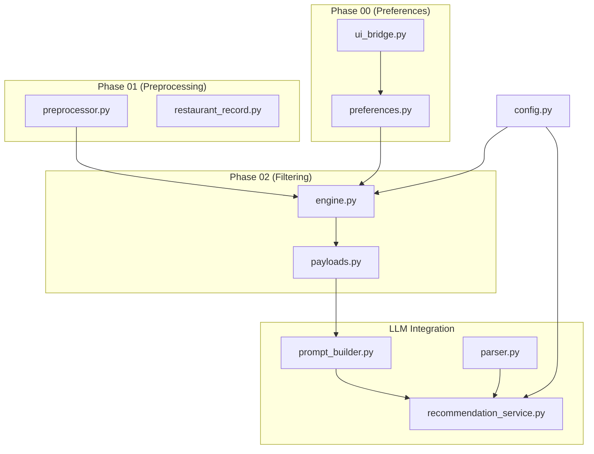
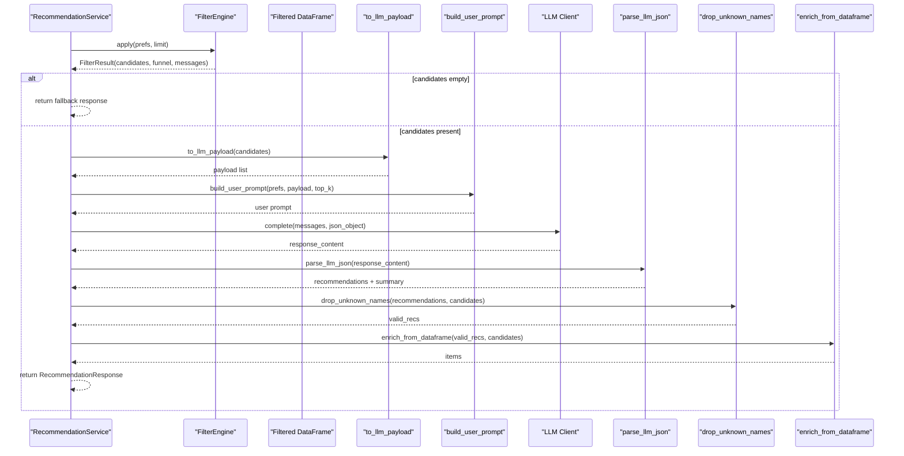
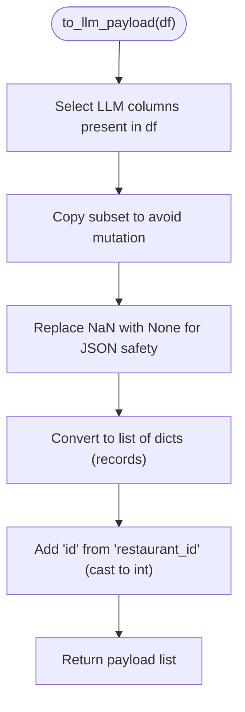
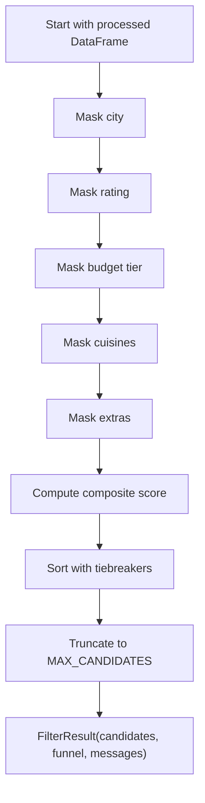
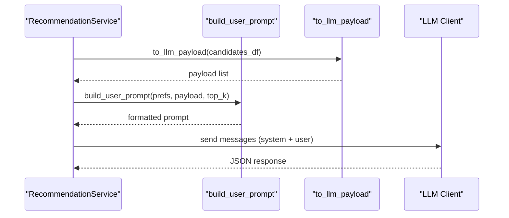
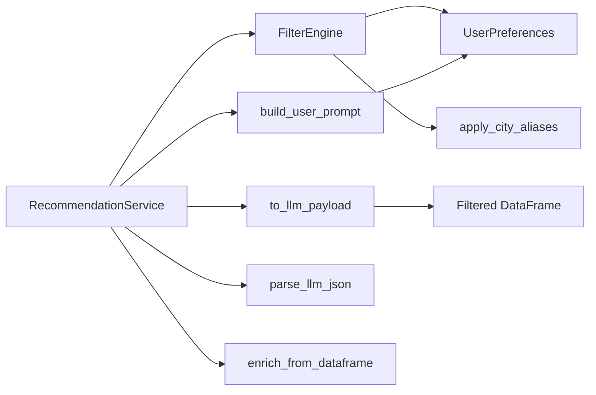

# Payload Construction for LLM

<cite>
**Referenced Files in This Document**
- [payloads.py](file://zomato-ai-recommendation/src/phases/phase02/payloads.py)
- [engine.py](file://zomato-ai-recommendation/src/phases/phase02/engine.py)
- [recommendation_service.py](file://zomato-ai-recommendation/src/services/recommendation_service.py)
- [prompt_builder.py](file://zomato-ai-recommendation/src/llm/prompt_builder.py)
- [parser.py](file://zomato-ai-recommendation/src/llm/parser.py)
- [preferences.py](file://zomato-ai-recommendation/src/phases/phase00/preferences.py)
- [ui_bridge.py](file://zomato-ai-recommendation/src/phases/phase00/ui_bridge.py)
- [preprocessor.py](file://zomato-ai-recommendation/src/phases/phase01/preprocessor.py)
- [restaurant_record.py](file://zomato-ai-recommendation/src/phases/phase01/restaurant_record.py)
- [config.py](file://zomato-ai-recommendation/src/config.py)
</cite>

## Table of Contents
1. [Introduction](#introduction)
2. [Project Structure](#project-structure)
3. [Core Components](#core-components)
4. [Architecture Overview](#architecture-overview)
5. [Detailed Component Analysis](#detailed-component-analysis)
6. [Dependency Analysis](#dependency-analysis)
7. [Performance Considerations](#performance-considerations)
8. [Troubleshooting Guide](#troubleshooting-guide)
9. [Conclusion](#conclusion)

## Introduction
This document explains the payload construction system that transforms filtered candidates into LLM-ready inputs. It covers the data transformation pipeline from FilterResult objects to compact restaurant records, including field selection, formatting rules, and data sanitization. It also documents the payload structure, formatting constraints, examples for different scenarios, and strategies for size optimization and performance at scale.

## Project Structure
The payload construction spans several phases:
- Phase 01: Preprocessing and normalization of raw data into a filter-ready schema.
- Phase 02: Filtering and scoring to produce a shortlist (FilterResult).
- Phase 02 payloads: Transformation of the shortlist into a compact list of dictionaries for the LLM.
- Phase 00 preferences: User preference models consumed by filtering and prompts.
- LLM integration: Prompt building, completion, parsing, and enrichment.

**Diagram sources**
- [preprocessor.py](file://zomato-ai-recommendation/src/phases/phase01/preprocessor.py)
- [restaurant_record.py](file://zomato-ai-recommendation/src/phases/phase01/restaurant_record.py)
- [engine.py](file://zomato-ai-recommendation/src/phases/phase02/engine.py)
- [payloads.py](file://zomato-ai-recommendation/src/phases/phase02/payloads.py)
- [preferences.py](file://zomato-ai-recommendation/src/phases/phase00/preferences.py)
- [ui_bridge.py](file://zomato-ai-recommendation/src/phases/phase00/ui_bridge.py)
- [recommendation_service.py](file://zomato-ai-recommendation/src/services/recommendation_service.py)
- [prompt_builder.py](file://zomato-ai-recommendation/src/llm/prompt_builder.py)
- [parser.py](file://zomato-ai-recommendation/src/llm/parser.py)
- [config.py](file://zomato-ai-recommendation/src/config.py)

**Section sources**
- [engine.py](file://zomato-ai-recommendation/src/phases/phase02/engine.py)
- [payloads.py](file://zomato-ai-recommendation/src/phases/phase02/payloads.py)
- [recommendation_service.py](file://zomato-ai-recommendation/src/services/recommendation_service.py)
- [preferences.py](file://zomato-ai-recommendation/src/phases/phase00/preferences.py)
- [ui_bridge.py](file://zomato-ai-recommendation/src/phases/phase00/ui_bridge.py)
- [preprocessor.py](file://zomato-ai-recommendation/src/phases/phase01/preprocessor.py)
- [restaurant_record.py](file://zomato-ai-recommendation/src/phases/phase01/restaurant_record.py)
- [config.py](file://zomato-ai-recommendation/src/config.py)

## Core Components
- FilterResult: Holds the filtered DataFrame, funnel statistics, and messages for empty results.
- to_llm_payload: Produces a compact list of dictionaries from a filtered DataFrame, ensuring stable IDs and safe null handling for JSON serialization.
- build_user_prompt: Constructs the LLM user prompt by selecting a subset of fields from the payload and embedding user preferences.
- RecommendationService: Orchestrates filtering, payload creation, LLM invocation, parsing, validation, and enrichment.

Key transformations:
- Column selection: Only the most relevant fields are retained for LLM consumption.
- Null handling: NaN values are converted to None to ensure JSON-safe serialization.
- ID normalization: The restaurant_id becomes the "id" field in the payload for stable identification.

**Section sources**
- [engine.py](file://zomato-ai-recommendation/src/phases/phase02/engine.py)
- [payloads.py](file://zomato-ai-recommendation/src/phases/phase02/payloads.py)
- [recommendation_service.py](file://zomato-ai-recommendation/src/services/recommendation_service.py)
- [prompt_builder.py](file://zomato-ai-recommendation/src/llm/prompt_builder.py)

## Architecture Overview
The payload construction pipeline follows a strict sequence: filtering produces candidates, which are transformed into a compact payload, embedded into a user prompt, sent to the LLM, parsed, validated, and finally enriched with ground-truth data.

**Diagram sources**
- [recommendation_service.py](file://zomato-ai-recommendation/src/services/recommendation_service.py)
- [engine.py](file://zomato-ai-recommendation/src/phases/phase02/engine.py)
- [payloads.py](file://zomato-ai-recommendation/src/phases/phase02/payloads.py)
- [prompt_builder.py](file://zomato-ai-recommendation/src/llm/prompt_builder.py)
- [parser.py](file://zomato-ai-recommendation/src/llm/parser.py)

## Detailed Component Analysis

### Payload Construction: to_llm_payload
Purpose:
- Convert a filtered DataFrame into a compact list of dictionaries suitable for LLM prompts.
- Ensure JSON-safe representation by replacing NaN with None.
- Normalize the "id" field to restaurant_id for stable identification.

Processing logic:
- Select only the columns defined in the LLM column set that exist in the DataFrame.
- Copy the subset and replace NaN with None.
- Convert to records and add an "id" field derived from "restaurant_id".

**Diagram sources**
- [payloads.py](file://zomato-ai-recommendation/src/phases/phase02/payloads.py)

**Section sources**
- [payloads.py](file://zomato-ai-recommendation/src/phases/phase02/payloads.py)

### FilterResult and Shortlist Generation
FilterEngine applies vectorized masks for city, rating, budget tier, cuisines, and extras, then computes composite scores and sorts with tiebreakers. The resulting DataFrame is truncated to a configured maximum and wrapped in FilterResult.

Highlights:
- City matching supports both exact city and location substring matches.
- Budget tier includes "unknown" to prevent silent exclusion of rows with missing cost.
- Extras toggles support family-friendly, quick-service, and table booking.
- Scoring and sorting occur before truncation to ensure top candidates.

**Diagram sources**
- [engine.py](file://zomato-ai-recommendation/src/phases/phase02/engine.py)
- [config.py](file://zomato-ai-recommendation/src/config.py)

**Section sources**
- [engine.py](file://zomato-ai-recommendation/src/phases/phase02/engine.py)
- [config.py](file://zomato-ai-recommendation/src/config.py)

### Prompt Building and Formatting Constraints
The user prompt embeds:
- UserPreferences: city, budget tier, cuisines, min_rating, extras toggles, and optional additional_notes.
- Candidate subset: A curated list of fields to minimize token usage while preserving relevance.

Formatting rules:
- Strict JSON schema expectation with system instructions.
- Only names present in the candidate list are accepted; hallucinations are dropped.
- Enrichment overwrites fields with ground truth values from the DataFrame.

**Diagram sources**
- [recommendation_service.py](file://zomato-ai-recommendation/src/services/recommendation_service.py)
- [prompt_builder.py](file://zomato-ai-recommendation/src/llm/prompt_builder.py)
- [payloads.py](file://zomato-ai-recommendation/src/phases/phase02/payloads.py)

**Section sources**
- [prompt_builder.py](file://zomato-ai-recommendation/src/llm/prompt_builder.py)
- [parser.py](file://zomato-ai-recommendation/src/llm/parser.py)
- [recommendation_service.py](file://zomato-ai-recommendation/src/services/recommendation_service.py)

### Data Sanitization and Validation
- Null handling: to_llm_payload replaces NaN with None for JSON safety.
- Name validation: drop_unknown_names ensures recommendations reference only candidates.
- Enrichment: enrich_from_dataframe overwrites fields with verified ground-truth values.
- Preference normalization: ui_bridge enforces budget choices and caps cuisines/additional_notes length.

**Section sources**
- [payloads.py](file://zomato-ai-recommendation/src/phases/phase02/payloads.py)
- [parser.py](file://zomato-ai-recommendation/src/llm/parser.py)
- [ui_bridge.py](file://zomato-ai-recommendation/src/phases/phase00/ui_bridge.py)

### Payload Structure and Field Selection
Fields included in the LLM payload:
- restaurant_id (mapped to id)
- name
- city
- location
- cuisines
- rating
- votes
- cost_for_two
- budget_tier
- rest_type
- online_order
- book_table
- dish_liked
- listed_in_type

These fields are selected to balance relevance and token efficiency. The prompt builder further narrows the candidate list to essential fields for the user prompt.

**Section sources**
- [payloads.py](file://zomato-ai-recommendation/src/phases/phase02/payloads.py)
- [prompt_builder.py](file://zomato-ai-recommendation/src/llm/prompt_builder.py)

### Examples of Payload Generation
- Scenario A: City and budget constraints yield a shortlist; to_llm_payload creates a compact record list with id and relevant fields.
- Scenario B: Cuisine filter reduces candidates; the payload retains only the selected subset for efficient prompting.
- Scenario C: Extras toggles (family-friendly, quick service, book_table) refine the shortlist; the payload preserves these attributes for context.

Note: The exact payload content is derived from the DataFrame and not hardcoded; refer to the code paths above for precise field mapping and transformations.

**Section sources**
- [engine.py](file://zomato-ai-recommendation/src/phases/phase02/engine.py)
- [payloads.py](file://zomato-ai-recommendation/src/phases/phase02/payloads.py)
- [recommendation_service.py](file://zomato-ai-recommendation/src/services/recommendation_service.py)

## Dependency Analysis
Key dependencies and contracts:
- RecommendationService depends on FilterEngine, to_llm_payload, build_user_prompt, and LLM parsing/enrichment utilities.
- FilterEngine depends on UserPreferences and city aliasing utilities.
- to_llm_payload depends on a fixed set of LLM columns and pandas DataFrame operations.
- Prompt builder depends on UserPreferences and constructs a constrained field subset for the LLM.

**Diagram sources**
- [recommendation_service.py](file://zomato-ai-recommendation/src/services/recommendation_service.py)
- [engine.py](file://zomato-ai-recommendation/src/phases/phase02/engine.py)
- [payloads.py](file://zomato-ai-recommendation/src/phases/phase02/payloads.py)
- [prompt_builder.py](file://zomato-ai-recommendation/src/llm/prompt_builder.py)
- [parser.py](file://zomato-ai-recommendation/src/llm/parser.py)
- [preferences.py](file://zomato-ai-recommendation/src/phases/phase00/preferences.py)
- [ui_bridge.py](file://zomato-ai-recommendation/src/phases/phase00/ui_bridge.py)

**Section sources**
- [recommendation_service.py](file://zomato-ai-recommendation/src/services/recommendation_service.py)
- [engine.py](file://zomato-ai-recommendation/src/phases/phase02/engine.py)
- [payloads.py](file://zomato-ai-recommendation/src/phases/phase02/payloads.py)
- [prompt_builder.py](file://zomato-ai-recommendation/src/llm/prompt_builder.py)
- [parser.py](file://zomato-ai-recommendation/src/llm/parser.py)
- [preferences.py](file://zomato-ai-recommendation/src/phases/phase00/preferences.py)
- [ui_bridge.py](file://zomato-ai-recommendation/src/phases/phase00/ui_bridge.py)

## Performance Considerations
- Candidate limit: MAX_CANDIDATES controls the maximum number of candidates passed to the LLM, reducing token usage and latency.
- Field pruning: to_llm_payload and prompt_builder restrict the payload to essential fields, minimizing prompt size.
- DataFrame operations: Vectorized filtering and sorting in FilterEngine avoid Python loops for large datasets.
- Memory efficiency: to_llm_payload copies only necessary columns and replaces NaN with None to avoid expensive conversions later.
- Fallback path: When the LLM API key is missing, RecommendationService uses structured scoring to avoid network overhead.

Optimization techniques:
- Reduce MAX_CANDIDATES for very large candidate sets to maintain prompt size within limits.
- Prefer exact cuisine matches and avoid overly broad filters to reduce candidate count early.
- Use city aliasing consistently to improve match quality and reduce false positives.

**Section sources**
- [config.py](file://zomato-ai-recommendation/src/config.py)
- [engine.py](file://zomato-ai-recommendation/src/phases/phase02/engine.py)
- [payloads.py](file://zomato-ai-recommendation/src/phases/phase02/payloads.py)
- [recommendation_service.py](file://zomato-ai-recommendation/src/services/recommendation_service.py)

## Troubleshooting Guide
Common issues and resolutions:
- Empty shortlist: explain_empty provides human-readable reasons (e.g., city/location mismatch, rating threshold, budget tier, cuisine overlap, extras toggles).
- LLM JSON parsing errors: parse_llm_json extracts JSON from potential markdown blocks and raises explicit errors for malformed responses.
- Hallucinated names: drop_unknown_names filters out recommendations whose names are not present in the candidate list.
- API key missing: RecommendationService falls back to structured scoring and returns a clear message.
- Excessive candidates: Adjust MAX_CANDIDATES or refine preferences to reduce payload size.

**Section sources**
- [engine.py](file://zomato-ai-recommendation/src/phases/phase02/engine.py)
- [parser.py](file://zomato-ai-recommendation/src/llm/parser.py)
- [recommendation_service.py](file://zomato-ai-recommendation/src/services/recommendation_service.py)
- [config.py](file://zomato-ai-recommendation/src/config.py)

## Conclusion
The payload construction system efficiently transforms filtered candidates into a compact, JSON-safe format optimized for LLM consumption. By combining precise field selection, robust sanitization, and strict validation, it ensures reliable, high-quality recommendations while maintaining performance and scalability. The modular design enables easy tuning of constraints and fallback strategies for production readiness.