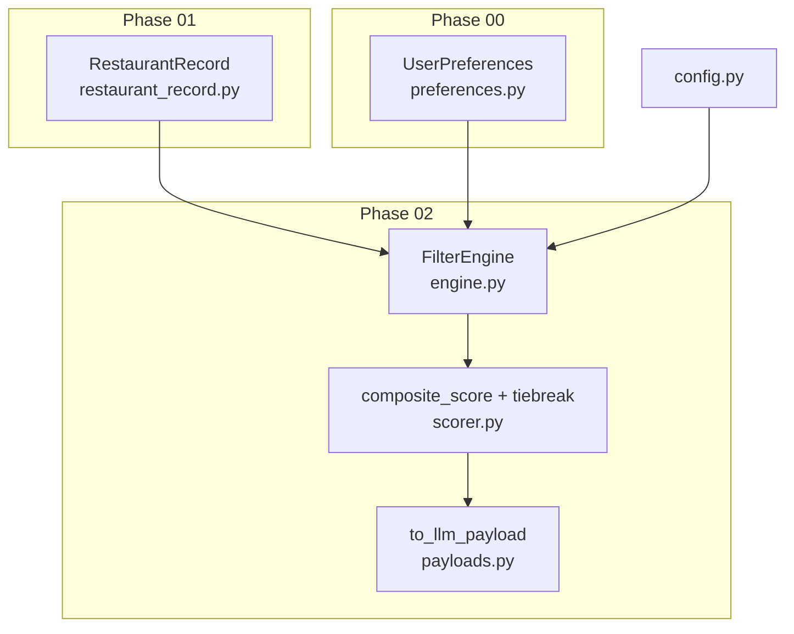
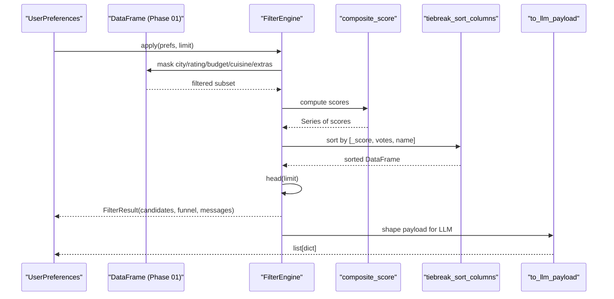
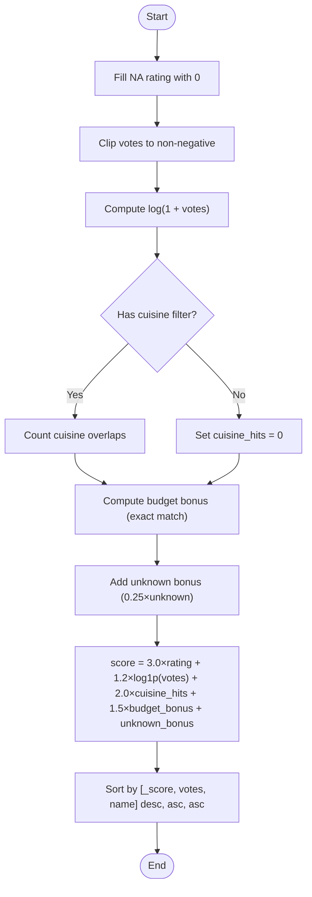
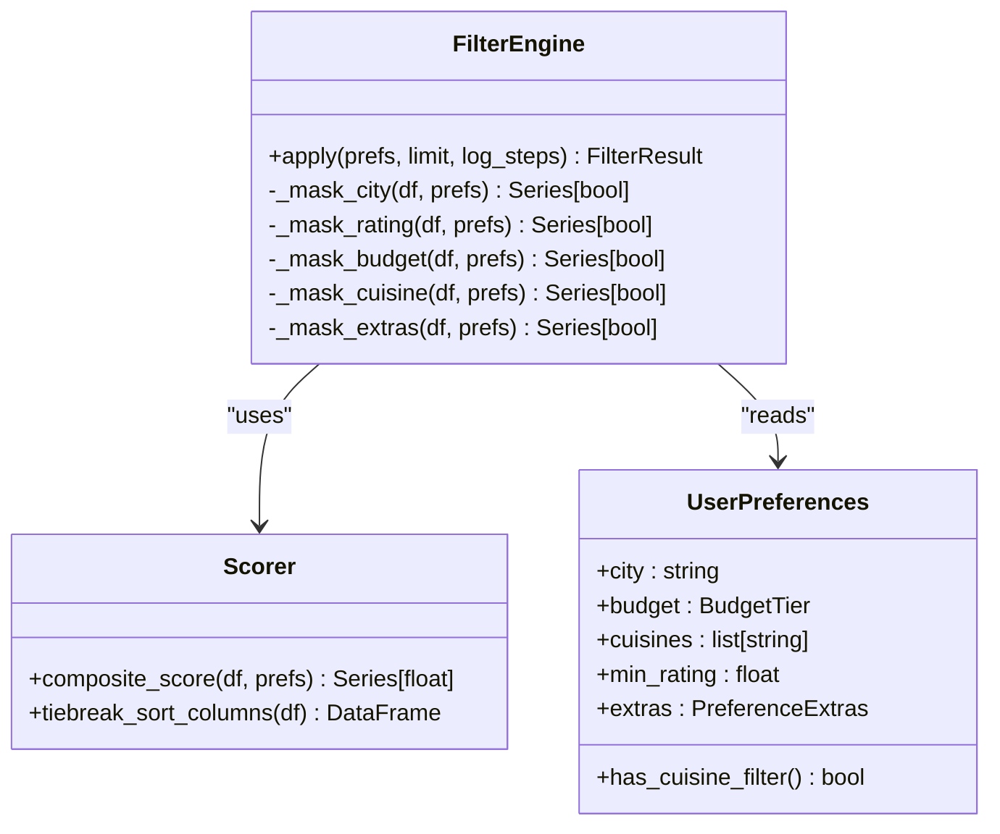
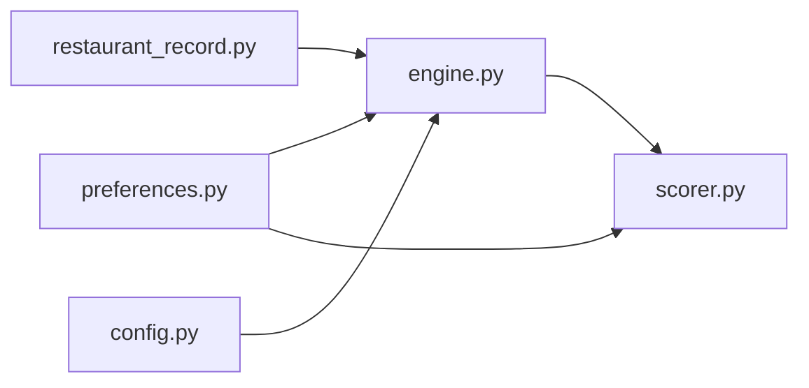
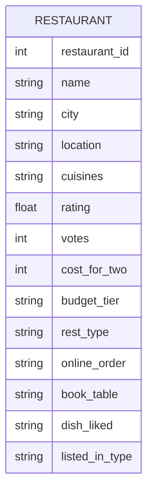

# Scoring Mechanism

<cite>
**Referenced Files in This Document**
- [scorer.py](file://zomato-ai-recommendation/src/phases/phase02/scorer.py)
- [engine.py](file://zomato-ai-recommendation/src/phases/phase02/engine.py)
- [preferences.py](file://zomato-ai-recommendation/src/phases/phase00/preferences.py)
- [restaurant_record.py](file://zomato-ai-recommendation/src/phases/phase01/restaurant_record.py)
- [payloads.py](file://zomato-ai-recommendation/src/phases/phase02/payloads.py)
- [config.py](file://zomato-ai-recommendation/src/config.py)
- [test_filter_engine.py](file://zomato-ai-recommendation/tests/test_filter_engine.py)
- [try_filter.py](file://zomato-ai-recommendation/scripts/try_filter.py)
- [EDGE_CASES.md](file://zomato-ai-recommendation/docs/EDGE_CASES.md)
</cite>

## Table of Contents
1. [Introduction](#introduction)
2. [Project Structure](#project-structure)
3. [Core Components](#core-components)
4. [Architecture Overview](#architecture-overview)
5. [Detailed Component Analysis](#detailed-component-analysis)
6. [Dependency Analysis](#dependency-analysis)
7. [Performance Considerations](#performance-considerations)
8. [Troubleshooting Guide](#troubleshooting-guide)
9. [Conclusion](#conclusion)
10. [Appendices](#appendices)

## Introduction
This document explains the composite scoring mechanism used in the filtering engine. It covers how multiple factors—rating, cost effectiveness (votes), popularity (votes), and preference alignment (cuisine overlap and budget tier)—are combined into a single pre-LLM ranking signal. It also documents tiebreak sorting, the mathematical formulation, weight assignments, normalization techniques, and practical examples. Finally, it outlines performance optimization strategies and memory management considerations for large datasets.

## Project Structure
The scoring logic resides in Phase 02 of the pipeline:
- Scoring and tiebreak logic: [scorer.py](file://zomato-ai-recommendation/src/phases/phase02/scorer.py)
- Filtering engine that applies filters, computes scores, and sorts: [engine.py](file://zomato-ai-recommendation/src/phases/phase02/engine.py)
- User preferences model: [preferences.py](file://zomato-ai-recommendation/src/phases/phase00/preferences.py)
- Restaurant record schema (input to Phase 02): [restaurant_record.py](file://zomato-ai-recommendation/src/phases/phase01/restaurant_record.py)
- LLM payload shaping: [payloads.py](file://zomato-ai-recommendation/src/phases/phase02/payloads.py)
- Global configuration (e.g., MAX_CANDIDATES): [config.py](file://zomato-ai-recommendation/src/config.py)
- Tests validating scoring and performance: [test_filter_engine.py](file://zomato-ai-recommendation/tests/test_filter_engine.py)
- CLI smoke test for filtering: [try_filter.py](file://zomato-ai-recommendation/scripts/try_filter.py)
- Edge cases and tiebreak behavior: [EDGE_CASES.md](file://zomato-ai-recommendation/docs/EDGE_CASES.md)

**Diagram sources**
- [engine.py:140-196](file://zomato-ai-recommendation/src/phases/phase02/engine.py#L140-L196)
- [scorer.py:29-69](file://zomato-ai-recommendation/src/phases/phase02/scorer.py#L29-L69)
- [preferences.py:20-71](file://zomato-ai-recommendation/src/phases/phase00/preferences.py#L20-L71)
- [restaurant_record.py:8-30](file://zomato-ai-recommendation/src/phases/phase01/restaurant_record.py#L8-L30)
- [payloads.py:27-44](file://zomato-ai-recommendation/src/phases/phase02/payloads.py#L27-L44)
- [config.py:40-41](file://zomato-ai-recommendation/src/config.py#L40-L41)

**Section sources**
- [engine.py:140-196](file://zomato-ai-recommendation/src/phases/phase02/engine.py#L140-L196)
- [scorer.py:29-69](file://zomato-ai-recommendation/src/phases/phase02/scorer.py#L29-L69)
- [preferences.py:20-71](file://zomato-ai-recommendation/src/phases/phase00/preferences.py#L20-L71)
- [restaurant_record.py:8-30](file://zomato-ai-recommendation/src/phases/phase01/restaurant_record.py#L8-L30)
- [payloads.py:27-44](file://zomato-ai-recommendation/src/phases/phase02/payloads.py#L27-L44)
- [config.py:40-41](file://zomato-ai-recommendation/src/config.py#L40-L41)

## Core Components
- Composite score function: Computes a pre-LLM ranking signal from rating, votes (log-transformed), cuisine overlap, and budget alignment.
- Tiebreak sorting: Deterministic secondary sorting when scores are equal.
- Filter engine: Applies city, rating, budget, cuisine, and extra filters; computes scores; sorts; caps candidates.

Key behaviors:
- Rating and votes are normalized to numeric types and clipped/filled as needed.
- Cuisine overlap is computed as the count of user-selected cuisines matched to the restaurant’s cuisines.
- Budget alignment adds a bonus when the restaurant’s tier matches the user’s budget; an additional small bonus is given for “unknown” budget tiers.
- Tiebreak order is deterministic: score desc, votes desc, name asc.

**Section sources**
- [scorer.py:29-69](file://zomato-ai-recommendation/src/phases/phase02/scorer.py#L29-L69)
- [engine.py:140-196](file://zomato-ai-recommendation/src/phases/phase02/engine.py#L140-L196)

## Architecture Overview
The filtering pipeline is vectorized and designed for speed. The engine:
1. Filters rows by city, rating, budget, cuisine, and extras.
2. Computes a composite score per row.
3. Sorts deterministically to break ties.
4. Caps the top candidates and prepares a compact payload for the LLM.

**Diagram sources**
- [engine.py:146-189](file://zomato-ai-recommendation/src/phases/phase02/engine.py#L146-L189)
- [scorer.py:29-69](file://zomato-ai-recommendation/src/phases/phase02/scorer.py#L29-L69)
- [payloads.py:27-44](file://zomato-ai-recommendation/src/phases/phase02/payloads.py#L27-L44)

## Detailed Component Analysis

### Composite Score Algorithm
The composite score is a weighted sum of four components:
- Rating: normalized to float; missing values treated as zero.
- Votes (log-transformed): votes are clipped to non-negative values, then transformed using log(1 + x) to reduce skew.
- Cuisine overlap: count of user-selected cuisines that match the restaurant’s cuisines (pipe-separated tokens).
- Budget alignment: binary indicator for exact budget tier match; an additional small bonus is given for “unknown” budget tiers.

Weights and formula:
- score = rating × 3.0 + log(1 + votes) × 1.2 + cuisine_hits × 2.0 + budget_bonus × 1.5 + unknown_bonus

Normalization and handling:
- Ratings are filled with zero for missing values.
- Votes are clipped to non-negative values before transformation.
- Cuisine overlap is computed token-wise; if no cuisine filter is set, the contribution is zero.
- Budget alignment uses case-insensitive comparison; “unknown” tiers receive a reduced bonus.

Tiebreak sorting:
- Primary sort: score descending.
- Secondary sort: votes descending.
- Tertiary sort: name ascending.

**Diagram sources**
- [scorer.py:29-69](file://zomato-ai-recommendation/src/phases/phase02/scorer.py#L29-L69)

**Section sources**
- [scorer.py:29-69](file://zomato-ai-recommendation/src/phases/phase02/scorer.py#L29-L69)

### Tiebreak Sorting Columns and Priority
Priority order:
1. Primary: _score (descending)
2. Secondary: votes (descending)
3. Tertiary: name (ascending)

The sort is performed using a stable, fast merge sort to preserve deterministic ordering.

**Section sources**
- [scorer.py:62-69](file://zomato-ai-recommendation/src/phases/phase02/scorer.py#L62-L69)
- [EDGE_CASES.md:60](file://zomato-ai-recommendation/docs/EDGE_CASES.md#L60)

### Mathematical Formula and Weight Assignments
- Components:
  - rating: 3.0 weight
  - log(1 + votes): 1.2 weight
  - cuisine_hits: 2.0 weight
  - budget_bonus: 1.5 weight
  - unknown_bonus: 0.25 weight
- Normalization:
  - rating: fill NA with 0, cast to float
  - votes: clip to ≥ 0, then log(1 + x)
  - cuisine_hits: integer count of matches
  - budget_bonus: boolean-like (1.0 if match, else 0.0), scaled by 1.5
  - unknown_bonus: boolean-like (1.0 if unknown, else 0.0), scaled by 0.25

These weights are chosen to stabilize ordering prior to LLM ranking.

**Section sources**
- [scorer.py:35-58](file://zomato-ai-recommendation/src/phases/phase02/scorer.py#L35-L58)

### Examples of Score Computation
Below are example computations for different restaurant profiles and preference combinations. These illustrate how the composite score aggregates inputs and how tiebreaks resolve equal scores.

Example 1: High rating, high votes, exact budget match, partial cuisine overlap
- Inputs:
  - rating = 4.5
  - votes = 200
  - budget_tier = "medium"
  - user budget = "medium"
  - cuisines = "chinese|thai"
  - user cuisines = ["Chinese"]
- Computation:
  - rating contribution: 4.5 × 3.0
  - votes contribution: log(1 + 200) × 1.2
  - cuisine_hits = 1 (Chinese matches)
  - cuisine contribution: 1 × 2.0
  - budget_bonus = 1.0 (exact match)
  - unknown_bonus = 0.0
  - Total score = 4.5×3.0 + log1p(200)×1.2 + 1×2.0 + 1×1.5 + 0
- Tiebreak:
  - If tied with another restaurant, higher votes wins; if still tied, alphabetical name wins.

Example 2: Medium rating, low votes, unknown budget, full cuisine overlap
- Inputs:
  - rating = 3.8
  - votes = 40
  - budget_tier = "unknown"
  - user budget = "high"
  - cuisines = "north indian"
  - user cuisines = ["north indian"]
- Computation:
  - rating contribution: 3.8 × 3.0
  - votes contribution: log(1 + 40) × 1.2
  - cuisine_hits = 1
  - cuisine contribution: 1 × 2.0
  - budget_bonus = 0.0
  - unknown_bonus = 0.25
  - Total score = 3.8×3.0 + log1p(40)×1.2 + 1×2.0 + 0×1.5 + 0.25
- Tiebreak:
  - If tied, higher votes wins; otherwise alphabetical name.

Example 3: Missing rating and cost
- Inputs:
  - rating = NA → treated as 0
  - votes = 10
  - budget_tier = "unknown"
  - user budget = "medium"
  - cuisines = ""
  - user cuisines = []
- Computation:
  - rating contribution: 0 × 3.0
  - votes contribution: log(1 + 10) × 1.2
  - cuisine_hits = 0
  - budget_bonus = 0.0
  - unknown_bonus = 0.25
  - Total score = 0×3.0 + log1p(10)×1.2 + 0×2.0 + 0×1.5 + 0.25

Note: These examples describe the computation process; refer to the test suite for concrete assertions and expected outcomes.

**Section sources**
- [scorer.py:29-69](file://zomato-ai-recommendation/src/phases/phase02/scorer.py#L29-L69)
- [test_filter_engine.py:160-165](file://zomato-ai-recommendation/tests/test_filter_engine.py#L160-L165)

### Integration with Filter Engine and Payload
- The engine applies filters, computes scores, sorts, caps candidates, and removes the temporary score column.
- The payload function shapes the final candidates for the LLM, preserving identifiers and safe serialization.

**Diagram sources**
- [engine.py:140-196](file://zomato-ai-recommendation/src/phases/phase02/engine.py#L140-L196)
- [scorer.py:29-69](file://zomato-ai-recommendation/src/phases/phase02/scorer.py#L29-L69)
- [preferences.py:20-71](file://zomato-ai-recommendation/src/phases/phase00/preferences.py#L20-L71)

**Section sources**
- [engine.py:146-189](file://zomato-ai-recommendation/src/phases/phase02/engine.py#L146-L189)
- [payloads.py:27-44](file://zomato-ai-recommendation/src/phases/phase02/payloads.py#L27-L44)

## Dependency Analysis
- FilterEngine depends on:
  - UserPreferences (Phase 00) for input constraints.
  - RestaurantRecord schema (Phase 01) for DataFrame columns.
  - Scorer for computing the pre-LLM ranking signal.
  - Config for MAX_CANDIDATES.
- Scorer depends on:
  - UserPreferences for budget and cuisine filters.
  - Pandas and NumPy for vectorized operations.

**Diagram sources**
- [engine.py:14-17](file://zomato-ai-recommendation/src/phases/phase02/engine.py#L14-L17)
- [scorer.py:12](file://zomato-ai-recommendation/src/phases/phase02/scorer.py#L12)
- [preferences.py:20-71](file://zomato-ai-recommendation/src/phases/phase00/preferences.py#L20-L71)
- [restaurant_record.py:8-30](file://zomato-ai-recommendation/src/phases/phase01/restaurant_record.py#L8-L30)
- [config.py:40-41](file://zomato-ai-recommendation/src/config.py#L40-L41)

**Section sources**
- [engine.py:14-17](file://zomato-ai-recommendation/src/phases/phase02/engine.py#L14-L17)
- [scorer.py:12](file://zomato-ai-recommendation/src/phases/phase02/scorer.py#L12)
- [preferences.py:20-71](file://zomato-ai-recommendation/src/phases/phase00/preferences.py#L20-L71)
- [restaurant_record.py:8-30](file://zomato-ai-recommendation/src/phases/phase01/restaurant_record.py#L8-L30)
- [config.py:40-41](file://zomato-ai-recommendation/src/config.py#L40-L41)

## Performance Considerations
- Vectorization: All scoring and filtering are vectorized using pandas and numpy, enabling efficient bulk operations on large DataFrames.
- Memory management:
  - The cache is stored as Parquet (Phase 01), minimizing memory footprint compared to raw text formats.
  - Large payloads are dropped from cache and LLM payloads to prevent memory blowups.
  - The engine caps candidates to MAX_CANDIDATES to keep downstream LLM costs manageable.
- Throughput:
  - Performance tests demonstrate sub-250 ms latency on ~8k synthetic rows.
  - Merge sort is used for stable, predictable tiebreaking.
- Practical tips:
  - Prefer exact budget matches to avoid unnecessary filtering overhead.
  - Limit the number of selected cuisines to reduce computation.
  - Use the CLI smoke test to validate performance on your dataset.

**Section sources**
- [test_filter_engine.py:167-184](file://zomato-ai-recommendation/tests/test_filter_engine.py#L167-L184)
- [config.py:40](file://zomato-ai-recommendation/src/config.py#L40)
- [EDGE_CASES.md:24](file://zomato-ai-recommendation/docs/EDGE_CASES.md#L24)
- [try_filter.py:22-78](file://zomato-ai-recommendation/scripts/try_filter.py#L22-L78)

## Troubleshooting Guide
Common issues and resolutions:
- Empty results:
  - Use explain_empty to diagnose whether the issue is city, rating, budget, cuisine, or extras filters.
  - Adjust preferences incrementally to find a non-empty set.
- Ties:
  - Confirm tiebreak order: score desc, votes desc, name asc.
  - If results appear inconsistent, verify that the DataFrame is sorted deterministically.
- Edge cases:
  - Missing ratings or costs are handled gracefully; missing ratings are treated as below threshold unless the minimum rating is zero.
  - Budget “unknown” rows are included when the user’s budget filter is applied.
  - Cuisine matching is case-insensitive and token-based; typos may require adjusting user input.

**Section sources**
- [engine.py:104-137](file://zomato-ai-recommendation/src/phases/phase02/engine.py#L104-L137)
- [EDGE_CASES.md:58-61](file://zomato-ai-recommendation/docs/EDGE_CASES.md#L58-L61)
- [scorer.py:35-49](file://zomato-ai-recommendation/src/phases/phase02/scorer.py#L35-L49)

## Conclusion
The composite scoring mechanism in Phase 02 provides a fast, deterministic, and interpretable pre-LLM ranking signal. By combining rating, popularity (votes), preference alignment (cuisine overlap), and budget fit with carefully chosen weights, it stabilizes ordering for the LLM while remaining efficient at scale. Tiebreak sorting ensures reproducibility, and the engine’s vectorized design supports large datasets with predictable performance.

## Appendices

### Appendix A: Data Model Overview

**Diagram sources**
- [restaurant_record.py:8-30](file://zomato-ai-recommendation/src/phases/phase01/restaurant_record.py#L8-L30)