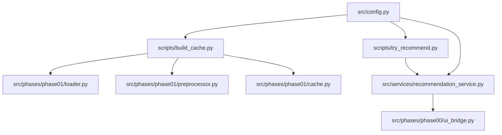
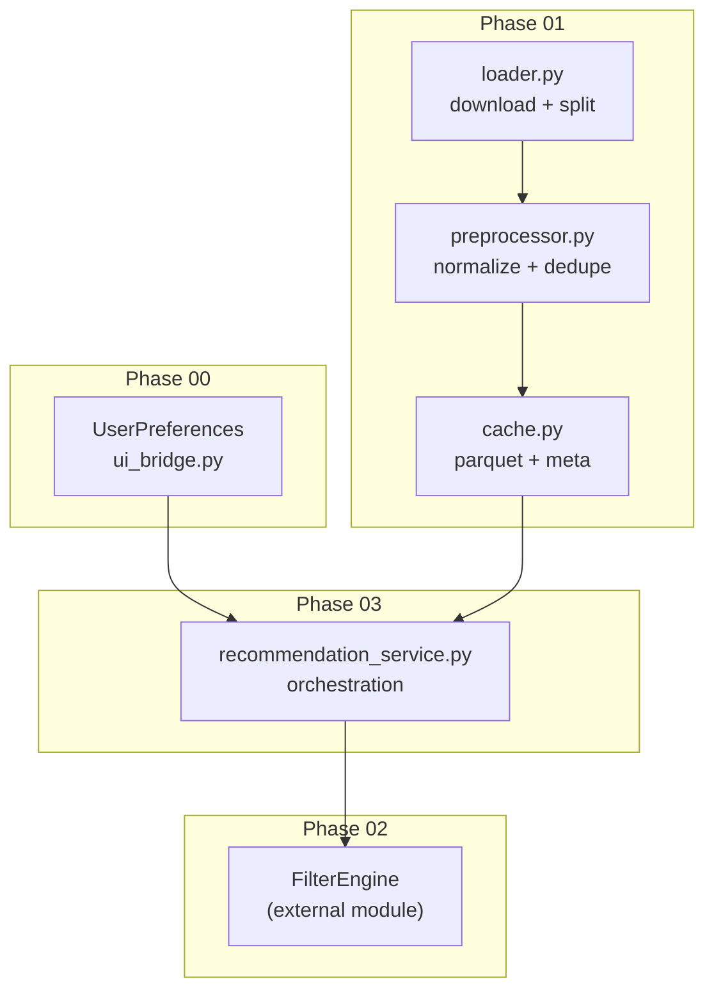
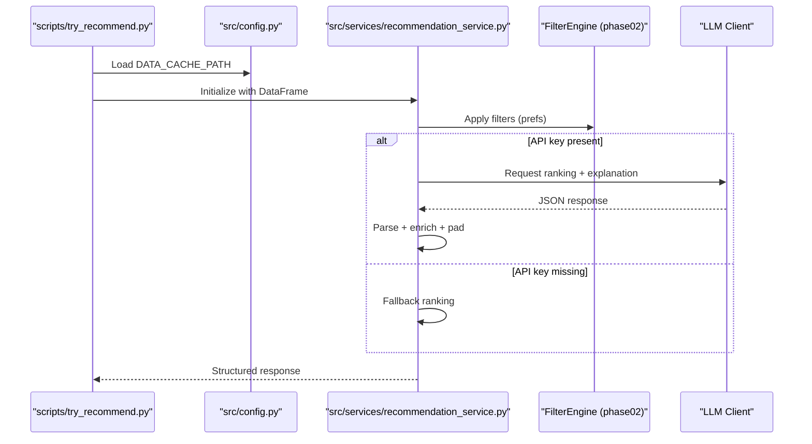
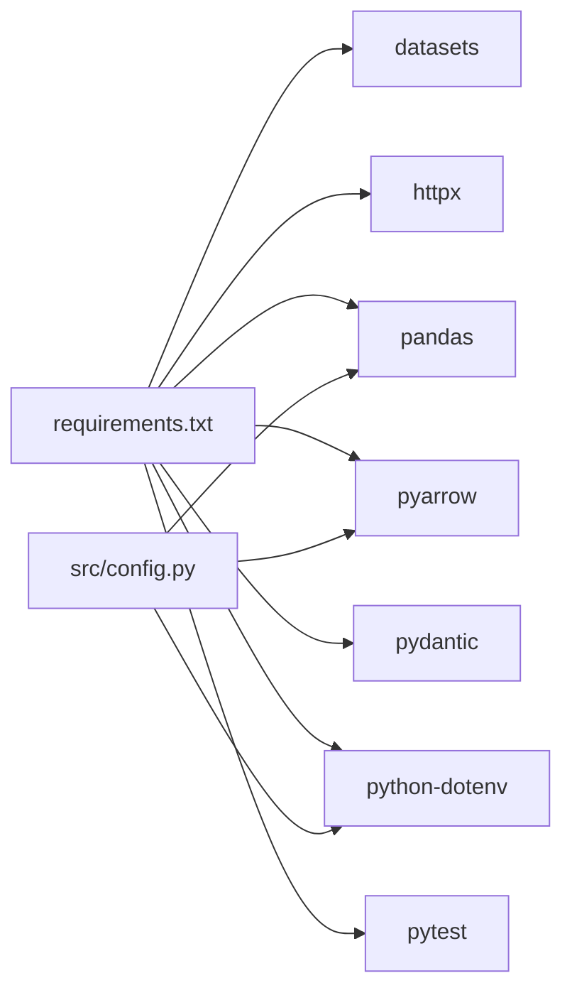

# Getting Started

<cite>
**Referenced Files in This Document**
- [README.md](file://zomato-ai-recommendation/README.md)
- [.env.example](file://zomato-ai-recommendation/.env.example)
- [requirements.txt](file://zomato-ai-recommendation/requirements.txt)
- [pyproject.toml](file://zomato-ai-recommendation/pyproject.toml)
- [src/config.py](file://zomato-ai-recommendation/src/config.py)
- [scripts/build_cache.py](file://zomato-ai-recommendation/scripts/build_cache.py)
- [scripts/try_recommend.py](file://zomato-ai-recommendation/scripts/try_recommend.py)
- [src/phases/phase01/loader.py](file://zomato-ai-recommendation/src/phases/phase01/loader.py)
- [src/phases/phase01/preprocessor.py](file://zomato-ai-recommendation/src/phases/phase01/preprocessor.py)
- [src/phases/phase01/cache.py](file://zomato-ai-recommendation/src/phases/phase01/cache.py)
- [src/services/recommendation_service.py](file://zomato-ai-recommendation/src/services/recommendation_service.py)
- [src/phases/phase00/ui_bridge.py](file://zomato-ai-recommendation/src/phases/phase00/ui_bridge.py)
- [docs/DATA_NOTES.md](file://zomato-ai-recommendation/docs/DATA_NOTES.md)
</cite>

## Table of Contents
1. [Introduction](#introduction)
2. [Project Structure](#project-structure)
3. [Core Components](#core-components)
4. [Architecture Overview](#architecture-overview)
5. [Detailed Component Analysis](#detailed-component-analysis)
6. [Dependency Analysis](#dependency-analysis)
7. [Performance Considerations](#performance-considerations)
8. [Troubleshooting Guide](#troubleshooting-guide)
9. [Conclusion](#conclusion)
10. [Appendices](#appendices)

## Introduction
This guide helps you install and run the Zomato AI Recommendation System locally. You will:
- Prepare your environment with Python 3.10+ and a virtual environment
- Configure API keys and environment variables
- Build the initial data cache from the Hugging Face dataset
- Run your first recommendation using the CLI
- Verify your setup and troubleshoot common issues

Prerequisites:
- Basic Python: variables, functions, modules, and command-line usage
- pandas basics: DataFrames, reading/writing files, and column selection
- Machine learning awareness: filtering candidates, ranking, and explanations

## Project Structure
At a high level, the project is organized into:
- scripts/: Command-line helpers for cache building and recommendation testing
- src/: Modular phases implementing ingestion, preprocessing, filtering, and recommendation
- docs/: Design and operational notes
- data/: Output cache directory (not committed to Git)
- Top-level configuration: environment variables, requirements, and project metadata

**Diagram sources**
- [scripts/build_cache.py:1-75](file://zomato-ai-recommendation/scripts/build_cache.py#L1-L75)
- [src/phases/phase01/loader.py:1-64](file://zomato-ai-recommendation/src/phases/phase01/loader.py#L1-L64)
- [src/phases/phase01/preprocessor.py:1-232](file://zomato-ai-recommendation/src/phases/phase01/preprocessor.py#L1-L232)
- [src/phases/phase01/cache.py:1-64](file://zomato-ai-recommendation/src/phases/phase01/cache.py#L1-L64)
- [scripts/try_recommend.py:1-95](file://zomato-ai-recommendation/scripts/try_recommend.py#L1-L95)
- [src/services/recommendation_service.py:1-200](file://zomato-ai-recommendation/src/services/recommendation_service.py#L1-L200)
- [src/phases/phase00/ui_bridge.py:1-112](file://zomato-ai-recommendation/src/phases/phase00/ui_bridge.py#L1-L112)
- [src/config.py:1-50](file://zomato-ai-recommendation/src/config.py#L1-L50)

**Section sources**
- [README.md:14-39](file://zomato-ai-recommendation/README.md#L14-L39)

## Core Components
- Environment and configuration
  - Environment variables are loaded from a local .env file and exposed via src/config.py
  - Required keys include provider credentials and model settings
- Data pipeline (Phase 01)
  - Download dataset from Hugging Face, normalize and deduplicate, and persist as Parquet with metadata
- Recommendation service (Phase 03 orchestration)
  - Applies filters, optionally calls an LLM for ranking and explanations, and returns a structured response

Key configuration points:
- Provider and model settings are read from environment variables
- Cache path defaults to a Parquet file under data/processed
- Tuning knobs include candidate count and top-K recommendations

**Section sources**
- [.env.example:1-17](file://zomato-ai-recommendation/.env.example#L1-L17)
- [src/config.py:1-50](file://zomato-ai-recommendation/src/config.py#L1-L50)
- [docs/DATA_NOTES.md:23-37](file://zomato-ai-recommendation/docs/DATA_NOTES.md#L23-L37)

## Architecture Overview
The system follows a phased architecture:
- Phase 00: UI contracts and preference normalization
- Phase 01: Data ingestion, preprocessing, and cache persistence
- Phase 02: Candidate filtering engine
- Phase 03: LLM-based ranking and explanation
- Phase 04: UI presentation (planned)

**Diagram sources**
- [src/phases/phase00/ui_bridge.py:1-112](file://zomato-ai-recommendation/src/phases/phase00/ui_bridge.py#L1-L112)
- [src/phases/phase01/loader.py:1-64](file://zomato-ai-recommendation/src/phases/phase01/loader.py#L1-L64)
- [src/phases/phase01/preprocessor.py:1-232](file://zomato-ai-recommendation/src/phases/phase01/preprocessor.py#L1-L232)
- [src/phases/phase01/cache.py:1-64](file://zomato-ai-recommendation/src/phases/phase01/cache.py#L1-L64)
- [src/services/recommendation_service.py:1-200](file://zomato-ai-recommendation/src/services/recommendation_service.py#L1-L200)

## Detailed Component Analysis

### Environment Setup and API Keys
- Copy the example environment file to .env and set your provider credentials
- Confirm provider, model, base URL, and tuning variables are present
- The configuration module loads .env and exposes typed settings

Verification steps:
- Ensure the .env file exists and contains your API key
- Confirm the configuration module reads the key and model settings

**Section sources**
- [README.md:41-54](file://zomato-ai-recommendation/README.md#L41-L54)
- [.env.example:1-17](file://zomato-ai-recommendation/.env.example#L1-L17)
- [src/config.py:26-38](file://zomato-ai-recommendation/src/config.py#L26-L38)

### Install Dependencies
- Use a Python 3.10+ interpreter
- Create and activate a virtual environment
- Install pinned dependencies from requirements.txt
- Optionally run tests to validate your environment

**Section sources**
- [README.md:66-73](file://zomato-ai-recommendation/README.md#L66-L73)
- [requirements.txt:1-8](file://zomato-ai-recommendation/requirements.txt#L1-L8)
- [pyproject.toml:6](file://zomato-ai-recommendation/pyproject.toml#L6)

### Build the Initial Data Cache
- The cache script downloads the dataset, preprocesses it, and writes a Parquet file with metadata
- Use the force flag to rebuild if needed and limit rows for quick smoke tests

Expected output:
- data/processed/restaurants.parquet
- restaurants.parquet.meta.json with cache version and row/column info

**Section sources**
- [README.md:75-85](file://zomato-ai-recommendation/README.md#L75-L85)
- [scripts/build_cache.py:21-75](file://zomato-ai-recommendation/scripts/build_cache.py#L21-L75)
- [src/phases/phase01/loader.py:33-64](file://zomato-ai-recommendation/src/phases/phase01/loader.py#L33-L64)
- [src/phases/phase01/preprocessor.py:136-232](file://zomato-ai-recommendation/src/phases/phase01/preprocessor.py#L136-L232)
- [src/phases/phase01/cache.py:27-64](file://zomato-ai-recommendation/src/phases/phase01/cache.py#L27-L64)
- [docs/DATA_NOTES.md:3-19](file://zomato-ai-recommendation/docs/DATA_NOTES.md#L3-L19)

### Run Your First Recommendation
- Use the recommendation CLI to load the cache and request recommendations
- Provide city, budget tier, cuisines, minimum rating, and optional extras
- The service applies filters, optionally calls the LLM, and prints a formatted response

**Diagram sources**
- [scripts/try_recommend.py:21-95](file://zomato-ai-recommendation/scripts/try_recommend.py#L21-L95)
- [src/config.py:43-47](file://zomato-ai-recommendation/src/config.py#L43-L47)
- [src/services/recommendation_service.py:37-131](file://zomato-ai-recommendation/src/services/recommendation_service.py#L37-L131)

**Section sources**
- [scripts/try_recommend.py:21-95](file://zomato-ai-recommendation/scripts/try_recommend.py#L21-L95)
- [src/services/recommendation_service.py:30-200](file://zomato-ai-recommendation/src/services/recommendation_service.py#L30-L200)

### Understanding the Data Cache
- The cache stores a normalized subset of the original dataset with derived fields
- It includes identifiers, location, cuisines, ratings, votes, cost, budget tier, and feature flags
- Use the included inspection commands to explore cities and cuisines for UI dropdowns

**Section sources**
- [docs/DATA_NOTES.md:23-37](file://zomato-ai-recommendation/docs/DATA_NOTES.md#L23-L37)

## Dependency Analysis
Runtime dependencies include libraries for dataset handling, HTTP, tabular data, serialization, configuration, and testing. The configuration module centralizes environment access and path resolution.

**Diagram sources**
- [requirements.txt:1-8](file://zomato-ai-recommendation/requirements.txt#L1-L8)
- [src/config.py:1-50](file://zomato-ai-recommendation/src/config.py#L1-L50)

**Section sources**
- [requirements.txt:1-8](file://zomato-ai-recommendation/requirements.txt#L1-L8)
- [src/config.py:1-50](file://zomato-ai-recommendation/src/config.py#L1-L50)

## Performance Considerations
- Building the cache for the first time downloads a large dataset; subsequent runs reuse local caches
- Use the --max-rows option during development to reduce runtime and memory usage
- Keep the cache updated when dataset or preprocessing rules change; the cache version field enforces invalidation

[No sources needed since this section provides general guidance]

## Troubleshooting Guide
Common issues and resolutions:
- Python version mismatch
  - Ensure you are using Python 3.10+; the project targets 3.11
- Missing or incorrect API key
  - Confirm your .env file contains the provider key and that the configuration module loads it
- Cache not found or wrong version
  - Rebuild the cache using the cache script; verify the metadata version matches expectations
- Network or download failures
  - The loader retries transient failures; check connectivity and try again
- Empty recommendations
  - Relax filters (budget tier, minimum rating, cuisines) and rerun
- LLM offline fallback
  - Without an API key, the service falls back to structured ranking; set the key to enable AI explanations

Verification checklist:
- Environment variables are present and readable
- Cache file and metadata exist and are readable
- CLI runs end-to-end without exceptions
- Recommendations include explanations when the API key is configured

**Section sources**
- [README.md:66-73](file://zomato-ai-recommendation/README.md#L66-L73)
- [src/config.py:26-38](file://zomato-ai-recommendation/src/config.py#L26-L38)
- [src/phases/phase01/cache.py:46-64](file://zomato-ai-recommendation/src/phases/phase01/cache.py#L46-L64)
- [src/phases/phase01/loader.py:45-64](file://zomato-ai-recommendation/src/phases/phase01/loader.py#L45-L64)
- [src/services/recommendation_service.py:60-66](file://zomato-ai-recommendation/src/services/recommendation_service.py#L60-L66)

## Conclusion
You now have a working local setup for the Zomato AI Recommendation System. Proceed to refine your preferences, explore the dataset, and integrate the service into your UI or backend as the project progresses through later phases.

[No sources needed since this section summarizes without analyzing specific files]

## Appendices

### Appendix A: Step-by-Step Setup Checklist
- Install Python 3.10+
- Create and activate a virtual environment
- Install dependencies from requirements.txt
- Copy .env.example to .env and configure API keys
- Build the cache using the cache script
- Run the recommendation CLI with your preferences
- Verify explanations appear when the API key is configured

**Section sources**
- [README.md:66-85](file://zomato-ai-recommendation/README.md#L66-L85)
- [.env.example:1-17](file://zomato-ai-recommendation/.env.example#L1-L17)
- [scripts/build_cache.py:21-75](file://zomato-ai-recommendation/scripts/build_cache.py#L21-L75)
- [scripts/try_recommend.py:21-95](file://zomato-ai-recommendation/scripts/try_recommend.py#L21-L95)