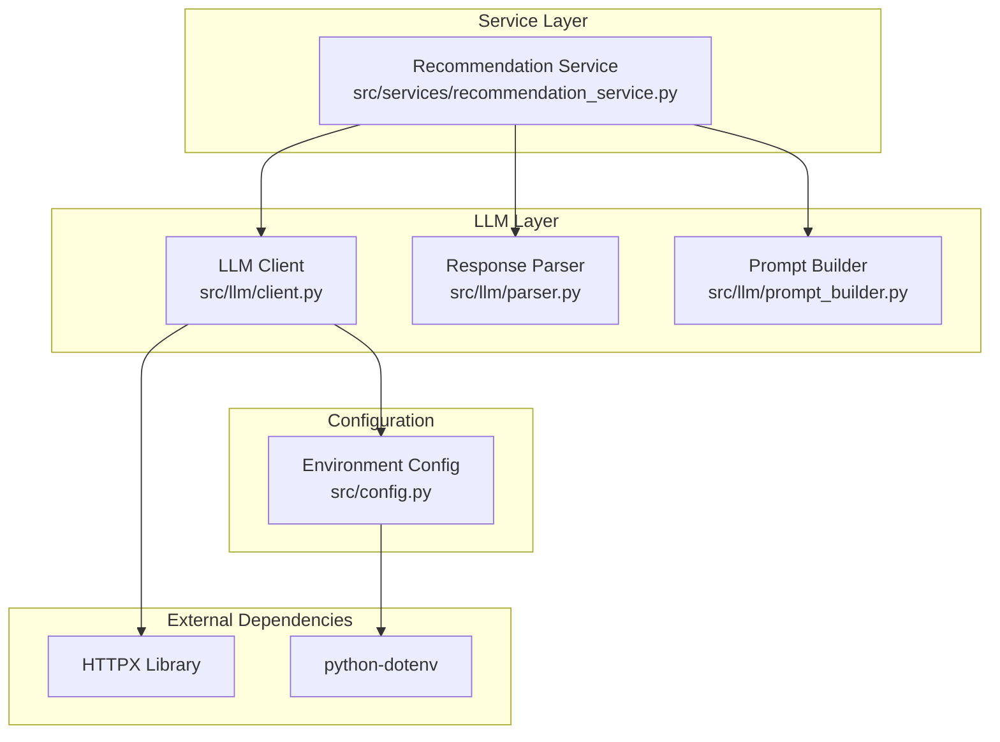
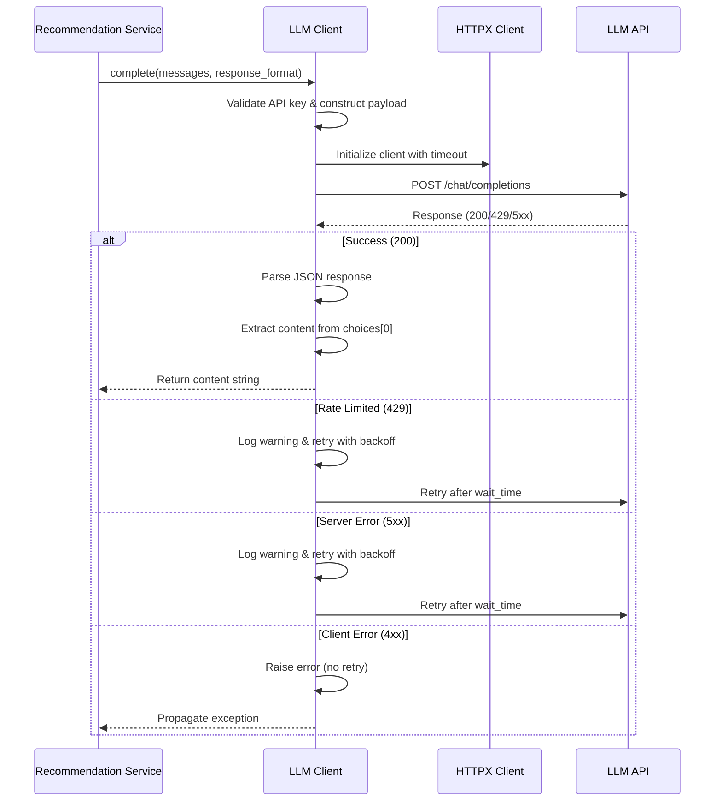
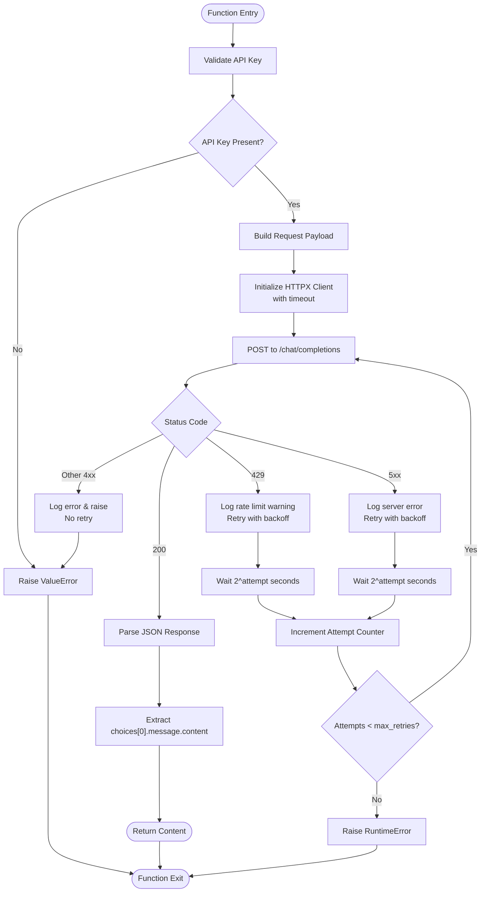
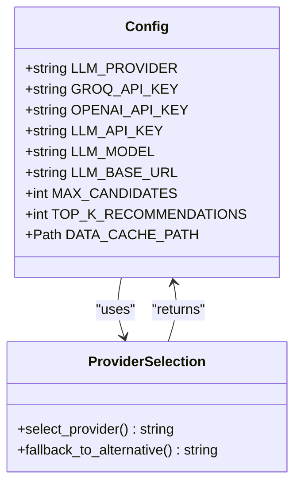
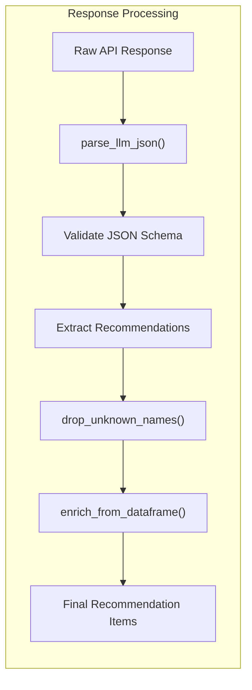
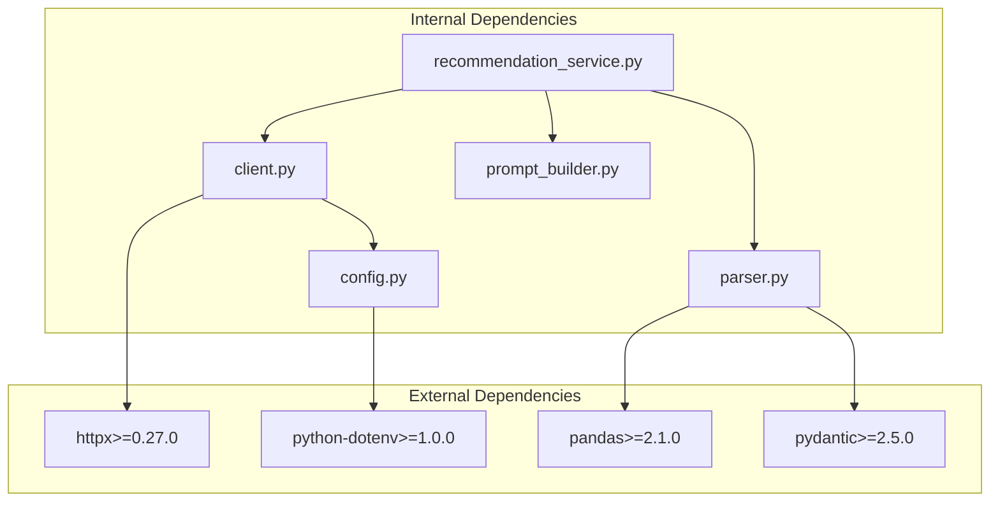

# LLM Client Implementation

<cite>
**Referenced Files in This Document**
- [client.py](file://zomato-ai-recommendation/src/llm/client.py)
- [config.py](file://zomato-ai-recommendation/src/config.py)
- [recommendation_service.py](file://zomato-ai-recommendation/src/services/recommendation_service.py)
- [prompt_builder.py](file://zomato-ai-recommendation/src/llm/prompt_builder.py)
- [parser.py](file://zomato-ai-recommendation/src/llm/parser.py)
- [test_recommendation.py](file://zomato-ai-recommendation/tests/test_recommendation.py)
- [requirements.txt](file://zomato-ai-recommendation/requirements.txt)
- [README.md](file://zomato-ai-recommendation/README.md)
</cite>

## Table of Contents
1. [Introduction](#introduction)
2. [Project Structure](#project-structure)
3. [Core Components](#core-components)
4. [Architecture Overview](#architecture-overview)
5. [Detailed Component Analysis](#detailed-component-analysis)
6. [Dependency Analysis](#dependency-analysis)
7. [Performance Considerations](#performance-considerations)
8. [Troubleshooting Guide](#troubleshooting-guide)
9. [Conclusion](#conclusion)

## Introduction
This document provides comprehensive documentation for the LLM HTTP client implementation used in the Zomato AI recommendation system. The client handles chat completions against Groq/OpenAI-compatible APIs with robust retry logic, timeout handling, and error management. It serves as the backbone for AI-powered restaurant recommendations, integrating seamlessly with the broader recommendation pipeline.

The implementation focuses on reliability and production readiness, featuring exponential backoff for rate limiting and server errors, comprehensive error handling, and structured logging for observability.

## Project Structure
The LLM client is part of a modular recommendation system with clear separation of concerns:

**Diagram sources**
- [client.py:1-94](file://zomato-ai-recommendation/src/llm/client.py#L1-L94)
- [recommendation_service.py:1-200](file://zomato-ai-recommendation/src/services/recommendation_service.py#L1-L200)
- [config.py:1-50](file://zomato-ai-recommendation/src/config.py#L1-L50)

**Section sources**
- [client.py:1-94](file://zomato-ai-recommendation/src/llm/client.py#L1-L94)
- [config.py:1-50](file://zomato-ai-recommendation/src/config.py#L1-L50)

## Core Components
The LLM client implementation consists of several interconnected components that work together to provide reliable AI recommendations:

### Primary Chat Completion Function
The `complete()` function serves as the main interface for chat completions, handling the complete request lifecycle from construction to response processing.

### Configuration Management
Centralized configuration through environment variables supporting both Groq and OpenAI providers with flexible model selection.

### Response Processing Pipeline
Structured parsing and validation of LLM responses with error handling and data enrichment capabilities.

**Section sources**
- [client.py:14-94](file://zomato-ai-recommendation/src/llm/client.py#L14-L94)
- [config.py:26-38](file://zomato-ai-recommendation/src/config.py#L26-L38)

## Architecture Overview
The LLM client follows a layered architecture pattern optimized for reliability and maintainability:

**Diagram sources**
- [client.py:55-94](file://zomato-ai-recommendation/src/llm/client.py#L55-L94)
- [recommendation_service.py:78-81](file://zomato-ai-recommendation/src/services/recommendation_service.py#L78-L81)

## Detailed Component Analysis

### LLM Client Implementation
The core `complete()` function implements a comprehensive retry mechanism with exponential backoff:

**Diagram sources**
- [client.py:55-94](file://zomato-ai-recommendation/src/llm/client.py#L55-L94)

#### Request Construction Process
The client builds requests following OpenAI-compatible API specifications:

**Authentication Headers:**
- Authorization: Bearer token using configured API key
- Content-Type: application/json

**Payload Structure:**
- model: Configured LLM model identifier
- messages: Array of chat messages (system + user)
- temperature: Fixed at 0.2 for deterministic responses
- response_format: Optional JSON object specification

**Section sources**
- [client.py:39-51](file://zomato-ai-recommendation/src/llm/client.py#L39-L51)

#### Retry Mechanism Details
The implementation employs exponential backoff with careful error classification:

**Retryable Errors:**
- HTTP 429 (Rate Limiting): Immediate retry with 2^n second delay
- HTTP 500, 502, 503, 504 (Server Errors): Retry with exponential backoff
- Network timeouts and connection errors: Retry with exponential backoff

**Non-Retryable Errors:**
- HTTP 400, 401, 403, 404: Raise immediately without retry
- Other HTTP 4xx errors: Raise immediately without retry

**Section sources**
- [client.py:70-90](file://zomato-ai-recommendation/src/llm/client.py#L70-L90)

### Configuration Management
The system supports dual provider compatibility through centralized configuration:

**Diagram sources**
- [config.py:26-38](file://zomato-ai-recommendation/src/config.py#L26-L38)

**Configuration Variables:**
- `LLM_PROVIDER`: Selects between "groq" or "openai" (default: groq)
- `GROQ_API_KEY`: Authentication key for Groq API
- `OPENAI_API_KEY`: Authentication key for OpenAI-compatible APIs
- `LLM_MODEL`: Model identifier (default: llama-3.3-70b-versatile)
- `LLM_BASE_URL`: API endpoint base URL (default: Groq OpenAI-compatible endpoint)

**Section sources**
- [config.py:26-38](file://zomato-ai-recommendation/src/config.py#L26-L38)
- [README.md:47-54](file://zomato-ai-recommendation/README.md#L47-L54)

### Response Processing Pipeline
The client integrates with a comprehensive response processing system:

**Diagram sources**
- [parser.py:24-44](file://zomato-ai-recommendation/src/llm/parser.py#L24-L44)
- [parser.py:45-66](file://zomato-ai-recommendation/src/llm/parser.py#L45-L66)
- [parser.py:68-141](file://zomato-ai-recommendation/src/llm/parser.py#L68-L141)

**Section sources**
- [parser.py:24-141](file://zomato-ai-recommendation/src/llm/parser.py#L24-L141)

## Dependency Analysis
The LLM client maintains loose coupling with external dependencies while providing robust error handling:

**Diagram sources**
- [requirements.txt:1-9](file://zomato-ai-recommendation/requirements.txt#L1-L9)
- [client.py:10](file://zomato-ai-recommendation/src/llm/client.py#L10)

**External Dependencies:**
- **httpx**: HTTP client library with async support and robust error handling
- **python-dotenv**: Environment variable loading from .env files
- **pandas**: Data manipulation and validation
- **pydantic**: Data validation and serialization

**Section sources**
- [requirements.txt:1-9](file://zomato-ai-recommendation/requirements.txt#L1-L9)
- [client.py:8](file://zomato-ai-recommendation/src/llm/client.py#L8)

## Performance Considerations
The LLM client is designed with production deployment in mind, incorporating several performance optimizations:

### Timeout Configuration
- Default timeout: 30 seconds for request completion
- Configurable via `timeout_seconds` parameter
- Prevents resource starvation during API outages

### Exponential Backoff Strategy
- Base delay: 2^attempt seconds
- Maximum 3 retry attempts by default
- Reduces API pressure during rate limiting events

### Memory Efficiency
- Streaming response handling through HTTPX
- Minimal intermediate data structures
- Efficient JSON parsing with error recovery

### Production Best Practices
- **Connection pooling**: HTTPX automatically manages connection reuse
- **Logging**: Structured logging with appropriate severity levels
- **Monitoring**: Comprehensive error tracking and metrics collection
- **Graceful degradation**: Fallback mechanisms when API is unavailable

## Troubleshooting Guide

### Common Issues and Solutions

**API Key Configuration Errors:**
- **Symptom**: ValueError indicating API key not configured
- **Solution**: Set `GROQ_API_KEY` or `OPENAI_API_KEY` in .env file
- **Prevention**: Validate environment variables at startup

**Rate Limiting (429) Handling:**
- **Behavior**: Automatic exponential backoff with up to 3 retries
- **Monitoring**: Check logs for rate limit warnings
- **Tuning**: Adjust `max_retries` parameter based on SLA requirements

**Network Timeout Issues:**
- **Symptom**: Timeout exceptions during API calls
- **Solution**: Increase `timeout_seconds` parameter
- **Monitoring**: Track timeout rates for capacity planning

**Response Parsing Failures:**
- **Cause**: Malformed JSON or unexpected response format
- **Solution**: Implement fallback mechanisms and comprehensive logging
- **Validation**: Use schema validation before processing

**Section sources**
- [client.py:36-37](file://zomato-ai-recommendation/src/llm/client.py#L36-L37)
- [client.py:71-86](file://zomato-ai-recommendation/src/llm/client.py#L71-L86)
- [test_recommendation.py:133-155](file://zomato-ai-recommendation/tests/test_recommendation.py#L133-L155)

### Logging Strategy
The client implements comprehensive logging for operational visibility:

**Log Levels:**
- INFO: Successful API calls with attempt details
- WARNING: Rate limits, server errors, and retry attempts
- ERROR: Unrecoverable errors and API failures

**Key Log Messages:**
- API endpoint and model information
- Attempt count and retry delays
- Error codes and response details
- Performance metrics and timing information

### Testing and Validation
The implementation includes comprehensive test coverage:

**Unit Tests:**
- Retry behavior under various error conditions
- Response parsing with malformed JSON
- Configuration loading from environment variables
- Integration testing with mocked HTTP responses

**Test Coverage Areas:**
- 429 rate limiting with exponential backoff
- 5xx server errors with retry logic
- 4xx client errors without retry
- JSON parsing with markdown wrappers
- Data validation and enrichment

**Section sources**
- [test_recommendation.py:133-155](file://zomato-ai-recommendation/tests/test_recommendation.py#L133-L155)
- [test_recommendation.py:48-71](file://zomato-ai-recommendation/tests/test_recommendation.py#L48-L71)

## Conclusion
The LLM HTTP client implementation provides a robust, production-ready foundation for AI-powered restaurant recommendations. Its comprehensive error handling, exponential backoff retry logic, and structured configuration management make it suitable for high-availability deployments.

Key strengths include:
- **Reliability**: Comprehensive retry logic for rate limiting and server errors
- **Flexibility**: Support for multiple providers (Groq/OpenAI) with unified interface
- **Observability**: Detailed logging and monitoring capabilities
- **Maintainability**: Clean separation of concerns and modular design
- **Performance**: Optimized for production workloads with configurable timeouts

The implementation successfully balances functionality with production requirements, providing a solid foundation for scalable AI recommendation systems.