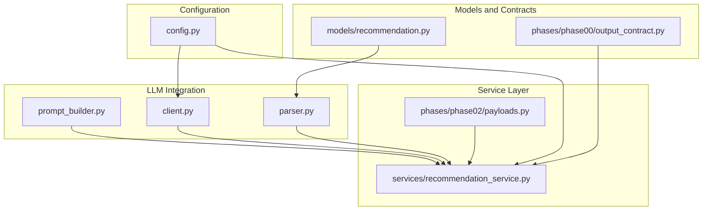
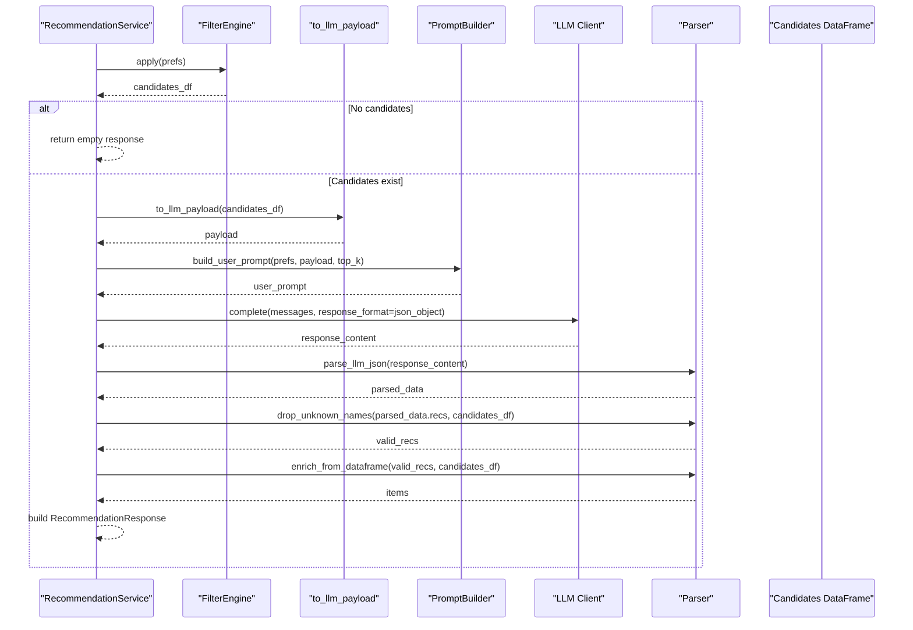
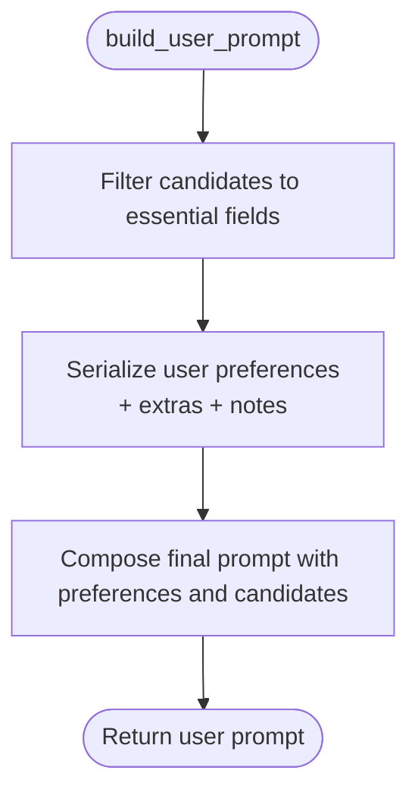
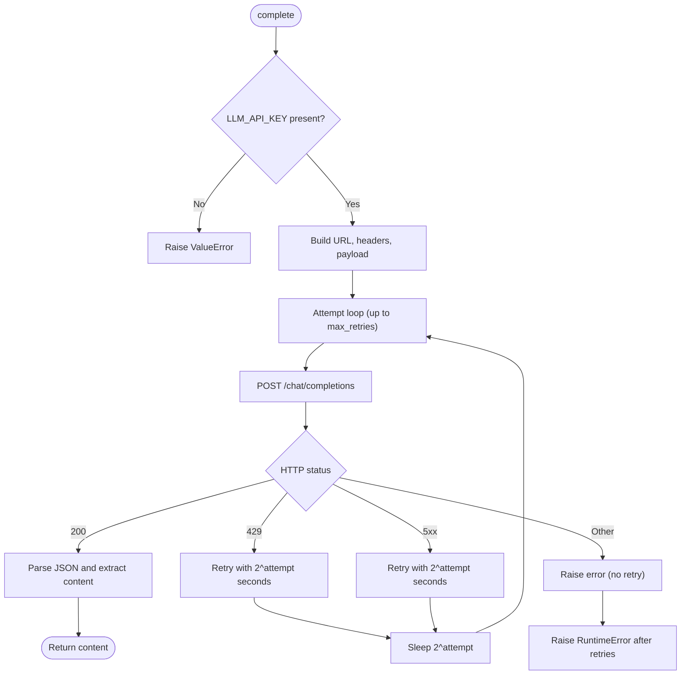
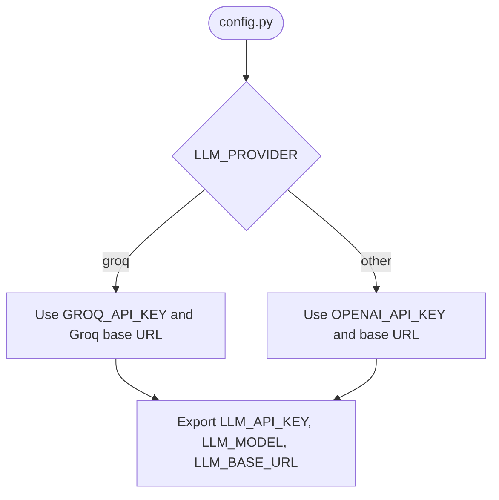
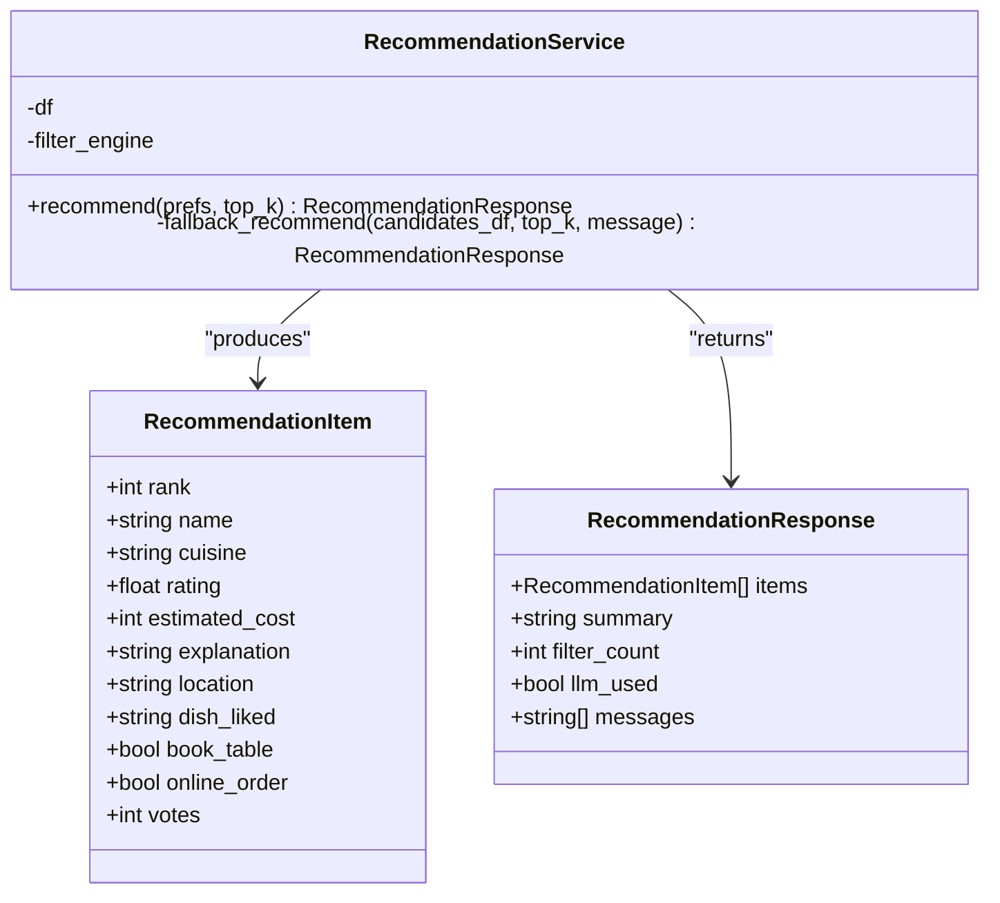
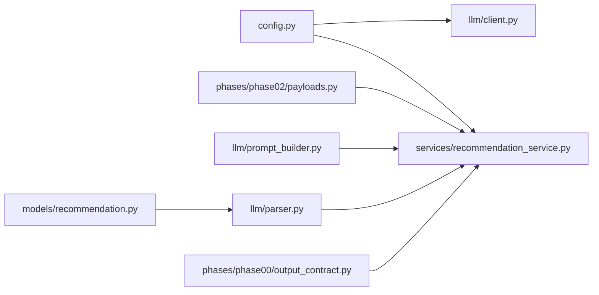

# LLM Integration

<cite>
**Referenced Files in This Document**
- [README.md](file://README.md)
- [pyproject.toml](file://pyproject.toml)
- [src/config.py](file://src/config.py)
- [src/llm/__init__.py](file://src/llm/__init__.py)
- [src/llm/client.py](file://src/llm/client.py)
- [src/llm/parser.py](file://src/llm/parser.py)
- [src/llm/prompt_builder.py](file://src/llm/prompt_builder.py)
- [src/services/recommendation_service.py](file://src/services/recommendation_service.py)
- [src/phases/phase02/payloads.py](file://src/phases/phase02/payloads.py)
- [src/models/recommendation.py](file://src/models/recommendation.py)
- [src/phases/phase00/output_contract.py](file://src/phases/phase00/output_contract.py)
- [tests/test_recommendation.py](file://tests/test_recommendation.py)
</cite>

## Table of Contents
1. [Introduction](#introduction)
2. [Project Structure](#project-structure)
3. [Core Components](#core-components)
4. [Architecture Overview](#architecture-overview)
5. [Detailed Component Analysis](#detailed-component-analysis)
6. [Dependency Analysis](#dependency-analysis)
7. [Performance Considerations](#performance-considerations)
8. [Troubleshooting Guide](#troubleshooting-guide)
9. [Conclusion](#conclusion)
10. [Appendices](#appendices)

## Introduction
This document explains the LLM integration for the Zomato AI Recommendation System. It covers how prompts are built, how the HTTP client performs requests with exponential backoff and retry logic, how JSON responses are parsed and validated, and how anti-hallucination checks and explanations are produced. It also documents configuration options for multiple providers, error handling patterns, performance optimization techniques, security considerations, rate limiting, and monitoring approaches for LLM API interactions.

## Project Structure
The LLM integration spans a small set of focused modules under src/llm and integrates with the broader recommendation pipeline in src/services/recommendation_service.py. Configuration is centralized in src/config.py, while domain models and UI contracts live in src/models and src/phases/phase00 respectively.



**Diagram sources**
- [src/llm/prompt_builder.py:1-69](file://src/llm/prompt_builder.py#L1-L69)
- [src/llm/client.py:1-94](file://src/llm/client.py#L1-L94)
- [src/llm/parser.py:1-141](file://src/llm/parser.py#L1-L141)
- [src/services/recommendation_service.py:1-200](file://src/services/recommendation_service.py#L1-L200)
- [src/phases/phase02/payloads.py:1-44](file://src/phases/phase02/payloads.py#L1-L44)
- [src/config.py:1-50](file://src/config.py#L1-L50)
- [src/models/recommendation.py:1-24](file://src/models/recommendation.py#L1-L24)
- [src/phases/phase00/output_contract.py:1-52](file://src/phases/phase00/output_contract.py#L1-L52)

**Section sources**
- [README.md:1-103](file://README.md#L1-L103)
- [pyproject.toml:1-16](file://pyproject.toml#L1-L16)

## Core Components
- Prompt builder: Constructs a system prompt and a user prompt embedding user preferences and a curated candidate list.
- HTTP client: Issues chat completions to an OpenAI-compatible endpoint (Groq by default) with exponential backoff and retry logic.
- Response parser: Extracts and validates JSON from LLM output, filters hallucinated names, and enriches results with ground-truth data.
- Service orchestrator: Coordinates filtering, prompt construction, LLM invocation, parsing, validation, and fallback behavior.

Key responsibilities:
- Structured prompt building with strict schema and grounding instructions.
- Robust HTTP client with timeouts, retries, and selective error handling.
- Anti-hallucination validation against a known candidate list.
- Enrichment of recommendations with verified attributes from the dataset.
- Fallback to structured ranking when LLM is unavailable or fails.

**Section sources**
- [src/llm/prompt_builder.py:1-69](file://src/llm/prompt_builder.py#L1-L69)
- [src/llm/client.py:1-94](file://src/llm/client.py#L1-L94)
- [src/llm/parser.py:1-141](file://src/llm/parser.py#L1-L141)
- [src/services/recommendation_service.py:1-200](file://src/services/recommendation_service.py#L1-L200)

## Architecture Overview
The LLM integration is invoked by the recommendation service after filtering candidates. The service builds a compact payload, constructs the system and user messages, calls the LLM client, parses and validates the response, and finally enriches the results with verified attributes.



**Diagram sources**
- [src/services/recommendation_service.py:37-131](file://src/services/recommendation_service.py#L37-L131)
- [src/phases/phase02/payloads.py:27-44](file://src/phases/phase02/payloads.py#L27-L44)
- [src/llm/prompt_builder.py:30-69](file://src/llm/prompt_builder.py#L30-L69)
- [src/llm/client.py:14-94](file://src/llm/client.py#L14-L94)
- [src/llm/parser.py:24-141](file://src/llm/parser.py#L24-L141)

## Detailed Component Analysis

### Prompt Building
The prompt builder defines:
- A system prompt that enforces grounding to the provided candidate list, mandates a single JSON object response, and specifies the required schema.
- A user prompt that includes user preferences and a curated subset of candidate attributes to reduce token usage.

Processing logic highlights:
- Candidate list is filtered to essential fields to minimize token count.
- User preferences are serialized with nested extras and additional notes.
- The final prompt instructs the model to return only the JSON object.



**Diagram sources**
- [src/llm/prompt_builder.py:30-69](file://src/llm/prompt_builder.py#L30-L69)

**Section sources**
- [src/llm/prompt_builder.py:1-69](file://src/llm/prompt_builder.py#L1-L69)

### HTTP Client with Exponential Backoff and Retry
The client:
- Validates presence of the API key and constructs the request payload with model, messages, and temperature.
- Sends the request using httpx with a configurable timeout.
- Implements retry logic with exponential backoff for 429 and 5xx errors, and logs warnings for recoverable failures.
- Raises unrecoverable errors immediately (e.g., 400, 401, 403, 404) without retrying.



**Diagram sources**
- [src/llm/client.py:14-94](file://src/llm/client.py#L14-L94)

**Section sources**
- [src/llm/client.py:1-94](file://src/llm/client.py#L1-L94)

### JSON Response Parsing and Anti-Hallucination Validation
The parser:
- Extracts JSON from potentially wrapped or markdown-formatted responses.
- Validates that the parsed result is a dictionary and contains the expected keys.
- Drops recommendations whose names are not present in the candidate list using case-insensitive matching.
- Enriches recommendations with verified attributes from the DataFrame, restoring casing and casting types.

```mermaid
flowchart TD
Start(["parse_llm_json"]) --> Strip["Strip whitespace"]
Strip --> FindJSON["Find JSON object via regex"]
FindJSON --> Load["Load JSON"]
Load --> DictCheck{"Is dict?"}
DictCheck --> |No| Error["Raise ValueError"]
DictCheck --> |Yes| Return(["Return parsed dict"])
subgraph Validation
VStart(["drop_unknown_names"]) --> Empty{"Empty input?"}
Empty --> |Yes| VReturn([])
Empty --> |No| BuildSet["Build candidate name set (lowercase)"]
BuildSet --> Loop["Iterate recommendations"]
Loop --> HasName{"Name in set?"}
HasName --> |Yes| Keep["Keep recommendation"]
HasName --> |No| Warn["Log warning and skip"]
Keep --> Next["Next item"]
Warn --> Next
Next --> VReturn["Return filtered list"]
end
subgraph Enrichment
EStart(["enrich_from_dataframe"]) --> EmptyDF{"Empty input or DF?"}
EmptyDF --> |Yes| EReturn([])
EmptyDF --> |No| Lookup["Build name->row lookup (lowercase)"]
Lookup --> Iterate["Iterate recommendations"]
Iterate --> Match{"Row exists?"}
Match --> |No| Skip["Skip item"]
Match --> |Yes| Cast["Cast and normalize fields"]
Cast --> Append["Append RecommendationItem"]
Skip --> Iterate
Append --> Iterate
Iterate --> EReturn["Return items"]
end
```

**Diagram sources**
- [src/llm/parser.py:24-141](file://src/llm/parser.py#L24-L141)

**Section sources**
- [src/llm/parser.py:1-141](file://src/llm/parser.py#L1-L141)

### Provider Abstraction and Configuration
The configuration module:
- Supports multiple providers (Groq and OpenAI-compatible) by selecting the appropriate API key and base URL.
- Provides defaults for model and base URL and exposes environment-driven overrides.
- Centralizes constants for top-K recommendations and candidate limits.



**Diagram sources**
- [src/config.py:26-38](file://src/config.py#L26-L38)

**Section sources**
- [src/config.py:1-50](file://src/config.py#L1-L50)

### Service Orchestration and Fallback Behavior
The recommendation service:
- Applies filters to derive a candidate set.
- Builds a compact payload and constructs system and user messages.
- Calls the LLM client with a JSON response format.
- Parses and validates the response, drops hallucinations, pads results if needed, and enriches with verified attributes.
- Falls back to a structured ranking with templated explanations when the API key is missing or when LLM calls fail.



**Diagram sources**
- [src/services/recommendation_service.py:30-200](file://src/services/recommendation_service.py#L30-L200)
- [src/phases/phase00/output_contract.py:8-52](file://src/phases/phase00/output_contract.py#L8-L52)

**Section sources**
- [src/services/recommendation_service.py:1-200](file://src/services/recommendation_service.py#L1-L200)
- [src/phases/phase00/output_contract.py:1-52](file://src/phases/phase00/output_contract.py#L1-L52)

## Dependency Analysis
The LLM integration depends on:
- Configuration for provider selection and endpoint details.
- Payload shaping from the filtering phase.
- Domain models for typed recommendations and UI contracts for response formatting.



**Diagram sources**
- [src/config.py:1-50](file://src/config.py#L1-L50)
- [src/llm/client.py:1-94](file://src/llm/client.py#L1-L94)
- [src/llm/parser.py:1-141](file://src/llm/parser.py#L1-L141)
- [src/llm/prompt_builder.py:1-69](file://src/llm/prompt_builder.py#L1-L69)
- [src/services/recommendation_service.py:1-200](file://src/services/recommendation_service.py#L1-L200)
- [src/phases/phase02/payloads.py:1-44](file://src/phases/phase02/payloads.py#L1-L44)
- [src/models/recommendation.py:1-24](file://src/models/recommendation.py#L1-L24)
- [src/phases/phase00/output_contract.py:1-52](file://src/phases/phase00/output_contract.py#L1-L52)

**Section sources**
- [src/config.py:1-50](file://src/config.py#L1-L50)
- [src/services/recommendation_service.py:1-200](file://src/services/recommendation_service.py#L1-L200)

## Performance Considerations
- Token efficiency: The prompt builder reduces the candidate footprint to essential fields to minimize token usage.
- Payload shaping: The payload utility ensures only necessary columns are included and NaN values are normalized to None for safe JSON serialization.
- Retry strategy: Exponential backoff reduces load during transient failures and respects rate limits.
- Early exit: On empty candidate sets, the service short-circuits to avoid unnecessary LLM calls.
- Padding: When LLM returns fewer valid recommendations than requested, the service augments results with top candidates to meet the requested top-K.

Practical tips:
- Tune MAX_CANDIDATES and TOP_K_RECOMMENDATIONS via environment variables to balance quality and latency.
- Monitor LLM_BASE_URL and model availability to select optimal endpoints.
- Consider caching frequent queries at higher layers if repeated recommendations are expected.

[No sources needed since this section provides general guidance]

## Troubleshooting Guide
Common issues and resolutions:
- Missing API key: The client raises a clear error if the key is not configured. Ensure the environment variable is set and loaded.
- Rate limiting: The client retries on 429 with exponential backoff. If persistent, reduce request frequency or adjust provider quotas.
- Non-JSON responses: The parser extracts JSON from wrapped or markdown-formatted outputs. If parsing fails, verify the model adheres to the required JSON schema and response format.
- Hallucinated names: Recommendations whose names do not match the candidate list are dropped. Confirm the candidate list is derived from the canonical dataset and that name normalization is consistent.
- Fallback behavior: When LLM is unavailable or fails, the service falls back to structured ranking with templated explanations. Review logs for error messages and verify the fallback path produces reasonable results.

Validation references:
- Retry behavior on 429 and success on second attempt.
- JSON parsing robustness for clean and wrapped outputs.
- Anti-hallucination filtering and enrichment correctness.
- Fallback path behavior on LLM failure and padding logic.

**Section sources**
- [src/llm/client.py:36-94](file://src/llm/client.py#L36-L94)
- [src/llm/parser.py:24-141](file://src/llm/parser.py#L24-L141)
- [src/services/recommendation_service.py:60-131](file://src/services/recommendation_service.py#L60-L131)
- [tests/test_recommendation.py:133-280](file://tests/test_recommendation.py#L133-L280)

## Conclusion
The LLM integration is designed for reliability and correctness: structured prompts enforce schema adherence and grounding, the HTTP client handles transient failures gracefully, and the parser validates outputs and guards against hallucinations. The service layer orchestrates the pipeline, provides a robust fallback, and ensures enriched, ground-truth results are delivered to the UI.

[No sources needed since this section summarizes without analyzing specific files]

## Appendices

### Configuration Options
- LLM_PROVIDER: Selects the provider ("groq" or another OpenAI-compatible provider).
- GROQ_API_KEY: API key for Groq.
- OPENAI_API_KEY: API key for OpenAI-compatible providers.
- LLM_MODEL: Model identifier used for completions.
- LLM_BASE_URL: Base URL for the OpenAI-compatible API.
- TOP_K_RECOMMENDATIONS: Number of recommendations to return.
- MAX_CANDIDATES: Upper bound on candidate list size for prompts.

Security and operational notes:
- API keys are loaded from environment variables and should be kept secret.
- Rate limits are handled via retries; monitor provider quotas and adjust request patterns accordingly.
- Logging captures warnings and errors for observability and debugging.

**Section sources**
- [src/config.py:26-41](file://src/config.py#L26-L41)
- [README.md:41-54](file://README.md#L41-L54)