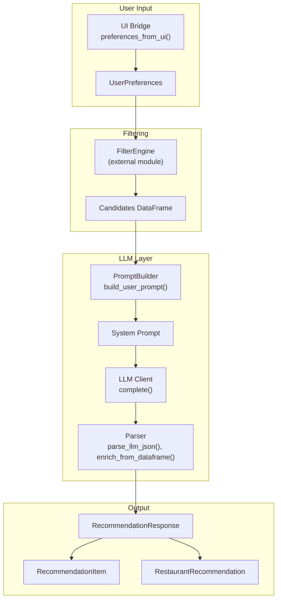
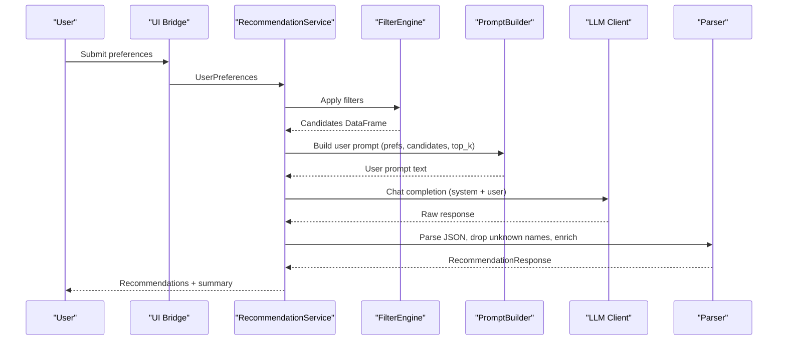
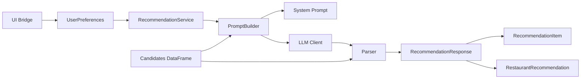

# Prompt Engineering and Builder

<cite>
**Referenced Files in This Document**
- [prompt_builder.py](file://zomato-ai-recommendation/src/llm/prompt_builder.py)
- [client.py](file://zomato-ai-recommendation/src/llm/client.py)
- [parser.py](file://zomato-ai-recommendation/src/llm/parser.py)
- [recommendation_service.py](file://zomato-ai-recommendation/src/services/recommendation_service.py)
- [preferences.py](file://zomato-ai-recommendation/src/phases/phase00/preferences.py)
- [ui_bridge.py](file://zomato-ai-recommendation/src/phases/phase00/ui_bridge.py)
- [output_contract.py](file://zomato-ai-recommendation/src/phases/phase00/output_contract.py)
- [recommendation.py](file://zomato-ai-recommendation/src/models/recommendation.py)
- [restaurant_record.py](file://zomato-ai-recommendation/src/phases/phase01/restaurant_record.py)
- [config.py](file://zomato-ai-recommendation/src/config.py)
- [DATA_NOTES.md](file://zomato-ai-recommendation/docs/DATA_NOTES.md)
- [EDGE_CASES.md](file://zomato-ai-recommendation/docs/EDGE_CASES.md)
</cite>

## Table of Contents
1. [Introduction](#introduction)
2. [Project Structure](#project-structure)
3. [Core Components](#core-components)
4. [Architecture Overview](#architecture-overview)
5. [Detailed Component Analysis](#detailed-component-analysis)
6. [Dependency Analysis](#dependency-analysis)
7. [Performance Considerations](#performance-considerations)
8. [Troubleshooting Guide](#troubleshooting-guide)
9. [Conclusion](#conclusion)
10. [Appendices](#appendices)

## Introduction
This document explains the structured prompt building system used to generate restaurant recommendations powered by an LLM. It covers how user preferences are transformed into a system prompt and a user prompt, how candidate restaurant data is prepared for optimal LLM processing, and how explanations are embedded into the final output. It also documents payload structures, JSON schema requirements, constraints, and best practices for prompt optimization and consistency across recommendation generations.

## Project Structure
The prompt engineering and builder spans several modules:
- LLM orchestration and prompting: prompt builder, client, parser
- User preferences and normalization: preferences model and UI bridge
- Output contracts and domain models: recommendation item/response and LLM output model
- Candidate data schema: restaurant record for Phase 01
- Configuration and environment variables
- Operational guidance and edge cases

**Diagram sources**
- [recommendation_service.py:37-131](file://zomato-ai-recommendation/src/services/recommendation_service.py#L37-L131)
- [prompt_builder.py:30-68](file://zomato-ai-recommendation/src/llm/prompt_builder.py#L30-L68)
- [client.py:14-93](file://zomato-ai-recommendation/src/llm/client.py#L14-L93)
- [parser.py:24-140](file://zomato-ai-recommendation/src/llm/parser.py#L24-L140)
- [preferences.py:20-71](file://zomato-ai-recommendation/src/phases/phase00/preferences.py#L20-L71)
- [ui_bridge.py:59-98](file://zomato-ai-recommendation/src/phases/phase00/ui_bridge.py#L59-L98)
- [output_contract.py:24-52](file://zomato-ai-recommendation/src/phases/phase00/output_contract.py#L24-L52)
- [recommendation.py:9-23](file://zomato-ai-recommendation/src/models/recommendation.py#L9-L23)
- [restaurant_record.py:8-30](file://zomato-ai-recommendation/src/phases/phase01/restaurant_record.py#L8-L30)

**Section sources**
- [recommendation_service.py:37-131](file://zomato-ai-recommendation/src/services/recommendation_service.py#L37-L131)
- [prompt_builder.py:30-68](file://zomato-ai-recommendation/src/llm/prompt_builder.py#L30-L68)
- [client.py:14-93](file://zomato-ai-recommendation/src/llm/client.py#L14-L93)
- [parser.py:24-140](file://zomato-ai-recommendation/src/llm/parser.py#L24-L140)
- [preferences.py:20-71](file://zomato-ai-recommendation/src/phases/phase00/preferences.py#L20-L71)
- [ui_bridge.py:59-98](file://zomato-ai-recommendation/src/phases/phase00/ui_bridge.py#L59-L98)
- [output_contract.py:24-52](file://zomato-ai-recommendation/src/phases/phase00/output_contract.py#L24-L52)
- [recommendation.py:9-23](file://zomato-ai-recommendation/src/models/recommendation.py#L9-L23)
- [restaurant_record.py:8-30](file://zomato-ai-recommendation/src/phases/phase01/restaurant_record.py#L8-L30)
- [config.py:19-47](file://zomato-ai-recommendation/src/config.py#L19-L47)

## Core Components
- System prompt: Defines grounding rules, output format, and JSON schema expectations for the LLM.
- User prompt builder: Assembles user preferences and a slimmed candidate list into a single prompt.
- LLM client: Issues chat completions with JSON response formatting and robust retry/backoff.
- Parser: Extracts and validates JSON from LLM output, drops hallucinated names, and enriches fields from ground-truth data.
- Recommendation service: Orchestrates filtering, prompt building, LLM invocation, parsing, and fallback ranking.

Key constraints and schema:
- Output JSON must include recommendations array and summary, with each recommendation containing name, cuisine, rating, estimated_cost, and explanation.
- Candidate list is filtered to essential fields to reduce token usage.
- Names in recommendations must match candidates exactly (case-insensitive) to prevent hallucinations.

**Section sources**
- [prompt_builder.py:9-28](file://zomato-ai-recommendation/src/llm/prompt_builder.py#L9-L28)
- [prompt_builder.py:30-68](file://zomato-ai-recommendation/src/llm/prompt_builder.py#L30-L68)
- [client.py:14-52](file://zomato-ai-recommendation/src/llm/client.py#L14-L52)
- [parser.py:24-44](file://zomato-ai-recommendation/src/llm/parser.py#L24-L44)
- [parser.py:45-66](file://zomato-ai-recommendation/src/llm/parser.py#L45-L66)
- [parser.py:68-140](file://zomato-ai-recommendation/src/llm/parser.py#L68-L140)
- [recommendation_service.py:37-131](file://zomato-ai-recommendation/src/services/recommendation_service.py#L37-L131)

## Architecture Overview
The recommendation pipeline integrates user preferences, filtering, and LLM reasoning into a single cohesive flow.

**Diagram sources**
- [recommendation_service.py:37-131](file://zomato-ai-recommendation/src/services/recommendation_service.py#L37-L131)
- [prompt_builder.py:30-68](file://zomato-ai-recommendation/src/llm/prompt_builder.py#L30-L68)
- [client.py:14-93](file://zomato-ai-recommendation/src/llm/client.py#L14-L93)
- [parser.py:24-140](file://zomato-ai-recommendation/src/llm/parser.py#L24-L140)

## Detailed Component Analysis

### System Prompt and Constraints
- Grounding: Only recommend restaurants present in the candidate list.
- Output format: Respond with a single JSON object; do not wrap in markdown or add conversational text.
- JSON schema: Must include recommendations array and summary. Each recommendation must include name, cuisine, rating, estimated_cost, and explanation.

These constraints are enforced by the system prompt and the parser’s strict schema validation.

**Section sources**
- [prompt_builder.py:9-28](file://zomato-ai-recommendation/src/llm/prompt_builder.py#L9-L28)

### User Preferences and Normalization
- UserPreferences defines canonical input fields: city, budget tier, cuisines list, minimum rating, optional extras, and additional notes.
- UI bridge normalizes inputs, applies city aliases, coerces budget and extras, and enforces length limits for cuisines and additional notes.
- Validators ensure non-empty city, deduplicated and normalized cuisines, and numeric min_rating.

Best practices:
- Keep cuisines short and representative; UI caps at a reasonable number to avoid over-filtering.
- Use additional_notes sparingly and truncate to avoid exceeding token budgets.

**Section sources**
- [preferences.py:20-71](file://zomato-ai-recommendation/src/phases/phase00/preferences.py#L20-L71)
- [ui_bridge.py:59-98](file://zomato-ai-recommendation/src/phases/phase00/ui_bridge.py#L59-L98)
- [EDGE_CASES.md:31-46](file://zomato-ai-recommendation/docs/EDGE_CASES.md#L31-L46)

### Candidate Data Formatting for LLM
- The candidate list is slimmed to essential fields to reduce token usage and improve speed.
- The user prompt includes the total candidate count and a compact JSON representation of candidates.

Guidelines:
- Prefer concise, normalized fields (e.g., cuisines as a tokenized list).
- Avoid sending large free-text fields that are not needed for ranking.

**Section sources**
- [prompt_builder.py:30-68](file://zomato-ai-recommendation/src/llm/prompt_builder.py#L30-L68)
- [DATA_NOTES.md:23-37](file://zomato-ai-recommendation/docs/DATA_NOTES.md#L23-L37)

### Prompt Construction Process
- System prompt establishes the role, constraints, and JSON schema.
- User prompt composes:
  - User info: city, budget tier, cuisines, min_rating, extras, additional_notes.
  - Candidate restaurants: slimmed list with key attributes.
  - Instruction: request top-K recommendations and return only the JSON object.

Optimization tips:
- Order fields to emphasize the most important constraints first.
- Keep additional_notes brief and focused.
- Reduce top_k or candidate count when encountering token limits.

**Section sources**
- [prompt_builder.py:30-68](file://zomato-ai-recommendation/src/llm/prompt_builder.py#L30-L68)
- [config.py:40-41](file://zomato-ai-recommendation/src/config.py#L40-L41)

### LLM Client and Response Handling
- The client sends a chat completion request with JSON response format enabled.
- It retries on 429/5xx with exponential backoff and raises on unrecoverable errors.
- The parser extracts JSON, tolerates minor prose wrapping, and validates the dictionary structure.

Fallback behavior:
- If API key is missing or LLM fails, the service falls back to a structured scorer ranking with templated explanations.

**Section sources**
- [client.py:14-93](file://zomato-ai-recommendation/src/llm/client.py#L14-L93)
- [parser.py:24-44](file://zomato-ai-recommendation/src/llm/parser.py#L24-L44)
- [recommendation_service.py:59-66](file://zomato-ai-recommendation/src/services/recommendation_service.py#L59-L66)
- [recommendation_service.py:124-131](file://zomato-ai-recommendation/src/services/recommendation_service.py#L124-L131)

### Explanation Generation and Validation
- The system prompt mandates explanations for each recommendation.
- The parser ensures explanations are preserved and attached to each item.
- Ground-truth enrichment overwrites LLM outputs for rating, cost, and other attributes to maintain accuracy.

Consistency checks:
- Name validation prevents hallucinations.
- Post-processing renumbers and trims results to top-K.

**Section sources**
- [prompt_builder.py:9-28](file://zomato-ai-recommendation/src/llm/prompt_builder.py#L9-L28)
- [parser.py:68-140](file://zomato-ai-recommendation/src/llm/parser.py#L68-L140)
- [recommendation_service.py:88-122](file://zomato-ai-recommendation/src/services/recommendation_service.py#L88-L122)

### Payload Structure and JSON Schema
- Input payload (from UI):
  - Fields: city, budget, cuisines, min_rating, extras (optional), additional_notes (optional).
  - Constraints: city non-empty, budget one of low/medium/high, cuisines deduplicated and normalized, min_rating in [0.0, 5.0].
- Output payload (RecommendationResponse):
  - Fields: items (list of RecommendationItem), summary, filter_count, llm_used, messages.
- RecommendationItem:
  - Fields: rank, name, cuisine, rating, estimated_cost, explanation, location, dish_liked, book_table, online_order, votes.
- RestaurantRecommendation (LLM output shape):
  - Fields: name, cuisine, rating, estimated_cost, explanation.

Validation and normalization:
- UI bridge enforces length limits and coercion.
- Parser validates JSON and enriches fields from the candidate DataFrame.

**Section sources**
- [preferences.py:20-71](file://zomato-ai-recommendation/src/phases/phase00/preferences.py#L20-L71)
- [ui_bridge.py:59-98](file://zomato-ai-recommendation/src/phases/phase00/ui_bridge.py#L59-L98)
- [output_contract.py:24-52](file://zomato-ai-recommendation/src/phases/phase00/output_contract.py#L24-L52)
- [recommendation.py:9-23](file://zomato-ai-recommendation/src/models/recommendation.py#L9-L23)
- [parser.py:68-140](file://zomato-ai-recommendation/src/llm/parser.py#L68-L140)

### Candidate Data Schema (Phase 01)
- RestaurantRecord defines the cache-friendly schema with normalized cuisines, budget tiers, and availability flags.
- This schema informs how candidates are prepared for the LLM prompt and later enriched into RecommendationItem.

**Section sources**
- [restaurant_record.py:8-30](file://zomato-ai-recommendation/src/phases/phase01/restaurant_record.py#L8-L30)
- [DATA_NOTES.md:23-37](file://zomato-ai-recommendation/docs/DATA_NOTES.md#L23-L37)

## Dependency Analysis

**Diagram sources**
- [recommendation_service.py:37-131](file://zomato-ai-recommendation/src/services/recommendation_service.py#L37-L131)
- [prompt_builder.py:30-68](file://zomato-ai-recommendation/src/llm/prompt_builder.py#L30-L68)
- [client.py:14-93](file://zomato-ai-recommendation/src/llm/client.py#L14-L93)
- [parser.py:24-140](file://zomato-ai-recommendation/src/llm/parser.py#L24-L140)
- [output_contract.py:24-52](file://zomato-ai-recommendation/src/phases/phase00/output_contract.py#L24-L52)
- [recommendation.py:9-23](file://zomato-ai-recommendation/src/models/recommendation.py#L9-L23)

**Section sources**
- [recommendation_service.py:37-131](file://zomato-ai-recommendation/src/services/recommendation_service.py#L37-L131)
- [prompt_builder.py:30-68](file://zomato-ai-recommendation/src/llm/prompt_builder.py#L30-L68)
- [client.py:14-93](file://zomato-ai-recommendation/src/llm/client.py#L14-L93)
- [parser.py:24-140](file://zomato-ai-recommendation/src/llm/parser.py#L24-L140)
- [output_contract.py:24-52](file://zomato-ai-recommendation/src/phases/phase00/output_contract.py#L24-L52)
- [recommendation.py:9-23](file://zomato-ai-recommendation/src/models/recommendation.py#L9-L23)

## Performance Considerations
- Token efficiency: Slim candidate fields and limit top_k to reduce context length.
- Retry strategy: Exponential backoff for transient errors; avoid retrying unrecoverable HTTP errors.
- Fallback ranking: Use structured scoring when LLM is unavailable to maintain responsiveness.
- Caching and limits: Respect MAX_CANDIDATES and TOP_K_RECOMMENDATIONS to avoid timeouts and excessive costs.

[No sources needed since this section provides general guidance]

## Troubleshooting Guide
Common issues and resolutions:
- Missing API key: Falls back to structured ranking; ensure LLM provider credentials are configured.
- Rate limiting or server errors: Automatic retries with backoff; consider reducing candidate count or top_k.
- Malformed JSON or truncated responses: Parser attempts to extract JSON block; otherwise fallback to ranking.
- Hallucinated names: Unknown names are dropped; remaining results are padded from scorer if needed.
- Empty filter set: Return helpful message and suggest relaxing constraints.

**Section sources**
- [client.py:55-93](file://zomato-ai-recommendation/src/llm/client.py#L55-L93)
- [parser.py:24-44](file://zomato-ai-recommendation/src/llm/parser.py#L24-L44)
- [parser.py:45-66](file://zomato-ai-recommendation/src/llm/parser.py#L45-L66)
- [recommendation_service.py:47-54](file://zomato-ai-recommendation/src/services/recommendation_service.py#L47-L54)
- [recommendation_service.py:124-131](file://zomato-ai-recommendation/src/services/recommendation_service.py#L124-L131)
- [EDGE_CASES.md:65-94](file://zomato-ai-recommendation/docs/EDGE_CASES.md#L65-L94)

## Conclusion
The structured prompt building system combines precise user intent capture, constrained LLM output, and robust post-processing to deliver accurate, explainable recommendations. By enforcing schema compliance, validating names against candidates, and providing a reliable fallback, the system maintains quality and consistency across diverse inputs and operational conditions.

[No sources needed since this section summarizes without analyzing specific files]

## Appendices

### Best Practices for Prompt Optimization
- Keep user preferences concise; avoid overly long additional notes.
- Prefer OR semantics across cuisines to prevent over-filtering.
- Reduce top_k and candidate count when encountering token limits or latency.
- Ensure explanations are grounded in user preferences and candidate attributes.

**Section sources**
- [ui_bridge.py:15-17](file://zomato-ai-recommendation/src/phases/phase00/ui_bridge.py#L15-L17)
- [ui_bridge.py:96-98](file://zomato-ai-recommendation/src/phases/phase00/ui_bridge.py#L96-L98)
- [EDGE_CASES.md:38-44](file://zomato-ai-recommendation/docs/EDGE_CASES.md#L38-L44)

### Guidelines for Consistency Across Generations
- Always validate LLM outputs against the candidate list and schema.
- Overwrite LLM outputs with ground-truth values for rating, cost, and other attributes.
- Preserve explanations and renumber ranks consistently.
- Log and surface actionable messages when filters yield no results.

**Section sources**
- [parser.py:68-140](file://zomato-ai-recommendation/src/llm/parser.py#L68-L140)
- [recommendation_service.py:113-122](file://zomato-ai-recommendation/src/services/recommendation_service.py#L113-L122)
- [EDGE_CASES.md:67-84](file://zomato-ai-recommendation/docs/EDGE_CASES.md#L67-L84)