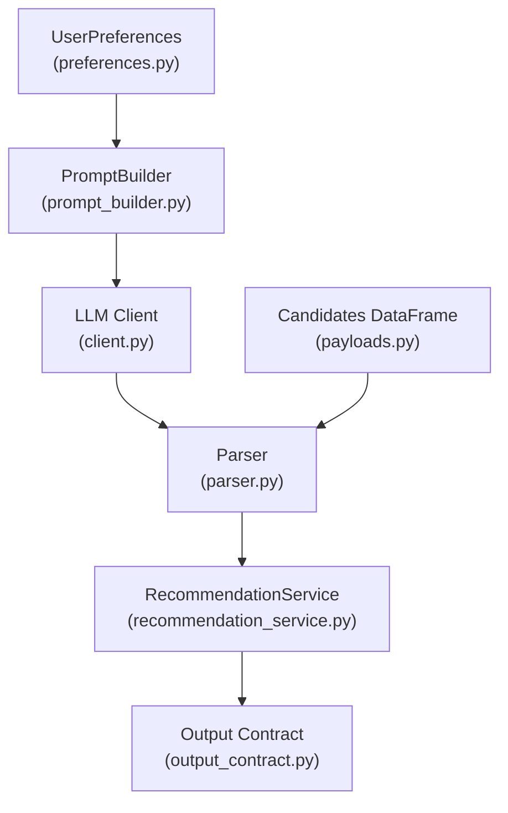
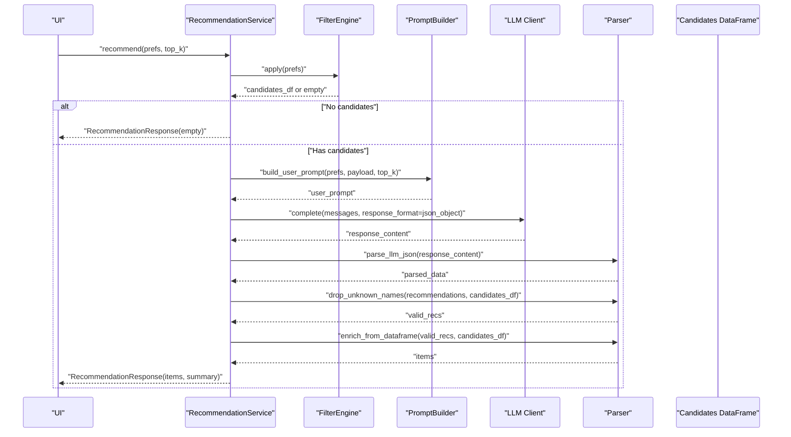
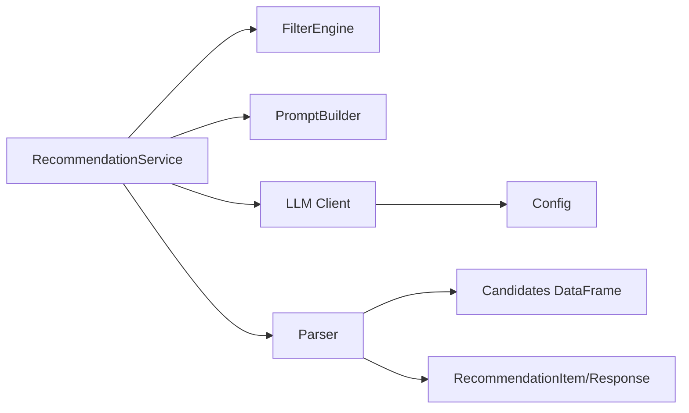

# Response Parsing and Validation

<cite>
**Referenced Files in This Document**
- [parser.py](file://src/llm/parser.py)
- [recommendation_service.py](file://src/services/recommendation_service.py)
- [client.py](file://src/llm/client.py)
- [prompt_builder.py](file://src/llm/prompt_builder.py)
- [output_contract.py](file://src/phases/phase00/output_contract.py)
- [recommendation.py](file://src/models/recommendation.py)
- [payloads.py](file://src/phases/phase02/payloads.py)
- [preferences.py](file://src/phases/phase00/preferences.py)
- [config.py](file://src/config.py)
- [test_recommendation.py](file://tests/test_recommendation.py)
- [EDGE_CASES.md](file://docs/EDGE_CASES.md)
</cite>

## Table of Contents
1. [Introduction](#introduction)
2. [Project Structure](#project-structure)
3. [Core Components](#core-components)
4. [Architecture Overview](#architecture-overview)
5. [Detailed Component Analysis](#detailed-component-analysis)
6. [Dependency Analysis](#dependency-analysis)
7. [Performance Considerations](#performance-considerations)
8. [Troubleshooting Guide](#troubleshooting-guide)
9. [Conclusion](#conclusion)

## Introduction
This document explains the LLM response parsing and validation mechanisms used to transform unstructured LLM outputs into structured, grounded recommendations. It covers:
- JSON extraction and parsing from free-form text
- Anti-hallucination validation to ensure recommendations reference only known restaurants
- Structured output validation and enrichment from ground-truth dataframes
- Recommendation list parsing, rating and cost normalization, and explanation generation
- Error handling for malformed responses and fallback strategies
- Performance and memory considerations for large responses

## Project Structure
The parsing and validation logic spans several modules:
- LLM client and prompt builder orchestrate the request and schema expectations
- Parser extracts and validates JSON, filters hallucinated names, and enriches fields
- Recommendation service coordinates filtering, LLM calls, parsing, validation, and fallback
- Output models define the final UI-renderable shapes

**Diagram sources**
- [preferences.py:20-32](file://src/phases/phase00/preferences.py#L20-L32)
- [prompt_builder.py:30-68](file://src/llm/prompt_builder.py#L30-L68)
- [client.py:14-94](file://src/llm/client.py#L14-L94)
- [parser.py:24-141](file://src/llm/parser.py#L24-L141)
- [recommendation_service.py:37-131](file://src/services/recommendation_service.py#L37-L131)
- [output_contract.py:8-40](file://src/phases/phase00/output_contract.py#L8-L40)
- [payloads.py:27-44](file://src/phases/phase02/payloads.py#L27-L44)

**Section sources**
- [preferences.py:20-32](file://src/phases/phase00/preferences.py#L20-L32)
- [prompt_builder.py:30-68](file://src/llm/prompt_builder.py#L30-L68)
- [client.py:14-94](file://src/llm/client.py#L14-L94)
- [parser.py:24-141](file://src/llm/parser.py#L24-L141)
- [recommendation_service.py:37-131](file://src/services/recommendation_service.py#L37-L131)
- [output_contract.py:8-40](file://src/phases/phase00/output_contract.py#L8-L40)
- [payloads.py:27-44](file://src/phases/phase02/payloads.py#L27-L44)

## Core Components
- JSON extraction and parsing: robustly finds and validates a JSON object from LLM responses, tolerating prose and markdown wrappers
- Anti-hallucination validation: ensures all recommended restaurant names exist in the known candidate list
- Enrichment from ground truth: overwrites fields with verified values and normalizes types (ratings, costs, booleans)
- Structured output validation: enforces schema fields and produces UI-ready items
- Fallback mechanisms: graceful degradation when the LLM is unavailable or returns invalid output

Key responsibilities:
- Parser: extract JSON, validate structure, drop unknown names, enrich fields
- Service: orchestrate filtering, LLM call, parsing, validation, padding, and fallback
- Client: enforce JSON response format and handle retries/backoff
- Models: define output shapes for UI rendering

**Section sources**
- [parser.py:24-141](file://src/llm/parser.py#L24-L141)
- [recommendation_service.py:37-131](file://src/services/recommendation_service.py#L37-L131)
- [client.py:14-94](file://src/llm/client.py#L14-L94)
- [output_contract.py:8-40](file://src/phases/phase00/output_contract.py#L8-L40)
- [recommendation.py:9-17](file://src/models/recommendation.py#L9-L17)

## Architecture Overview
End-to-end flow from user preferences to validated recommendations:

**Diagram sources**
- [recommendation_service.py:37-131](file://src/services/recommendation_service.py#L37-L131)
- [prompt_builder.py:30-68](file://src/llm/prompt_builder.py#L30-L68)
- [client.py:14-94](file://src/llm/client.py#L14-L94)
- [parser.py:24-141](file://src/llm/parser.py#L24-L141)
- [payloads.py:27-44](file://src/phases/phase02/payloads.py#L27-L44)

## Detailed Component Analysis

### JSON Extraction and Parsing
Purpose:
- Extract a JSON object from LLM responses that may include prose or markdown code blocks
- Validate that the extracted JSON is a dictionary with expected keys

Behavior:
- Strips leading/trailing whitespace
- Uses a regex to locate a JSON object bounded by braces
- Parses with JSON decoder and verifies the result is a dictionary
- Raises a clear error if parsing fails

Validation rules:
- Rejects non-dictionary JSON
- Logs original response for debugging

Examples:
- Successful clean JSON: parses and returns the object
- Markdown-wrapped JSON: extracts inner JSON and parses
- Invalid JSON: raises a value error

Edge cases covered:
- Prose before/after JSON
- Markdown fences
- Empty or malformed content

**Section sources**
- [parser.py:24-44](file://src/llm/parser.py#L24-L44)
- [test_recommendation.py:48-71](file://tests/test_recommendation.py#L48-L71)

### Anti-Hallucination Validation
Purpose:
- Ensure all recommended restaurant names exist in the known candidate list
- Prevent recommending fictional or misspelled restaurants

Behavior:
- Builds a case-insensitive lookup of candidate names
- Filters recommendations whose names are not present in the candidate set
- Emits warnings for dropped entries

Validation rules:
- Case-insensitive comparison
- Drops entries with missing names
- Preserves explanations for remaining entries

Padding logic:
- If fewer valid recommendations than requested, fills remaining slots with top candidates not already recommended
- Generates template explanations for padded entries

**Section sources**
- [parser.py:45-66](file://src/llm/parser.py#L45-L66)
- [recommendation_service.py:88-111](file://src/services/recommendation_service.py#L88-L111)
- [test_recommendation.py:75-90](file://tests/test_recommendation.py#L75-L90)
- [test_recommendation.py:255-280](file://tests/test_recommendation.py#L255-L280)

### Enrichment from Ground Truth
Purpose:
- Overwrite recommendation fields with verified values from the candidate DataFrame
- Normalize types (ratings, costs, booleans) and handle missing values

Behavior:
- Creates a case-insensitive lookup map keyed by restaurant name
- Iterates through validated recommendations and enriches each item
- Converts booleans from string-like values to Python booleans
- Normalizes numeric fields and cleans missing values

Fields enriched:
- Name casing restored to match database
- Cuisine, rating, cost for two, location, dish liked, votes
- Boolean flags for table booking and online ordering

**Section sources**
- [parser.py:68-141](file://src/llm/parser.py#L68-L141)
- [recommendation_service.py:113-122](file://src/services/recommendation_service.py#L113-L122)
- [test_recommendation.py:91-128](file://tests/test_recommendation.py#L91-L128)

### Structured Output Validation and Recommendations
Purpose:
- Enforce schema compliance and produce UI-ready items

Behavior:
- Validates presence of required fields and applies type constraints
- Produces a list of items with ranks, names, cuisines, ratings, costs, explanations, locations, dishes, and flags
- Limits output to top-K results

Models:
- RecommendationItem defines the UI shape
- RestaurantRecommendation defines the expected LLM schema

**Section sources**
- [output_contract.py:8-40](file://src/phases/phase00/output_contract.py#L8-L40)
- [recommendation.py:9-17](file://src/models/recommendation.py#L9-L17)
- [recommendation_service.py:116-122](file://src/services/recommendation_service.py#L116-L122)

### LLM Client and Retry Strategy
Purpose:
- Call the LLM API with a JSON response format and robust retry/backoff

Behavior:
- Sends a chat completion request with temperature tuned for deterministic outputs
- Enforces response_format=json_object to encourage structured JSON
- Retries on 429 and 5xx with exponential backoff
- Raises unrecoverable errors immediately for 4xx except 429

**Section sources**
- [client.py:14-94](file://src/llm/client.py#L14-L94)
- [test_recommendation.py:133-155](file://tests/test_recommendation.py#L133-L155)

### Fallback Mechanisms
Purpose:
- Provide reliable recommendations when the LLM is unavailable or returns invalid output

Behavior:
- If API key is missing, falls back to a scorer-based ranking with template explanations
- On LLM failures, logs the error and returns items with fallback explanations
- Ensures at least top-K results by padding with high-ranked candidates when necessary

**Section sources**
- [recommendation_service.py:59-66](file://src/services/recommendation_service.py#L59-L66)
- [recommendation_service.py:124-131](file://src/services/recommendation_service.py#L124-L131)
- [recommendation_service.py:132-199](file://src/services/recommendation_service.py#L132-L199)
- [test_recommendation.py:227-251](file://tests/test_recommendation.py#L227-L251)

### Prompt Building and Schema Enforcement
Purpose:
- Provide the LLM with explicit instructions to avoid hallucinations and return structured JSON

Behavior:
- System prompt enforces grounding, JSON-only output, and schema
- User prompt includes user preferences and a compact candidate list
- Payload shaping reduces token usage and avoids heavy text fields

**Section sources**
- [prompt_builder.py:9-28](file://src/llm/prompt_builder.py#L9-L28)
- [prompt_builder.py:30-68](file://src/llm/prompt_builder.py#L30-L68)
- [payloads.py:27-44](file://src/phases/phase02/payloads.py#L27-L44)

## Dependency Analysis
Key dependencies and relationships:
- RecommendationService depends on FilterEngine, PromptBuilder, LLM Client, and Parser
- Parser depends on pandas for DataFrame operations and on RecommendationItem for output
- Client depends on configuration for credentials and endpoint
- Models define the canonical output shapes consumed by the UI

**Diagram sources**
- [recommendation_service.py:37-131](file://src/services/recommendation_service.py#L37-L131)
- [parser.py:68-141](file://src/llm/parser.py#L68-L141)
- [client.py:14-94](file://src/llm/client.py#L14-L94)
- [output_contract.py:8-40](file://src/phases/phase00/output_contract.py#L8-L40)
- [config.py:26-41](file://src/config.py#L26-L41)
- [payloads.py:27-44](file://src/phases/phase02/payloads.py#L27-L44)

**Section sources**
- [recommendation_service.py:37-131](file://src/services/recommendation_service.py#L37-L131)
- [parser.py:68-141](file://src/llm/parser.py#L68-L141)
- [client.py:14-94](file://src/llm/client.py#L14-L94)
- [output_contract.py:8-40](file://src/phases/phase00/output_contract.py#L8-L40)
- [config.py:26-41](file://src/config.py#L26-L41)
- [payloads.py:27-44](file://src/phases/phase02/payloads.py#L27-L44)

## Performance Considerations
- Token efficiency: the payload builder limits columns and replaces NaN with None to keep JSON compact
- Early exit: if no candidates are found, the service short-circuits and avoids calling the LLM
- Backoff and timeouts: the client retries transient errors with exponential backoff and enforces timeouts
- Memory management: large text columns are excluded from the payload to prevent oversized requests and cache bloat
- Output limiting: results are truncated to top-K after validation to avoid UI overload

[No sources needed since this section provides general guidance]

## Troubleshooting Guide
Common issues and resolutions:
- Missing API key: triggers fallback ranking with a user-facing message
- Rate limit or server errors: client retries with backoff; on exhaustion, falls back
- Malformed JSON: parser extracts JSON block; if parsing fails, service falls back
- Hallucinated names: dropped with warnings; service pads to top-K when possible
- Empty candidates: returns empty items with filter reasons
- Wrong types or missing fields: enrichment normalizes values; missing values become None/default

Operational tips:
- Validate configuration (provider, base URL, model) before calling the LLM
- Monitor logs for rate-limit and server errors
- Keep candidate lists canonical and consistent to minimize case mismatches

**Section sources**
- [client.py:36-94](file://src/llm/client.py#L36-L94)
- [parser.py:24-44](file://src/llm/parser.py#L24-L44)
- [parser.py:45-66](file://src/llm/parser.py#L45-L66)
- [recommendation_service.py:47-54](file://src/services/recommendation_service.py#L47-L54)
- [recommendation_service.py:124-131](file://src/services/recommendation_service.py#L124-L131)
- [EDGE_CASES.md:65-94](file://docs/EDGE_CASES.md#L65-L94)

## Conclusion
The parsing and validation pipeline ensures that LLM-generated recommendations are grounded, structured, and ready for UI rendering. It combines robust JSON extraction, anti-hallucination checks, and ground-truth enrichment with graceful fallbacks and strong error handling. Together with prompt engineering and payload shaping, it delivers reliable, high-quality recommendations even under adverse conditions.