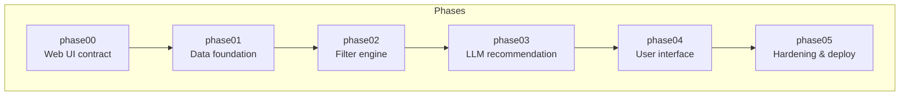
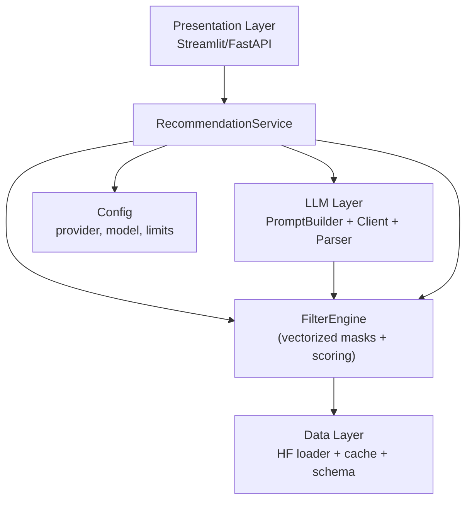
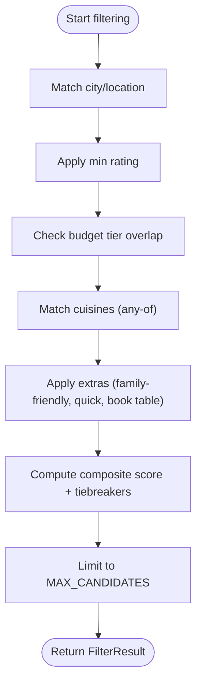
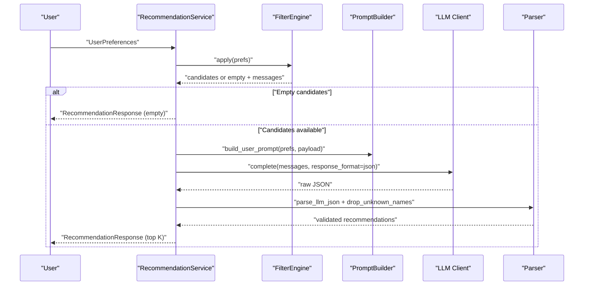
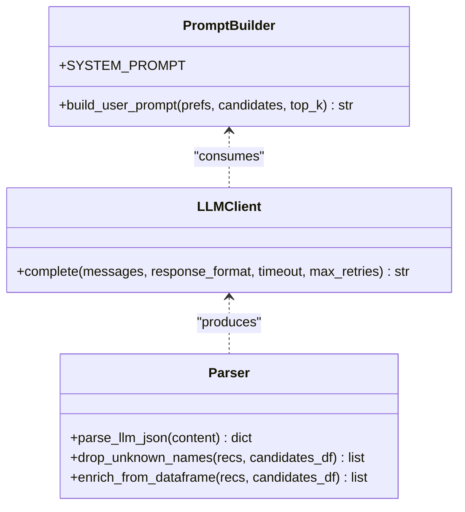
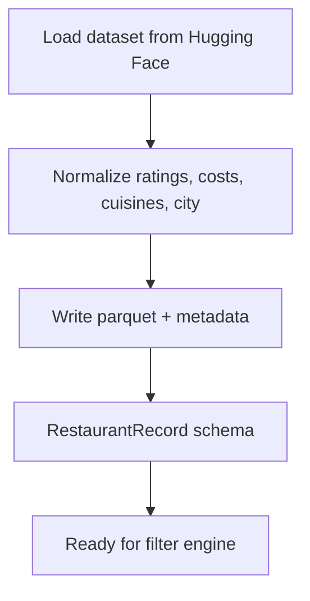
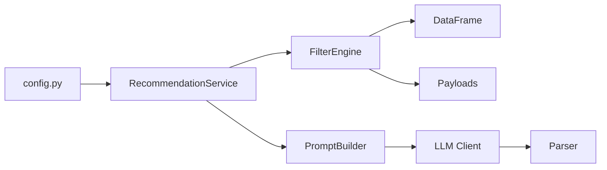

# Introduction

<cite>
**Referenced Files in This Document**
- [README.md](file://README.md)
- [ARCHITECTURE.md](file://docs/ARCHITECTURE.md)
- [phases.md](file://docs/phases.md)
- [config.py](file://src/config.py)
- [preferences.py](file://src/phases/phase00/preferences.py)
- [output_contract.py](file://src/phases/phase00/output_contract.py)
- [restaurant_record.py](file://src/phases/phase01/restaurant_record.py)
- [engine.py](file://src/phases/phase02/engine.py)
- [payloads.py](file://src/phases/phase02/payloads.py)
- [recommendation_service.py](file://src/services/recommendation_service.py)
- [prompt_builder.py](file://src/llm/prompt_builder.py)
- [client.py](file://src/llm/client.py)
- [try_recommend.py](file://scripts/try_recommend.py)
- [test_recommendation.py](file://tests/test_recommendation.py)
- [test_filter_engine.py](file://tests/test_filter_engine.py)
</cite>

## Table of Contents
1. [Introduction](#introduction)
2. [Project Structure](#project-structure)
3. [Core Components](#core-components)
4. [Architecture Overview](#architecture-overview)
5. [Detailed Component Analysis](#detailed-component-analysis)
6. [Dependency Analysis](#dependency-analysis)
7. [Performance Considerations](#performance-considerations)
8. [Troubleshooting Guide](#troubleshooting-guide)
9. [Conclusion](#conclusion)
10. [Appendices](#appendices)

## Introduction
This project is an AI-powered restaurant recommendation system built on the Zomato dataset and powered by Groq’s LLM APIs. It solves the challenge of delivering personalized, explainable recommendations at low latency by combining a structured filter engine with a targeted LLM ranking step. Users specify preferences such as city, budget tier, cuisines, minimum rating, and extra features, and the system returns top restaurants with clear explanations grounded in the candidate set.

Key value propositions:
- Personalization with explainability: Recommendations are grounded in the dataset and include concise explanations.
- Low-latency UX: Pre-filtering reduces LLM input size to a small, curated list.
- Resilience: Graceful fallback to structured ranking when the LLM is unavailable or fails.
- Reproducible data: Cached, versioned datasets minimize variability and speed up development and deployment.

Target audience:
- Developers building AI recommendation systems with structured data.
- Product teams prototyping explainable AI features.
- Data scientists optimizing retrieval and ranking pipelines.

## Project Structure
The repository follows a phased architecture that builds a working vertical slice per phase, enabling incremental delivery and testability. The phased layout ensures clear contracts between layers and supports rollback and maintenance.

**Diagram sources**
- [phases.md:18-25](file://docs/phases.md#L18-L25)

**Section sources**
- [README.md:14-39](file://README.md#L14-L39)
- [phases.md:3-26](file://docs/phases.md#L3-L26)

## Core Components
- User preferences model: Defines canonical input schema for city, budget tier, cuisines, minimum rating, extras, and optional notes.
- Filter engine: Applies fast, vectorized filters and composite scoring to produce a small candidate list for the LLM.
- LLM layer: Builds structured prompts, calls Groq/OpenAI-compatible APIs, parses JSON responses, and validates against the candidate set.
- Recommendation service: Orchestrates filtering, LLM invocation, parsing, grounding, and fallback ranking.
- Configuration: Centralizes environment-driven settings for providers, models, and runtime limits.

Practical example: A user selects “Bangalore,” “medium” budget, “Chinese” cuisine, and minimum rating 4.0. The filter engine shortlists nearby restaurants meeting the criteria, the LLM ranks them and explains why, and the service returns top results with explanations.

**Section sources**
- [preferences.py:20-71](file://src/phases/phase00/preferences.py#L20-L71)
- [engine.py:140-197](file://src/phases/phase02/engine.py#L140-L197)
- [recommendation_service.py:30-200](file://src/services/recommendation_service.py#L30-L200)
- [config.py:26-47](file://src/config.py#L26-L47)

## Architecture Overview
The system employs a phased architecture with layered responsibilities and strict contracts. The recommendation lifecycle integrates data ingestion, filtering, LLM ranking, and presentation.

**Diagram sources**
- [ARCHITECTURE.md:12-39](file://docs/ARCHITECTURE.md#L12-L39)
- [recommendation_service.py:30-131](file://src/services/recommendation_service.py#L30-L131)
- [engine.py:140-197](file://src/phases/phase2/engine.py#L140-L197)
- [prompt_builder.py:30-69](file://src/llm/prompt_builder.py#L30-L69)
- [client.py:14-94](file://src/llm/client.py#L14-L94)
- [config.py:26-47](file://src/config.py#L26-L47)

**Section sources**
- [ARCHITECTURE.md:43-121](file://docs/ARCHITECTURE.md#L43-L121)
- [ARCHITECTURE.md:122-143](file://docs/ARCHITECTURE.md#L122-L143)

## Detailed Component Analysis

### Filter Engine
The filter engine transforms user preferences into a compact candidate list using vectorized masks and a composite scoring function. It logs funnel statistics and provides human-readable reasons when no candidates remain.

**Diagram sources**
- [engine.py:146-189](file://src/phases/phase02/engine.py#L146-L189)

**Section sources**
- [engine.py:41-102](file://src/phases/phase02/engine.py#L41-L102)
- [engine.py:104-137](file://src/phases/phase02/engine.py#L104-L137)
- [engine.py:140-197](file://src/phases/phase02/engine.py#L140-L197)

### Recommendation Workflow
The recommendation service coordinates filtering, LLM ranking, and fallback behavior. It also ensures grounded outputs by validating names against the filtered dataset and enriching fields from the original data.

**Diagram sources**
- [recommendation_service.py:37-131](file://src/services/recommendation_service.py#L37-L131)
- [prompt_builder.py:30-69](file://src/llm/prompt_builder.py#L30-L69)
- [client.py:14-94](file://src/llm/client.py#L14-L94)
- [payloads.py:27-44](file://src/phases/phase02/payloads.py#L27-L44)

**Section sources**
- [recommendation_service.py:30-200](file://src/services/recommendation_service.py#L30-L200)
- [prompt_builder.py:9-28](file://src/llm/prompt_builder.py#L9-L28)
- [client.py:36-94](file://src/llm/client.py#L36-L94)
- [payloads.py:9-44](file://src/phases/phase02/payloads.py#L9-L44)

### LLM Layer
The LLM layer defines a strict system prompt and user prompt schema, enforces JSON output, and handles retries and structured parsing. It guarantees grounded recommendations by validating names against the filtered dataset and enriching fields from the dataframe.

**Diagram sources**
- [prompt_builder.py:9-69](file://src/llm/prompt_builder.py#L9-L69)
- [client.py:14-94](file://src/llm/client.py#L14-L94)
- [test_recommendation.py:48-128](file://tests/test_recommendation.py#L48-L128)

**Section sources**
- [prompt_builder.py:9-69](file://src/llm/prompt_builder.py#L9-L69)
- [client.py:14-94](file://src/llm/client.py#L14-L94)
- [test_recommendation.py:48-128](file://tests/test_recommendation.py#L48-L128)

### Data and Schema
The data layer loads, cleans, and caches the Zomato dataset, exposing a stable record schema for downstream components. It focuses on essential fields and precomputes budget tiers to accelerate filtering.

**Diagram sources**
- [ARCHITECTURE.md:45-60](file://docs/ARCHITECTURE.md#L45-L60)
- [restaurant_record.py:8-30](file://src/phases/phase01/restaurant_record.py#L8-L30)

**Section sources**
- [ARCHITECTURE.md:45-60](file://docs/ARCHITECTURE.md#L45-L60)
- [restaurant_record.py:8-30](file://src/phases/phase01/restaurant_record.py#L8-L30)

### Practical Examples
- End-to-end CLI example: The Phase 03 CLI demonstrates loading cached data, constructing preferences, initializing the recommendation service, and printing results.
- Test-backed scenarios: Unit tests validate prompt construction, JSON parsing, grounding, retry behavior, and fallback ranking.

**Section sources**
- [try_recommend.py:21-95](file://scripts/try_recommend.py#L21-L95)
- [test_recommendation.py:19-280](file://tests/test_recommendation.py#L19-L280)
- [test_filter_engine.py:85-185](file://tests/test_filter_engine.py#L85-L185)

## Dependency Analysis
The phased architecture defines a clear dependency order: data foundation feeds the filter engine, which supplies the LLM layer, and the recommendation service orchestrates the end-to-end flow. Configuration drives provider and model selection.

**Diagram sources**
- [config.py:26-47](file://src/config.py#L26-L47)
- [recommendation_service.py:9-17](file://src/services/recommendation_service.py#L9-L17)
- [engine.py:14-17](file://src/phases/phase02/engine.py#L14-L17)
- [payloads.py:9-24](file://src/phases/phase02/payloads.py#L9-L24)
- [prompt_builder.py:7](file://src/llm/prompt_builder.py#L7)
- [client.py:10](file://src/llm/client.py#L10)

**Section sources**
- [phases.md:214-222](file://docs/phases.md#L214-L222)
- [config.py:26-47](file://src/config.py#L26-L47)

## Performance Considerations
- Filter performance: The filter engine targets sub-200 ms on warm caches for large datasets, ensuring the LLM receives a small, manageable list.
- LLM latency: The system targets 2–8 seconds for LLM calls and under 10 seconds total UX with loading indicators.
- Token efficiency: The prompt includes only key fields to reduce token usage and cost.
- Retry and backoff: The LLM client implements exponential backoff for 429/5xx and timeouts.

**Section sources**
- [ARCHITECTURE.md:136-142](file://docs/ARCHITECTURE.md#L136-L142)
- [test_filter_engine.py:167-185](file://tests/test_filter_engine.py#L167-L185)
- [client.py:55-94](file://src/llm/client.py#L55-L94)

## Troubleshooting Guide
Common issues and remedies:
- Missing API key: The recommendation service falls back to structured ranking and surfaces a clear message.
- LLM failures: The service catches exceptions and returns fallback results with enriched fields.
- Empty candidates: The filter engine provides actionable reasons (e.g., city mismatch, rating threshold, budget tier).
- Grounding concerns: The parser drops hallucinated names and enriches outputs from the dataframe.

**Section sources**
- [recommendation_service.py:60-131](file://src/services/recommendation_service.py#L60-L131)
- [engine.py:104-137](file://src/phases/phase02/engine.py#L104-L137)
- [test_recommendation.py:188-251](file://tests/test_recommendation.py#L188-L251)

## Conclusion
This system delivers a robust, explainable, and resilient restaurant recommendation pipeline. By separating concerns into distinct layers—data, filter, LLM, and presentation—and enforcing strict contracts, it balances personalization with performance and reliability. The phased architecture accelerates delivery, simplifies testing, and prepares the system for future enhancements such as collaborative filtering, richer UI, and caching of repeated queries.

## Appendices

### Environment and Setup
- Environment variables: Provider, model, base URL, and cache paths are configured via environment variables and defaults.
- CLI usage: The Phase 03 CLI demonstrates end-to-end recommendation with configurable preferences and cache path.

**Section sources**
- [config.py:26-47](file://src/config.py#L26-L47)
- [try_recommend.py:21-95](file://scripts/try_recommend.py#L21-L95)