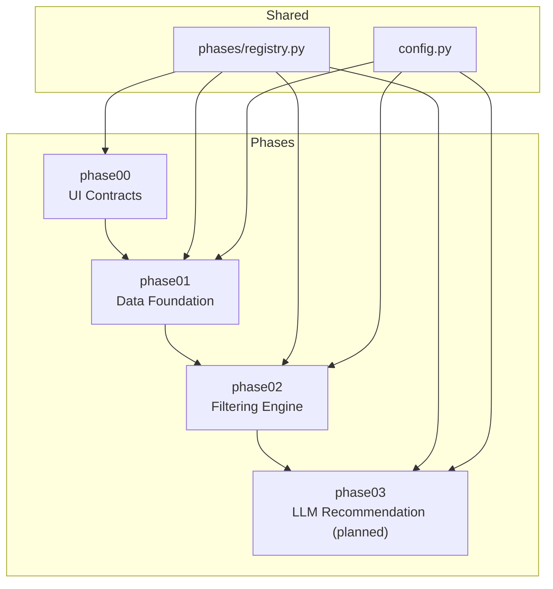
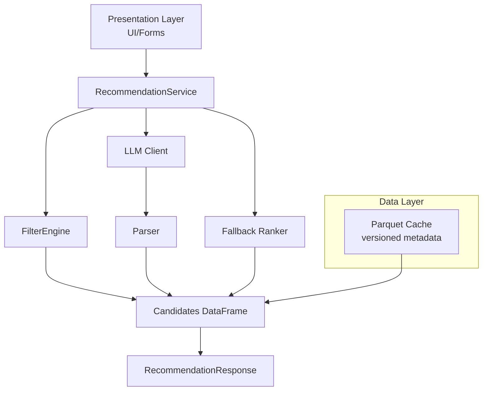
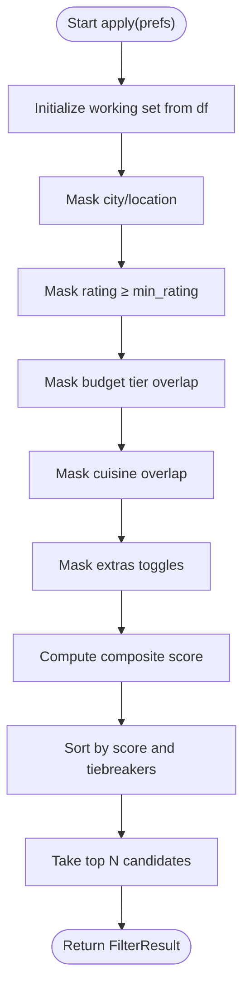
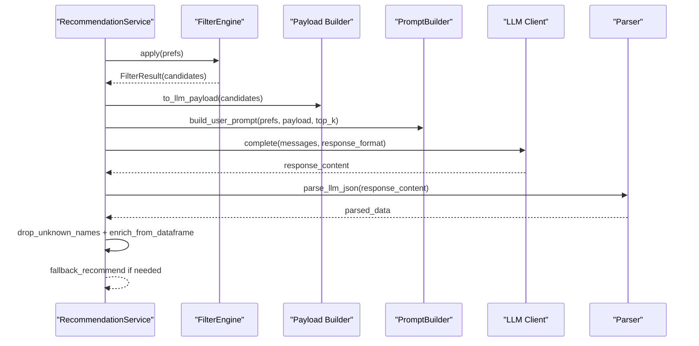
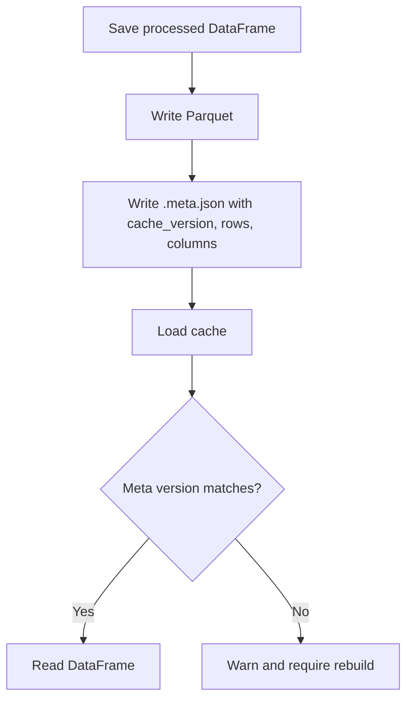
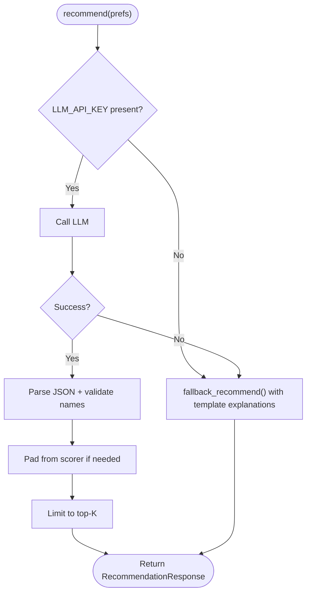
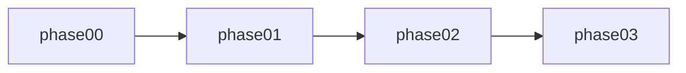
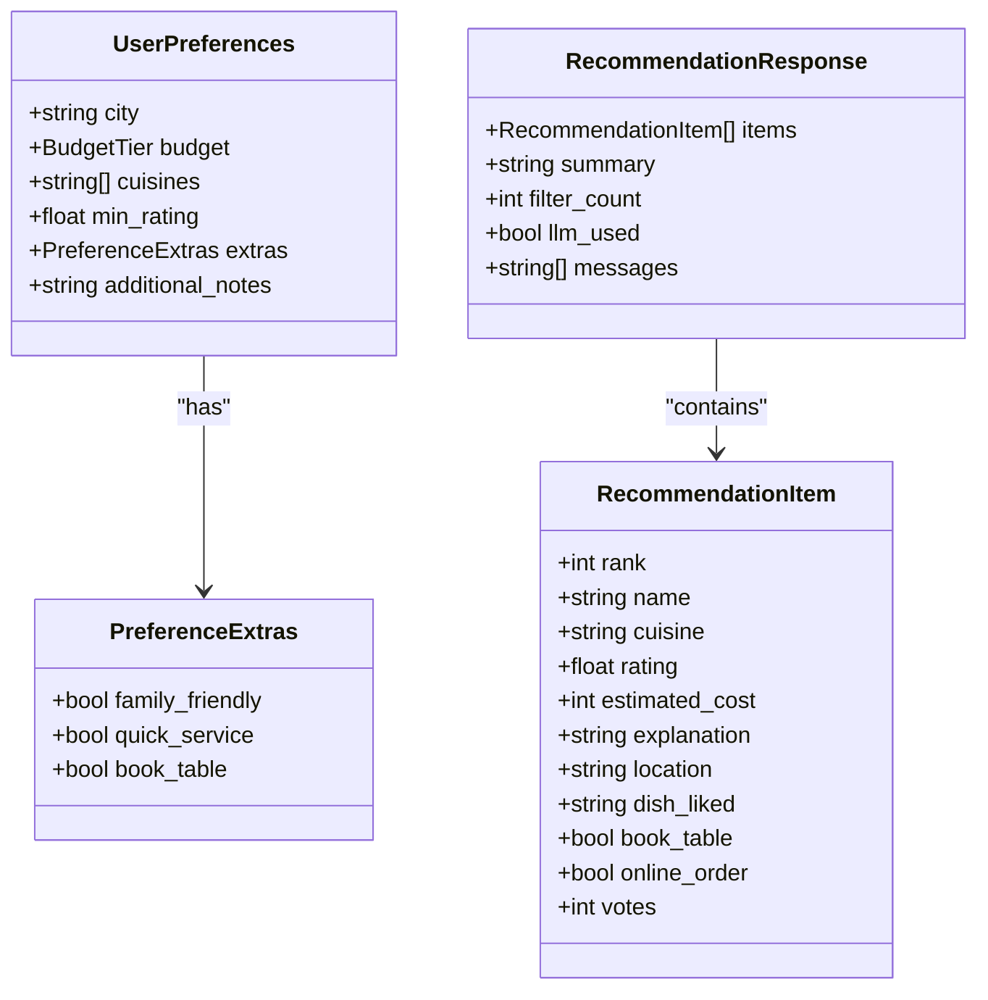
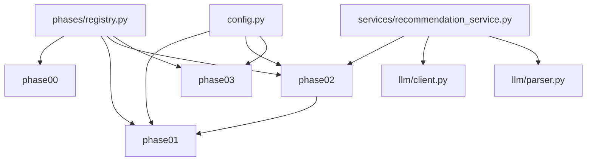

# Key Features

<cite>
**Referenced Files in This Document**
- [README.md](file://README.md)
- [ARCHITECTURE.md](file://docs/ARCHITECTURE.md)
- [config.py](file://src/config.py)
- [registry.py](file://src/phases/registry.py)
- [recommendation_service.py](file://src/services/recommendation_service.py)
- [engine.py](file://src/phases/phase02/engine.py)
- [scorer.py](file://src/phases/phase02/scorer.py)
- [cache.py](file://src/phases/phase01/cache.py)
- [client.py](file://src/llm/client.py)
- [parser.py](file://src/llm/parser.py)
- [preferences.py](file://src/phases/phase00/preferences.py)
- [ui_bridge.py](file://src/phases/phase00/ui_bridge.py)
- [output_contract.py](file://src/phases/phase00/output_contract.py)
- [restaurant.py](file://src/models/restaurant.py)
- [recommendation.py](file://src/models/recommendation.py)
</cite>

## Table of Contents
1. [Introduction](#introduction)
2. [Project Structure](#project-structure)
3. [Core Components](#core-components)
4. [Architecture Overview](#architecture-overview)
5. [Detailed Component Analysis](#detailed-component-analysis)
6. [Dependency Analysis](#dependency-analysis)
7. [Performance Considerations](#performance-considerations)
8. [Troubleshooting Guide](#troubleshooting-guide)
9. [Conclusion](#conclusion)

## Introduction
This document explains the key features of the Zomato AI Recommendation System with a focus on:
- Structured preference-based filtering
- LLM-powered recommendation generation with explainable AI
- Data caching and reproducible processing pipeline
- Graceful fallback mechanisms
- Modular phased architecture

Each feature is described in terms of its role in recommendation quality and user experience, with concrete references to implementation and usage patterns from the codebase.

## Project Structure
The system is organized into development phases that define clear boundaries and dependencies. The phased architecture ensures modularity, testability, and safe rollbacks.

**Diagram sources**
- [registry.py:28-68](file://src/phases/registry.py#L28-L68)
- [config.py:40-47](file://src/config.py#L40-L47)

**Section sources**
- [README.md:14-39](file://README.md#L14-L39)
- [ARCHITECTURE.md:146-181](file://docs/ARCHITECTURE.md#L146-L181)
- [registry.py:1-84](file://src/phases/registry.py#L1-L84)

## Core Components
- Structured preference-based filtering: Applies vectorized masks and composite scoring to reduce the candidate set to a small, LLM-friendly list.
- LLM-powered recommendation: Builds a constrained prompt, calls the LLM client, parses structured JSON, validates names against candidates, and enriches fields from the dataset.
- Data caching: Writes and reads a versioned Parquet cache with metadata to ensure reproducibility and fast startup.
- Graceful fallback: If the LLM is unavailable or fails, the system returns top-N results ranked by the pre-LLM scorer with templated explanations.
- Modular phased architecture: Explicit phase manifests and dependency order enable incremental delivery and safe rollbacks.

**Section sources**
- [engine.py:140-197](file://src/phases/phase02/engine.py#L140-L197)
- [scorer.py:29-69](file://src/phases/phase02/scorer.py#L29-L69)
- [client.py:14-94](file://src/llm/client.py#L14-L94)
- [parser.py:24-141](file://src/llm/parser.py#L24-L141)
- [cache.py:27-64](file://src/phases/phase01/cache.py#L27-L64)
- [recommendation_service.py:30-200](file://src/services/recommendation_service.py#L30-L200)
- [registry.py:28-68](file://src/phases/registry.py#L28-L68)

## Architecture Overview
The system separates concerns across layers: Data, Filter, LLM, and Presentation. It minimizes LLM calls by pre-filtering candidates and caches processed data for reproducibility. The orchestration service coordinates filtering and LLM ranking, with a robust fallback path.

**Diagram sources**
- [ARCHITECTURE.md:122-134](file://docs/ARCHITECTURE.md#L122-L134)
- [recommendation_service.py:37-131](file://src/services/recommendation_service.py#L37-L131)
- [engine.py:146-189](file://src/phases/phase02/engine.py#L146-L189)
- [client.py:14-94](file://src/llm/client.py#L14-L94)
- [parser.py:45-141](file://src/llm/parser.py#L45-L141)
- [cache.py:46-63](file://src/phases/phase01/cache.py#L46-L63)

## Detailed Component Analysis

### Structured Preference-Based Filtering
- Purpose: Efficiently narrow the dataset to a small set suitable for LLM ranking while preserving explainability.
- Implementation highlights:
  - Vectorized masks for city/location, rating threshold, budget tier overlap, cuisine overlap, and extras toggles.
  - Composite scoring and deterministic tiebreaking to select top candidates.
  - Empty-state messaging to guide users when no results remain.
- Example usage patterns:
  - Apply filters in order: city → rating → budget → cuisine → extras.
  - Return a FilterResult with funnel counts and human-readable messages.

**Diagram sources**
- [engine.py:146-189](file://src/phases/phase02/engine.py#L146-L189)
- [scorer.py:29-69](file://src/phases/phase02/scorer.py#L29-L69)

**Section sources**
- [engine.py:41-102](file://src/phases/phase02/engine.py#L41-L102)
- [engine.py:104-137](file://src/phases/phase02/engine.py#L104-L137)
- [scorer.py:15-69](file://src/phases/phase02/scorer.py#L15-L69)

### LLM-Powered Recommendation with Explainable AI
- Purpose: Provide personalized rankings and explanations while preventing hallucinations and controlling token usage.
- Implementation highlights:
  - Stable payload construction from filtered candidates.
  - System and user prompt building with explicit JSON schema.
  - Structured output mode and robust parsing with JSON extraction and validation.
  - Name validation against candidates and enrichment of fields from the dataset.
  - Fallback to structured ranking if LLM is unavailable or fails.
- Example usage patterns:
  - Build messages with system + user prompt.
  - Complete LLM call with retries and exponential backoff.
  - Parse JSON, drop unknown names, pad with scorer if needed, and limit to top-K.

**Diagram sources**
- [recommendation_service.py:37-131](file://src/services/recommendation_service.py#L37-L131)
- [client.py:14-94](file://src/llm/client.py#L14-L94)
- [parser.py:24-141](file://src/llm/parser.py#L24-L141)

**Section sources**
- [recommendation_service.py:37-131](file://src/services/recommendation_service.py#L37-L131)
- [client.py:14-94](file://src/llm/client.py#L14-L94)
- [parser.py:24-141](file://src/llm/parser.py#L24-L141)

### Data Caching and Reproducible Processing Pipeline
- Purpose: Ensure fast startup, reproducibility, and safe migrations by caching processed data with versioned metadata.
- Implementation highlights:
  - Save processed DataFrame to Parquet with metadata including cache version, row count, column set, and write timestamp.
  - Load cache with version checks; warn and require rebuild if mismatched.
  - Centralized cache path configuration with environment override.
- Example usage patterns:
  - Build cache once and reuse across runs.
  - Invalidate and rebuild when schema or processing logic changes.

**Diagram sources**
- [cache.py:27-63](file://src/phases/phase01/cache.py#L27-L63)
- [config.py:43-47](file://src/config.py#L43-L47)

**Section sources**
- [cache.py:27-63](file://src/phases/phase01/cache.py#L27-L63)
- [config.py:43-47](file://src/config.py#L43-L47)

### Graceful Fallback Mechanisms
- Purpose: Maintain a good user experience even when the LLM is unavailable or fails.
- Implementation highlights:
  - Detect missing API key and log a warning; return top-N results with structured explanations.
  - On LLM exceptions, log error and fall back to pre-LLM ranking with template explanations.
  - Pad recommendations from scorer when LLM returns fewer results than requested.
- Example usage patterns:
  - Return a RecommendationResponse with llm_used=false and user-facing messages.

**Diagram sources**
- [recommendation_service.py:59-131](file://src/services/recommendation_service.py#L59-L131)
- [parser.py:45-66](file://src/llm/parser.py#L45-L66)

**Section sources**
- [recommendation_service.py:59-131](file://src/services/recommendation_service.py#L59-L131)
- [parser.py:45-66](file://src/llm/parser.py#L45-L66)

### Modular Phased Architecture
- Purpose: Enable incremental delivery, testability, and safe rollbacks by enforcing strict dependency order.
- Implementation highlights:
  - Phase manifests define id, slug, package, dependencies, and rollback hints.
  - Utility to assert dependency order at runtime for safety.
  - Clear separation of concerns across phases with explicit contracts.
- Example usage patterns:
  - Use phase registry to reason about scope and rollback options.
  - Import downstream phases only from earlier phases.

**Diagram sources**
- [registry.py:28-68](file://src/phases/registry.py#L28-L68)

**Section sources**
- [registry.py:28-84](file://src/phases/registry.py#L28-L84)
- [ARCHITECTURE.md:215-219](file://docs/ARCHITECTURE.md#L215-L219)

### Preference Models and UI Bridge
- Purpose: Define canonical input and output contracts and normalize UI inputs to dataset-facing values.
- Implementation highlights:
  - UserPreferences model with validators for city, cuisines, and budget tiers.
  - PreferenceExtras toggles mapped to dataset columns.
  - UI bridge normalizes city aliases and coerces extras safely.
  - Output contract defines RecommendationItem and RecommendationResponse shapes.
- Example usage patterns:
  - Build UserPreferences from UI payload and validate early.
  - Apply city aliases before filtering.

**Diagram sources**
- [preferences.py:20-71](file://src/phases/phase00/preferences.py#L20-L71)
- [output_contract.py:8-52](file://src/phases/phase00/output_contract.py#L8-L52)

**Section sources**
- [preferences.py:20-71](file://src/phases/phase00/preferences.py#L20-L71)
- [ui_bridge.py:30-98](file://src/phases/phase00/ui_bridge.py#L30-L98)
- [output_contract.py:8-52](file://src/phases/phase00/output_contract.py#L8-L52)
- [restaurant.py:1-6](file://src/models/restaurant.py#L1-L6)
- [recommendation.py:9-23](file://src/models/recommendation.py#L9-L23)

## Dependency Analysis
The system enforces a strict dependency order across phases and layers. The orchestration service depends on the filter engine and LLM components, while configuration and registry govern environment and phase ordering.

**Diagram sources**
- [registry.py:28-68](file://src/phases/registry.py#L28-L68)
- [config.py:26-47](file://src/config.py#L26-L47)
- [recommendation_service.py:10-16](file://src/services/recommendation_service.py#L10-L16)

**Section sources**
- [registry.py:28-84](file://src/phases/registry.py#L28-L84)
- [config.py:26-47](file://src/config.py#L26-L47)
- [recommendation_service.py:10-16](file://src/services/recommendation_service.py#L10-L16)

## Performance Considerations
- Minimizing LLM cost and latency:
  - Pre-filter candidates to a small set before LLM ranking.
  - Use structured, compact payloads and JSON mode to reduce token usage.
- Data layer efficiency:
  - Cache processed data as Parquet with minimal columns and compute budget tiers once.
- LLM client reliability:
  - Exponential backoff retries for transient errors; avoid retrying unrecoverable HTTP errors.
- Scoring determinism:
  - Composite score and stable sort order ensure consistent pre-LLM ranking.

[No sources needed since this section provides general guidance]

## Troubleshooting Guide
- Missing API key:
  - Symptom: Warning logged and fallback path triggered.
  - Action: Set the appropriate LLM API key in environment variables.
- LLM failures:
  - Symptom: Exception caught and fallback executed with user-facing message.
  - Action: Inspect logs for error details; verify network connectivity and quotas.
- Cache version mismatch:
  - Symptom: Warning to rebuild cache.
  - Action: Run the cache build script to regenerate with current schema.
- Empty filter results:
  - Symptom: Friendly messages guiding users to relax filters.
  - Action: Review funnel messages and adjust preferences accordingly.

**Section sources**
- [recommendation_service.py:60-66](file://src/services/recommendation_service.py#L60-L66)
- [recommendation_service.py:124-130](file://src/services/recommendation_service.py#L124-L130)
- [cache.py:55-60](file://src/phases/phase01/cache.py#L55-L60)
- [engine.py:104-137](file://src/phases/phase02/engine.py#L104-L137)

## Conclusion
The Zomato AI Recommendation System achieves high-quality, explainable recommendations through a disciplined combination of structured filtering, constrained LLM prompting, reproducible caching, and resilient fallbacks. The phased architecture ensures modularity and maintainability, enabling incremental delivery and safe rollouts. Together, these features improve both recommendation quality and user experience by reducing latency, controlling hallucinations, and maintaining responsiveness even under partial system failures.