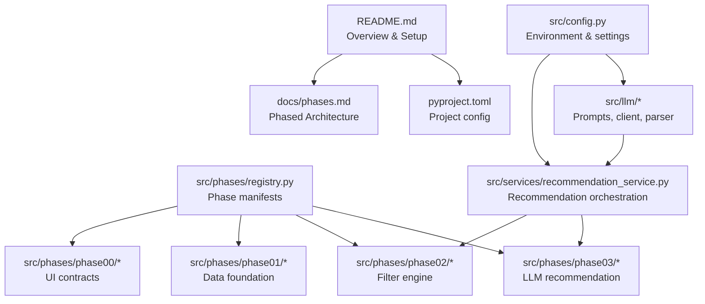
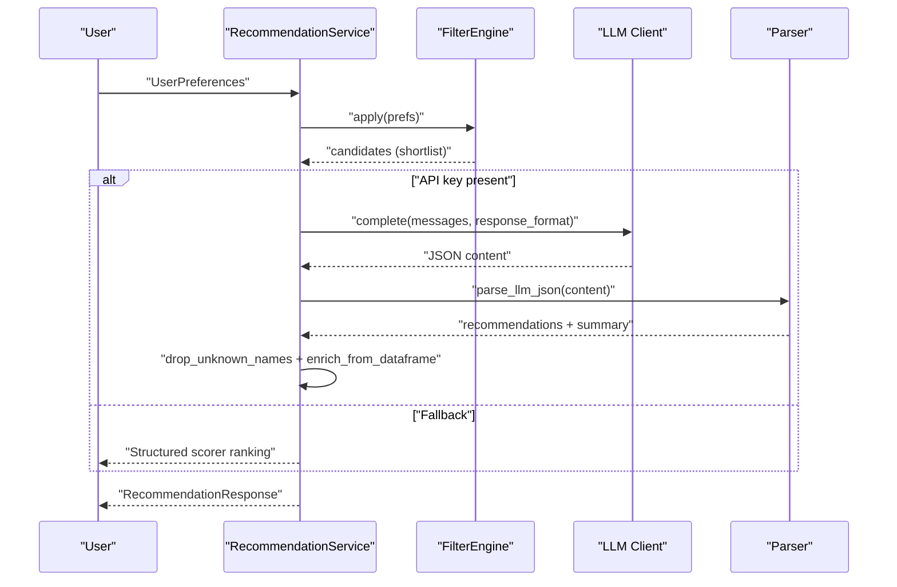
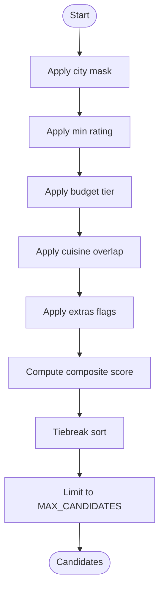
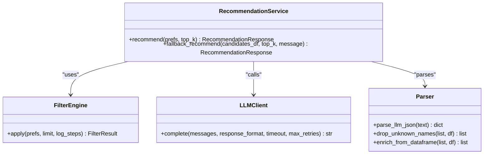
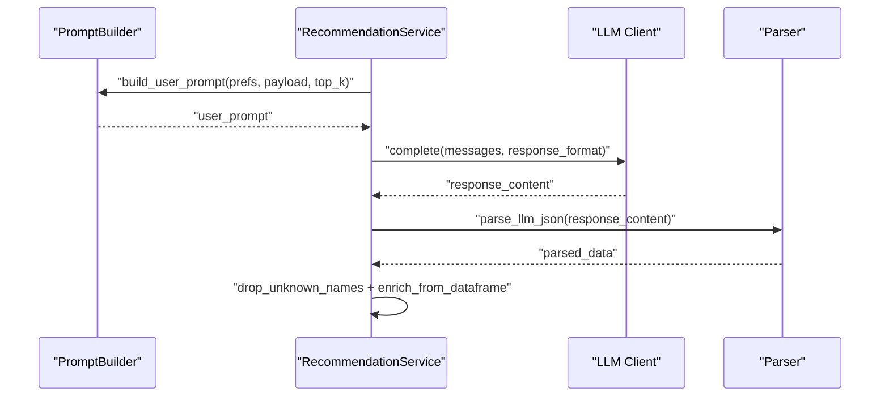
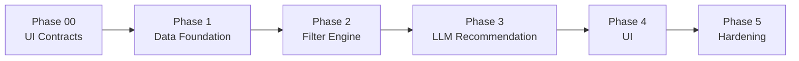

# Project Overview

<cite>
**Referenced Files in This Document**
- [README.md](file://README.md)
- [phases.md](file://docs/phases.md)
- [registry.py](file://src/phases/registry.py)
- [preferences.py](file://src/phases/phase00/preferences.py)
- [engine.py](file://src/phases/phase02/engine.py)
- [recommendation_service.py](file://src/services/recommendation_service.py)
- [client.py](file://src/llm/client.py)
- [parser.py](file://src/llm/parser.py)
- [prompt_builder.py](file://src/llm/prompt_builder.py)
- [recommendation.py](file://src/models/recommendation.py)
- [restaurant.py](file://src/models/restaurant.py)
- [config.py](file://src/config.py)
- [loader.py](file://src/phases/phase01/loader.py)
- [pyproject.toml](file://pyproject.toml)
</cite>

## Table of Contents
1. [Introduction](#introduction)
2. [Project Structure](#project-structure)
3. [Core Components](#core-components)
4. [Architecture Overview](#architecture-overview)
5. [Detailed Component Analysis](#detailed-component-analysis)
6. [Dependency Analysis](#dependency-analysis)
7. [Performance Considerations](#performance-considerations)
8. [Troubleshooting Guide](#troubleshooting-guide)
9. [Conclusion](#conclusion)

## Introduction
This project is an AI-powered restaurant recommendation system built on the Zomato dataset and powered by Groq’s LLM APIs. It implements a phased architecture to incrementally deliver working vertical slices: a stable UI contract, a robust data foundation, a fast filter engine, an LLM-backed recommendation service, and a polished user interface. The system emphasizes explainable AI recommendations by grounding LLM suggestions in a curated, filtered candidate list and returning structured outputs with human-readable explanations.

Key goals:
- Accept user preferences (location, budget, cuisine, minimum rating, extras)
- Efficiently filter candidates from the Zomato dataset
- Use an LLM to rank and explain choices
- Present clear results with name, cuisine, rating, cost, and AI explanation

Environment highlights:
- Groq LLM integration with configurable provider, model, and base URL
- Local caching of processed data for fast iteration
- Configurable candidate count and top-K recommendations

**Section sources**
- [README.md:1-103](file://README.md#L1-L103)
- [phases.md:1-341](file://docs/phases.md#L1-L341)

## Project Structure
The repository follows a phased, feature-oriented layout:
- docs: Architectural and process documentation
- scripts: Phase-specific CLI helpers
- src: Modular code organized by phases and services
- tests: Unit and integration tests
- requirements.txt and pyproject.toml: Dependencies and project metadata

**Diagram sources**
- [README.md:14-39](file://README.md#L14-L39)
- [pyproject.toml:1-16](file://pyproject.toml#L1-L16)
- [registry.py:27-68](file://src/phases/registry.py#L27-L68)

**Section sources**
- [README.md:14-39](file://README.md#L14-L39)
- [pyproject.toml:1-16](file://pyproject.toml#L1-L16)

## Core Components
- Phased architecture: Explicit phase manifests define dependency order and rollback hints, enabling incremental delivery and safe bisection of issues.
- Filter engine: Applies structured filters (city, rating, budget, cuisines, extras) to produce a shortlist for the LLM.
- Recommendation service: Coordinates filtering and LLM ranking, with a fallback to structured scoring when the LLM is unavailable.
- LLM integration: Prompt builder, HTTP client with retries, and parser for JSON outputs and hallucination checks.
- Configuration: Centralized environment variables for provider, model, base URL, and runtime limits.

Practical outcomes:
- Structured filtering ensures low-latency candidate selection (< 200 ms warm cache)
- LLM-only recommendations from the filtered set with grounded explanations
- Resilient fallback ranking when API keys or connectivity are missing

**Section sources**
- [registry.py:1-84](file://src/phases/registry.py#L1-L84)
- [engine.py:140-197](file://src/phases/phase02/engine.py#L140-L197)
- [recommendation_service.py:30-200](file://src/services/recommendation_service.py#L30-L200)
- [client.py:14-94](file://src/llm/client.py#L14-L94)
- [parser.py:24-141](file://src/llm/parser.py#L24-L141)
- [config.py:15-50](file://src/config.py#L15-L50)

## Architecture Overview
The system uses a phased architecture to ensure each layer is independently testable and deployable. The recommendation pipeline is:
1. User preferences enter via a typed contract (Phase 00)
2. Data is ingested, cleaned, and cached (Phase 01)
3. Filter engine shortlists candidates (Phase 02)
4. LLM ranks and explains recommendations (Phase 03)
5. Results are returned with structured fields and explanations

**Diagram sources**
- [recommendation_service.py:37-131](file://src/services/recommendation_service.py#L37-L131)
- [engine.py:146-189](file://src/phases/phase02/engine.py#L146-L189)
- [client.py:14-94](file://src/llm/client.py#L14-L94)
- [parser.py:24-66](file://src/llm/parser.py#L24-L66)

**Section sources**
- [phases.md:18-26](file://docs/phases.md#L18-L26)
- [registry.py:27-68](file://src/phases/registry.py#L27-L68)

## Detailed Component Analysis

### Filter Engine
The filter engine transforms user preferences into a small, high-quality candidate set using vectorized operations and a scoring function. It logs a funnel of stepwise reductions and provides human-readable reasons when the result is empty.

Key behaviors:
- City matching via canonicalization and substring location matching
- Budget tier alignment with allowance for unknown costs
- Cuisine overlap detection supporting partial matches
- Extras mapping to restaurant types and operational flags
- Composite scoring and tiebreaking for deterministic ordering

**Diagram sources**
- [engine.py:41-101](file://src/phases/phase02/engine.py#L41-L101)
- [engine.py:183-186](file://src/phases/phase02/engine.py#L183-L186)

**Section sources**
- [engine.py:140-197](file://src/phases/phase02/engine.py#L140-L197)

### Recommendation Service
The recommendation service orchestrates filtering and LLM ranking, with a robust fallback path. It validates API keys, constructs prompts, parses JSON outputs, and enforces hallucination checks.

Highlights:
- Shortlist candidates from the filter engine
- Build user prompt with cleaned candidate fields
- Call LLM with JSON response format
- Drop unknown names and enrich fields from the dataframe
- Pad recommendations from structured scoring if needed
- Fallback to scorer-based ranking when LLM is unavailable

**Diagram sources**
- [recommendation_service.py:30-200](file://src/services/recommendation_service.py#L30-L200)
- [engine.py:140-197](file://src/phases/phase02/engine.py#L140-L197)
- [client.py:14-94](file://src/llm/client.py#L14-L94)
- [parser.py:24-141](file://src/llm/parser.py#L24-L141)

**Section sources**
- [recommendation_service.py:30-200](file://src/services/recommendation_service.py#L30-L200)

### LLM Integration
The LLM stack includes a prompt builder, HTTP client, and parser:
- Prompt builder enforces grounding, JSON schema, and concise explanations
- HTTP client handles retries, timeouts, and provider compatibility
- Parser extracts and validates JSON, drops hallucinated names, and enriches fields

**Diagram sources**
- [prompt_builder.py:30-69](file://src/llm/prompt_builder.py#L30-L69)
- [recommendation_service.py:71-122](file://src/services/recommendation_service.py#L71-L122)
- [client.py:14-94](file://src/llm/client.py#L14-L94)
- [parser.py:24-66](file://src/llm/parser.py#L24-L66)

**Section sources**
- [prompt_builder.py:1-69](file://src/llm/prompt_builder.py#L1-L69)
- [client.py:14-94](file://src/llm/client.py#L14-L94)
- [parser.py:1-141](file://src/llm/parser.py#L1-L141)

### Data Foundation (Phase 01)
The data foundation loads, cleans, and caches the Zomato dataset locally for fast iteration. It includes robust ingestion with retries, preprocessing for ratings and costs, and stable schema export.

Deliverables:
- Loader with retries and split resolution
- Preprocessor for ratings, costs, cuisines, and city normalization
- Cache I/O for parquet artifacts
- CLI to refresh cache

**Section sources**
- [loader.py:33-64](file://src/phases/phase01/loader.py#L33-L64)
- [phases.md:65-151](file://docs/phases.md#L65-L151)

### Configuration and Environment
Centralized configuration reads environment variables for provider, model, base URL, and runtime limits. It supports both Groq and OpenAI-compatible providers and defaults to a strong model for grounded recommendations.

**Section sources**
- [config.py:15-50](file://src/config.py#L15-L50)
- [README.md:41-54](file://README.md#L41-L54)

## Dependency Analysis
The phased architecture enforces strict dependency order and rollback hints. Each phase is intentionally isolated to simplify testing and regression prevention.

**Diagram sources**
- [registry.py:27-68](file://src/phases/registry.py#L27-L68)
- [phases.md:18-26](file://docs/phases.md#L18-L26)

**Section sources**
- [registry.py:75-84](file://src/phases/registry.py#L75-L84)
- [phases.md:9-16](file://docs/phases.md#L9-L16)

## Performance Considerations
- Filter engine performance: Designed to filter 51K rows in under 200 ms with a warm cache
- Candidate limiting: Controlled by MAX_CANDIDATES to reduce LLM context size and latency
- Token efficiency: Prompt builder includes only essential fields per candidate
- Retries and timeouts: LLM client uses exponential backoff for resilience
- Fallback ranking: Ensures responsiveness even without LLM availability

[No sources needed since this section provides general guidance]

## Troubleshooting Guide
Common issues and remedies:
- Missing API key: The recommendation service falls back to structured scoring and surfaces a warning
- LLM failures: The client retries on 429/5xx and raises on unrecoverable errors; the service logs and falls back
- Empty results: The filter engine explains funnel steps and suggests relaxing constraints
- Hallucinations: Parser drops unknown restaurant names and logs warnings

Operational tips:
- Verify environment variables for provider and model
- Confirm cache exists and is readable
- Use the CLI scripts to build or smoke-test cache and filter pipeline

**Section sources**
- [recommendation_service.py:60-66](file://src/services/recommendation_service.py#L60-L66)
- [recommendation_service.py:124-130](file://src/services/recommendation_service.py#L124-L130)
- [client.py:71-86](file://src/llm/client.py#L71-L86)
- [engine.py:104-137](file://src/phases/phase02/engine.py#L104-L137)
- [parser.py:45-66](file://src/llm/parser.py#L45-L66)

## Conclusion
This system demonstrates a pragmatic, phased approach to delivering an AI-powered recommendation platform. By separating concerns across phases—typed UI contracts, robust data, efficient filtering, and explainable LLM ranking—the project balances rapid iteration with reliability. The filter engine ensures low-latency candidate selection, while the LLM-backed recommendation service delivers grounded, explainable results. The configuration and fallback mechanisms provide operational resilience, and the phased architecture simplifies testing, rollback, and future enhancements.

[No sources needed since this section summarizes without analyzing specific files]