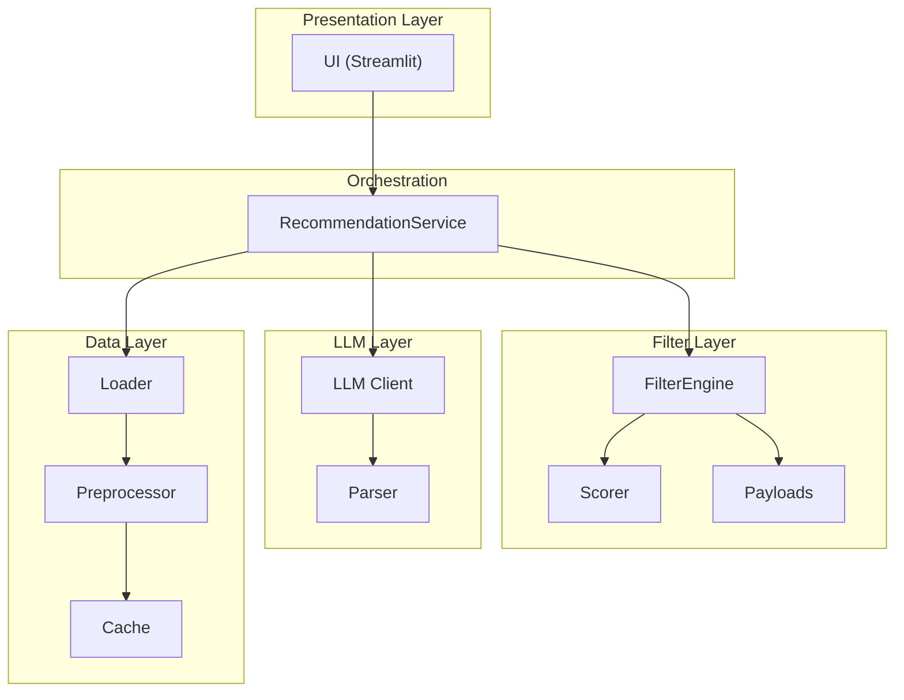
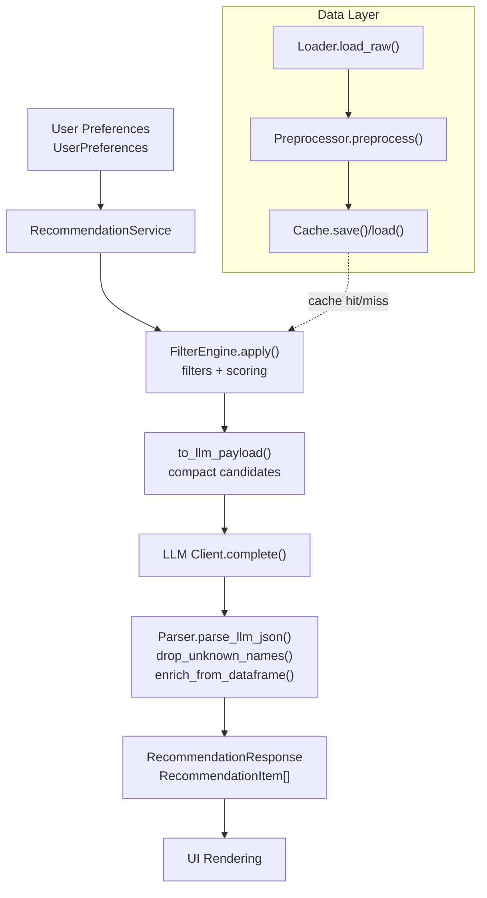
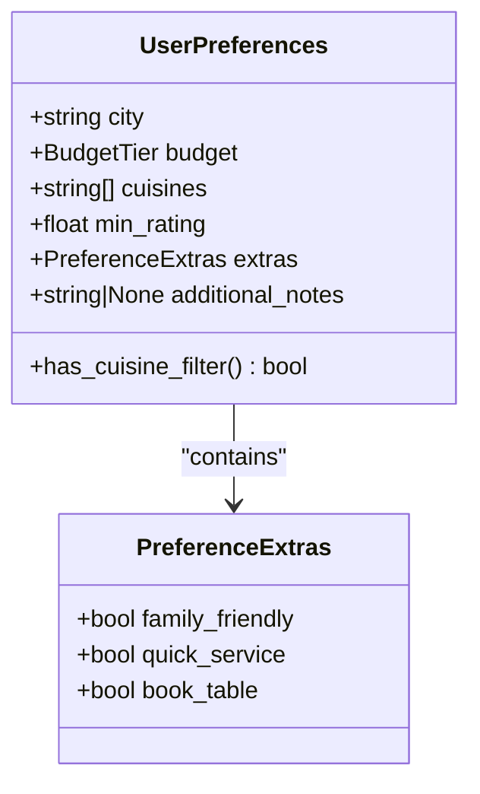
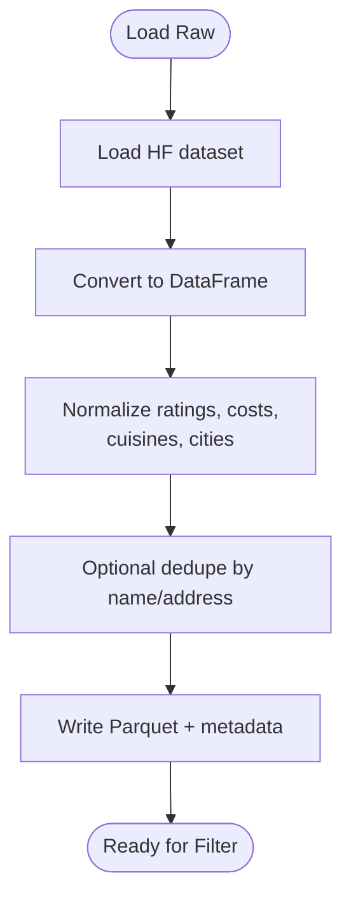
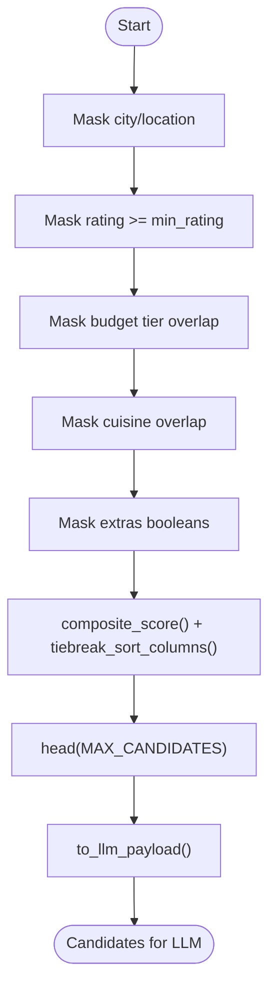
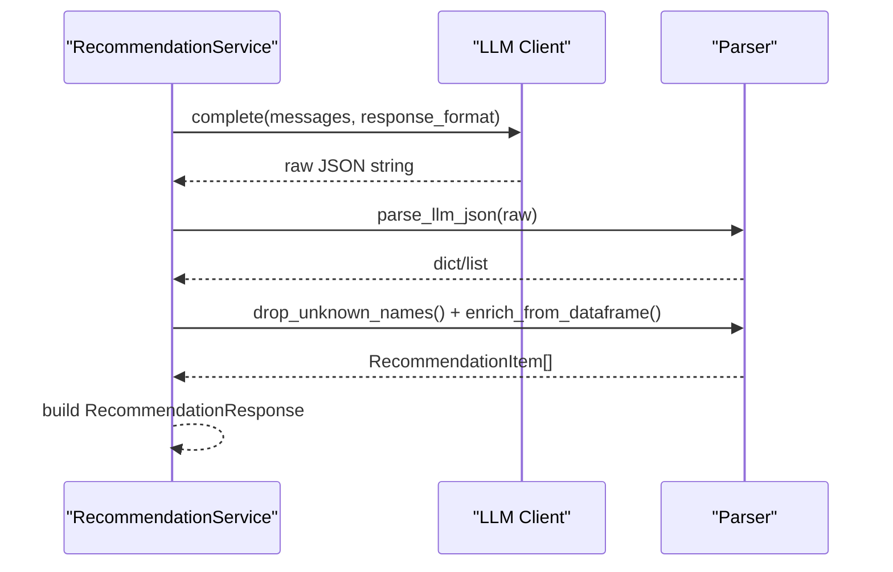
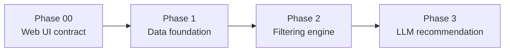

# System Architecture

<cite>
**Referenced Files in This Document**
- [README.md](file://README.md)
- [ARCHITECTURE.md](file://docs/ARCHITECTURE.md)
- [phases.md](file://docs/phases.md)
- [pyproject.toml](file://pyproject.toml)
- [requirements.txt](file://requirements.txt)
- [config.py](file://src/config.py)
- [registry.py](file://src/phases/registry.py)
- [preferences.py](file://src/phases/phase00/preferences.py)
- [loader.py](file://src/phases/phase01/loader.py)
- [preprocessor.py](file://src/phases/phase01/preprocessor.py)
- [engine.py](file://src/phases/phase02/engine.py)
- [scorer.py](file://src/phases/phase02/scorer.py)
- [payloads.py](file://src/phases/phase02/payloads.py)
- [client.py](file://src/llm/client.py)
- [parser.py](file://src/llm/parser.py)
</cite>

## Table of Contents
1. [Introduction](#introduction)
2. [Project Structure](#project-structure)
3. [Core Components](#core-components)
4. [Architecture Overview](#architecture-overview)
5. [Detailed Component Analysis](#detailed-component-analysis)
6. [Dependency Analysis](#dependency-analysis)
7. [Performance Considerations](#performance-considerations)
8. [Troubleshooting Guide](#troubleshooting-guide)
9. [Conclusion](#conclusion)
10. [Appendices](#appendices)

## Introduction
This document describes the phased architecture and layered design of the Zomato AI Recommendation System. It focuses on phases 00 through 03 and documents system boundaries, component interactions, data flows, and integration patterns. It also explains technical decisions, trade-offs, constraints, infrastructure requirements, scalability considerations, deployment topology, cross-cutting concerns, and technology stack/version compatibility.

## Project Structure
The repository follows a phased, layer-oriented structure:
- src/phases/phase00: Web UI contract (input/output models)
- src/phases/phase01: Data ingestion, cleaning, caching
- src/phases/phase02: Filtering engine and payload shaping
- src/llm/: LLM orchestration, client, and parser
- src/services/: Recommendation service orchestrating the pipeline
- docs/: Architectural and development-phase documentation
- scripts/: CLI utilities for building cache and testing

**Diagram sources**
- [preferences.py:1-71](file://src/phases/phase00/preferences.py#L1-L71)
- [engine.py:1-197](file://src/phases/phase2/engine.py#L1-L197)
- [scorer.py:1-70](file://src/phases/phase02/scorer.py#L1-L70)
- [payloads.py:1-44](file://src/phases/phase02/payloads.py#L1-L44)
- [client.py:1-94](file://src/llm/client.py#L1-L94)
- [parser.py:1-141](file://src/llm/parser.py#L1-L141)
- [loader.py:1-64](file://src/phases/phase01/loader.py#L1-L64)
- [preprocessor.py:1-232](file://src/phases/phase01/preprocessor.py#L1-L232)

**Section sources**
- [README.md:14-39](file://README.md#L14-L39)
- [ARCHITECTURE.md:146-181](file://docs/ARCHITECTURE.md#L146-L181)

## Core Components
- Configuration and environment: centralized via environment variables and .env, including LLM provider, model, base URL, and cache path.
- Phase registry: enforces ordered, dependency-safe phases to support rollback and incremental delivery.
- Phase 00: Strongly-typed user preferences and output contracts to anchor UI and downstream components.
- Phase 01: Hugging Face dataset ingestion, normalization, and persistent caching.
- Phase 02: Structured filtering and pre-ranking, producing a small, curated candidate set for the LLM.
- Phase 03: LLM client, prompt orchestration, and response parsing with anti-hallucination enrichment.

**Section sources**
- [config.py:1-50](file://src/config.py#L1-L50)
- [registry.py:1-84](file://src/phases/registry.py#L1-L84)
- [preferences.py:1-71](file://src/phases/phase00/preferences.py#L1-L71)
- [loader.py:1-64](file://src/phases/phase01/loader.py#L1-L64)
- [preprocessor.py:1-232](file://src/phases/phase01/preprocessor.py#L1-L232)
- [engine.py:1-197](file://src/phases/phase02/engine.py#L1-L197)
- [scorer.py:1-70](file://src/phases/phase02/scorer.py#L1-L70)
- [payloads.py:1-44](file://src/phases/phase02/payloads.py#L1-L44)
- [client.py:1-94](file://src/llm/client.py#L1-L94)
- [parser.py:1-141](file://src/llm/parser.py#L1-L141)

## Architecture Overview
The system employs a layered architecture:
- Presentation: Streamlit MVP or future FastAPI + frontend
- Orchestration: RecommendationService coordinates input validation, filtering, LLM invocation, and response formatting
- Filter: Pandas-based filters and composite scoring
- LLM: Structured prompts and JSON-mode responses
- Data: Hugging Face ingestion, normalization, and Parquet cache

**Diagram sources**
- [preferences.py:20-71](file://src/phases/phase00/preferences.py#L20-L71)
- [engine.py:140-197](file://src/phases/phase02/engine.py#L140-L197)
- [payloads.py:27-44](file://src/phases/phase02/payloads.py#L27-L44)
- [client.py:14-94](file://src/llm/client.py#L14-L94)
- [parser.py:24-141](file://src/llm/parser.py#L24-L141)
- [loader.py:33-64](file://src/phases/phase01/loader.py#L33-L64)
- [preprocessor.py:136-232](file://src/phases/phase01/preprocessor.py#L136-L232)

**Section sources**
- [ARCHITECTURE.md:12-39](file://docs/ARCHITECTURE.md#L12-L39)
- [ARCHITECTURE.md:122-143](file://docs/ARCHITECTURE.md#L122-L143)

## Detailed Component Analysis

### Phase 00: Web UI Contract
Responsibilities:
- Define canonical input model (UserPreferences) and output model (RecommendationItem/Response)
- Provide safe conversion helpers and UI-bound constraints (e.g., note length caps)

Key design points:
- Centralized validation and coercion for cuisines and city
- Shared extras toggles mapped to downstream filters

**Diagram sources**
- [preferences.py:20-71](file://src/phases/phase00/preferences.py#L20-L71)

**Section sources**
- [preferences.py:1-71](file://src/phases/phase00/preferences.py#L1-L71)
- [phases.md:37-62](file://docs/phases.md#L37-L62)

### Phase 01: Data Foundation
Responsibilities:
- Load dataset from Hugging Face
- Normalize and clean fields (ratings, costs, cuisines, cities)
- Persist a typed, filtered Parquet cache
- Provide diagnostics and robust retry on load failures

**Diagram sources**
- [loader.py:33-64](file://src/phases/phase01/loader.py#L33-L64)
- [preprocessor.py:136-232](file://src/phases/phase01/preprocessor.py#L136-L232)

**Section sources**
- [loader.py:1-64](file://src/phases/phase01/loader.py#L1-L64)
- [preprocessor.py:1-232](file://src/phases/phase01/preprocessor.py#L1-L232)
- [phases.md:65-151](file://docs/phases.md#L65-L151)

### Phase 02: Filtering Engine
Responsibilities:
- Apply structured filters in order-of-performance
- Compute composite score and deterministic tiebreaks
- Produce compact payload for LLM

Filter pipeline:
1. City/location match (broadest)
2. Rating threshold
3. Budget tier overlap
4. Cuisine substring/token overlap
5. Extras booleans (family-friendly, quick service, book table)
6. Sort by composite score; select top-N

**Diagram sources**
- [engine.py:140-197](file://src/phases/phase02/engine.py#L140-L197)
- [scorer.py:29-70](file://src/phases/phase02/scorer.py#L29-L70)
- [payloads.py:27-44](file://src/phases/phase02/payloads.py#L27-L44)

**Section sources**
- [engine.py:1-197](file://src/phases/phase02/engine.py#L1-L197)
- [scorer.py:1-70](file://src/phases/phase02/scorer.py#L1-L70)
- [payloads.py:1-44](file://src/phases/phase02/payloads.py#L1-L44)
- [phases.md:154-212](file://docs/phases.md#L154-L212)

### Phase 03: LLM Recommendation
Responsibilities:
- Construct structured prompts with JSON schema
- Invoke provider (Groq/OpenAI-compatible) with retries/backoff
- Parse and validate JSON, drop hallucinations, enrich with ground truth

**Diagram sources**
- [client.py:14-94](file://src/llm/client.py#L14-L94)
- [parser.py:24-141](file://src/llm/parser.py#L24-L141)

**Section sources**
- [client.py:1-94](file://src/llm/client.py#L1-L94)
- [parser.py:1-141](file://src/llm/parser.py#L1-L141)
- [phases.md:214-271](file://docs/phases.md#L214-L271)

### Cross-Cutting Concerns
- Security: environment-only credentials, avoid logging sensitive prompts
- Observability: filter funnel logs, LLM latency, and error surfaces
- Resilience: fallback behavior when LLM is unavailable
- Configuration: centralized via config module and .env

**Section sources**
- [config.py:1-50](file://src/config.py#L1-L50)
- [ARCHITECTURE.md:198-203](file://docs/ARCHITECTURE.md#L198-L203)

## Dependency Analysis
Phases are ordered and dependency-aware. The phase registry defines explicit dependencies and rollback hints.

**Diagram sources**
- [registry.py:28-68](file://src/phases/registry.py#L28-L68)
- [phases.md:18-25](file://docs/phases.md#L18-L25)

**Section sources**
- [registry.py:1-84](file://src/phases/registry.py#L1-L84)
- [phases.md:1-341](file://docs/phases.md#L1-L341)

## Performance Considerations
- Minimize LLM cost and latency by pre-filtering to a small candidate set
- Cache preprocessed dataset locally as Parquet for fast warm reads
- Keep only necessary columns for filtering and LLM context
- Use vectorized operations and composite scoring to stay under 100 ms for filtering
- Tune MAX_CANDIDATES and TOP_K to balance quality and latency

**Section sources**
- [ARCHITECTURE.md:5-8](file://docs/ARCHITECTURE.md#L5-L8)
- [ARCHITECTURE.md:136-143](file://docs/ARCHITECTURE.md#L136-L143)
- [engine.py:183-189](file://src/phases/phase02/engine.py#L183-L189)

## Troubleshooting Guide
Common issues and mitigations:
- Hugging Face load failures: automatic retries with exponential backoff
- LLM API errors: 429 handled with warnings; 5xx retried; unrecoverable errors raised immediately
- Hallucinated names: parser drops unknown names and enriches from ground truth
- Empty filter results: explain_empty provides actionable suggestions

**Section sources**
- [loader.py:46-63](file://src/phases/phase01/loader.py#L46-L63)
- [client.py:55-93](file://src/llm/client.py#L55-L93)
- [parser.py:45-66](file://src/llm/parser.py#L45-L66)
- [engine.py:104-137](file://src/phases/phase02/engine.py#L104-L137)

## Conclusion
The Zomato AI Recommendation System applies a phased, layered architecture to deliver a fast, explainable, and resilient recommendation pipeline. By enforcing strict contracts in Phase 00, establishing a robust data foundation in Phase 01, and implementing efficient filtering in Phase 02, the system minimizes LLM usage while preserving quality. Phase 03 integrates the LLM with structured prompts and anti-hallucination checks. The phase registry and configuration module support incremental delivery, rollback, and operational safety.

## Appendices

### System Context and Deployment Topology
- Local development: Streamlit app invoking RecommendationService
- Production option: FastAPI endpoint + lightweight frontend
- Infrastructure: ephemeral compute for inference; persistent storage for Parquet cache
- Secrets: environment variables only (.env), never in code

**Section sources**
- [ARCHITECTURE.md:104-114](file://docs/ARCHITECTURE.md#L104-L114)
- [README.md:41-54](file://README.md#L41-L54)

### Technology Stack and Version Compatibility
- Language/runtime: Python 3.10+ (project targets 3.11)
- Core libraries: pandas, pyarrow, datasets, pydantic, httpx, python-dotenv, pytest, streamlit
- Toolchain: pytest, ruff (py310 target)

**Section sources**
- [pyproject.toml:1-16](file://pyproject.toml#L1-L16)
- [requirements.txt:1-9](file://requirements.txt#L1-L9)
- [README.md:66-73](file://README.md#L66-L73)