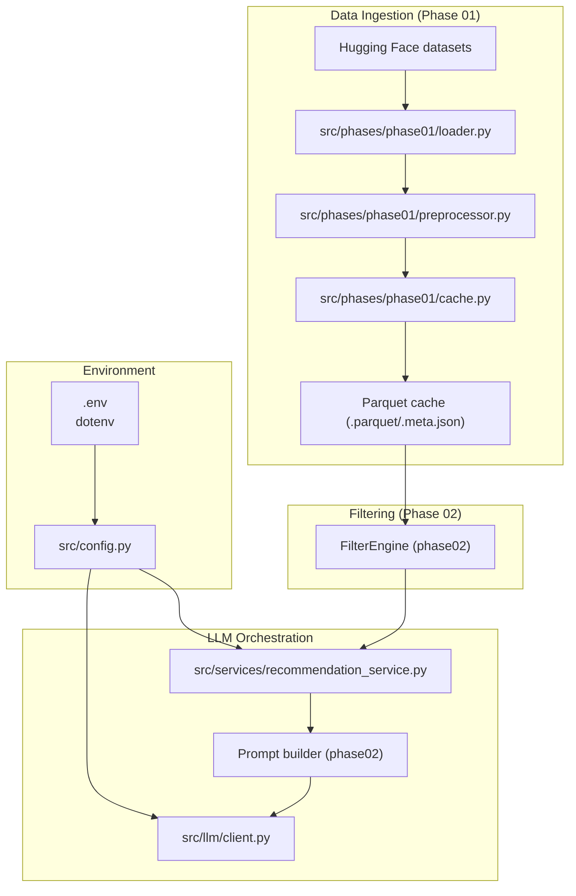
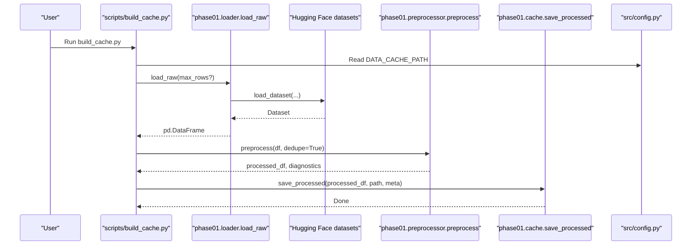
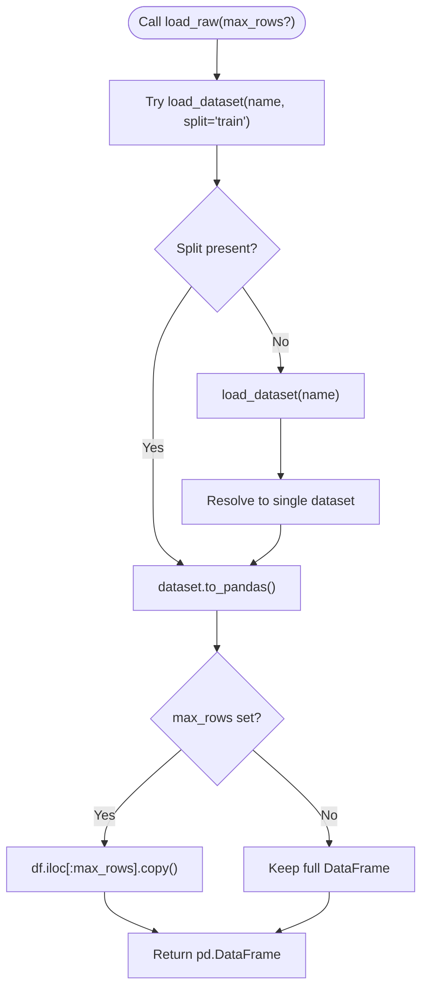
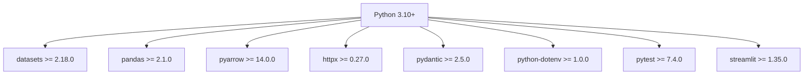

# Technology Stack

<cite>
**Referenced Files in This Document**
- [pyproject.toml](file://zomato-ai-recommendation/pyproject.toml)
- [requirements.txt](file://zomato-ai-recommendation/requirements.txt)
- [README.md](file://zomato-ai-recommendation/README.md)
- [src/config.py](file://zomato-ai-recommendation/src/config.py)
- [src/phases/phase01/loader.py](file://zomato-ai-recommendation/src/phases/phase01/loader.py)
- [src/phases/phase01/preprocessor.py](file://zomato-ai-recommendation/src/phases/phase01/preprocessor.py)
- [src/phases/phase01/cache.py](file://zomato-ai-recommendation/src/phases/phase01/cache.py)
- [src/llm/client.py](file://zomato-ai-recommendation/src/llm/client.py)
- [src/models/recommendation.py](file://zomato-ai-recommendation/src/models/recommendation.py)
- [src/services/recommendation_service.py](file://zomato-ai-recommendation/src/services/recommendation_service.py)
- [scripts/build_cache.py](file://zomato-ai-recommendation/scripts/build_cache.py)
- [tests/test_hf_integration.py](file://zomato-ai-recommendation/tests/test_hf_integration.py)
</cite>

## Table of Contents
1. [Introduction](#introduction)
2. [Project Structure](#project-structure)
3. [Core Components](#core-components)
4. [Architecture Overview](#architecture-overview)
5. [Detailed Component Analysis](#detailed-component-analysis)
6. [Dependency Analysis](#dependency-analysis)
7. [Performance Considerations](#performance-considerations)
8. [Troubleshooting Guide](#troubleshooting-guide)
9. [Conclusion](#conclusion)
10. [Appendices](#appendices)

## Introduction
This document explains the technology stack used in the Zomato AI Recommendation System. It focuses on Python 3.10+, Hugging Face datasets for data ingestion, Pandas for data manipulation, PyArrow for efficient Parquet handling, HTTPX for asynchronous LLM API communication, Pydantic for data validation, and dotenv for environment configuration. For each technology, we describe its role, rationale, version compatibility, and practical guidance for setup and dependency management.

## Project Structure
The project is organized around development phases and modular services:
- Data ingestion and caching: Phase 01 implements downloading, preprocessing, and caching of the Hugging Face dataset as Parquet.
- Filtering pipeline: Phase 02 applies user preferences to narrow candidates.
- LLM orchestration: Services coordinate filtering and LLM ranking/explanation.
- Configuration and environment: Environment variables are loaded via dotenv and exposed through a central configuration module.
- Scripts and tests: Command-line scripts build caches; tests validate integration and compatibility.

**Diagram sources**
- [src/config.py:1-50](file://zomato-ai-recommendation/src/config.py#L1-L50)
- [src/phases/phase01/loader.py:1-64](file://zomato-ai-recommendation/src/phases/phase01/loader.py#L1-L64)
- [src/phases/phase01/preprocessor.py:1-232](file://zomato-ai-recommendation/src/phases/phase01/preprocessor.py#L1-L232)
- [src/phases/phase01/cache.py:1-64](file://zomato-ai-recommendation/src/phases/phase01/cache.py#L1-L64)
- [src/services/recommendation_service.py:1-200](file://zomato-ai-recommendation/src/services/recommendation_service.py#L1-L200)
- [src/llm/client.py:1-94](file://zomato-ai-recommendation/src/llm/client.py#L1-L94)

**Section sources**
- [README.md:14-39](file://zomato-ai-recommendation/README.md#L14-L39)
- [pyproject.toml:1-16](file://zomato-ai-recommendation/pyproject.toml#L1-L16)

## Core Components
- Python 3.10+: The project targets Python 3.10+ and uses 3.11 in practice. This enables modern language features and ensures compatibility with contemporary libraries.
- Hugging Face datasets: Used to download and parse the Zomato dataset, returning a Pandas DataFrame for downstream processing.
- Pandas: Central for data cleaning, normalization, and transformations during preprocessing and caching.
- PyArrow: Provides efficient Parquet I/O for caching and metadata handling.
- HTTPX: Asynchronous-friendly HTTP client for calling LLM APIs with retry/backoff logic.
- Pydantic: Validates structured outputs and domain models for recommendations.
- dotenv: Loads environment variables from .env for secure configuration.

**Section sources**
- [pyproject.toml:6](file://zomato-ai-recommendation/pyproject.toml#L6)
- [requirements.txt:1-6](file://zomato-ai-recommendation/requirements.txt#L1-L6)
- [README.md:66-73](file://zomato-ai-recommendation/README.md#L66-L73)

## Architecture Overview
The system follows a phased pipeline:
- Phase 01: Download dataset from Hugging Face, normalize and preprocess, and persist as Parquet with metadata.
- Phase 02: Apply user preferences to filter candidates.
- Phase 03 (planned): Use LLM to rank and explain recommendations.
- Phase 04 (planned): Present results via UI.

**Diagram sources**
- [scripts/build_cache.py:21-70](file://zomato-ai-recommendation/scripts/build_cache.py#L21-L70)
- [src/phases/phase01/loader.py:33-63](file://zomato-ai-recommendation/src/phases/phase01/loader.py#L33-L63)
- [src/phases/phase01/preprocessor.py:136-231](file://zomato-ai-recommendation/src/phases/phase01/preprocessor.py#L136-L231)
- [src/phases/phase01/cache.py:27-43](file://zomato-ai-recommendation/src/phases/phase01/cache.py#L27-L43)
- [src/config.py:43-47](file://zomato-ai-recommendation/src/config.py#L43-L47)

## Detailed Component Analysis

### Python 3.10+
- Role: Primary runtime and language baseline for the entire system.
- Rationale: Enables modern typing, f-strings, and ecosystem compatibility.
- Version compatibility: Requires Python 3.10+; the repository uses 3.11 in practice.
- Setup: Create a virtual environment and install dependencies as documented.

**Section sources**
- [pyproject.toml:6](file://zomato-ai-recommendation/pyproject.toml#L6)
- [README.md:66-73](file://zomato-ai-recommendation/README.md#L66-L73)

### Hugging Face datasets
- Role: Downloads and parses the Zomato dataset into a Pandas DataFrame.
- Implementation highlights:
  - Robust retry loop with exponential backoff.
  - Handles both single-split and split-dataset structures.
- Why chosen: Rich ecosystem, fast downloads, and seamless conversion to Pandas.

**Diagram sources**
- [src/phases/phase01/loader.py:33-63](file://zomato-ai-recommendation/src/phases/phase01/loader.py#L33-L63)

**Section sources**
- [src/phases/phase01/loader.py:18-63](file://zomato-ai-recommendation/src/phases/phase01/loader.py#L18-L63)

### Pandas
- Role: Data cleaning, normalization, parsing, deduplication, and column selection.
- Implementation highlights:
  - Parsing numeric fields robustly (ratings, approximate cost).
  - Normalizing cuisines and city names.
  - Budget tier assignment using per-city quantiles with fallback to global.
  - Deduplication by name and address, preserving highest-vote entries.
- Why chosen: Mature ecosystem, excellent I/O support, and convenient vectorized operations.

**Section sources**
- [src/phases/phase01/preprocessor.py:27-231](file://zomato-ai-recommendation/src/phases/phase01/preprocessor.py#L27-L231)

### PyArrow (via Pandas Parquet)
- Role: Efficient serialization/deserialization of processed data to/from Parquet.
- Implementation highlights:
  - Writing Parquet with metadata sidecar (.meta.json).
  - Reading Parquet with cache version validation.
- Why chosen: Fast binary format, columnar storage, and cross-language compatibility.

**Section sources**
- [src/phases/phase01/cache.py:27-63](file://zomato-ai-recommendation/src/phases/phase01/cache.py#L27-L63)

### HTTPX
- Role: Calls LLM APIs (e.g., Groq) with timeouts, retries, and backoff.
- Implementation highlights:
  - Chat completions endpoint construction.
  - Retry logic for 429/5xx and timeouts; no retry for unrecoverable 4xx.
  - Structured error logging and propagation.
- Why chosen: Modern async-friendly HTTP client with excellent error handling and timeouts.

**Section sources**
- [src/llm/client.py:14-94](file://zomato-ai-recommendation/src/llm/client.py#L14-L94)

### Pydantic
- Role: Defines validated domain models for recommendations.
- Implementation highlights:
  - Structured fields for restaurant name, cuisine, rating, cost, and explanation.
  - Integration with output contracts for consistent serialization.
- Why chosen: Strong validation, serialization, and developer ergonomics.

**Section sources**
- [src/models/recommendation.py:9-23](file://zomato-ai-recommendation/src/models/recommendation.py#L9-L23)

### dotenv
- Role: Loads environment variables from .env for secure configuration.
- Implementation highlights:
  - Centralized config module reads provider, model, base URL, and cache paths.
  - Graceful fallbacks and defaults for optional settings.
- Why chosen: Keeps secrets out of version control and simplifies local/dev configuration.

**Section sources**
- [src/config.py:15-49](file://zomato-ai-recommendation/src/config.py#L15-L49)

## Dependency Analysis
The system’s dependencies are declared in pyproject.toml and requirements.txt. They define the minimum versions for each library and align with the implementation patterns shown in the code.

**Diagram sources**
- [pyproject.toml:1-16](file://zomato-ai-recommendation/pyproject.toml#L1-L16)
- [requirements.txt:1-9](file://zomato-ai-recommendation/requirements.txt#L1-L9)

**Section sources**
- [pyproject.toml:1-16](file://zomato-ai-recommendation/pyproject.toml#L1-L16)
- [requirements.txt:1-9](file://zomato-ai-recommendation/requirements.txt#L1-L9)

## Performance Considerations
- Data ingestion: The loader retries with exponential backoff to handle transient network issues and reduce wasted compute.
- Data processing: Pandas operations are vectorized and optimized for large datasets; deduplication preserves quality while reducing candidate sets.
- Caching: Parquet reduces I/O overhead and speeds up subsequent runs; metadata validates cache compatibility.
- LLM calls: HTTPX timeouts and retries prevent long hangs; structured JSON responses improve reliability.
- Recommendations: Fallback scoring ensures results even without an API key, maintaining responsiveness.

[No sources needed since this section provides general guidance]

## Troubleshooting Guide
- Missing API key: The LLM client raises a clear error if the key is not configured; the service falls back to structured scoring.
- Network failures: The loader retries failed downloads; increase verbosity to inspect retry logs.
- Cache mismatch: If cache metadata version differs, rebuild using the provided script.
- Integration tests: Optional HF integration test requires explicit opt-in due to large download size.

**Section sources**
- [src/llm/client.py:36-37](file://zomato-ai-recommendation/src/llm/client.py#L36-L37)
- [src/services/recommendation_service.py:60-66](file://zomato-ai-recommendation/src/services/recommendation_service.py#L60-L66)
- [src/phases/phase01/cache.py:55-60](file://zomato-ai-recommendation/src/phases/phase01/cache.py#L55-L60)
- [tests/test_hf_integration.py:9-12](file://zomato-ai-recommendation/tests/test_hf_integration.py#L9-L12)

## Conclusion
The Zomato AI Recommendation System leverages a cohesive stack tailored for performance and maintainability:
- Python 3.10+ for modernity and compatibility.
- Hugging Face datasets for reliable data ingestion.
- Pandas for robust preprocessing and transformations.
- PyArrow-backed Parquet for efficient caching.
- HTTPX for resilient LLM API calls.
- Pydantic for validated domain models.
- dotenv for secure environment configuration.

Together, these technologies enable scalable, testable, and user-focused recommendation workflows.

[No sources needed since this section summarizes without analyzing specific files]

## Appendices

### Setup and Dependency Management
- Create a Python 3.10+ virtual environment and activate it.
- Install dependencies from requirements.txt.
- Configure environment variables by copying .env.example to .env and setting provider credentials.
- Build the cache using the provided script to download and preprocess the dataset.

**Section sources**
- [README.md:66-85](file://zomato-ai-recommendation/README.md#L66-L85)
- [requirements.txt:1-9](file://zomato-ai-recommendation/requirements.txt#L1-L9)

### Version Compatibility Matrix
- Python: >= 3.10 (practically 3.11)
- datasets: >= 2.18.0
- pandas: >= 2.1.0
- pyarrow: >= 14.0.0
- httpx: >= 0.27.0
- pydantic: >= 2.5.0
- python-dotenv: >= 1.0.0
- pytest: >= 7.4.0
- streamlit: >= 1.35.0

**Section sources**
- [pyproject.toml:6](file://zomato-ai-recommendation/pyproject.toml#L6)
- [requirements.txt:1-9](file://zomato-ai-recommendation/requirements.txt#L1-L9)