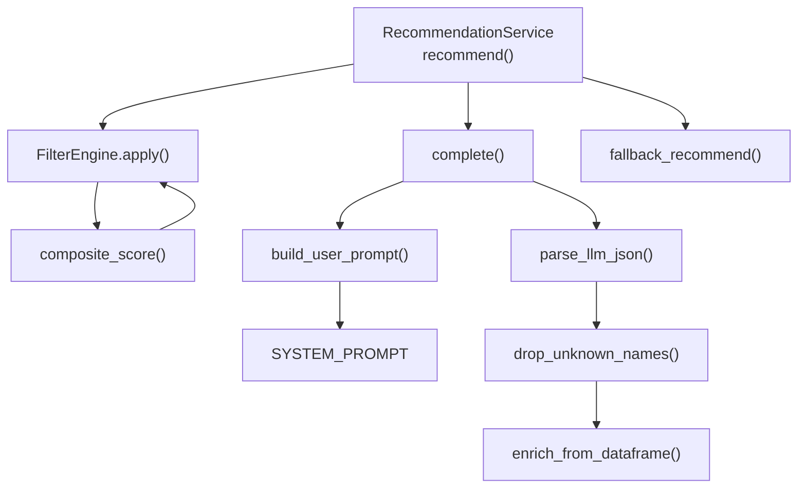
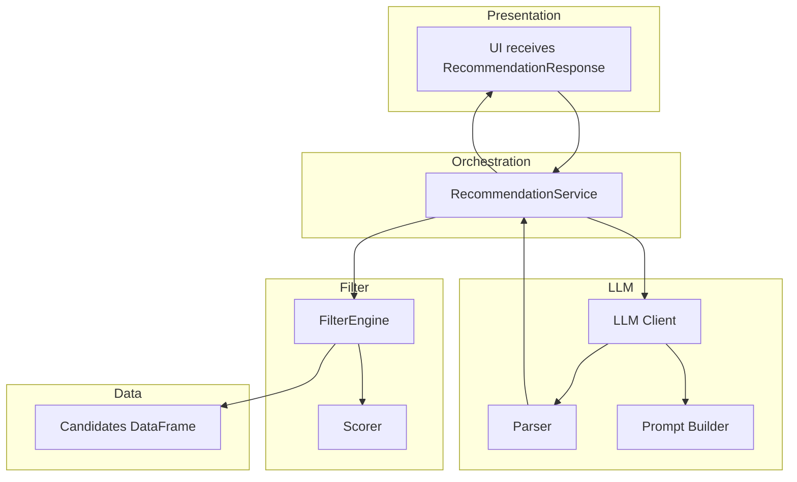
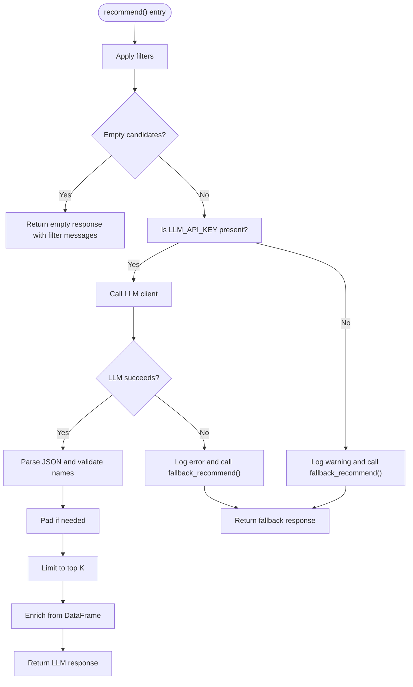
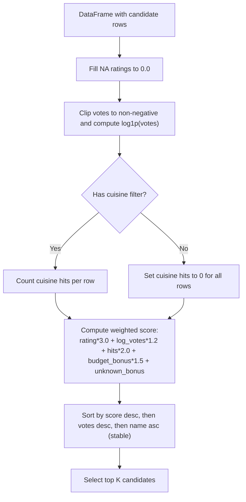
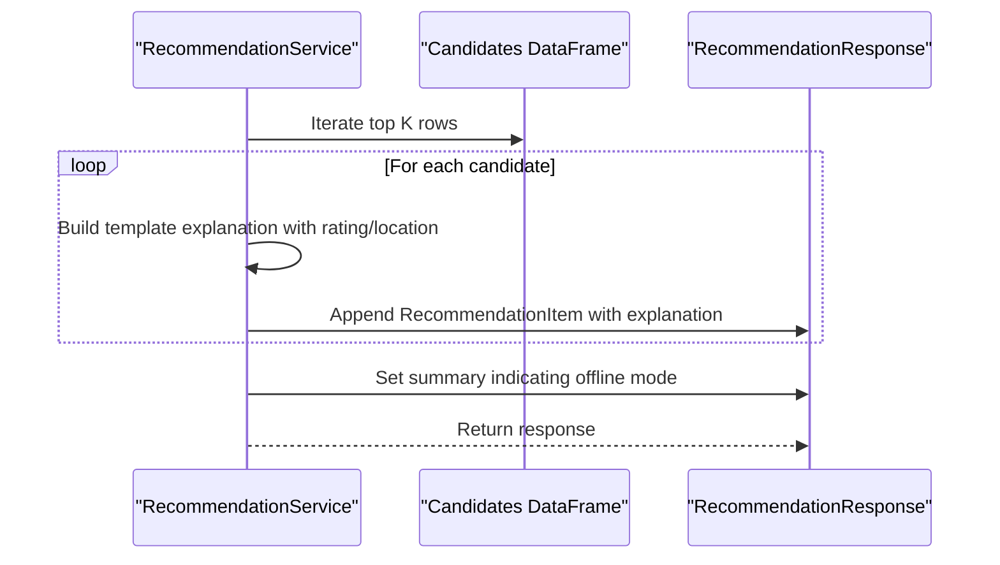
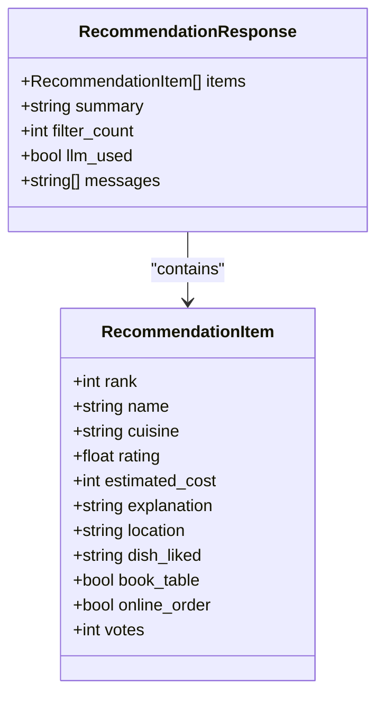
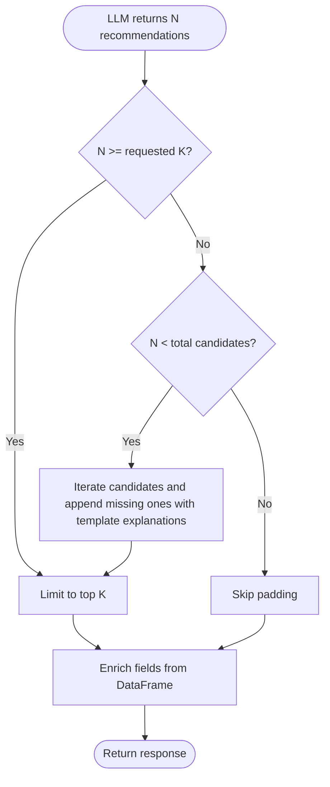
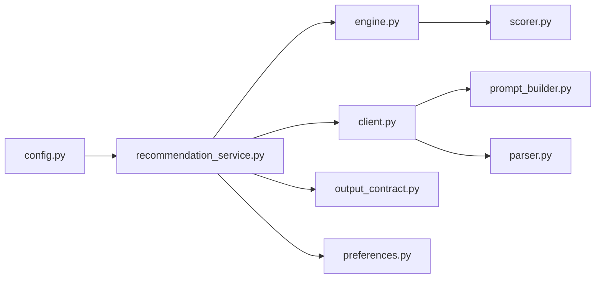

# Fallback Mechanisms

<cite>
**Referenced Files in This Document**
- [recommendation_service.py](file://zomato-ai-recommendation/src/services/recommendation_service.py)
- [scorer.py](file://zomato-ai-recommendation/src/phases/phase02/scorer.py)
- [engine.py](file://zomato-ai-recommendation/src/phases/phase02/engine.py)
- [client.py](file://zomato-ai-recommendation/src/llm/client.py)
- [parser.py](file://zomato-ai-recommendation/src/llm/parser.py)
- [prompt_builder.py](file://zomato-ai-recommendation/src/llm/prompt_builder.py)
- [config.py](file://zomato-ai-recommendation/src/config.py)
- [output_contract.py](file://zomato-ai-recommendation/src/phases/phase00/output_contract.py)
- [preferences.py](file://zomato-ai-recommendation/src/phases/phase00/preferences.py)
- [test_recommendation.py](file://zomato-ai-recommendation/tests/test_recommendation.py)
- [ARCHITECTURE.md](file://zomato-ai-recommendation/docs/ARCHITECTURE.md)
</cite>

## Table of Contents
1. [Introduction](#introduction)
2. [Project Structure](#project-structure)
3. [Core Components](#core-components)
4. [Architecture Overview](#architecture-overview)
5. [Detailed Component Analysis](#detailed-component-analysis)
6. [Dependency Analysis](#dependency-analysis)
7. [Performance Considerations](#performance-considerations)
8. [Troubleshooting Guide](#troubleshooting-guide)
9. [Conclusion](#conclusion)

## Introduction
This document explains the fallback mechanisms in the recommendation service. It covers when fallback mode is triggered (missing API keys and LLM failures), the structured scorer ranking algorithm used during fallback, template-based explanation generation, and response formatting. It also documents graceful degradation strategies, error message handling, and user notification systems. Finally, it provides examples of fallback scenarios and contrasts LLM-powered versus fallback responses.

## Project Structure
The fallback logic is implemented in the recommendation orchestration service and integrates with the filtering engine, LLM client, and parsers. The system is designed to gracefully degrade when the LLM layer is unavailable or misconfigured.

**Diagram sources**
- [recommendation_service.py:37-131](file://zomato-ai-recommendation/src/services/recommendation_service.py#L37-L131)
- [engine.py:146-189](file://zomato-ai-recommendation/src/phases/phase02/engine.py#L146-L189)
- [scorer.py:29-59](file://zomato-ai-recommendation/src/phases/phase02/scorer.py#L29-L59)
- [client.py:14-94](file://zomato-ai-recommendation/src/llm/client.py#L14-L94)
- [prompt_builder.py:30-68](file://zomato-ai-recommendation/src/llm/prompt_builder.py#L30-L68)
- [parser.py:24-141](file://zomato-ai-recommendation/src/llm/parser.py#L24-L141)

**Section sources**
- [recommendation_service.py:37-131](file://zomato-ai-recommendation/src/services/recommendation_service.py#L37-L131)
- [engine.py:146-189](file://zomato-ai-recommendation/src/phases/phase02/engine.py#L146-L189)
- [scorer.py:29-59](file://zomato-ai-recommendation/src/phases/phase02/scorer.py#L29-L59)
- [client.py:14-94](file://zomato-ai-recommendation/src/llm/client.py#L14-L94)
- [prompt_builder.py:30-68](file://zomato-ai-recommendation/src/llm/prompt_builder.py#L30-L68)
- [parser.py:24-141](file://zomato-ai-recommendation/src/llm/parser.py#L24-L141)

## Core Components
- RecommendationService: Orchestrates filtering, LLM invocation, parsing, and fallback. It decides when to fall back based on API key presence and LLM exceptions.
- FilterEngine: Applies user preferences to produce a shortlist and sorts candidates using a composite score.
- Scorer: Computes a composite score and deterministic tiebreaks to rank candidates before LLM.
- LLM Client: Performs HTTP requests to the configured LLM provider with retries and structured output support.
- Parser: Validates and parses LLM JSON responses, drops hallucinated names, and enriches fields from the candidate DataFrame.
- Prompt Builder: Constructs the system and user prompts with explicit schema and grounding instructions.
- Configuration: Loads environment variables for API keys, base URLs, and model selection.

**Section sources**
- [recommendation_service.py:30-131](file://zomato-ai-recommendation/src/services/recommendation_service.py#L30-L131)
- [engine.py:140-189](file://zomato-ai-recommendation/src/phases/phase02/engine.py#L140-L189)
- [scorer.py:29-69](file://zomato-ai-recommendation/src/phases/phase02/scorer.py#L29-L69)
- [client.py:14-94](file://zomato-ai-recommendation/src/llm/client.py#L14-L94)
- [parser.py:24-141](file://zomato-ai-recommendation/src/llm/parser.py#L24-L141)
- [prompt_builder.py:9-68](file://zomato-ai-recommendation/src/llm/prompt_builder.py#L9-L68)
- [config.py:26-38](file://zomato-ai-recommendation/src/config.py#L26-L38)

## Architecture Overview
The system follows a layered architecture with graceful degradation:
- Data layer caches normalized restaurant records.
- Filter layer applies vectorized masks and computes a composite score to produce a small, high-quality shortlist.
- LLM layer builds a grounded prompt, invokes the model, validates output, and merges with ground-truth fields.
- Fallback layer uses the pre-ranked candidates and generates template-based explanations.

**Diagram sources**
- [ARCHITECTURE.md:12-39](file://zomato-ai-recommendation/docs/ARCHITECTURE.md#L12-L39)
- [recommendation_service.py:37-131](file://zomato-ai-recommendation/src/services/recommendation_service.py#L37-L131)
- [engine.py:146-189](file://zomato-ai-recommendation/src/phases/phase02/engine.py#L146-L189)
- [scorer.py:29-69](file://zomato-ai-recommendation/src/phases/phase02/scorer.py#L29-L69)
- [client.py:14-94](file://zomato-ai-recommendation/src/llm/client.py#L14-L94)
- [parser.py:24-141](file://zomato-ai-recommendation/src/llm/parser.py#L24-L141)
- [prompt_builder.py:30-68](file://zomato-ai-recommendation/src/llm/prompt_builder.py#L30-L68)

## Detailed Component Analysis

### Fallback Trigger Conditions
- Missing API key: If the LLM API key is not configured, the service logs a warning and immediately falls back to structured scorer ranking.
- LLM failure: If the LLM client raises an exception (e.g., network error, rate limit, or unrecoverable HTTP error), the service logs the error and falls back to structured scorer ranking.

**Diagram sources**
- [recommendation_service.py:37-131](file://zomato-ai-recommendation/src/services/recommendation_service.py#L37-L131)
- [client.py:36-94](file://zomato-ai-recommendation/src/llm/client.py#L36-L94)

**Section sources**
- [recommendation_service.py:59-66](file://zomato-ai-recommendation/src/services/recommendation_service.py#L59-L66)
- [recommendation_service.py:124-130](file://zomato-ai-recommendation/src/services/recommendation_service.py#L124-L130)
- [client.py:36-94](file://zomato-ai-recommendation/src/llm/client.py#L36-L94)

### Structured Scorer Ranking Algorithm (Fallback)
The fallback ranking is derived from the pre-LLM composite score computed by the filter engine. The scorer considers:
- Rating (primary weight)
- Votes (transformed via log plus one)
- Cuisine overlap (count of matched cuisines)
- Budget tier alignment (exact match and unknown bonus)
- Deterministic tiebreaks (score, votes, then alphabetical name)

**Diagram sources**
- [scorer.py:29-69](file://zomato-ai-recommendation/src/phases/phase02/scorer.py#L29-L69)

**Section sources**
- [scorer.py:29-69](file://zomato-ai-recommendation/src/phases/phase02/scorer.py#L29-L69)
- [engine.py:183-189](file://zomato-ai-recommendation/src/phases/phase02/engine.py#L183-L189)

### Template Explanation Generation
During fallback, explanations are generated from template strings that incorporate user preferences and candidate attributes. The template includes:
- Rating value
- Location context
- Indicator that the recommendation is offline

**Diagram sources**
- [recommendation_service.py:132-199](file://zomato-ai-recommendation/src/services/recommendation_service.py#L132-L199)

**Section sources**
- [recommendation_service.py:132-199](file://zomato-ai-recommendation/src/services/recommendation_service.py#L132-L199)

### Response Formatting and Output Contract
The service constructs a standardized response using the output contract:
- Items: List of RecommendationItem with fields like rank, name, cuisine, rating, estimated_cost, explanation, location, dish_liked, book_table, online_order, votes.
- Summary: A human-readable summary indicating fallback mode.
- filter_count: Number of candidates after filtering.
- llm_used: False during fallback.
- messages: User-facing hints and error messages.

**Diagram sources**
- [output_contract.py:8-41](file://zomato-ai-recommendation/src/phases/phase00/output_contract.py#L8-L41)

**Section sources**
- [output_contract.py:8-41](file://zomato-ai-recommendation/src/phases/phase00/output_contract.py#L8-L41)
- [recommendation_service.py:193-199](file://zomato-ai-recommendation/src/services/recommendation_service.py#L193-L199)

### Graceful Degradation Strategy
- Shortlist size: The filter engine caps candidates to a reasonable number before LLM invocation.
- Padding: When LLM returns fewer valid recommendations than requested, the service pads with top candidates not already included.
- Ground-truth enrichment: Even in fallback, fields are overwritten with verified data from the DataFrame to prevent hallucinations.
- Logging: Warnings and errors are logged with sufficient context for debugging.

**Diagram sources**
- [recommendation_service.py:91-115](file://zomato-ai-recommendation/src/services/recommendation_service.py#L91-L115)
- [parser.py:68-141](file://zomato-ai-recommendation/src/llm/parser.py#L68-L141)

**Section sources**
- [recommendation_service.py:91-115](file://zomato-ai-recommendation/src/services/recommendation_service.py#L91-L115)
- [parser.py:68-141](file://zomato-ai-recommendation/src/llm/parser.py#L68-L141)

### Error Message Handling and User Notifications
- Missing API key: A warning is logged and a user-facing message is included in the response messages indicating the need to configure the API key.
- LLM failure: An error is logged and a user-facing message is included indicating AI recommendation failure and fallback usage.
- Filter empty: When no candidates remain after filtering, the service returns a friendly summary and filter messages explaining why.

**Section sources**
- [recommendation_service.py:48-54](file://zomato-ai-recommendation/src/services/recommendation_service.py#L48-L54)
- [recommendation_service.py:60-66](file://zomato-ai-recommendation/src/services/recommendation_service.py#L60-L66)
- [recommendation_service.py:124-130](file://zomato-ai-recommendation/src/services/recommendation_service.py#L124-L130)
- [engine.py:104-137](file://zomato-ai-recommendation/src/phases/phase02/engine.py#L104-L137)

### Examples of Fallback Scenarios
- Missing API key scenario: The service logs a warning and returns a fallback response with template explanations and a message instructing to set the API key.
- LLM failure scenario: The service logs the error and returns a fallback response with template explanations and a message indicating AI recommendation failure.
- Padding scenario: When LLM returns fewer valid recommendations than requested, the service appends candidates with template explanations to reach the requested count.

**Section sources**
- [test_recommendation.py:227-252](file://zomato-ai-recommendation/tests/test_recommendation.py#L227-L252)
- [test_recommendation.py:255-280](file://zomato-ai-recommendation/tests/test_recommendation.py#L255-L280)
- [recommendation_service.py:91-115](file://zomato-ai-recommendation/src/services/recommendation_service.py#L91-L115)

### Differences Between LLM-Powered and Fallback Responses
- Explanations: LLM-powered explanations are personalized and grounded in the user’s preferences; fallback explanations are template-based and indicate offline mode.
- Fields: LLM-powered responses rely on LLM-provided fields; fallback responses overwrite fields with verified data from the DataFrame.
- Ranking: LLM-powered responses undergo final LLM ranking; fallback responses use the pre-LLM composite score and deterministic tiebreaks.
- Messages: LLM-powered responses include a summary from the LLM; fallback responses include a summary indicating offline mode and a message explaining the fallback.

**Section sources**
- [recommendation_service.py:116-122](file://zomato-ai-recommendation/src/services/recommendation_service.py#L116-L122)
- [recommendation_service.py:188-191](file://zomato-ai-recommendation/src/services/recommendation_service.py#L188-L191)
- [parser.py:68-141](file://zomato-ai-recommendation/src/llm/parser.py#L68-L141)

## Dependency Analysis
The fallback mechanism depends on:
- Configuration for API key detection and model/base URL settings.
- FilterEngine and Scorer for pre-ranking candidates.
- LLM Client for invoking the model and Parser for validating and enriching outputs.
- Output contract for consistent response formatting.

**Diagram sources**
- [config.py:26-38](file://zomato-ai-recommendation/src/config.py#L26-L38)
- [recommendation_service.py:37-131](file://zomato-ai-recommendation/src/services/recommendation_service.py#L37-L131)
- [engine.py:146-189](file://zomato-ai-recommendation/src/phases/phase02/engine.py#L146-L189)
- [scorer.py:29-69](file://zomato-ai-recommendation/src/phases/phase02/scorer.py#L29-L69)
- [client.py:14-94](file://zomato-ai-recommendation/src/llm/client.py#L14-L94)
- [prompt_builder.py:30-68](file://zomato-ai-recommendation/src/llm/prompt_builder.py#L30-L68)
- [parser.py:24-141](file://zomato-ai-recommendation/src/llm/parser.py#L24-L141)
- [output_contract.py:8-41](file://zomato-ai-recommendation/src/phases/phase00/output_contract.py#L8-L41)
- [preferences.py:20-32](file://zomato-ai-recommendation/src/phases/phase00/preferences.py#L20-L32)

**Section sources**
- [config.py:26-38](file://zomato-ai-recommendation/src/config.py#L26-L38)
- [recommendation_service.py:37-131](file://zomato-ai-recommendation/src/services/recommendation_service.py#L37-L131)
- [engine.py:146-189](file://zomato-ai-recommendation/src/phases/phase02/engine.py#L146-L189)
- [scorer.py:29-69](file://zomato-ai-recommendation/src/phases/phase02/scorer.py#L29-L69)
- [client.py:14-94](file://zomato-ai-recommendation/src/llm/client.py#L14-L94)
- [prompt_builder.py:30-68](file://zomato-ai-recommendation/src/llm/prompt_builder.py#L30-L68)
- [parser.py:24-141](file://zomato-ai-recommendation/src/llm/parser.py#L24-L141)
- [output_contract.py:8-41](file://zomato-ai-recommendation/src/phases/phase00/output_contract.py#L8-L41)
- [preferences.py:20-32](file://zomato-ai-recommendation/src/phases/phase00/preferences.py#L20-L32)

## Performance Considerations
- Pre-filtering reduces LLM input size to a small, high-quality shortlist, minimizing latency and cost.
- The fallback path avoids LLM calls entirely, providing fast, deterministic results.
- Deterministic tiebreaks ensure stable ordering even when scores are equal.

[No sources needed since this section provides general guidance]

## Troubleshooting Guide
- Missing API key: Ensure the environment variable is set and loaded by the configuration module. The service will log a warning and fall back automatically.
- LLM rate limit or server errors: The LLM client retries with exponential backoff for recoverable errors; unrecoverable errors propagate as runtime errors.
- Hallucinated names: The parser drops names not present in the candidate list; fallback avoids hallucinations by using verified data.
- Empty candidates: The filter engine provides user-facing messages explaining why no results matched the preferences.

**Section sources**
- [config.py:26-38](file://zomato-ai-recommendation/src/config.py#L26-L38)
- [client.py:71-94](file://zomato-ai-recommendation/src/llm/client.py#L71-L94)
- [parser.py:45-66](file://zomato-ai-recommendation/src/llm/parser.py#L45-L66)
- [engine.py:104-137](file://zomato-ai-recommendation/src/phases/phase02/engine.py#L104-L137)

## Conclusion
The fallback mechanism ensures reliable recommendations even when the LLM layer is unavailable or misconfigured. By leveraging a robust pre-LLM ranking algorithm, template-based explanations, and strict validation, the system maintains quality and user trust while degrading gracefully. The design balances performance, reliability, and user experience, with clear error messaging and deterministic behavior.