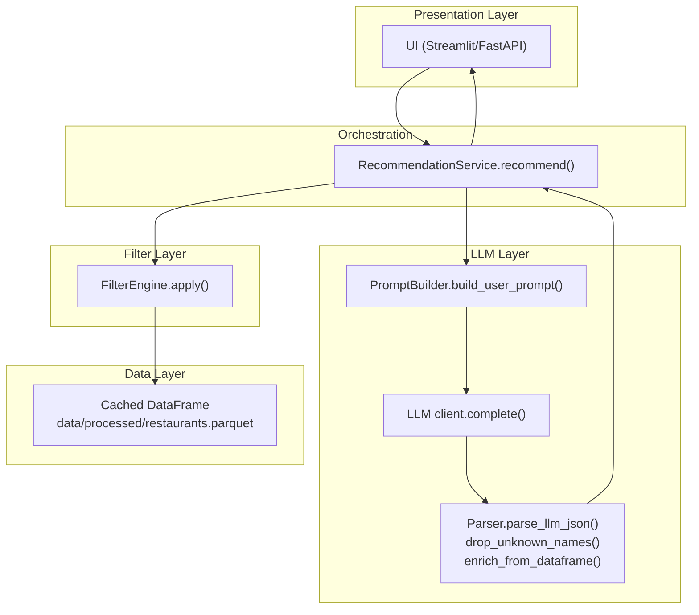
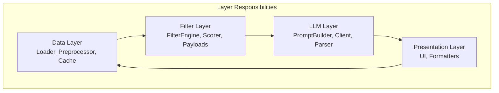
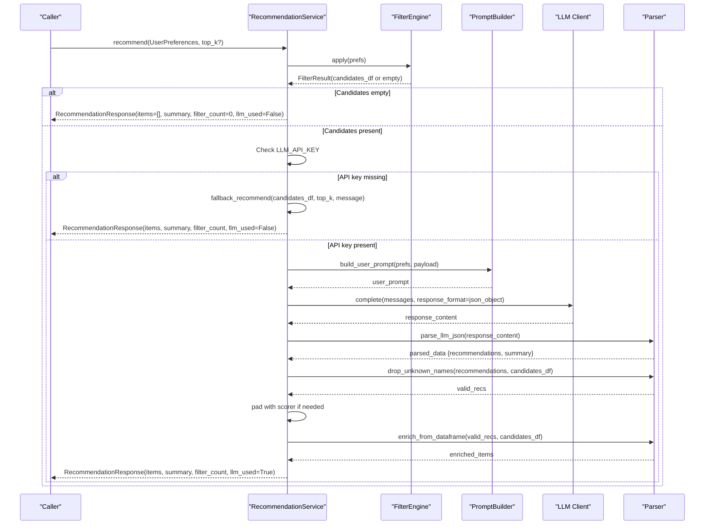
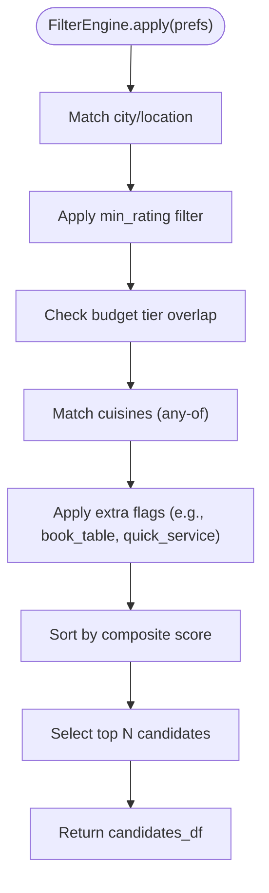
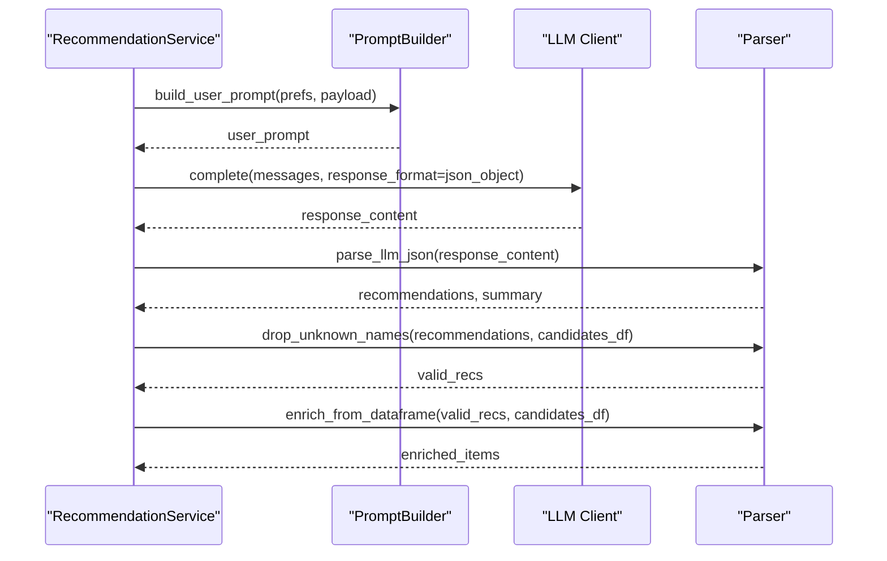
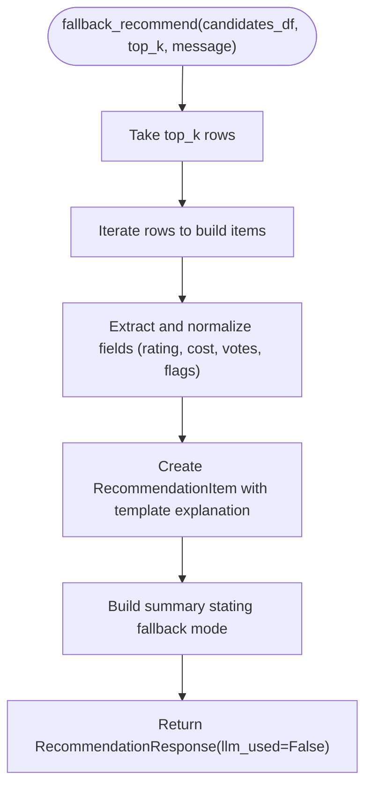
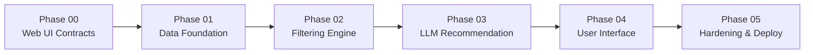

# Recommendation Workflow

<cite>
**Referenced Files in This Document**
- [recommendation_service.py](file://src/services/recommendation_service.py)
- [config.py](file://src/config.py)
- [ARCHITECTURE.md](file://docs/ARCHITECTURE.md)
- [phases.md](file://docs/phases.md)
- [registry.py](file://src/phases/registry.py)
- [README.md](file://README.md)
</cite>

## Table of Contents
1. [Introduction](#introduction)
2. [Project Structure](#project-structure)
3. [Core Components](#core-components)
4. [Architecture Overview](#architecture-overview)
5. [Detailed Component Analysis](#detailed-component-analysis)
6. [Dependency Analysis](#dependency-analysis)
7. [Performance Considerations](#performance-considerations)
8. [Troubleshooting Guide](#troubleshooting-guide)
9. [Conclusion](#conclusion)
10. [Appendices](#appendices)

## Introduction
This document explains the recommendation workflow orchestration in the Zomato AI Recommendation System. It covers the end-to-end process from validating user preferences, filtering candidates, invoking an LLM for ranking and explanations, and generating the final response. It also documents the integration between the RecommendationService and the FilterEngine, decision points for LLM versus fallback processing, workflow parameters, error handling, and performance optimizations. Practical execution paths and edge-case handling are included to help developers and operators reason about the system behavior.

## Project Structure
The repository is organized into phases and layers. The recommendation workflow is orchestrated by a service that integrates:
- User preference validation and contracts (Phase 00)
- Data ingestion and caching (Phase 01)
- Candidate filtering (Phase 02)
- LLM ranking and explanation (Phase 03)
- Optional UI and hardening (Phases 04–05)

**Diagram sources**
- [recommendation_service.py:37-131](file://src/services/recommendation_service.py#L37-L131)
- [config.py:40-41](file://src/config.py#L40-L41)
- [ARCHITECTURE.md:122-134](file://docs/ARCHITECTURE.md#L122-L134)

**Section sources**
- [README.md:14-39](file://README.md#L14-L39)
- [ARCHITECTURE.md:146-181](file://docs/ARCHITECTURE.md#L146-L181)
- [phases.md:1-341](file://docs/phases.md#L1-L341)

## Core Components
- RecommendationService: Orchestrates filtering, LLM invocation, parsing, and fallback ranking. It validates inputs, applies the FilterEngine, builds prompts, calls the LLM client, parses and validates the response, and returns a structured RecommendationResponse.
- FilterEngine: Applies user preferences to the cached DataFrame to produce a shortlist of candidates. It logs empty-state reasons and ensures the output is ready for LLM ranking.
- LLM Layer: Includes prompt building, client invocation with structured output, and post-processing to validate and enrich results.
- Configuration: Provides environment-driven settings such as API keys, model selection, and limits for candidates and recommendations.

Key responsibilities and integration points:
- Input validation and contracts are defined in Phase 00 and consumed by RecommendationService.
- FilterEngine consumes the DataFrame produced by Phase 01 and returns a filtered subset.
- LLM Layer consumes the filtered candidates and user preferences to produce ranked results with explanations.
- Fallback path uses structured scoring when LLM is unavailable or fails.

**Section sources**
- [recommendation_service.py:30-131](file://src/services/recommendation_service.py#L30-L131)
- [ARCHITECTURE.md:43-114](file://docs/ARCHITECTURE.md#L43-L114)
- [config.py:26-41](file://src/config.py#L26-L41)

## Architecture Overview
The system follows a layered architecture with explicit boundaries and graceful degradation:
- Data Layer: Loads, cleans, and caches the dataset locally.
- Filter Layer: Applies structured filters to produce a small, high-quality candidate set.
- LLM Layer: Ranks and explains recommendations using a grounded prompt and structured output.
- Presentation Layer: Renders results and handles user interactions.
- Orchestration: RecommendationService coordinates the end-to-end flow and switches to fallback when needed.

**Diagram sources**
- [ARCHITECTURE.md:43-114](file://docs/ARCHITECTURE.md#L43-L114)

**Section sources**
- [ARCHITECTURE.md:3-11](file://docs/ARCHITECTURE.md#L3-L11)
- [ARCHITECTURE.md:122-134](file://docs/ARCHITECTURE.md#L122-L134)

## Detailed Component Analysis

### RecommendationService Orchestration
RecommendationService implements the end-to-end recommendation workflow with robust fallback logic.

**Diagram sources**
- [recommendation_service.py:37-131](file://src/services/recommendation_service.py#L37-L131)
- [recommendation_service.py:132-199](file://src/services/recommendation_service.py#L132-L199)

Key steps and decisions:
- Validate and convert preferences to internal types (handled by Phase 00 contracts).
- Apply FilterEngine to produce candidates or return empty-state guidance.
- Check LLM_API_KEY; if absent, fall back to structured ranking.
- Build LLM prompt from filtered candidates and user preferences.
- Invoke LLM with structured JSON output mode.
- Parse and validate LLM output, drop hallucinated names, and enrich with ground-truth fields.
- Pad results from structured scoring if LLM returns fewer items.
- Limit output to top K and return a unified response.

Decision points for LLM vs fallback:
- Missing API key triggers fallback immediately.
- LLM exceptions trigger fallback with a user-facing message.
- If LLM returns fewer valid recommendations than requested, pad from structured scoring.

Parameters and configuration:
- TOP_K_RECOMMENDATIONS controls the number of recommendations returned.
- MAX_CANDIDATES influences the size of the candidate pool sent to the LLM.
- LLM_PROVIDER, LLM_MODEL, LLM_BASE_URL, and LLM_API_KEY are loaded from environment.

Error handling:
- Empty candidates: Friendly summary and suggestion to relax filters.
- Missing API key: Warning logged; fallback response with guidance.
- LLM failures: Error logged; fallback response with explanatory message.
- Name validation: Unknown names dropped; padding occurs when possible.

**Section sources**
- [recommendation_service.py:37-131](file://src/services/recommendation_service.py#L37-L131)
- [recommendation_service.py:132-199](file://src/services/recommendation_service.py#L132-L199)
- [config.py:26-41](file://src/config.py#L26-L41)

### FilterEngine Integration
FilterEngine is responsible for transforming user preferences into a filtered DataFrame suitable for LLM ranking. It:
- Applies a sequence of structured filters (e.g., city/location, rating threshold, budget tier, cuisines, extras).
- Sorts candidates by a composite score and returns up to a configured limit.
- Produces empty-state messages when no candidates remain, enabling the orchestrator to return helpful guidance.

Integration with RecommendationService:
- RecommendationService calls FilterEngine.apply(prefs) and receives either an empty result or a DataFrame of candidates.
- If empty, RecommendationService returns a response with llm_used=False and a friendly summary.
- If not empty, RecommendationService proceeds to LLM ranking.

**Diagram sources**
- [ARCHITECTURE.md:70-78](file://docs/ARCHITECTURE.md#L70-L78)

**Section sources**
- [ARCHITECTURE.md:60-78](file://docs/ARCHITECTURE.md#L60-L78)

### LLM Layer and Post-processing
The LLM layer builds a grounded prompt, invokes the provider client, and validates/normalizes the response:
- PromptBuilder constructs a system prompt and a user prompt containing user preferences and a compact candidate payload.
- Client.complete enforces JSON mode and handles timeouts/retries.
- Parser validates the JSON schema, drops unknown names, and enriches fields from the original DataFrame.

**Diagram sources**
- [recommendation_service.py:68-122](file://src/services/recommendation_service.py#L68-L122)

**Section sources**
- [recommendation_service.py:68-122](file://src/services/recommendation_service.py#L68-L122)

### Fallback Ranking
When the LLM is unavailable or fails, RecommendationService falls back to structured ranking:
- Uses the pre-sorted candidates from FilterEngine.
- Constructs RecommendationItems with template explanations.
- Returns a response indicating llm_used=False and includes a user-facing message.

**Diagram sources**
- [recommendation_service.py:132-199](file://src/services/recommendation_service.py#L132-L199)

**Section sources**
- [recommendation_service.py:132-199](file://src/services/recommendation_service.py#L132-L199)

## Dependency Analysis
The system’s phased architecture ensures clear dependency order and rollback hints. The recommendation workflow depends on:
- Phase 00 contracts for user preferences and response models.
- Phase 01 data cache for the underlying DataFrame.
- Phase 02 filter engine for candidate shortlisting.
- Phase 03 LLM components for ranking and explanations.

**Diagram sources**
- [registry.py:28-68](file://src/phases/registry.py#L28-L68)
- [phases.md:18-25](file://docs/phases.md#L18-L25)

**Section sources**
- [registry.py:28-68](file://src/phases/registry.py#L28-L68)
- [phases.md:18-25](file://docs/phases.md#L18-L25)

## Performance Considerations
- Minimize LLM cost and latency by filtering first: the filter layer reduces the candidate set to a small, manageable size before LLM ranking.
- Efficient data access: cached Parquet enables fast warm-cache reads.
- Structured scoring: provides a deterministic fallback and reduces LLM calls when appropriate.
- Configurable limits: MAX_CANDIDATES and TOP_K_RECOMMENDATIONS balance quality and speed.
- Logging and monitoring: track filter counts and LLM latency without exposing sensitive data.

Target timings:
- Filter: < 100 ms
- LLM: 2–8 s
- Total UX: < 10 s with loading indicators

**Section sources**
- [ARCHITECTURE.md:5, 136-142:5-5](file://docs/ARCHITECTURE.md#L5-L5)
- [config.py:40-41](file://src/config.py#L40-L41)

## Troubleshooting Guide
Common issues and resolutions:
- No candidates returned:
  - Cause: Filters too restrictive (location, rating, budget, cuisines).
  - Action: Return friendly summary suggesting to relax constraints.
- Missing API key:
  - Cause: LLM_API_KEY not set in environment.
  - Action: Log warning and return fallback response with guidance.
- LLM failure:
  - Cause: Network error, provider rate limit, or malformed response.
  - Action: Log error and return fallback response with explanatory message.
- Hallucinated names:
  - Cause: LLM recommending restaurants not in the candidate set.
  - Action: Drop unknown names and optionally pad from structured scoring.
- Unexpected empty response:
  - Verify FilterEngine empty-state messages and ensure the cache is populated.

Operational tips:
- Ensure environment variables are loaded from .env.
- Use scripts to build and validate the cache.
- Monitor filter counts and LLM latency in logs.

**Section sources**
- [recommendation_service.py:47-54](file://src/services/recommendation_service.py#L47-L54)
- [recommendation_service.py:60-66](file://src/services/recommendation_service.py#L60-L66)
- [recommendation_service.py:124-130](file://src/services/recommendation_service.py#L124-L130)
- [recommendation_service.py:88-111](file://src/services/recommendation_service.py#L88-L111)

## Conclusion
The recommendation workflow is designed for reliability, performance, and explainability. By applying structured filtering first, limiting LLM input size, and enforcing strict validation and fallback behavior, the system delivers responsive, grounded recommendations. The phased architecture and explicit contracts support incremental development, testing, and safe rollbacks.

## Appendices

### Workflow Parameters
- TOP_K_RECOMMENDATIONS: Number of recommendations to return.
- MAX_CANDIDATES: Upper bound on candidates sent to the LLM.
- LLM_PROVIDER, LLM_MODEL, LLM_BASE_URL: Provider configuration.
- LLM_API_KEY: API key for the selected provider.

**Section sources**
- [config.py:26-41](file://src/config.py#L26-L41)

### Typical Execution Paths
- Normal path:
  - FilterEngine returns candidates → LLM invoked → Recommendations parsed and enriched → Response returned with llm_used=True.
- Empty candidates:
  - FilterEngine returns empty → Friendly summary and guidance → Response returned with llm_used=False.
- Missing API key:
  - Immediate fallback to structured ranking → Response returned with llm_used=False and message.
- LLM failure:
  - Exception caught → Fallback to structured ranking → Response returned with llm_used=False and message.

**Section sources**
- [recommendation_service.py:37-131](file://src/services/recommendation_service.py#L37-L131)
- [recommendation_service.py:132-199](file://src/services/recommendation_service.py#L132-L199)