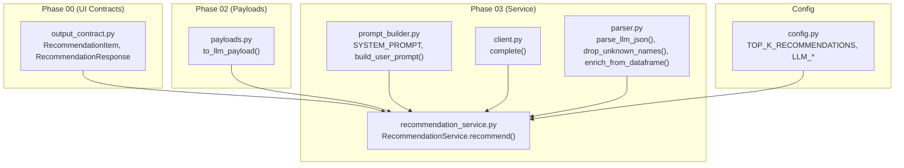
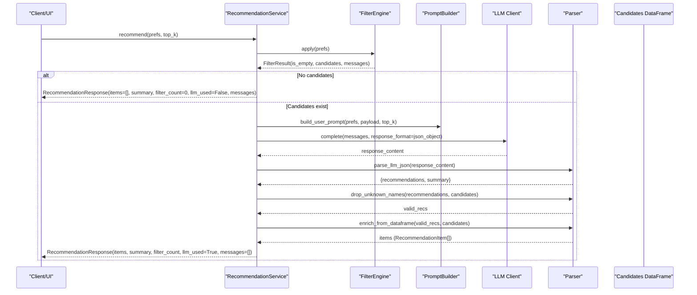
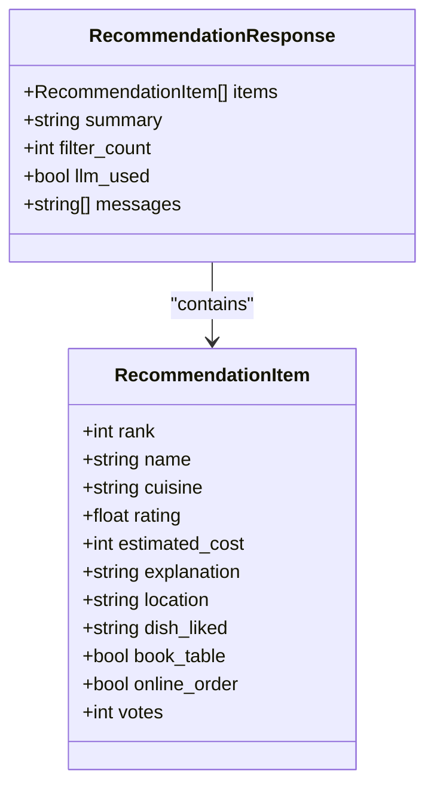
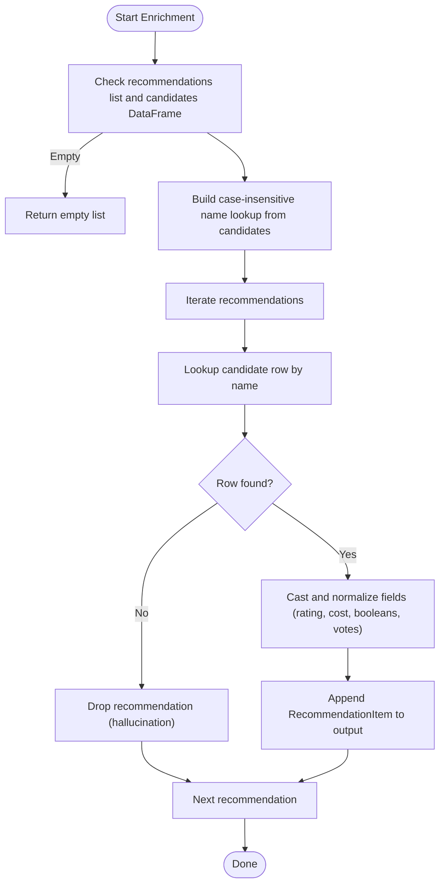
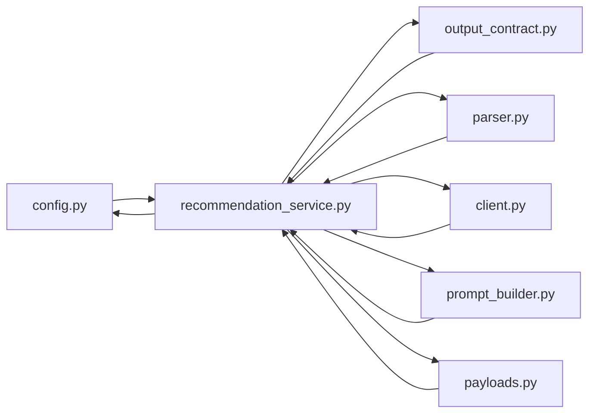

# Response Formatting

<cite>
**Referenced Files in This Document**
- [output_contract.py](file://zomato-ai-recommendation/src/phases/phase00/output_contract.py)
- [recommendation.py](file://zomato-ai-recommendation/src/models/recommendation.py)
- [recommendation_service.py](file://zomato-ai-recommendation/src/services/recommendation_service.py)
- [parser.py](file://zomato-ai-recommendation/src/llm/parser.py)
- [client.py](file://zomato-ai-recommendation/src/llm/client.py)
- [payloads.py](file://zomato-ai-recommendation/src/phases/phase02/payloads.py)
- [prompt_builder.py](file://zomato-ai-recommendation/src/llm/prompt_builder.py)
- [config.py](file://zomato-ai-recommendation/src/config.py)
- [test_recommendation.py](file://zomato-ai-recommendation/tests/test_recommendation.py)
</cite>

## Table of Contents
1. [Introduction](#introduction)
2. [Project Structure](#project-structure)
3. [Core Components](#core-components)
4. [Architecture Overview](#architecture-overview)
5. [Detailed Component Analysis](#detailed-component-analysis)
6. [Dependency Analysis](#dependency-analysis)
7. [Performance Considerations](#performance-considerations)
8. [Troubleshooting Guide](#troubleshooting-guide)
9. [Conclusion](#conclusion)
10. [Appendices](#appendices)

## Introduction
This document explains the recommendation response formatting and data structures used by the system. It focuses on the RecommendationResponse and RecommendationItem models, the response enrichment process, ground truth field guarantees, anti-hallucination validation, summary generation logic, funnel metrics reporting, and message handling. It also provides examples of complete recommendation responses, error responses, and empty result scenarios with their corresponding data structures.

## Project Structure
The recommendation response pipeline spans several modules:
- Phase 00 defines the stable output contracts used by the UI.
- Phase 02 prepares candidate payloads for the LLM.
- Phase 03 orchestrates filtering, LLM calls, parsing, validation, and enrichment.
- LLM client and parser handle API communication and response parsing.
- Tests validate the end-to-end behavior and edge cases.

**Diagram sources**
- [output_contract.py:1-52](file://zomato-ai-recommendation/src/phases/phase00/output_contract.py#L1-L52)
- [payloads.py:1-44](file://zomato-ai-recommendation/src/phases/phase02/payloads.py#L1-L44)
- [recommendation_service.py:1-200](file://zomato-ai-recommendation/src/services/recommendation_service.py#L1-L200)
- [parser.py:1-141](file://zomato-ai-recommendation/src/llm/parser.py#L1-L141)
- [client.py:1-94](file://zomato-ai-recommendation/src/llm/client.py#L1-L94)
- [prompt_builder.py:1-69](file://zomato-ai-recommendation/src/llm/prompt_builder.py#L1-L69)
- [config.py:1-50](file://zomato-ai-recommendation/src/config.py#L1-L50)

**Section sources**
- [output_contract.py:1-52](file://zomato-ai-recommendation/src/phases/phase00/output_contract.py#L1-L52)
- [payloads.py:1-44](file://zomato-ai-recommendation/src/phases/phase02/payloads.py#L1-L44)
- [recommendation_service.py:1-200](file://zomato-ai-recommendation/src/services/recommendation_service.py#L1-L200)
- [parser.py:1-141](file://zomato-ai-recommendation/src/llm/parser.py#L1-L141)
- [client.py:1-94](file://zomato-ai-recommendation/src/llm/client.py#L1-L94)
- [prompt_builder.py:1-69](file://zomato-ai-recommendation/src/llm/prompt_builder.py#L1-L69)
- [config.py:1-50](file://zomato-ai-recommendation/src/config.py#L1-L50)

## Core Components
This section documents the data models used to represent recommendation responses and items.

- RecommendationItem
  - Purpose: Represents a single recommended restaurant in the UI results list.
  - Fields:
    - rank: integer, required, must be ≥ 1
    - name: string, required
    - cuisine: string, default empty
    - rating: float or null, default null
    - estimated_cost: integer or null, default null (INR for two)
    - explanation: string, default empty
    - location: string, default empty (sub-locality/neighborhood)
    - dish_liked: string, default empty (pipe-separated popular dishes)
    - book_table: boolean, default false (table booking available)
    - online_order: boolean, default false (online ordering available)
    - votes: integer, default 0 (number of user reviews/votes)
  - Validation rules:
    - rank must satisfy ge=1
    - All numeric fields are nullable and may be None when unknown
    - Strings may be empty defaults when data is missing

- RecommendationResponse
  - Purpose: Complete response for the recommendation view.
  - Fields:
    - items: list of RecommendationItem, default empty
    - summary: string or null, default null
    - filter_count: integer or null, default null
    - llm_used: boolean, default false
    - messages: list of strings, default empty (user-facing hints)
  - Behavior:
    - Frozen configuration disabled for mutability during construction
    - Provides a placeholder factory method for early-stage UI testing

- RestaurantRecommendation (auxiliary model)
  - Purpose: Structured output shape generated by the LLM (used internally).
  - Fields:
    - name: string, required (must match candidate list exactly)
    - cuisine: string, default empty
    - rating: float or null, default null
    - estimated_cost: integer or null, default null
    - explanation: string, required (personalized explanation)

**Section sources**
- [output_contract.py:8-39](file://zomato-ai-recommendation/src/phases/phase00/output_contract.py#L8-L39)
- [recommendation.py:9-16](file://zomato-ai-recommendation/src/models/recommendation.py#L9-L16)

## Architecture Overview
The recommendation response pipeline follows a strict sequence: filtering candidates, preparing payloads, prompting the LLM, parsing and validating outputs, enriching with ground truth, and returning a standardized response.

**Diagram sources**
- [recommendation_service.py:37-131](file://zomato-ai-recommendation/src/services/recommendation_service.py#L37-L131)
- [prompt_builder.py:30-68](file://zomato-ai-recommendation/src/llm/prompt_builder.py#L30-L68)
- [client.py:14-94](file://zomato-ai-recommendation/src/llm/client.py#L14-L94)
- [parser.py:24-141](file://zomato-ai-recommendation/src/llm/parser.py#L24-L141)
- [payloads.py:27-44](file://zomato-ai-recommendation/src/phases/phase02/payloads.py#L27-L44)

## Detailed Component Analysis

### RecommendationResponse and RecommendationItem Models
- RecommendationItem
  - Guarantees:
    - rank is always ≥ 1 and populated by enrichment
    - name casing preserved from ground truth
    - cuisine, rating, estimated_cost, location, dish_liked, book_table, online_order, votes are overwritten from the DataFrame to ensure ground truth
  - Defaults:
    - Numeric fields may be null when unknown
    - String fields may be empty defaults when unknown
- RecommendationResponse
  - Summary:
    - summary is taken from LLM JSON or constructed in fallback
    - filter_count reflects the number of candidates after filtering
    - llm_used indicates whether the LLM was invoked
    - messages carries user-facing hints (e.g., empty filter reasons, API errors)

**Diagram sources**
- [output_contract.py:8-39](file://zomato-ai-recommendation/src/phases/phase00/output_contract.py#L8-L39)

**Section sources**
- [output_contract.py:8-39](file://zomato-ai-recommendation/src/phases/phase00/output_contract.py#L8-L39)

### Response Enrichment and Ground Truth Field Guarantees
- Enrichment process:
  - Input: list of recommendation dicts (from LLM) and the candidates DataFrame
  - Lookup: case-insensitive name mapping from DataFrame
  - Overwrite: name casing, cuisines, rating, cost_for_two, location, dish_liked, book_table, online_order, votes
  - Output: list of RecommendationItem with guaranteed ground truth fields
- Anti-hallucination validation:
  - Unknown names are dropped before enrichment
  - Case-insensitive matching ensures only valid candidates are included

**Diagram sources**
- [parser.py:68-141](file://zomato-ai-recommendation/src/llm/parser.py#L68-L141)

**Section sources**
- [parser.py:45-141](file://zomato-ai-recommendation/src/llm/parser.py#L45-L141)

### Summary Generation Logic
- LLM produces a JSON object containing:
  - recommendations: list of dicts with name and explanation
  - summary: string overview
- Summary is passed through unchanged to the final response.
- Fallback path constructs a summary indicating offline status and uses structured scoring.

**Section sources**
- [prompt_builder.py:9-28](file://zomato-ai-recommendation/src/llm/prompt_builder.py#L9-L28)
- [recommendation_service.py:188-191](file://zomato-ai-recommendation/src/services/recommendation_service.py#L188-L191)

### Funnel Metrics Reporting
- filter_count: number of candidates after filtering
- llm_used: indicates whether the LLM was invoked
- messages: user-facing hints (e.g., empty filter reasons, API errors)
- These fields provide visibility into the funnel stages and outcomes.

**Section sources**
- [recommendation_service.py:47-54](file://zomato-ai-recommendation/src/services/recommendation_service.py#L47-L54)
- [recommendation_service.py:116-122](file://zomato-ai-recommendation/src/services/recommendation_service.py#L116-L122)
- [recommendation_service.py:193-199](file://zomato-ai-recommendation/src/services/recommendation_service.py#L193-L199)

### Message Handling
- Empty candidates: summary and messages indicate no matches; filter_count=0
- API key missing: fallback triggered; messages explain missing key; llm_used=False
- LLM failures: fallback triggered; messages include error; llm_used=False
- Successful LLM: messages remain empty; llm_used=True

**Section sources**
- [recommendation_service.py:47-54](file://zomato-ai-recommendation/src/services/recommendation_service.py#L47-L54)
- [recommendation_service.py:60-66](file://zomato-ai-recommendation/src/services/recommendation_service.py#L60-L66)
- [recommendation_service.py:124-130](file://zomato-ai-recommendation/src/services/recommendation_service.py#L124-L130)
- [recommendation_service.py:193-199](file://zomato-ai-recommendation/src/services/recommendation_service.py#L193-L199)

### Example Data Structures

- Complete recommendation response (LLM path)
  - items: list of RecommendationItem with fields populated from candidates DataFrame
  - summary: string overview from LLM
  - filter_count: number of candidates after filtering
  - llm_used: true
  - messages: empty

- Error response (fallback due to LLM failure)
  - items: list of RecommendationItem with explanations indicating offline status
  - summary: constructed fallback summary
  - filter_count: number of candidates after filtering
  - llm_used: false
  - messages: error message indicating AI recommendation failure

- Empty result scenario (no candidates)
  - items: empty list
  - summary: guidance to relax filters
  - filter_count: 0
  - llm_used: false
  - messages: empty filter reason

**Section sources**
- [recommendation_service.py:47-54](file://zomato-ai-recommendation/src/services/recommendation_service.py#L47-L54)
- [recommendation_service.py:124-130](file://zomato-ai-recommendation/src/services/recommendation_service.py#L124-L130)
- [recommendation_service.py:188-191](file://zomato-ai-recommendation/src/services/recommendation_service.py#L188-L191)

## Dependency Analysis
The response formatting pipeline depends on:
- Pydantic models for validation and serialization
- LLM client for completions with retry/backoff
- Parser utilities for JSON extraction and anti-hallucination checks
- Payload preparation for efficient prompts
- Configuration for top-K and API keys

**Diagram sources**
- [config.py:1-50](file://zomato-ai-recommendation/src/config.py#L1-L50)
- [recommendation_service.py:1-200](file://zomato-ai-recommendation/src/services/recommendation_service.py#L1-L200)
- [prompt_builder.py:1-69](file://zomato-ai-recommendation/src/llm/prompt_builder.py#L1-L69)
- [client.py:1-94](file://zomato-ai-recommendation/src/llm/client.py#L1-L94)
- [parser.py:1-141](file://zomato-ai-recommendation/src/llm/parser.py#L1-L141)
- [payloads.py:1-44](file://zomato-ai-recommendation/src/phases/phase02/payloads.py#L1-L44)
- [output_contract.py:1-52](file://zomato-ai-recommendation/src/phases/phase00/output_contract.py#L1-L52)

**Section sources**
- [recommendation_service.py:1-200](file://zomato-ai-recommendation/src/services/recommendation_service.py#L1-L200)
- [config.py:1-50](file://zomato-ai-recommendation/src/config.py#L1-L50)

## Performance Considerations
- Token efficiency: Candidate payloads include only essential fields to reduce prompt size.
- Retry/backoff: LLM client retries on transient errors with exponential backoff.
- Early exit: Empty candidate sets short-circuit to a fast response with guidance.
- Padding: When LLM returns fewer valid recommendations than requested, the service pads with top-scoring candidates to meet top-K.

[No sources needed since this section provides general guidance]

## Troubleshooting Guide
Common issues and resolutions:
- LLM API key missing:
  - Symptom: Fallback triggered with message indicating missing key.
  - Resolution: Set GROQ_API_KEY or OPENAI_API_KEY in .env.
- LLM API rate limit or server error:
  - Symptom: Fallback triggered with error message; llm_used remains false.
  - Resolution: Retry later or adjust rate limits; verify base URL/model settings.
- Hallucinated restaurant names:
  - Symptom: Names not present in candidates are dropped; warnings logged.
  - Resolution: Ensure LLM strictly references the provided candidate list.
- Empty candidates:
  - Symptom: Empty items with guidance to relax filters; filter_count=0.
  - Resolution: Adjust preferences (city, budget, cuisines, min_rating).

**Section sources**
- [recommendation_service.py:60-66](file://zomato-ai-recommendation/src/services/recommendation_service.py#L60-L66)
- [recommendation_service.py:124-130](file://zomato-ai-recommendation/src/services/recommendation_service.py#L124-L130)
- [parser.py:45-66](file://zomato-ai-recommendation/src/llm/parser.py#L45-L66)
- [recommendation_service.py:47-54](file://zomato-ai-recommendation/src/services/recommendation_service.py#L47-L54)

## Conclusion
The recommendation response pipeline enforces strict data contracts, validates against ground truth, and ensures robust fallback behavior. The RecommendationResponse and RecommendationItem models define a stable, validated output shape for the UI, while the enrichment and anti-hallucination steps guarantee correctness and reliability.

[No sources needed since this section summarizes without analyzing specific files]

## Appendices

### Appendix A: End-to-End Flow Details
- Filtering: Produces candidates and messages; empty set triggers immediate response.
- Payload preparation: Strips to essential columns and normalizes types for JSON safety.
- Prompt building: Injects user preferences and candidate list; enforces JSON-only output.
- LLM call: Uses response_format=json_object; retries on 429/5xx with exponential backoff.
- Parsing: Extracts JSON from free-form text; validates schema presence.
- Validation: Drops unknown names; preserves only candidates present in the dataset.
- Enrichment: Overwrites fields with verified ground truth; assigns ranks.
- Finalization: Returns RecommendationResponse with summary, filter_count, llm_used, and messages.

**Section sources**
- [payloads.py:27-44](file://zomato-ai-recommendation/src/phases/phase02/payloads.py#L27-L44)
- [prompt_builder.py:30-68](file://zomato-ai-recommendation/src/llm/prompt_builder.py#L30-L68)
- [client.py:14-94](file://zomato-ai-recommendation/src/llm/client.py#L14-L94)
- [parser.py:24-66](file://zomato-ai-recommendation/src/llm/parser.py#L24-L66)
- [recommendation_service.py:37-131](file://zomato-ai-recommendation/src/services/recommendation_service.py#L37-L131)

### Appendix B: Test Coverage Highlights
- Prompt building: Verifies inclusion of city, budget, cuisines, and candidate names.
- JSON parsing: Validates clean JSON, markdown-wrapped JSON, and invalid inputs.
- Anti-hallucination: Confirms unknown names are dropped and casing is preserved.
- Enrichment: Ensures ground truth fields overwrite LLM-provided values.
- Client retries: Confirms exponential backoff on 429.
- Service behavior: Empty candidates, successful LLM, fallback on failure, padding behavior.

**Section sources**
- [test_recommendation.py:22-43](file://zomato-ai-recommendation/tests/test_recommendation.py#L22-L43)
- [test_recommendation.py:48-71](file://zomato-ai-recommendation/tests/test_recommendation.py#L48-L71)
- [test_recommendation.py:76-90](file://zomato-ai-recommendation/tests/test_recommendation.py#L76-L90)
- [test_recommendation.py:91-128](file://zomato-ai-recommendation/tests/test_recommendation.py#L91-L128)
- [test_recommendation.py:133-155](file://zomato-ai-recommendation/tests/test_recommendation.py#L133-L155)
- [test_recommendation.py:160-187](file://zomato-ai-recommendation/tests/test_recommendation.py#L160-L187)
- [test_recommendation.py:189-226](file://zomato-ai-recommendation/tests/test_recommendation.py#L189-L226)
- [test_recommendation.py:228-252](file://zomato-ai-recommendation/tests/test_recommendation.py#L228-L252)
- [test_recommendation.py:255-280](file://zomato-ai-recommendation/tests/test_recommendation.py#L255-L280)