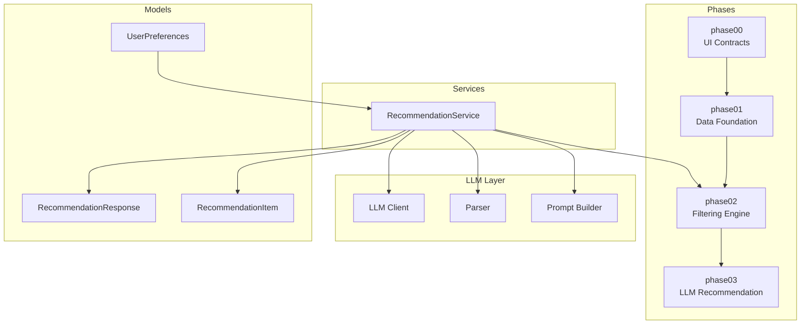
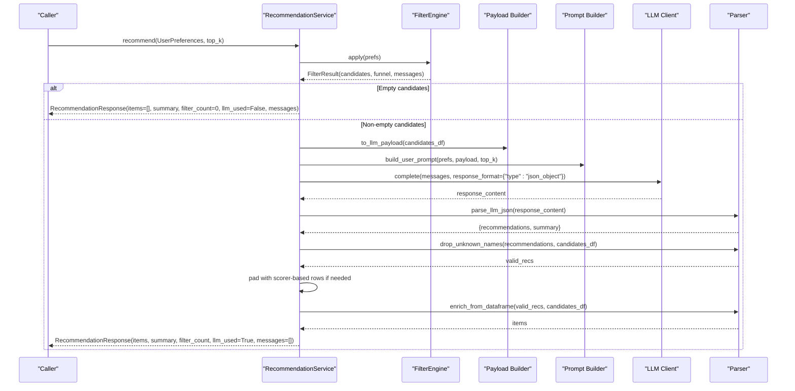
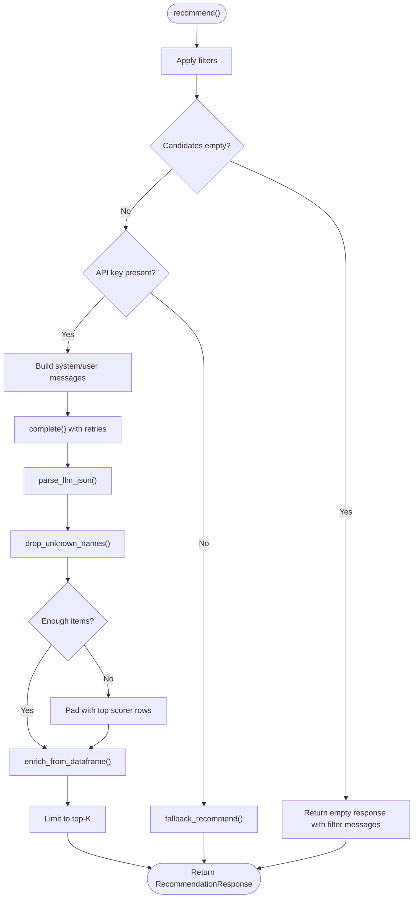
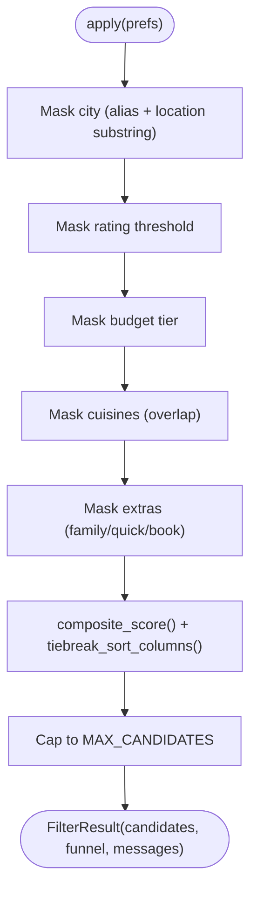
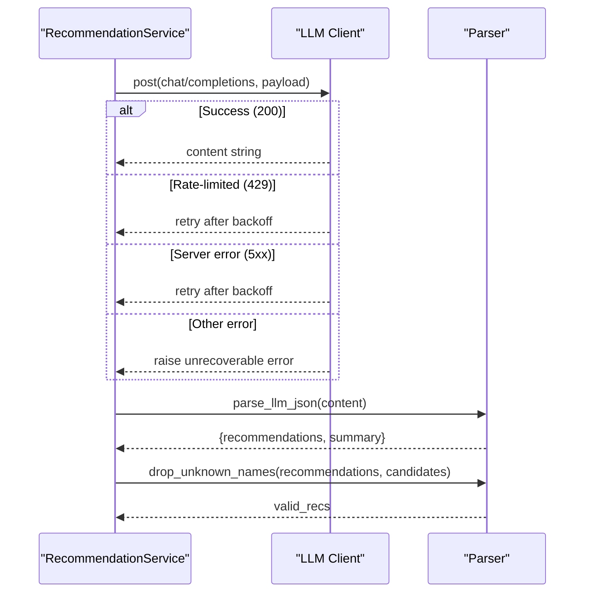
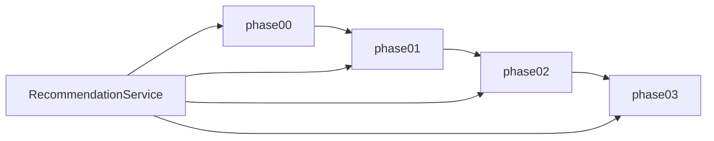

# Service Orchestration

<cite>
**Referenced Files in This Document**
- [README.md](file://README.md)
- [recommendation_service.py](file://src/services/recommendation_service.py)
- [registry.py](file://src/phases/registry.py)
- [config.py](file://src/config.py)
- [engine.py](file://src/phases/phase02/engine.py)
- [payloads.py](file://src/phases/phase02/payloads.py)
- [scorer.py](file://src/phases/phase02/scorer.py)
- [client.py](file://src/llm/client.py)
- [parser.py](file://src/llm/parser.py)
- [prompt_builder.py](file://src/llm/prompt_builder.py)
- [preferences.py](file://src/phases/phase00/preferences.py)
- [output_contract.py](file://src/phases/phase00/output_contract.py)
- [recommendation.py](file://src/models/recommendation.py)
- [restaurant.py](file://src/models/restaurant.py)
- [try_recommend.py](file://scripts/try_recommend.py)
</cite>

## Table of Contents
1. [Introduction](#introduction)
2. [Project Structure](#project-structure)
3. [Core Components](#core-components)
4. [Architecture Overview](#architecture-overview)
5. [Detailed Component Analysis](#detailed-component-analysis)
6. [Dependency Analysis](#dependency-analysis)
7. [Performance Considerations](#performance-considerations)
8. [Troubleshooting Guide](#troubleshooting-guide)
9. [Conclusion](#conclusion)
10. [Appendices](#appendices)

## Introduction
This document explains the service orchestration of the Zomato AI Recommendation System with a focus on how filtering and LLM processing coordinate, how user preferences are validated and normalized, and how fallback mechanisms ensure system reliability. It documents the recommendation service API, response formatting, error handling strategies, integration with phase components, graceful degradation patterns, and performance optimization techniques. Practical usage examples, configuration options, and troubleshooting approaches are included for common orchestration issues.

## Project Structure
The recommendation system is organized into development phases that define clear boundaries and dependencies. The service orchestrator coordinates filtering and LLM recommendation while maintaining backward compatibility via a robust fallback path.

**Diagram sources**
- [registry.py:28-68](file://src/phases/registry.py#L28-L68)
- [recommendation_service.py:30-131](file://src/services/recommendation_service.py#L30-L131)
- [client.py:14-94](file://src/llm/client.py#L14-L94)
- [parser.py:24-141](file://src/llm/parser.py#L24-L141)
- [prompt_builder.py:30-69](file://src/llm/prompt_builder.py#L30-L69)
- [preferences.py:20-71](file://src/phases/phase00/preferences.py#L20-L71)
- [output_contract.py:8-52](file://src/phases/phase00/output_contract.py#L8-L52)

**Section sources**
- [README.md:14-39](file://README.md#L14-L39)
- [registry.py:27-84](file://src/phases/registry.py#L27-L84)

## Core Components
- RecommendationService: Central orchestrator that applies filters, prepares LLM prompts, invokes the LLM, parses and validates outputs, and falls back to structured ranking when needed.
- FilterEngine: Applies vectorized filters and pre-ranks candidates to a shortlist.
- LLM Client: HTTP client with exponential backoff and retry logic for Groq/OpenAI-compatible APIs.
- Parser: Parses and validates LLM JSON responses, normalizes hallucinated names, and enriches fields from the candidate DataFrame.
- Prompt Builder: Constructs a system and user prompt with grounded schema and constraints.
- UserPreferences and Output Contracts: Strongly typed input and output contracts shared across phases and the service.

Key orchestration responsibilities:
- Validation and normalization of user preferences.
- Candidate shortlisting and pre-ranking.
- LLM invocation with structured JSON schema and grounding instructions.
- Name validation and padding to meet requested top-K.
- Graceful degradation to structured ranking when API keys are missing or LLM calls fail.

**Section sources**
- [recommendation_service.py:30-131](file://src/services/recommendation_service.py#L30-L131)
- [engine.py:140-196](file://src/phases/phase02/engine.py#L140-L196)
- [client.py:14-94](file://src/llm/client.py#L14-L94)
- [parser.py:24-141](file://src/llm/parser.py#L24-L141)
- [prompt_builder.py:9-69](file://src/llm/prompt_builder.py#L9-L69)
- [preferences.py:20-71](file://src/phases/phase00/preferences.py#L20-L71)
- [output_contract.py:8-52](file://src/phases/phase00/output_contract.py#L8-L52)

## Architecture Overview
The recommendation workflow is a pipeline that:
1. Loads processed restaurant data.
2. Validates and normalizes user preferences.
3. Filters candidates and pre-ranks them.
4. Builds a compact payload for the LLM.
5. Calls the LLM with a grounded prompt and JSON schema.
6. Parses and validates the response, drops hallucinations, and enriches fields.
7. Pads results to meet top-K when necessary.
8. Returns a unified response with a summary and items.

**Diagram sources**
- [recommendation_service.py:37-131](file://src/services/recommendation_service.py#L37-L131)
- [engine.py:146-189](file://src/phases/phase02/engine.py#L146-L189)
- [payloads.py:27-44](file://src/phases/phase02/payloads.py#L27-L44)
- [prompt_builder.py:30-69](file://src/llm/prompt_builder.py#L30-L69)
- [client.py:14-94](file://src/llm/client.py#L14-L94)
- [parser.py:24-141](file://src/llm/parser.py#L24-L141)

## Detailed Component Analysis

### RecommendationService
Responsibilities:
- Validate and normalize preferences.
- Apply filters and handle empty-candidate scenarios.
- Check for API key presence and fall back to structured ranking if absent.
- Build LLM messages and invoke completion with retries.
- Parse and validate JSON, drop hallucinated names, and enrich items.
- Pad recommendations to meet top-K and enforce output limits.
- Return a unified response with summary, counts, and messages.

Graceful degradation:
- If API key is missing, returns a structured ranking with explanatory messages.
- If LLM call fails, logs the error and falls back to structured ranking.

**Diagram sources**
- [recommendation_service.py:37-131](file://src/services/recommendation_service.py#L37-L131)
- [parser.py:24-141](file://src/llm/parser.py#L24-L141)

**Section sources**
- [recommendation_service.py:30-131](file://src/services/recommendation_service.py#L30-L131)

### FilterEngine
Responsibilities:
- Apply city/cuisine/rating/budget/extras filters in sequence.
- Track funnel sizes for diagnostics.
- Pre-rank candidates using a composite score and deterministic tiebreakers.
- Return a shortlist capped by MAX_CANDIDATES.

Validation and normalization:
- City aliasing and broad location substring matching.
- Budget tier normalization.
- Cuisine overlap detection with flexible token matching.
- Extras toggles mapped to restaurant attributes.

**Diagram sources**
- [engine.py:146-189](file://src/phases/phase02/engine.py#L146-L189)
- [scorer.py:29-70](file://src/phases/phase02/scorer.py#L29-L70)

**Section sources**
- [engine.py:140-196](file://src/phases/phase02/engine.py#L140-L196)
- [scorer.py:29-70](file://src/phases/phase02/scorer.py#L29-L70)

### LLM Client and Parser
LLM Client:
- Exponential backoff retries for 429/5xx and timeouts.
- Rejects unrecoverable client errors (e.g., 400-range except 429).
- Enforces model and base URL configuration.

Parser:
- Extracts JSON from free-form LLM output (handles markdown wrappers).
- Validates JSON structure and raises descriptive errors.
- Drops hallucinated restaurant names not present in candidates.
- Enriches recommendation items with ground-truth fields from the DataFrame.

**Diagram sources**
- [client.py:14-94](file://src/llm/client.py#L14-L94)
- [parser.py:24-141](file://src/llm/parser.py#L24-L141)

**Section sources**
- [client.py:14-94](file://src/llm/client.py#L14-L94)
- [parser.py:24-141](file://src/llm/parser.py#L24-L141)

### Prompt Builder
- System prompt enforces grounding, JSON-only output, and schema compliance.
- User prompt injects user preferences and a compact candidate list.
- Ensures the LLM returns only restaurants present in the candidate list.

**Section sources**
- [prompt_builder.py:9-69](file://src/llm/prompt_builder.py#L9-L69)

### User Preferences and Output Contracts
- UserPreferences: Strongly typed input with validators for city, cuisines, and extras toggles.
- Output contracts: Stable response shapes for UI rendering and messages.

**Section sources**
- [preferences.py:20-71](file://src/phases/phase00/preferences.py#L20-L71)
- [output_contract.py:8-52](file://src/phases/phase00/output_contract.py#L8-L52)
- [recommendation.py:9-24](file://src/models/recommendation.py#L9-L24)
- [restaurant.py:3-6](file://src/models/restaurant.py#L3-L6)

## Dependency Analysis
The phased architecture defines explicit dependency order and rollback hints. The service depends on phase00 contracts, phase01 data, phase02 filtering, and phase03 LLM components.

**Diagram sources**
- [registry.py:28-68](file://src/phases/registry.py#L28-L68)
- [recommendation_service.py:10-16](file://src/services/recommendation_service.py#L10-L16)

**Section sources**
- [registry.py:27-84](file://src/phases/registry.py#L27-L84)

## Performance Considerations
- Shortlist size: MAX_CANDIDATES controls the number of candidates passed to the LLM, reducing token costs and latency.
- Payload shaping: to_llm_payload reduces column count and nulls to None for JSON safety.
- Pre-ranking: Composite score and tiebreakers minimize LLM workload and improve relevance.
- Retry strategy: Exponential backoff reduces thundering herds and improves resilience under rate limits.
- Structured fallback: Avoids expensive LLM calls when API keys are missing or during outages.

[No sources needed since this section provides general guidance]

## Troubleshooting Guide
Common orchestration issues and resolutions:
- API key missing:
  - Symptom: Fallback response with a message indicating the AI engine is offline.
  - Resolution: Set the appropriate provider key in .env and ensure LLM_PROVIDER is configured.
  - Reference: [recommendation_service.py:60-66](file://src/services/recommendation_service.py#L60-L66), [config.py:26-34](file://src/config.py#L26-L34)

- LLM call failures:
  - Symptom: Error logged and fallback invoked.
  - Resolution: Check network connectivity, provider quotas, and retry limits.
  - Reference: [recommendation_service.py:124-130](file://src/services/recommendation_service.py#L124-L130), [client.py:55-94](file://src/llm/client.py#L55-L94)

- Empty candidates:
  - Symptom: Empty results with diagnostic messages explaining filter funnel stages.
  - Resolution: Relax constraints (city, rating, budget, cuisines, extras).
  - Reference: [engine.py:104-137](file://src/phases/phase02/engine.py#L104-L137), [recommendation_service.py:47-54](file://src/services/recommendation_service.py#L47-L54)

- Hallucinated names:
  - Symptom: Names dropped from recommendations; warning logged.
  - Resolution: Ensure candidate list covers all recommended names.
  - Reference: [parser.py:45-66](file://src/llm/parser.py#L45-L66)

- JSON parsing errors:
  - Symptom: Descriptive error raised for invalid JSON.
  - Resolution: Verify system prompt enforces JSON-only output and schema compliance.
  - Reference: [parser.py:24-44](file://src/llm/parser.py#L24-L44), [prompt_builder.py:9-28](file://src/llm/prompt_builder.py#L9-L28)

**Section sources**
- [recommendation_service.py:47-54](file://src/services/recommendation_service.py#L47-L54)
- [engine.py:104-137](file://src/phases/phase02/engine.py#L104-L137)
- [parser.py:24-44](file://src/llm/parser.py#L24-L44)
- [prompt_builder.py:9-28](file://src/llm/prompt_builder.py#L9-L28)
- [client.py:55-94](file://src/llm/client.py#L55-L94)

## Conclusion
The RecommendationService orchestrates a reliable, grounded recommendation pipeline that prioritizes correctness and resilience. By validating and normalizing user preferences, efficiently filtering and pre-ranking candidates, and enforcing strict LLM grounding, the system delivers explainable results. Robust fallbacks ensure continuity when LLM services are unavailable, and careful configuration supports performance and reliability.

[No sources needed since this section summarizes without analyzing specific files]

## Appendices

### Service API Definition
- Method: recommend(prefs: UserPreferences, top_k: int | None = None) -> RecommendationResponse
- Inputs:
  - UserPreferences: city, budget, cuisines, min_rating, extras, additional_notes
  - top_k: optional override for TOP_K_RECOMMENDATIONS
- Outputs:
  - RecommendationResponse: items, summary, filter_count, llm_used, messages
- Behavior:
  - Applies filters and pre-ranking.
  - Invokes LLM with grounded prompt and JSON schema.
  - Parses, validates, and enriches results.
  - Falls back to structured ranking when API key is missing or LLM fails.

**Section sources**
- [recommendation_service.py:37-131](file://src/services/recommendation_service.py#L37-L131)
- [preferences.py:20-71](file://src/phases/phase00/preferences.py#L20-L71)
- [output_contract.py:24-52](file://src/phases/phase00/output_contract.py#L24-L52)

### Configuration Options
- LLM_PROVIDER: groq (default) or openai-compatible
- GROQ_API_KEY / OPENAI_API_KEY: provider credentials
- LLM_MODEL: model identifier (default provided)
- LLM_BASE_URL: provider base URL (default provided)
- MAX_CANDIDATES: maximum candidates passed to LLM
- TOP_K_RECOMMENDATIONS: default number of recommendations
- DATA_CACHE_PATH: path to processed parquet cache

**Section sources**
- [config.py:26-47](file://src/config.py#L26-L47)

### Practical Usage Examples
- CLI smoke test:
  - Load cache, construct UserPreferences, initialize RecommendationService, call recommend, and print results.
  - Reference: [try_recommend.py:21-95](file://scripts/try_recommend.py#L21-L95)

**Section sources**
- [try_recommend.py:21-95](file://scripts/try_recommend.py#L21-L95)