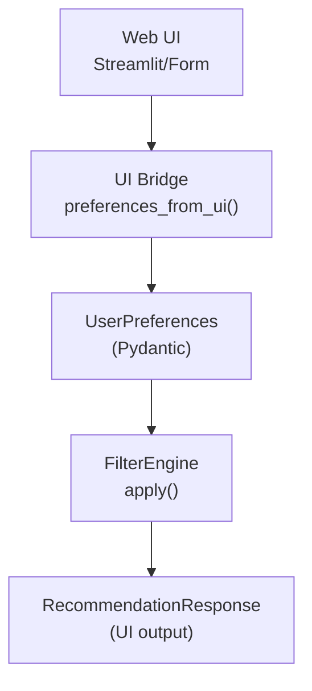
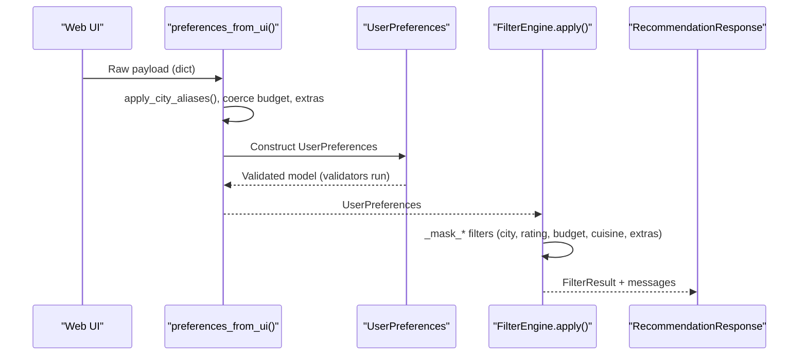
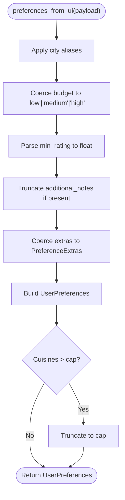
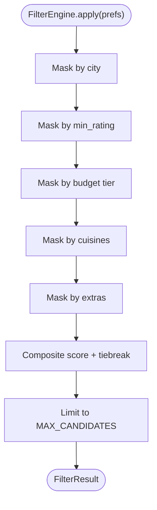
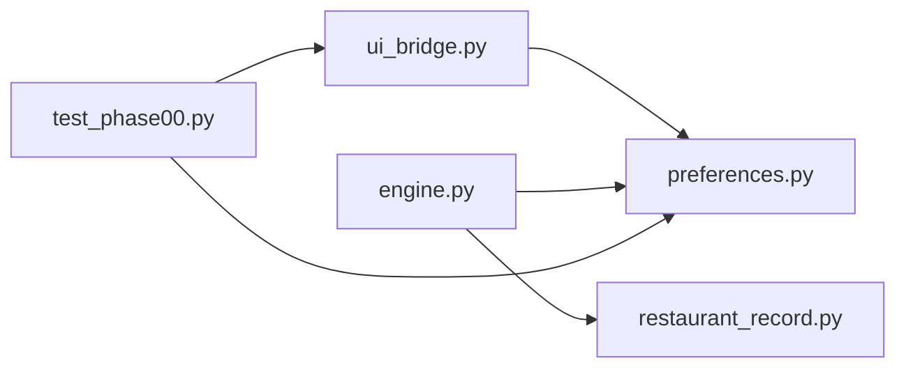

# User Preferences Validation

<cite>
**Referenced Files in This Document**
- [preferences.py](file://zomato-ai-recommendation/src/phases/phase00/preferences.py)
- [ui_bridge.py](file://zomato-ai-recommendation/src/phases/phase00/ui_bridge.py)
- [engine.py](file://zomato-ai-recommendation/src/phases/phase02/engine.py)
- [restaurant_record.py](file://zomato-ai-recommendation/src/phases/phase01/restaurant_record.py)
- [output_contract.py](file://zomato-ai-recommendation/src/phases/phase00/output_contract.py)
- [test_phase00.py](file://zomato-ai-recommendation/tests/phases/test_phase00.py)
- [EDGE_CASES.md](file://zomato-ai-recommendation/docs/EDGE_CASES.md)
</cite>

## Table of Contents
1. [Introduction](#introduction)
2. [Project Structure](#project-structure)
3. [Core Components](#core-components)
4. [Architecture Overview](#architecture-overview)
5. [Detailed Component Analysis](#detailed-component-analysis)
6. [Dependency Analysis](#dependency-analysis)
7. [Performance Considerations](#performance-considerations)
8. [Troubleshooting Guide](#troubleshooting-guide)
9. [Conclusion](#conclusion)

## Introduction
This document explains the user preference validation and normalization system used by the recommendation pipeline. It covers the UserPreferences data model, input validation rules, preference normalization processes, supported preference types, and error handling. The goal is to help developers and testers understand how raw UI inputs are transformed into a canonical, validated form consumed by downstream filtering and recommendation stages.

## Project Structure
The preference validation system spans several modules:
- Phase 00 defines the canonical input model and normalization helpers
- Phase 02 consumes validated preferences to filter candidate restaurants
- Tests validate behavior and edge cases
- Documentation describes edge cases and failure handling



**Diagram sources**
- [ui_bridge.py:59-98](file://zomato-ai-recommendation/src/phases/phase00/ui_bridge.py#L59-L98)
- [preferences.py:20-71](file://zomato-ai-recommendation/src/phases/phase00/preferences.py#L20-L71)
- [engine.py:140-197](file://zomato-ai-recommendation/src/phases/phase02/engine.py#L140-L197)
- [output_contract.py:24-52](file://zomato-ai-recommendation/src/phases/phase00/output_contract.py#L24-L52)

**Section sources**
- [preferences.py:1-71](file://zomato-ai-recommendation/src/phases/phase00/preferences.py#L1-L71)
- [ui_bridge.py:1-112](file://zomato-ai-recommendation/src/phases/phase00/ui_bridge.py#L1-L112)
- [engine.py:1-197](file://zomato-ai-recommendation/src/phases/phase02/engine.py#L1-L197)
- [output_contract.py:1-52](file://zomato-ai-recommendation/src/phases/phase00/output_contract.py#L1-L52)

## Core Components
- UserPreferences: Canonical input model with validation and normalization rules
- PreferenceExtras: Optional toggles for service features
- UI Bridge: Converts raw UI payloads into validated UserPreferences
- FilterEngine: Applies preferences to candidate restaurants

Key capabilities:
- City normalization via alias mapping
- Budget validation against a controlled vocabulary
- Cuisines normalization, deduplication, and length limits
- Rating bounds enforcement
- Extras coercion and defaults
- Additional notes truncation
- Safe conversion with error collection

**Section sources**
- [preferences.py:20-71](file://zomato-ai-recommendation/src/phases/phase00/preferences.py#L20-L71)
- [ui_bridge.py:59-112](file://zomato-ai-recommendation/src/phases/phase00/ui_bridge.py#L59-L112)
- [engine.py:140-197](file://zomato-ai-recommendation/src/phases/phase02/engine.py#L140-L197)

## Architecture Overview
The validation pipeline transforms raw UI inputs into a canonical form and applies them to filter candidates.



**Diagram sources**
- [ui_bridge.py:59-98](file://zomato-ai-recommendation/src/phases/phase00/ui_bridge.py#L59-L98)
- [preferences.py:20-71](file://zomato-ai-recommendation/src/phases/phase00/preferences.py#L20-L71)
- [engine.py:140-197](file://zomato-ai-recommendation/src/phases/phase02/engine.py#L140-L197)
- [output_contract.py:24-52](file://zomato-ai-recommendation/src/phases/phase00/output_contract.py#L24-L52)

## Detailed Component Analysis

### UserPreferences Data Model
UserPreferences is the canonical input contract for the recommendation pipeline. It enforces:
- city: non-empty string with whitespace stripped
- budget: controlled vocabulary (low, medium, high)
- cuisines: list of strings with deduplication and order preservation
- min_rating: float in [0.0, 5.0]
- extras: PreferenceExtras with defaults
- additional_notes: optional string with length cap

Validation and normalization:
- City validator strips and rejects blank inputs
- Cuisines validator coerces None, string, list/tuple to normalized list
- Cuisines validator deduplicates case-insensitively while preserving insertion order
- Min rating validator enforces bounds
- Extras defaults to False for all toggles
- Additional notes are truncated to a fixed length

```mermaid
classDiagram
class UserPreferences {
+string city
+BudgetTier budget
+string[] cuisines
+float min_rating
+PreferenceExtras extras
+string|None additional_notes
+has_cuisine_filter() bool
}
class PreferenceExtras {
+bool family_friendly
+bool quick_service
+bool book_table
}
class BudgetTier {
<<literal>>
"low"
"medium"
"high"
}
UserPreferences --> PreferenceExtras : "has"
UserPreferences --> BudgetTier : "uses"
```

**Diagram sources**
- [preferences.py:20-71](file://zomato-ai-recommendation/src/phases/phase00/preferences.py#L20-L71)

**Section sources**
- [preferences.py:20-71](file://zomato-ai-recommendation/src/phases/phase00/preferences.py#L20-L71)

### UI Bridge: Normalization and Coercion
The UI bridge converts raw UI payloads into validated UserPreferences:
- City alias normalization using a predefined map
- Budget coercion validates required presence and controlled vocabulary
- Extras coercion accepts dict or existing PreferenceExtras, normalizing booleans
- Cuisines coercion supports None, string, list/tuple; trims and deduplicates
- Additional notes are stripped and truncated to a fixed length
- Cuisines list is truncated to a UI cap
- Safe conversion returns errors as strings for UI display



**Diagram sources**
- [ui_bridge.py:59-98](file://zomato-ai-recommendation/src/phases/phase00/ui_bridge.py#L59-L98)

**Section sources**
- [ui_bridge.py:59-112](file://zomato-ai-recommendation/src/phases/phase00/ui_bridge.py#L59-L112)

### FilterEngine: Applying Preferences
The FilterEngine applies validated preferences to candidate restaurants:
- City filter: canonical city plus location substring match
- Rating filter: excludes None ratings when threshold > 0
- Budget filter: matches budget tier or includes unknown-cost rows
- Cuisine filter: OR over normalized cuisines; supports substring/token overlap
- Extras filter: family-friendly, quick service, book table toggles



**Diagram sources**
- [engine.py:140-197](file://zomato-ai-recommendation/src/phases/phase02/engine.py#L140-L197)

**Section sources**
- [engine.py:41-102](file://zomato-ai-recommendation/src/phases/phase02/engine.py#L41-L102)

### Supported Preference Types and Normalization
- City: normalized via alias map; case-insensitive canonicalization
- Budget: controlled vocabulary enforced; case-insensitive
- Cuisines: list with deduplication (case-insensitive), order preserved, capped at UI limit
- Rating threshold: numeric with bounds enforcement
- Extras: toggles mapped to boolean; defaults False
- Additional notes: truncated to a fixed character limit

**Section sources**
- [ui_bridge.py:15-27](file://zomato-ai-recommendation/src/phases/phase00/ui_bridge.py#L15-L27)
- [preferences.py:27-32](file://zomato-ai-recommendation/src/phases/phase00/preferences.py#L27-L32)
- [engine.py:82-101](file://zomato-ai-recommendation/src/phases/phase02/engine.py#L82-L101)

### Validation Error Handling and Defaults
- Validation errors: raised as ValueError or Pydantic ValidationError
- Safe conversion: preferences_from_ui_safe returns (UserPreferences or None, list[str] errors)
- Defaults: extras toggles default False; min_rating default 0.0; additional_notes default None
- Cuisines default empty list; None coerced to empty list

**Section sources**
- [ui_bridge.py:101-112](file://zomato-ai-recommendation/src/phases/phase00/ui_bridge.py#L101-L112)
- [preferences.py:15-32](file://zomato-ai-recommendation/src/phases/phase00/preferences.py#L15-L32)
- [test_phase00.py:79-85](file://zomato-ai-recommendation/tests/phases/test_phase00.py#L79-L85)

### Preference Transformation Logic
- City alias normalization: "bengaluru" → "Bangalore", "gurugram" → "Gurgaon", etc.
- Budget coercion: "LOW" → "low", "Medium" → "medium", etc.; raises on invalid values
- Extras coercion: dict keys mapped to booleans; missing keys default False
- Cuisines normalization: split by comma for string; strip and deduplicate; cap at 10
- Additional notes truncation: enforced to 2000 characters

**Section sources**
- [ui_bridge.py:20-27](file://zomato-ai-recommendation/src/phases/phase00/ui_bridge.py#L20-L27)
- [ui_bridge.py:36-56](file://zomato-ai-recommendation/src/phases/phase00/ui_bridge.py#L36-L56)
- [ui_bridge.py:80-84](file://zomato-ai-recommendation/src/phases/phase00/ui_bridge.py#L80-L84)
- [preferences.py:44-67](file://zomato-ai-recommendation/src/phases/phase00/preferences.py#L44-L67)

### Examples of Valid and Invalid Inputs
- Valid examples:
  - City alias normalization: "Bengaluru" becomes "Bangalore"
  - Cuisines string split: "Chinese, Thai, " becomes ["Chinese", "Thai"]
  - Cuisines deduplication: ["Chinese", "chinese"] becomes ["Chinese"]
  - Budget coercion: "LOW" accepted as "low"
  - Additional notes truncation: 5000 chars reduced to 2000
- Invalid examples:
  - Empty city: raises validation error
  - Invalid budget: "luxury" raises ValueError
  - Out-of-range rating: 5.5 raises Pydantic error
  - Extras type error: non-dict/non-PreferenceExtras raises TypeError

**Section sources**
- [test_phase00.py:15-22](file://zomato-ai-recommendation/tests/phases/test_phase00.py#L15-L22)
- [test_phase00.py:25-46](file://zomato-ai-recommendation/tests/phases/test_phase00.py#L25-L46)
- [test_phase00.py:49-69](file://zomato-ai-recommendation/tests/phases/test_phase00.py#L49-L69)
- [test_phase00.py:72-76](file://zomato-ai-recommendation/tests/phases/test_phase00.py#L72-L76)
- [test_phase00.py:91-93](file://zomato-ai-recommendation/tests/phases/test_phase00.py#L91-L93)

## Dependency Analysis
- UI Bridge depends on UserPreferences and PreferenceExtras
- FilterEngine depends on UserPreferences and applies it to RestaurantRecord fields
- Tests depend on UI Bridge and UserPreferences to validate behavior



**Diagram sources**
- [ui_bridge.py:13](file://zomato-ai-recommendation/src/phases/phase00/ui_bridge.py#L13)
- [preferences.py:20](file://zomato-ai-recommendation/src/phases/phase00/preferences.py#L20)
- [engine.py:15](file://zomato-ai-recommendation/src/phases/phase02/engine.py#L15)
- [restaurant_record.py:8](file://zomato-ai-recommendation/src/phases/phase01/restaurant_record.py#L8)
- [test_phase00.py:6](file://zomato-ai-recommendation/tests/phases/test_phase00.py#L6)

**Section sources**
- [ui_bridge.py:13](file://zomato-ai-recommendation/src/phases/phase00/ui_bridge.py#L13)
- [engine.py:15](file://zomato-ai-recommendation/src/phases/phase02/engine.py#L15)
- [test_phase00.py:6](file://zomato-ai-recommendation/tests/phases/test_phase00.py#L6)

## Performance Considerations
- Cuisines cap reduces downstream matching complexity
- String normalization (strip, casefold) enables efficient comparisons
- Vectorized filtering in FilterEngine minimizes Python loops
- Early truncation of additional_notes avoids heavy LLM payloads

## Troubleshooting Guide
Common issues and resolutions:
- City normalization: Ensure city spelling aligns with alias map; otherwise use canonical form
- Budget validation: Use only "low", "medium", or "high"
- Cuisines overflow: Limit selections to 10 or fewer
- Rating bounds: Keep min_rating between 0.0 and 5.0
- Extras coercion: Provide dict with boolean values or existing PreferenceExtras
- Safe conversion: Use preferences_from_ui_safe to collect user-facing error messages

**Section sources**
- [ui_bridge.py:15-17](file://zomato-ai-recommendation/src/phases/phase00/ui_bridge.py#L15-L17)
- [ui_bridge.py:36-56](file://zomato-ai-recommendation/src/phases/phase00/ui_bridge.py#L36-L56)
- [test_phase00.py:79-85](file://zomato-ai-recommendation/tests/phases/test_phase00.py#L79-L85)

## Conclusion
The user preference validation system ensures robust, consistent inputs for the recommendation pipeline. It normalizes diverse UI inputs, enforces strict validation rules, and provides safe fallbacks. Together with the FilterEngine, it produces reliable candidate shortlists and user-facing messages when no results remain.