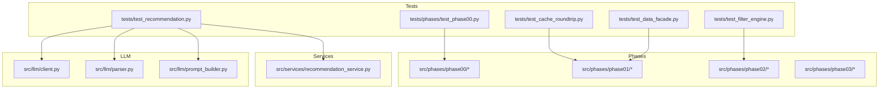
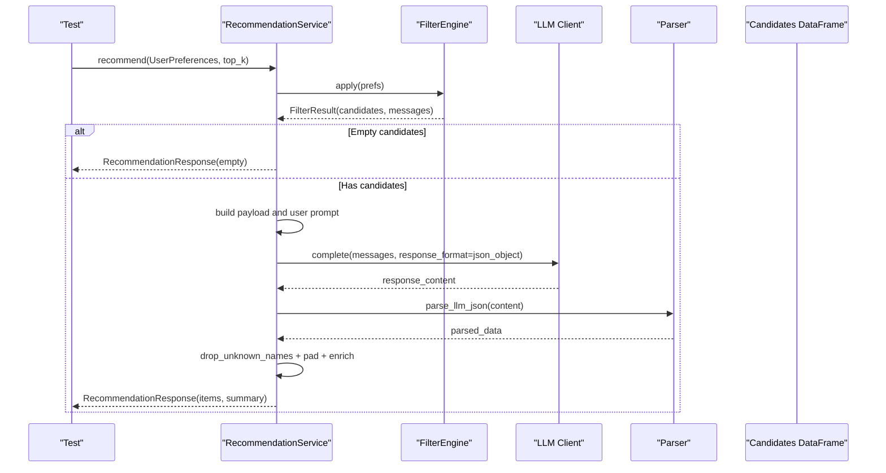
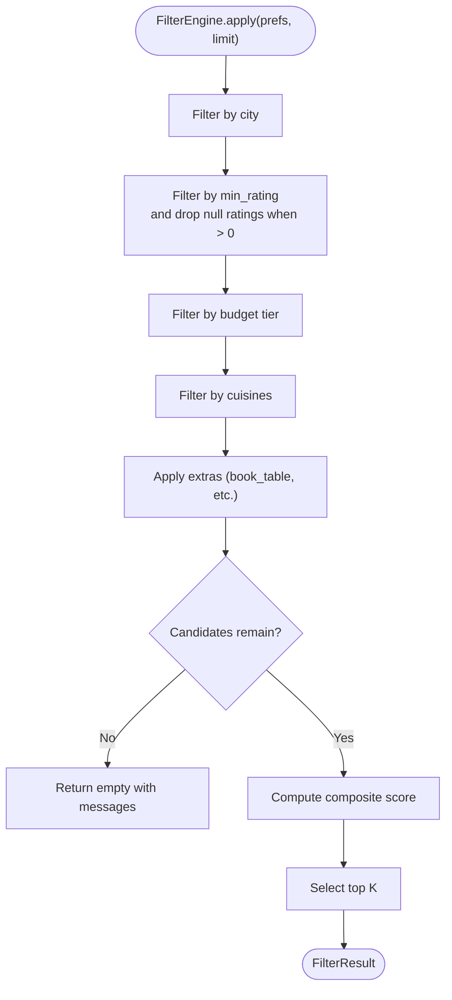
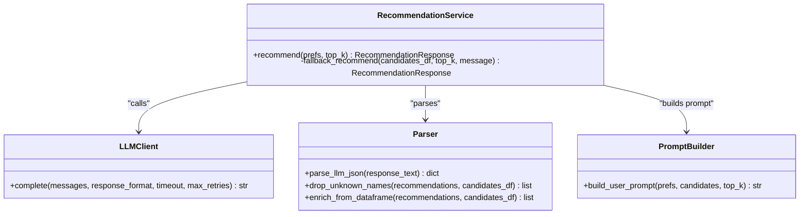
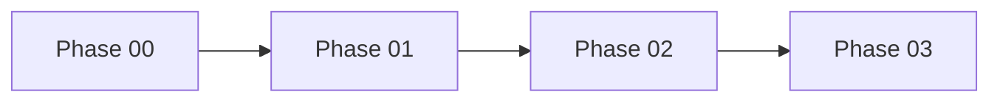

# Testing Strategy

<cite>
**Referenced Files in This Document**
- [README.md](file://zomato-ai-recommendation/README.md)
- [pyproject.toml](file://zomato-ai-recommendation/pyproject.toml)
- [src/config.py](file://zomato-ai-recommendation/src/config.py)
- [src/phases/registry.py](file://zomato-ai-recommendation/src/phases/registry.py)
- [src/services/recommendation_service.py](file://zomato-ai-recommendation/src/services/recommendation_service.py)
- [src/llm/client.py](file://zomato-ai-recommendation/src/llm/client.py)
- [src/llm/parser.py](file://zomato-ai-recommendation/src/llm/parser.py)
- [src/llm/prompt_builder.py](file://zomato-ai-recommendation/src/llm/prompt_builder.py)
- [tests/test_recommendation.py](file://zomato-ai-recommendation/tests/test_recommendation.py)
- [tests/test_filter_engine.py](file://zomato-ai-recommendation/tests/test_filter_engine.py)
- [tests/test_cache_roundtrip.py](file://zomato-ai-recommendation/tests/test_cache_roundtrip.py)
- [tests/test_data_facade.py](file://zomato-ai-recommendation/tests/test_data_facade.py)
- [tests/phases/test_phase00.py](file://zomato-ai-recommendation/tests/phases/test_phase00.py)
</cite>

## Table of Contents
1. [Introduction](#introduction)
2. [Project Structure](#project-structure)
3. [Core Components](#core-components)
4. [Architecture Overview](#architecture-overview)
5. [Detailed Component Analysis](#detailed-component-analysis)
6. [Dependency Analysis](#dependency-analysis)
7. [Performance Considerations](#performance-considerations)
8. [Troubleshooting Guide](#troubleshooting-guide)
9. [Conclusion](#conclusion)
10. [Appendices](#appendices)

## Introduction
This document defines a comprehensive testing strategy for the Zomato AI Recommendation System. It covers unit testing approaches for individual components, integration testing patterns for phase coordination, and mock strategies for external LLM services. It also documents the test suite organization, test data management, edge case handling, guidelines for writing effective tests, continuous integration practices, debugging test failures, performance testing considerations, regression testing strategies, and quality assurance processes.

## Project Structure
The repository follows a phased architecture with explicit boundaries between UI contracts, data ingestion/cache, filtering engine, and LLM recommendation. The test suite mirrors this structure and validates both isolated units and integrated flows.

**Diagram sources**
- [tests/phases/test_phase00.py:1-100](file://zomato-ai-recommendation/tests/phases/test_phase00.py#L1-L100)
- [tests/test_filter_engine.py:1-185](file://zomato-ai-recommendation/tests/test_filter_engine.py#L1-L185)
- [tests/test_recommendation.py:1-280](file://zomato-ai-recommendation/tests/test_recommendation.py#L1-L280)
- [tests/test_cache_roundtrip.py:1-39](file://zomato-ai-recommendation/tests/test_cache_roundtrip.py#L1-L39)
- [tests/test_data_facade.py:1-11](file://zomato-ai-recommendation/tests/test_data_facade.py#L1-L11)
- [src/phases/registry.py:1-84](file://zomato-ai-recommendation/src/phases/registry.py#L1-L84)
- [src/services/recommendation_service.py:1-200](file://zomato-ai-recommendation/src/services/recommendation_service.py#L1-L200)
- [src/llm/client.py:1-94](file://zomato-ai-recommendation/src/llm/client.py#L1-L94)
- [src/llm/parser.py:1-141](file://zomato-ai-recommendation/src/llm/parser.py#L1-L141)
- [src/llm/prompt_builder.py:1-69](file://zomato-ai-recommendation/src/llm/prompt_builder.py#L1-L69)

**Section sources**
- [README.md:14-39](file://zomato-ai-recommendation/README.md#L14-L39)
- [pyproject.toml:8-11](file://zomato-ai-recommendation/pyproject.toml#L8-L11)

## Core Components
- Phase 00: UI contracts and preferences parsing/validation.
- Phase 01: Data cache loading/saving and facade compatibility.
- Phase 02: Filter engine and scoring pipeline.
- Phase 03: LLM recommendation orchestration, prompt building, client, and response parsing.
- RecommendationService: End-to-end coordinator that integrates filtering and LLM ranking with fallback logic.

Key testing responsibilities:
- Unit tests validate parsers, prompt builder, client retry logic, and service orchestration.
- Integration tests validate cross-phase flows (preferences → filtering → LLM → enrichment).
- Mock strategies isolate external LLM dependencies during local development and CI.

**Section sources**
- [src/phases/registry.py:27-84](file://zomato-ai-recommendation/src/phases/registry.py#L27-L84)
- [src/services/recommendation_service.py:30-200](file://zomato-ai-recommendation/src/services/recommendation_service.py#L30-L200)
- [src/llm/client.py:14-94](file://zomato-ai-recommendation/src/llm/client.py#L14-L94)
- [src/llm/parser.py:24-141](file://zomato-ai-recommendation/src/llm/parser.py#L24-L141)
- [src/llm/prompt_builder.py:30-69](file://zomato-ai-recommendation/src/llm/prompt_builder.py#L30-L69)

## Architecture Overview
The recommendation pipeline is orchestrated by RecommendationService. It applies filters, builds prompts, queries the LLM client with retry logic, parses and validates results, enriches with ground-truth data, and falls back to a structured ranking when necessary.

**Diagram sources**
- [src/services/recommendation_service.py:37-131](file://zomato-ai-recommendation/src/services/recommendation_service.py#L37-L131)
- [src/llm/client.py:14-94](file://zomato-ai-recommendation/src/llm/client.py#L14-L94)
- [src/llm/parser.py:24-141](file://zomato-ai-recommendation/src/llm/parser.py#L24-L141)

## Detailed Component Analysis

### Phase 00: UI Contracts and Preferences
- Tests validate normalization/casing, alias resolution, truncation limits, and safe parsing with error reporting.
- Edge cases include empty cities, invalid budgets, and excessively long notes.

Guidelines:
- Prefer parametric tests for multiple cuisines and truncation scenarios.
- Validate Pydantic constraints and error propagation.

**Section sources**
- [tests/phases/test_phase00.py:15-100](file://zomato-ai-recommendation/tests/phases/test_phase00.py#L15-L100)

### Phase 01: Data Cache Roundtrip and Facade
- Tests validate save/load roundtrip, column preservation, metadata presence, and facade delegation to canonical Phase 01.

Guidelines:
- Use temporary filesystem paths for deterministic cache IO tests.
- Ensure cache version and metadata integrity.

**Section sources**
- [tests/test_cache_roundtrip.py:12-39](file://zomato-ai-recommendation/tests/test_cache_roundtrip.py#L12-L39)
- [tests/test_data_facade.py:8-11](file://zomato-ai-recommendation/tests/test_data_facade.py#L8-L11)

### Phase 02: Filter Engine
- Tests validate filtering by city/cuisine/budget, null-rating handling, extras constraints, and empty-state messaging.
- Includes performance test on bulk synthetic data to ensure sub-200 ms latency for typical workloads.

Guidelines:
- Add negative-control tests for “hallucinated” or out-of-domain preferences.
- Include stress tests with larger candidate sets to detect regressions.

**Diagram sources**
- [tests/test_filter_engine.py:85-185](file://zomato-ai-recommendation/tests/test_filter_engine.py#L85-L185)

**Section sources**
- [tests/test_filter_engine.py:85-185](file://zomato-ai-recommendation/tests/test_filter_engine.py#L85-L185)

### Phase 03: LLM Recommendation Pipeline
- Prompt builder tests ensure inclusion of preferences and candidate fields.
- Parser tests validate JSON extraction from plain JSON and markdown-wrapped responses, and error handling for invalid JSON.
- Client tests validate retry behavior on 429 and propagate unrecoverable errors.
- Service tests validate end-to-end flows, fallback on LLM failure, padding behavior, and enrichment.

Mock strategies for external LLM services:
- Patch the LLM client’s completion endpoint and inject controlled JSON responses.
- Use environment overrides to simulate missing API keys and trigger fallback paths.
- Mock time.sleep to avoid delays in retry tests.

**Diagram sources**
- [src/services/recommendation_service.py:30-200](file://zomato-ai-recommendation/src/services/recommendation_service.py#L30-L200)
- [src/llm/client.py:14-94](file://zomato-ai-recommendation/src/llm/client.py#L14-L94)
- [src/llm/parser.py:24-141](file://zomato-ai-recommendation/src/llm/parser.py#L24-L141)
- [src/llm/prompt_builder.py:30-69](file://zomato-ai-recommendation/src/llm/prompt_builder.py#L30-L69)

**Section sources**
- [tests/test_recommendation.py:22-280](file://zomato-ai-recommendation/tests/test_recommendation.py#L22-L280)
- [src/llm/client.py:14-94](file://zomato-ai-recommendation/src/llm/client.py#L14-L94)
- [src/llm/parser.py:24-141](file://zomato-ai-recommendation/src/llm/parser.py#L24-L141)
- [src/llm/prompt_builder.py:30-69](file://zomato-ai-recommendation/src/llm/prompt_builder.py#L30-L69)

## Dependency Analysis
The phased architecture enforces strict dependency order. Tests can validate this ordering and guard against import cycles.

**Diagram sources**
- [src/phases/registry.py:28-68](file://zomato-ai-recommendation/src/phases/registry.py#L28-L68)

**Section sources**
- [src/phases/registry.py:75-84](file://zomato-ai-recommendation/src/phases/registry.py#L75-L84)

## Performance Considerations
- Filter performance: A bulk synthetic-data test targets sub-200 ms for typical filtering workloads. Use similar synthetic datasets to detect regressions.
- LLM client retries: Validate exponential backoff timing and ensure sleep mocks are used in tests to avoid real delays.
- RecommendationService fallback: Ensure fallback explanations are fast and deterministic.

Guidelines:
- Add benchmark tests for FilterEngine.apply with synthetic datasets of increasing sizes.
- Measure RecommendationService end-to-end latency under realistic payloads.

**Section sources**
- [tests/test_filter_engine.py:167-185](file://zomato-ai-recommendation/tests/test_filter_engine.py#L167-L185)
- [tests/test_recommendation.py:133-155](file://zomato-ai-recommendation/tests/test_recommendation.py#L133-L155)

## Troubleshooting Guide
Common issues and debugging steps:
- Missing API key: Tests simulate missing LLM_API_KEY to validate fallback behavior. Confirm environment loading and configuration precedence.
- LLM rate limiting: Validate retry logic and backoff timing; ensure mocks simulate 429 responses.
- Invalid JSON from LLM: Validate parser error handling and that tests surface meaningful exceptions.
- Name hallucinations: Validate drop_unknown_names and padding logic to ensure only known candidates are returned.

Environment and configuration:
- Ensure .env is loaded and variables are present for LLM provider settings.
- Validate that DATA_CACHE_PATH resolves to the expected cache file.

**Section sources**
- [src/config.py:26-47](file://zomato-ai-recommendation/src/config.py#L26-L47)
- [tests/test_recommendation.py:133-155](file://zomato-ai-recommendation/tests/test_recommendation.py#L133-L155)
- [tests/test_recommendation.py:188-251](file://zomato-ai-recommendation/tests/test_recommendation.py#L188-L251)

## Conclusion
The testing strategy emphasizes unit isolation for LLM components, robust integration tests across phases, and comprehensive edge-case coverage. By mocking external LLM services, validating performance bounds, and maintaining clear fallback behavior, the system remains reliable and maintainable. Continuous integration should enforce test coverage and performance thresholds to sustain quality over time.

## Appendices

### Test Suite Organization
- Location: tests/
- Structure mirrors phases and core services.
- Execution: pytest with configured paths and options.

**Section sources**
- [pyproject.toml:8-11](file://zomato-ai-recommendation/pyproject.toml#L8-L11)
- [README.md:68-73](file://zomato-ai-recommendation/README.md#L68-L73)

### Test Data Management
- Use pandas DataFrames to construct deterministic fixtures for filtering and recommendation tests.
- For cache IO tests, use temporary filesystem paths to avoid polluting the repository.
- Maintain representative subsets for smoke tests and full suites.

**Section sources**
- [tests/test_cache_roundtrip.py:12-39](file://zomato-ai-recommendation/tests/test_cache_roundtrip.py#L12-L39)
- [tests/test_filter_engine.py:14-82](file://zomato-ai-recommendation/tests/test_filter_engine.py#L14-L82)
- [tests/test_recommendation.py:160-225](file://zomato-ai-recommendation/tests/test_recommendation.py#L160-L225)

### Guidelines for Writing Effective Tests
- Isolate external dependencies using mocks and environment overrides.
- Cover positive, negative, and edge cases (empty inputs, invalid JSON, missing keys).
- Keep tests deterministic; avoid real network calls and time-dependent sleeps without mocks.
- Use descriptive assertions and meaningful error messages.

### Continuous Integration Practices
- Run pytest with configured options and quiet output.
- Include performance checks for filtering and recommendation paths.
- Gate merges on passing tests and enforced coverage thresholds.

**Section sources**
- [pyproject.toml:8-11](file://zomato-ai-recommendation/pyproject.toml#L8-L11)

### Regression Testing Strategies
- Maintain representative test datasets for filtering and recommendation.
- Add synthetic bulk tests to catch performance regressions.
- Validate fallback behavior under various failure modes (missing API key, LLM errors).

**Section sources**
- [tests/test_filter_engine.py:167-185](file://zomato-ai-recommendation/tests/test_filter_engine.py#L167-L185)
- [tests/test_recommendation.py:227-280](file://zomato-ai-recommendation/tests/test_recommendation.py#L227-L280)