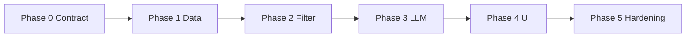

# Development Phases

Incremental delivery: each phase produces a **working vertical slice** or a **testable module** before the next begins.

Implement under `src/`; check acceptance criteria before moving on. See [docs/EDGE_CASES.md](docs/EDGE_CASES.md) for handling bad data and failure modes.

## Overview

| Phase | Goal | Depends on | Effort |
|-------|------|------------|--------|
| **00 – Web UI contract** | Typed inputs from Streamlit/API + stable response shapes | — | ~1 day |
| **01 – Data foundation** | Load, clean, cache dataset | Phase 00 (types stable for UI) | 2–3 days |
| **02 – Filtering engine** | Preference model + fast candidate shortlist | Phase 01 | 2 days |
| **03 – LLM recommendation** | Rank and explain via Groq/OpenAI | Phase 02 | 3–4 days |
| **04 – User interface** | Streamlit end-to-end UX | Phase 03 | 2 days |
| **05 – Hardening & deploy** | Tests, CI, fallback, optional API | Phase 04 | 2–3 days |

## Project definition of done

- [ ] User can set location, budget, cuisine, min rating, extras
- [ ] System filters real Zomato data and returns top recommendations
- [ ] Each result: name, cuisine, rating, cost, AI explanation
- [ ] LLM only recommends restaurants from the filtered list
- [ ] README documents setup, env vars (Groq), and how to run

---

## Phase 00: Web UI contract (`src/phases/phase00`)

### Objective

Lock **what the web UI sends and receives** before data / filter / LLM work. Keeps Phase 04 aligned with validated payloads and lets you roll back later phases without losing form typings.

### Code layout

| Path | Role |
|------|------|
| `src/phases/phase00/preferences.py` | `UserPreferences`, `BudgetTier`, `PreferenceExtras` |
| `src/phases/phase00/ui_bridge.py` | `preferences_from_ui()`, `preferences_from_ui_safe()`, city aliases, cuisine/note caps |
| `src/phases/phase00/output_contract.py` | `RecommendationItem`, `RecommendationResponse` (+ placeholder until Phase 03) |
| `src/phases/phase00/README.md` | Rollback + Streamlit snippet |

### Acceptance criteria

- [ ] Streamlit-ready dict → `UserPreferences` with validation errors surfaced for the UI
- [ ] Optional notes and cuisines bounded (caps in `ui_bridge`)
- [ ] Output types exist so the UI can render empty / error / success states consistently
- [ ] Unit tests under `tests/phases/test_phase00.py`

### Tasks

- [ ] Import `UserPreferences` in Phase 02 filter from `src.phases.phase00` (do not fork a second preferences model)

---

## Phase 01: Data foundation

### Objective

Establish a reliable, fast local copy of the Zomato dataset with clean, typed fields ready for filtering and LLM context.

### In scope

- Hugging Face load (`ManikaSaini/zomato-restaurant-recommendation`)
- Field selection and stable schema
- Cleaning: ratings, costs, cuisines, cities
- Parquet cache under `data/processed/`
- CLI to refresh cache

### Out of scope

- UI, LLM, preference filtering

### Deliverables

| Artifact | Path |
|----------|------|
| Dependencies | `requirements.txt` |
| Data loader | `src/phases/phase01/loader.py` |
| Preprocessor | `src/phases/phase01/preprocessor.py` |
| Cache I/O | `src/phases/phase01/cache.py` |
| Record schema | `src/phases/phase01/restaurant_record.py` (+ optional `src/models/restaurant.py` re-export) |
| Phase registry | `src/phases/registry.py` |
| Refresh script | `scripts/build_cache.py` |
| Output | `data/processed/restaurants.parquet` (gitignored) |

### Acceptance criteria

- [ ] `python scripts/build_cache.py` downloads data and writes parquet
- [ ] `rate` → numeric float; invalid values logged
- [ ] `approx_cost` → integer INR; `budget_tier` (`low`/`medium`/`high`)
- [ ] `cuisines` normalized for matching
- [ ] `city` from `listed_in(city)` with consistent spelling
- [ ] Exclude `reviews_list`, full `menu_item`
- [ ] Unit tests for rating/cost parsing

### Tasks

**Setup**

- [ ] `requirements.txt`: `datasets`, `pandas`, `pyarrow`, `pydantic`, `python-dotenv`
- [ ] `.gitignore`: `data/`, `.env`, `__pycache__/`, `.venv/`
- [ ] Copy `.env.example` → `.env` (Groq key already in example)

**Explore dataset**

- [ ] `datasets.load_dataset("ManikaSaini/zomato-restaurant-recommendation")`
- [ ] Print features and sample rows
- [ ] Document null rates for `rate`, `cuisines`, `approx_cost(for two people)`

**`src/phases/phase01/loader.py`**

- [ ] `load_raw() -> pd.DataFrame`

**`src/phases/phase01/preprocessor.py`**

- [ ] `parse_rate` — `"4.1/5"`, `"NEW"`, `"-"`
- [ ] `parse_cost` — commas, ranges
- [ ] `assign_budget_tier(cost, city)`
- [ ] `normalize_cuisines`, `canonical_city`
- [ ] `preprocess(df)` — optional dedupe on `name`+`address`

**`src/phases/phase01/cache.py`**

- [ ] `CACHE_VERSION = "1"`, `save_processed`, `load_processed`

**`src/phases/phase01/restaurant_record.py`** (optional re-export via `src/models/restaurant.py`)

- [ ] `id`, `name`, `city`, `location`, `cuisines`, `rating`, `votes`, `cost_for_two`, `budget_tier`, `rest_type`, `online_order`, `book_table`, `dish_liked`

**`scripts/build_cache.py`**

- [ ] `--force` flag; log row counts

**Tests**

- [ ] `tests/test_preprocessor.py` — rate/cost edge strings

**Handoff**

- [ ] `docs/DATA_NOTES.md` — top cities/cuisines for UI dropdowns

---

## Phase 02: Filtering engine

### Objective

Turn user preferences into a **20–40 restaurant** shortlist via fast structured filters (no LLM).

### In scope

- `UserPreferences` model
- `FilterEngine`, `scorer`
- `scripts/try_filter.py`

### Out of scope

- LLM, web UI

### Deliverables

| Artifact | Path |
|----------|------|
| Preferences | *(Phase 00)* `src/phases/phase00/preferences.py` |
| Filter | `src/phases/phase02/engine.py` |
| Scorer | `src/phases/phase02/scorer.py` |
| Payload helper | `src/phases/phase02/payloads.py` |
| Script | `scripts/try_filter.py` |
| Tests | `tests/test_filter_engine.py` |

### Acceptance criteria

- [ ] Filter 51K rows in **< 200 ms** (warm cache)
- [ ] City matches `listed_in(city)` or `location`
- [ ] Budget → `budget_tier`
- [ ] Cuisine: any user cuisine matches (case-insensitive)
- [ ] `min_rating` applied
- [ ] Extras: family-friendly, quick service, book table
- [ ] Empty result returns reason codes
- [ ] Output ready for LLM (no review blobs)

### Tasks

**`src/phases/phase00/preferences.py`** (already delivered in Phase 00)

**`src/phases/phase02/engine.py`**

- [ ] `apply(prefs, limit=35)`, stepwise logging, `explain_empty`

**`src/phases/phase02/scorer.py`**

- [ ] Cuisine match, rating, `log(votes+1)`, budget bonus

**Extras mapping**

- [ ] `family_friendly`, `quick_service`, `book_table`

**Script & tests**

- [ ] `try_filter.py`, filter tests, `to_llm_payload(df)`

---

## Phase 03: LLM recommendation (Groq)

### Objective

Rank filtered candidates and generate explanations via **Groq** (OpenAI-compatible), grounded in the candidate list only.

### In scope

- Prompts, `src/llm/client.py` using `GROQ_API_KEY` + `LLM_BASE_URL`
- Parser, `RecommendationService`, fallback ranker

### Out of scope

- Polished UI, production deploy

### Deliverables

| Artifact | Path |
|----------|------|
| Prompts | `src/llm/prompt_builder.py` |
| Client | `src/llm/client.py` |
| Parser | `src/llm/parser.py` |
| Service | `src/services/recommendation_service.py` |
| Models | `src/models/recommendation.py` |
| CLI | `scripts/try_recommend.py` |

### Acceptance criteria

- [ ] Top **5** recommendations (configurable)
- [ ] Fields: name, cuisine, rating, estimated_cost, explanation
- [ ] Hallucination check: every name in filter output
- [ ] JSON schema in prompt; Groq JSON mode when supported
- [ ] Fallback on API failure
- [ ] Optional summary paragraph
- [ ] Mocked LLM integration test

### Tasks

**Models & prompts**

- [ ] `RestaurantRecommendation`, `RecommendationResponse`
- [ ] `SYSTEM_PROMPT`, `build_user_prompt`

**Client**

- [ ] Read `LLM_API_KEY`, `LLM_MODEL`, `LLM_BASE_URL` from `src/config`
- [ ] `complete()` with timeout, retries
- [ ] Handle Groq rate limits (429) — see EDGE_CASES.md

**Parser & service**

- [ ] `parse_llm_json`, `enrich_from_dataframe`, `drop_unknown_names`
- [ ] `recommend()`, `fallback_recommend()`

**Scripts & tests**

- [ ] `try_recommend.py`, parser tests, prompt iteration checklist

---

## Phase 04: User interface

### Objective

End-to-end Streamlit: collect preferences, show results and loading states with a polished, responsive UI that integrates all previous phases.

### In scope

- Streamlit sidebar form with dynamic dropdowns
- Live match counter (updates as filters change)
- Result cards with AI explanations
- Loading spinners and empty states
- Error handling and fallback displays

### Out of scope

- User authentication
- Persistent user preferences
- Mobile-responsive design (Streamlit handles basic responsiveness)

### Deliverables

| Artifact | Path |
|----------|------|
| App | `src/ui/streamlit_app.py` |
| Formatters | `src/ui/formatters.py` |
| Phase registry | `src/phases/phase04/README.md` |

### Acceptance criteria

- [ ] City, budget, cuisines, min rating, extras
- [ ] Dynamic cuisine dropdown filtered by selected city with counts
- [ ] Live match counter updates in real-time as filters change
- [ ] Spinner during Groq call
- [ ] Top 5–10 cards + optional summary
- [ ] Empty-state guidance with actionable suggestions
- [ ] Fallback display when LLM is unavailable
- [ ] `streamlit run src/ui/streamlit_app.py`
- [ ] All formatters tested with edge cases (None values, empty strings)

### Tasks

**Setup**

- [ ] Add `streamlit` to `requirements.txt`
- [ ] Create `src/ui/` directory structure

**Data loading**

- [ ] `@st.cache_resource` for parquet (load once per session)
- [ ] `@st.cache_data` for city counts and cuisine counts
- [ ] Error handling when cache file is missing

**Form components**

- [ ] City dropdown with restaurant counts
- [ ] Budget tier selector
- [ ] Dynamic cuisine multiselect (filtered by city)
- [ ] Minimum rating slider
- [ ] Extras checkboxes (family-friendly, quick service, book table)
- [ ] Top-K results slider
- [ ] Submit button with primary styling

**Live feedback**

- [ ] Real-time match counter using `FilterEngine`
- [ ] Color-coded feedback (green: many matches, yellow: few, red: none)
- [ ] Validation error display from `preferences_from_ui_safe()`

**Results display**

- [ ] Summary block with filter count and LLM indicator
- [ ] Numbered recommendation cards
- [ ] Rich formatting: name, rating, cost, location, cuisines, dishes, badges
- [ ] AI explanation in blockquote style
- [ ] Empty state with suggestions to relax filters

**Formatters**

- [ ] `format_cost()` — handle None, format with ₹ symbol
- [ ] `format_rating()` — handle None, format with ⭐ symbol
- [ ] `format_cuisines()` — split pipe-separated, title case
- [ ] `format_dish_liked()` — split pipe-separated, title case
- [ ] `format_votes()` — abbreviate large numbers (e.g., "1.2K reviews")
- [ ] `item_card_markdown()` — build complete card layout
- [ ] `response_summary_markdown()` — build summary with metadata

**Testing**

- [ ] Manual tests: Delhi, Bangalore, impossible filters
- [ ] Test with missing data cache
- [ ] Test with invalid API key
- [ ] Test with various filter combinations
- [ ] Verify loading states appear correctly
- [ ] Test edge cases: no cuisines selected, rating = 0, all extras checked

---

## Phase 05: Hardening & deploy

### Objective

Tests, CI, docs, resilience, optional FastAPI/Docker.

### Acceptance criteria

- [ ] `pytest` passes
- [ ] README: install, cache build, Groq `.env`, Streamlit
- [ ] LLM failure UX + fallback badge
- [ ] Secrets not committed (prefer `.env` only; rotate if `.env.example` leaked)

### Tasks

- [ ] `tests/` coverage, `requirements-dev.txt`
- [ ] `.github/workflows/ci.yml`
- [ ] `docs/RUNBOOK.md`, update ARCHITECTURE if paths changed
- [ ] Retry/backoff, filter funnel logging
- [ ] Optional: FastAPI `POST /recommend`, Docker
- [ ] Benchmark: 100 filters < 10s

---

## Status tracker

Update this table in [README.md](README.md) as you progress.

| Phase | Status |
|-------|--------|
| 00 – Web UI contract | Implemented (`src/phases/phase00`) |
| 01 – Data foundation | Implemented (`src/phases/phase01`, facade `src/data`) |
| 02 – Filtering engine | Implemented (`src/phases/phase02`, facade `src/filter`) |
| 03 – LLM recommendation | Implemented (`src/llm/`, `src/services/`, `src/phases/phase03`) |
| 04 – User interface | Implemented (`src/ui/`, `src/phases/phase04`) |
| 05 – Hardening & deploy | Not started |
